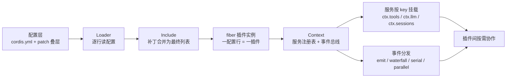
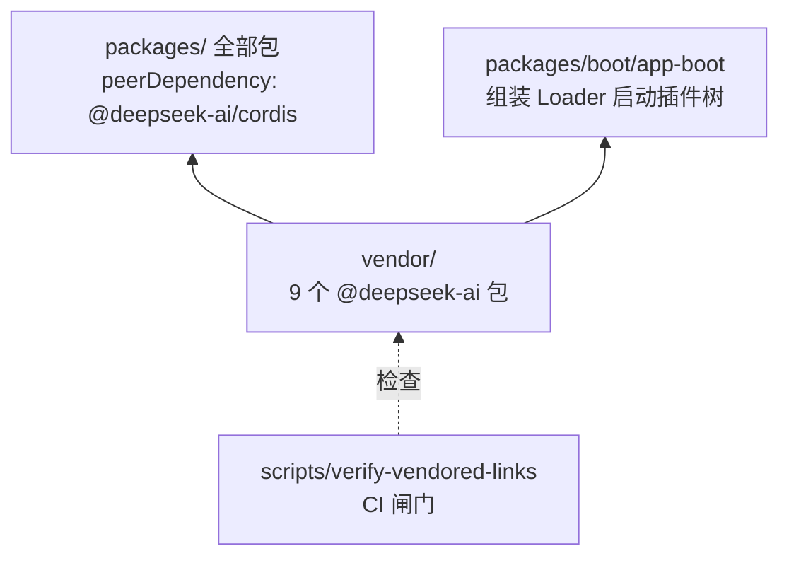
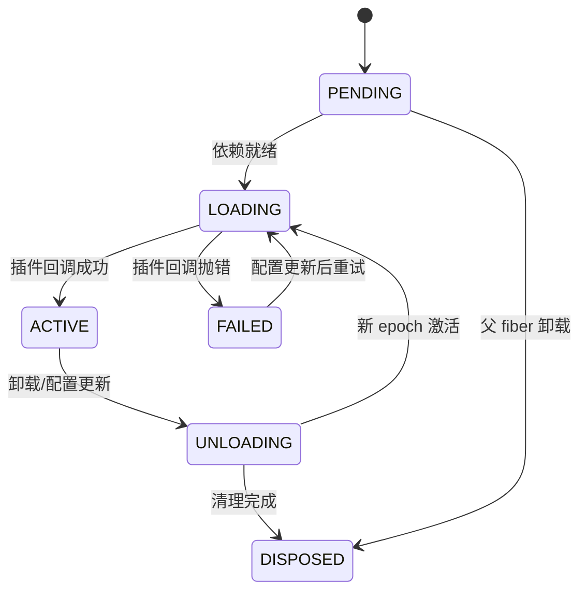

# 【第 01 篇】vendor/：可拆卸的运行时底座（Cordis 框架层详解）

> **版本**：v0.1.5-rc.2（框架源码截止 commit `56b3d4f7` + 19 项本地修改）  
> 难度：🟢 入门（系列地基，人人必读）  
> 前置阅读：`../项目架构总览.md`（总览层）  
> 对应目录：`deepseek-harness/vendor/`  
> 对应版本：v0.1.5-rc.2

## 目录

- [0 功能需求（WHY）](#0-功能需求why)
- [1 架构设计（WHAT）](#1-架构设计what)
- [2 实现落点（HOW）](#2-实现落点how)
- [3 产物演示（EXAMPLE）](#3-产物演示example)
- [4 动手验证](#4-动手验证)
- [5 FAQ 与自测](#5-faq-与自测)
- [6 版本演进（v0.1.0-rc.5 → v0.1.5-rc.2）](#6-版本演进v010-rc5--v015-rc2)
- [7 延伸阅读](#7-延伸阅读)

---

## 0 功能需求（WHY）

> 本篇的"功能需求"是 dsh 产品的底层需求，vendor/ 只是这些需求的实现载体之一。

### 0.1 背景与场景

dsh 是一个 Agent 运行时，**同一个代码库必须支撑四种产品形态**，它们对组件的要求截然不同：

| 形态 | 运行方式 | 需要的组件 | 明确不需要的 |
|---|---|---|---|
| `headless` | 一条命令跑完一个任务就退出 | 会话、工具、模型适配器、持久化 | 热更新、GUI、协议服务端 |
| `web` | GUI 交互会话（http://127.0.0.1:3080） | 上面全部 + Web 服务端 + 前端静态资源 | —— |
| `acp` | 被其他程序调用的自动化服务 | 会话、工具、ACP 协议服务端 | GUI、热更新 |
| `sdk` | 嵌入其他产品的进程外运行时 | 会话、JSON-RPC 协议、SDK 客户端 | GUI |

**推演：不做"可拆卸"会怎样？** 两种结局：

1. 四种形态各维护一份代码拷贝 → 四份 bug 四份修；
2. 单体内核堆满 `if 形态 == 'web' 则加载 X` 的开关 → 组件数 × 形态数的组合爆炸，且无法替换实现（换模型适配器要动主干）。

结论：可拆卸不是加分项，是四种形态共存的**前提条件**。

### 0.2 需求陈述

**R1 · 可拆卸**——任一功能组件可整体禁用或摘除，不影响其余功能运行。

- 实例：headless 形态把 hmr（热更新）插件 `disabled: true`，系统照常启动。
- 为什么必须：四种形态的"不需要"清单各不相同，不能被迫加载用不上的组件。

**R2 · 可替换**——同一能力可有多个实现，切换实现不影响使用方。

- 实例：模型适配器换 `llm-deepseek` ↔ `llm-pi-ai` 只需改配置一行。
- 为什么必须：模型提供商、沙箱、存储后端都在快速演进，换组件不能动主干。

**R3 · 可组合**——功能组件按场景拼装成不同产品形态。

- 实例：base bundle 打底，web-app / headless 补丁层叠加出两种形态。
- 为什么必须：形态是组合出来的，而不是四份拷贝。

**R4 · 可扩展**——第三方不改内核即可加入全新功能。

- 实例：社区插件打上 `dsh-plugin` 主题即可被安装组合。
- 为什么必须：逼用户 fork 内核 = 失去生态。

**R5 · 可回滚**——任何安装/卸载/替换操作可逆；运行中能安全换零件，变更可审计。

- 实例：HMR 修改配置不重启、不丢会话；卸载插件后所有注册全部撤销。
- 为什么必须：运维不能因为"换配置"而中断服务；框架行为必须可审计。

### 0.3 非功能需求

| 编号 | 约束 | 衡量方式 |
|---|---|---|
| N1 | **可验证**：配置组合必须能被完整打印出来，供人审计 | `dsh --dump-config` 输出与实际生效树一致 |
| N2 | **安全**：插件卸载不得泄漏资源（监听器、文件句柄、子进程） | 卸载后无悬挂注册；CI 有 HMR 安全测试 |
| N3 | **兼容可控**：框架升级必须受控，不能悄悄变化 | vendored 包锁定 commit + 修改日志 |
| N4 | **性能**：插件挂载/协作开销必须可忽略 | 进程内协作，无跨进程 IPC 开销 |
| N5 | **可诊断**：配置错误必须在启动时大声失败，而不是运行期静默 | "Misconfiguration fails loud" 为仓库级纪律 |

### 0.4 验收标准

| 需求 | 验收示例（做到 = 通过） | 失败示例（做不到 = 没通过） |
|---|---|---|
| R1 | headless 配置里 `hmr` 标 `disabled: true`，系统正常跑完任务 | 禁用一个插件导致其他插件连锁报错 |
| R2 | `cordis.yml` 里模型适配器行换包名，产品其余部分零改动 | 换实现要改调用方代码 |
| R3 | 同一份代码库，`--profile web` 与 `--profile headless` 各自正常启动 | 形态间互相拷贝代码 |
| R4 | 新插件包加入配置即生效，无需改动内核任何文件 | 加功能必须改 agent-loop |
| R5 | 运行中改配置（HMR）不重启不丢会话；卸载后注册全部撤销 | 热更新后残留旧监听器 |

### 0.5 边界与不做什么（明确排除项）

- **不做进程外隔离**：插件与宿主同进程（进程隔离是 `sandbox/` 组的职责，见第 03 篇）。
- **不做跨语言插件**：现阶段只支持 TS/JS 插件（WASM 等留作沙箱层的未来补充）。
- **不做 UI 框架、不做具体业务功能**：那是 `packages/client/` 和各大能力组的职责。
- **不自动升级框架**：vendored 框架永远手动同步，杜绝"悄悄变了"。

### 0.6 设计哲学（原则 → 由哪条需求引出）

| 原则 | 内容 | 引出的需求 |
|---|---|---|
| P1 没有特权内核 | 模型适配器、工具注册表、会话日志、agent 循环都是平级插件 | R1/R2/R4 |
| P2 注册即副作用 | 一切注册返回 disposer（撤销器），卸载逐项回滚 | R5 |
| P3 服务按 key 发现 | 插件通过 `ctx.tools`/`ctx.llm` 找服务，从不 import 实现类 | R2 |
| P4 组合优于配置 | 形态 = 补丁层叠，不是巨型开关面板 | R3 |
| P5 类型化事件 | 事件名由 TS 声明合并定义，编译期可检查 | R2/R4（契约可验证） |
| P6 失败要大声 | 配置错误启动即报，绝不静默跳过 | N5 |

### 0.7 备选技术路径

| 路径 | 思路 | 优势 | 代价 | 需求匹配 |
|---|---|---|---|---|
| A. 特性开关 | 单体内核 + 配置开关启停 | 实现最简单 | 只能开/关，**无法替换实现**；开关组合爆炸；无法热插拔 | 只满足 R1 一半，R2/R4 落空 |
| B. 微服务化 | 能力独立进程，IPC 通信 | 隔离最强、可独立部署 | 单机场景运维重、开销大、会话状态跨进程难共享 | 过度设计 |
| C. 进程内插件框架（**本项目**） | 框架管生命周期/DI/事件总线，插件进程内动态挂载 | 轻量、热插拔、类型安全、与 TS 同构 | 框架本身成为新的风险源（→ 用 vendoring 对冲） | 全面满足 R1~R5 |
| D. 跨语言插件（WASM/Go） | 插件以独立二进制/沙箱形式加载 | 隔离与安全最佳 | 类型/生态衔接成本高，与主力栈割裂 | 未来可作沙箱补充，现阶段过重 |

**选型结论（三段论）**：需求要求"轻量组合 + 运行中热替换 + 类型安全"（R1~R5）→ 候选里只有 C 同时满足 → C 的唯一硬伤（框架稳定性）由 vendoring（决策 D1）对冲。所以"插件框架 + 框架内置"是一对不可拆分的组合拳，这也解释了 vendor/ 目录为什么存在。

## 1 架构设计（WHAT）

### 1.1 总体架构

官方对"一切皆插件"的表述：

> 📖 **原文**（docs/architecture.md）："Every part of the product is a plugin, including the model adapter, the tool registry, the session log, and the agent loop itself, so every part is replaceable from configuration."

翻译：**产品的每一部分都是插件**——模型适配器、工具注册表、会话日志、agent 循环本身，全部可以从配置层面替换。这就是 P1"没有特权内核"的官方原话（对应需求 R2/R4）。



同一张图，换"层次"视角：

| 层 | 职责 | 关键组件 |
|---|---|---|
| **配置层** | 声明要什么插件（R3） | cordis.yml + bundle/profile/用户三层补丁叠叠乐 |
| **装配层** | 把配置行变成真实对象（R3/R4） | Loader 逐行实例化 → Include 合并补丁与 `!!js` 表达式 |
| **运行层** | 共享工作台：注册、发现、协作（R1/R2/R5） | Context 服务注册表 + 事件总线，fiber 管插件的一生 |
| **插件层** | 具体功能实现（R4） | session / tools / llm / shell …… 全部平级，可摘可换 |

**四步读懂**：

1. 配置层是"产品说明书"，每行声明一个插件，补丁层叠决定最终形态（R3）；
2. 装配层把配置行变成真实对象——Loader 创建 **fiber**（插件在系统内的身份单元），Include 解析叠层与 `!!js` 动态表达式（R3/R4）；
3. 运行层是共享工作台：`ctx.on()` 监听、`ctx.effect()` 注册可撤销副作用、服务按 key 挂载（R1/R2/R5）；
4. 事件总线五种分发对应五种协作形态：`emit` 广播、`parallel` 并行、`serial` 顺序、`bail` 一票否决、`waterfall` 顺序且可改写/截停——策略与拦截都挂在事件层，不动调用方（R2）。

> 小结：架构的每一层都只回答一个问题——配置层"要什么"、装配层"怎么装"、运行层"怎么协作"、插件层"有什么"。

### 1.2 关键架构决策（需求 → 方案 → 权衡）

| # | 决策 | 对应需求 | 权衡 |
|---|---|---|---|
| D1 | **vendoring（框架内置）**：Cordis 全家桶源码复制进仓库，manifest 锁定版本与 commit，19 项本地修改逐项记录 | R5 / N3 | 上游升级要手动同步；换来框架完全可控可审计 |
| D2 | **rescope（改名）**：vendored 包改名 `@deepseek-ai/cordis`，packages 以 peerDependency 引用 | R4 / 发布安全 | 同步后要重放改名脚本；换来发布不占上游包名、全系统单实例 |
| D3 | **Loader/Include 分层 + patch 叠层** | R3 | 配置来源变多，用 `--dump-config` 兜底审计（N1） |
| D4 | **事件五分发 + `@mode` 文档化** | R2 | 事件语义成为公开契约，新事件必须声明分发模式 |
| D5 | **注册即副作用**：`ctx.on()`/`ctx.effect()` 一律返回 disposer | R5 / N2 | 全仓库强制纪律；换来 HMR 与热插拔的根基 |
| D6 | **Standard Schema 校验**：配置校验采用 `@standard-schema/spec` 标准 | N5 | 与 TypeScript 类型系统深度集成，启动即校验 |
| D7 | **事务性配置更新**：Loader/Include 支持事务性应用、回滚、序列化写入 | R5 / N2 | 复杂度增加；换来运行中配置变更的安全性 |

### 1.3 关系网



- **下游**：`packages/` 每个包声明 `@deepseek-ai/cordis` 为 peerDependency——全系统只有一个框架实例（R4 的生态前提）。
- **上游消费者**：`packages/boot/app-boot` 把 profile 组合成插件树并启动。
- **守护**：CI 闸门 `verify-vendored-links` 检查锁文件，确保 vendored 包走工作区链接、registry 无同名副本。

## 2 实现落点（HOW）

### 2.1 文件导航表（按阅读顺序）

| 顺序 | 文件（点击直达） | 关注点 | 对应需求 |
|---|---|---|---|
| 1 | [vendor/README.md](../deepseek-harness/vendor/README.md) | manifest 表（9 包 + 版本 + commit）与 19 项本地修改日志 | R5 / N3 |
| 2 | [vendor/cordis/src/context.ts](../deepseek-harness/vendor/cordis/src/context.ts) | `Context` 类：服务注册与取用 | R1/R2 |
| 3 | [vendor/cordis/src/events.ts](../deepseek-harness/vendor/cordis/src/events.ts) | `DispatchMode`（五种模式）、`waterfall`、`on` | R2/R5 |
| 4 | [vendor/cordis/src/fiber.ts](../deepseek-harness/vendor/cordis/src/fiber.ts) | 插件生命周期与 `effect` 机制（754 行，加固版） | R5 |
| 5 | [vendor/cordis/src/registry.ts](../deepseek-harness/vendor/cordis/src/registry.ts) | 插件注册、`@Inject` 装饰器、依赖声明 | R4 |
| 6 | [vendor/cordis/src/reflect.ts](../deepseek-harness/vendor/cordis/src/reflect.ts) | 服务发现、accessor、mixin 机制 | R2 |
| 7 | [vendor/cordis/src/service.ts](../deepseek-harness/vendor/cordis/src/service.ts) | Service 基类、配置合并、拦截器 | R2 |
| 8 | [vendor/cordis/src/logger.ts](../deepseek-harness/vendor/cordis/src/logger.ts) | 日志服务、Exporter 机制、格式化 | N5 |
| 9 | [vendor/loader/src/index.ts](../deepseek-harness/vendor/loader/src/index.ts) | Loader：配置行 → 插件实例 | R3 |
| 10 | [vendor/include/src/index.ts](../deepseek-harness/vendor/include/src/index.ts) | Include：补丁叠层 + `!!js` 表达式 + 事务性写入 | R3/R5 |

### 2.2 关键实现片段

**片段 A：事件分发的类型定义**（[events.ts 第 32 行](../deepseek-harness/vendor/cordis/src/events.ts)）

```ts
export type DispatchMode = 'emit' | 'parallel' | 'serial' | 'bail' | 'waterfall'
```

翻译：事件总线的五种通讯方式。`emit` 广播不等结果；`parallel` 并行分发并等待全部完成；`serial` 按注册顺序串行、结果逐级传递；`waterfall` 与 serial 类似，但监听者可**改写**传给下一个的值，也可**不调用 `next()`** 直接截停——策略/拦截类插件的挂载点（R2）；`bail` 一票否决即停。

**片段 B：注册的返回值就是撤销器**（[events.ts 第 97 行](../deepseek-harness/vendor/cordis/src/events.ts)）

```ts
on<K extends keyof Events>(name: K, listener: Events[K], options?: boolean | EventOptions): () => boolean
```

翻译：`on` 是泛型方法——`name` 必须是**已声明的事件名**（编译期检查）；`listener` 是处理函数；**返回值是一个"取消监听"的函数**。"注册即返回撤销器"就写在这个签名里：框架层保证任何注册都可逆（R5），插件卸载时逐个调用这些返回值完成回滚。

**片段 C：Fiber 生命周期状态机**（[fiber.ts 第 147~154 行](../deepseek-harness/vendor/cordis/src/fiber.ts)）

```ts
export const enum FiberState {
  PENDING,   // 等待依赖服务就绪
  LOADING,   // 插件回调正在执行
  ACTIVE,    // 已加载，正常提供服务
  FAILED,    // 回调或配置验证抛错
  DISPOSED,  // 已移除，不可重启
  UNLOADING, // 清理器正在运行
}
```

翻译：每个插件 fiber 都有完整的生命周期状态机。`PENDING` → `LOADING` → `ACTIVE` 是正常路径；`ACTIVE` → `UNLOADING` → `DISPOSED` 是销毁路径；`FAILED` 是异常路径。状态转换触发 `internal/status` 事件，供其他插件感知。

**片段 D：Standard Schema 配置校验**（[fiber.ts 第 50~62 行](../deepseek-harness/vendor/cordis/src/fiber.ts)）

```ts
export function resolveConfig(runtime: Plugin.Runtime, config: any) {
  if (!runtime.Config) return config
  const result = runtime.Config['~standard'].validate(config)
  if ('then' in result) {
    throw new TypeError('Async config validation is not supported')
  }
  if (result.issues) {
    throw new ValidationError(result.issues)
  } else {
    return result.value
  }
}
```

翻译：配置校验采用 Standard Schema 标准（`@standard-schema/spec`）。插件可声明 `Config` schema，插件启动前自动校验。校验失败抛 `ValidationError`，包含所有 issue 的路径和消息——"Misconfiguration fails loud"（N5）。

**片段 E：一个真实配置行 = 一个插件**（[examples/headless-agent/cordis.yml](../deepseek-harness/examples/headless-agent/cordis.yml)）

```yaml
- id: settings
  name: '@deepseek-ai/dsh-settings-file'

- id: credentials
  name: '@deepseek-ai/dsh-credentials-local'

- id: llm-deepseek
  name: '@deepseek-ai/dsh-llm-deepseek'
  config:
    thinking: enabled
    reasoningEffort: max
```

翻译：三行配置 = 三个插件。`id` 是配置树里的唯一标识（补丁按 id 定位）；`name` 是要加载的 npm 包；`config` 是插件参数（schemastery 校验）。`llm-deepseek` 只是模型适配的一种实现——同一位置换成 `@deepseek-ai/dsh-llm-pi-ai` 即切换提供商（R2 的直接演示）。

### 2.3 Context 核心能力详解

`Context` 是 Cordis 框架的核心容器，提供四项关键能力：

#### 2.3.1 服务发现（`ctx.reflect`）

通过 Proxy 机制实现动态服务解析：

```ts
// 读取服务：ctx.tools → 自动查找提供 tools 的 fiber
const tools = ctx.tools

// 可选的 strict 模式：只查找 ACTIVE 状态的 fiber
const tools = ctx.reflect.get('tools', true)
```

#### 2.3.2 服务隔离（`ctx.isolate()`）

创建独立的服务作用域，不同作用域的同名服务互不干扰：

```ts
// 创建隔离作用域
const isolatedCtx = ctx.isolate('llm', Symbol('custom-llm'))
// 在 isolatedCtx 中注册的 llm 服务不影响父 ctx
```

#### 2.3.3 配置拦截（`ctx.intercept()`）

在子上下文中为特定服务注入额外配置：

```ts
const childCtx = ctx.intercept('logger', { level: 'debug' })
// childCtx 下所有插件看到的 logger 配置会合并 level: 'debug'
```

#### 2.3.4 插件注册（`ctx.plugin()`）

加载插件并创建 fiber 实例：

```ts
const fiber = ctx.plugin(myPlugin, { /* config */ })
await fiber // 等待插件加载完成
```

### 2.4 事件总线详解

事件总线支持五种分发模式，每种模式对应不同的协作场景：

| 模式 | 语义 | 典型用途 |
|---|---|---|
| `emit` | 同步广播，不等待结果 | 通知类事件（如 `internal/plugin`） |
| `parallel` | 并行执行所有监听器，等待全部完成 | 批量操作（如工具注册） |
| `serial` | 按注册顺序串行执行，遇到 bail 值即停 | 顺序处理（如配置校验链） |
| `bail` | 同步执行，遇到第一个 bail 值即返回 | 一票否决（如权限检查） |
| `waterfall` | 顺序执行，监听器可改写传递值或不调用 `next()` 截停 | 中间件/拦截器（如 `internal/update`） |

**Waterfall 语义关键点**：监听器**必须**调用 `next()` 才能继续链的传递；不调用则短路整个链，包括内置行为。

### 2.5 Fiber 生命周期详解

Fiber 是插件在系统内的身份单元，管理插件的完整生命周期：



**关键机制**：

1. **Effect 注册**：`ctx.effect()` 返回 disposer，fiber 卸载时按逆序执行所有 disposer。
2. **Epoch 追踪**：每次依赖变化生成新 epoch，过期的加载/卸载操作自动跳过。
3. **重入安全**：卸载期间创建的 effect 会被正确清理，不会泄漏。
4. **异步清理**：异步 disposer 在 fiber 可见期间完成，外部可等待。

### 2.6 服务提供与依赖注入

#### 2.6.1 Service 基类

继承 `Service` 的类自动注册为服务：

```ts
class MyService extends Service {
  static inject = ['otherService']  // 声明依赖
  static provide = 'myService'      // 服务名
  
  constructor(ctx: Context) {
    super(ctx, 'myService')
  }
}
```

#### 2.6.2 `@Inject` 装饰器

用于类或类方法的依赖声明：

```ts
// 类级别：整个插件依赖此服务
@Inject('logger', { level: 'debug' })
class MyPlugin {
  // ...
}

// 方法级别：方法延迟到依赖就绪后执行
class MyPlugin {
  @Inject('tools')
  async doSomething() {
    // tools 可用时才执行
  }
}
```

#### 2.6.3 `ctx.inject()` 快捷方法

函数式插件的依赖声明：

```ts
ctx.inject(['tools', 'llm'], (ctx, config) => {
  // tools 和 llm 都可用时执行
})
```

## 3 产物演示（EXAMPLE）

### 3.1 输入

一行命令（**已实测**，仓库根目录下执行）：

```powershell
pnpm dsh --profile headless --dump-config > dump.yml
```

概念输入：`headless` profile = `dsh-base` + `dsh-headless` 两个 bundle 的补丁叠层（R3 的组合产物）。

### 3.2 产物（真实输出，带行号与行内注释）

> 以下为实测输出片段；"真实产物"列与命令输出逐字符一致。

| 行 | 真实行内注释 |
|---|---|
| 1 | `# == @deepseek-ai/dsh-base` —— 分段注释：以下条目来自 base bundle（R3 组合的证据） |
| 2 | `- id: timer` —— 定时器插件（base 默认携带） |
| 3 | `name: '@deepseek-ai/cordis-plugin-timer'` —— vendored 的 @deepseek-ai 作用域包名 |
| **4** | **`# == @deepseek-ai/dsh-base, patched by @deepseek-ai/dsh-headless`** —— 🎯 关键行：被 headless 补丁层修改（R3） |
| **5** | **`- id: hmr`** —— 🎯 关键行：热更新插件，headless 形态不需要 |
| 6 | `name: '@deepseek-ai/cordis-plugin-hmr'` —— hmr 的 npm 包 |
| 7-8 | `config: { root: ... }` —— 配置开始 |
| **9** | **`disabled: true`** —— 🎯 关键行：配置级摘除——可拆卸（R1）的活证据 |
| 10 | `# == @deepseek-ai/dsh-base` —— 回到 base 段 |
| 11 | `- id: llm` —— LLM 抽象服务（ctx.llm，适配器的挂载点） |
| 13 | `- id: session` —— 会话服务 |
| 15 | `- id: agent` —— Agent 服务——"没有特权内核"的例证（P1） |

### 3.3 发生了什么（输入 → 产出的四步）

1. `dsh` 读取 `headless` profile 清单，得到 bundle 列表：`dsh-base` → `dsh-headless`；
2. Include 把两个 bundle 的补丁逐层合并成最终配置列表（每行含 id/name/config）；
3. Loader 验证每个插件的配置（schemastery），并打印合并结果——**打印的是"蓝图"不是运行实例**，所以无需 API key 即可审计；
4. 输出按补丁来源分段注释（`# == ...`），标注每一行来自哪个 bundle、被谁改过（第 1、4、10 行）。

### 3.4 观察点（对应产物表中的行号）

- **第 4 行** `patched by @deepseek-ai/dsh-headless`：patch 层叠的直接证据（R3）；
- **第 5、9 行**：hmr 被整体 `disabled: true`——可拆卸（R1）的活证据；
- **第 11、13、15 行**：llm、session、agent 都是平级条目——"没有特权内核"（P1）的活证据；
- **第 3、6 行**：包名都是 `@deepseek-ai/` 作用域——rescope（D2）在产物中的痕迹。

## 4 动手验证

> 以下命令**已在本机实测**（仓库根目录下执行，退出码 0）。

### 任务 1：亲手复现第 3 节的产物

```powershell
pnpm dsh --profile headless --dump-config > dump.yml
```

**预期**：无报错，生成 `dump.yml`。**判据**：对照第 3.2 节表格——第 1 行分层注释、第 9 行 `disabled: true`、`- id: llm` 等条目，你的输出应逐字符一致。

### 任务 2：验证"框架被买断"

打开 [vendor/README.md](../deepseek-harness/vendor/README.md) 的 manifest 表，回答三问：一共几个包？`cordis` 的版本与 commit？19 项本地修改第 1 项改了什么、为什么？

<details>
<summary>答案</summary>

- 9 个包
- `cordis` 版本 `4.0.0-rc.7`，commit `56b3d4f725681cf4556c1a8695a709cc3b6eed74`
- 第 1 项修改：`hmr/src/index.ts`，去掉依赖运行时 YAML 钩子的 i18n 导入（因为 dsh 不 vendor `@cordisjs/unyaml`）

</details>

### 任务 3（进阶）：手写配置 vs 实际生效的树

对比 [examples/headless-agent/cordis.yml](../deepseek-harness/examples/headless-agent/cordis.yml)（手写）与 `dump.yml`（实际生效）：找**都出现**的插件（settings、credentials、llm-deepseek……）；找 **dump.yml 有而手写文件没有**的（timer、hmr——base bundle 默认携带）。结论：你的配置只是"加料"，底层永远有基础层兜底——这就是 patch 层叠。

## 5 FAQ 与自测

### FAQ

- **Q1：为什么不直接 `npm install cordis`？** 普通项目应该；但 dsh 是"框架即产品"，需要可控、可审计、可打补丁、可发布（D1/D2）。
- **Q2：可拆卸和"删代码"有什么区别？** 可拆卸是**配置级**操作（`disabled: true` 或换 bundle），代码仍在、随时可恢复，HMR 支持运行中切换；删代码是源码级、不可逆。
- **Q3：插件和 Service 什么关系？** Service 是插件挂到 ctx 上的"对外能力"（如 `ctx.tools`）；插件是载体——一个插件可声明多个 Service，也可只监听事件。
- **Q4：我要写插件，需要动 vendor/ 吗？** 不需要。写插件 = 在 `packages/` 新建包或直接改配置组合（参考 [examples/](../deepseek-harness/examples/)）；vendor/ 是框架层，改动要走同步流程。
- **Q5：上游 cordis 更新了怎么办？** 按 [vendor/README.md](../deepseek-harness/vendor/README.md) 同步流程：拉新 commit → 重放/退休本地修改 → `pnpm run test && pnpm run build` → 更新 manifest。
- **Q6：`@standard-schema/spec` 是什么？** Standard Schema 是一个跨框架的 schema 校验标准，Cordis 用它来校验插件配置。插件可声明 `Config` 属性为 Standard Schema 兼容的对象，框架在插件启动前自动校验。

### 自测

1. 事件分发模式有几种？`waterfall` 与 `serial` 的关键区别？
2. `ctx.on()` 的返回值是什么？它支撑了哪条需求？
3. 为什么 vendored 包要改名成 `@deepseek-ai/` 作用域？
4. 第 3.2 节产物表里，哪一行是"可拆卸（R1）"的直接证据？
5. 需求 R2（可替换）在架构上主要由哪些机制支撑？（多选）A. 服务按 key 发现 B. 事件总线五种分发 C. patch 层叠 D. rescope 改名

<details>
<summary>点开看答案</summary>

1. 五种（emit/parallel/serial/bail/waterfall）。serial 只顺序传递结果；waterfall 的监听者可改写结果，也可不调用 `next()` 截停。
2. 返回"取消监听"的函数（disposer）→ 支撑 R5（可回滚）。
3. 因为 dsh 要随产品发布这套框架到 npm，保持原名会占用上游包名（squatting）；改名后互不干扰（D2）。
4. 第 9 行：`disabled: true`（hmr 被配置级摘除）。
5. A、B。C 支撑 R3（组合），D 支撑发布安全与单实例。

</details>

## 6 版本演进（v0.1.0-rc.5 → v0.1.5-rc.2）

### 6.1 框架包版本变化

| 包名 | v0.1.0-rc.5 | v0.1.5-rc.2 | 变化说明 |
|---|---|---|---|
| `@deepseek-ai/cordis` | 4.0.0-rc.7 | **4.0.2** | 升级到稳定版，包含生命周期加固 |
| `@deepseek-ai/cosmokit` | 1.8.1 | **1.8.3** | 小版本更新 |
| `@deepseek-ai/schemastery` | 3.18.0 | **3.18.2** | 小版本更新 |
| `@deepseek-ai/cordis-plugin-loader` | 1.0.0-rc.5 | **1.0.3** | 升级到稳定版 |
| `@deepseek-ai/cordis-plugin-include` | 1.0.4 | **1.0.7** | 事务性写入、补丁语义导出 |
| `@deepseek-ai/cordis-plugin-group` | 1.0.0 | **1.0.2** | 小版本更新 |
| `@deepseek-ai/cordis-plugin-hmr` | 1.0.15 | **1.0.17** | 精确配置监听、initial-scan 抑制 |
| `@deepseek-ai/cordis-plugin-timer` | 1.1.2 | **1.1.4** | 小版本更新 |
| `@deepseek-ai/cordis-plugin-logger-console` | 1.0.0 | **1.0.2** | 小版本更新 |

### 6.2 本地修改变化（19 项 vs 18 项）

v0.1.0-rc.5 有 18 项本地修改，v0.1.5-rc.2 增加到 **19 项**。新增的关键修改：

| # | 修改 | 说明 |
|---|---|---|
| 18 | `loader/src/config/entry.ts`：`disabled` 插值 | `disabled: !!js` 表达式在每次挂载决策时求值，原始节点保留在 options 中，写回保持 `!!js` 形式。这是唯一被插值的元数据字段 |
| 19 | `loader/src/internal.ts`：运行时形状检测 | `ModuleLoader.fromInternal()` 通过检测 API 拥有情况（`getOrCreateModuleJob` vs `getModuleJobForImport`）来分类内部加载器，而非按 Node 主版本号。修复了 Node 24.0-24.11.1 的误分类问题 |

### 6.3 Fiber 生命周期加固（v0.1.5-rc.2 重点变化）

v0.1.5-rc.2 对 fiber 生命周期进行了重大加固（修改 #6），主要改进：

1. **Effect 所有权可见性**：effect 的 owner-list wrapper 在 setup body 执行前注册，确保 unload 能等待 setup 和所有收集的 cleanup。
2. **同步 setup 失败处理**：同步 setup 失败时移除 wrapper 并回滚已收集的 cleanup。
3. **异步清理可见性**：异步 cleanup 在 fiber 可见期间完成，外部可等待其完成。
4. **Effect 创建拒绝**：在 owner 为 `UNLOADING` 状态时拒绝创建 effect，防止清理时注册逃逸。
5. **子 fiber 注册顺序**：子 fiber 在 `internal/plugin` 发布前注册并获取 owner-owned disposer。
6. **重入销毁安全**：重入 disposal 使 load epoch 失效时跳过插件执行。

### 6.4 事务性配置更新（v0.1.5-rc.2 重点变化）

v0.1.5-rc.2 引入了事务性配置更新机制（修改 #8），主要改进：

1. **Loader 事务性**：导入变更的 entry name 后等待生命周期稳定，候选应用失败时恢复先前的 plugin 或 config。
2. **Include 事务性**：读取并校验分离的候选内容，应用补丁到克隆体，协调树，然后才提交缓存内容。
3. **Group 事务性**：并行启动候选，等待所有结果，包含 sibling-start 失败，失败时撤销变更和添加。
4. **序列化写入**：Include 的所有子树变更通过队列序列化，防止并发 apply 交错。

### 6.5 JSDoc 富化（v0.1.5-rc.2 新增）

v0.1.5-rc.2 对整个 Cordis 框架的公共 API 进行了 JSDoc 富化（修改 #7），包括：

- `Context` 类、静态方法和接口属性
- `EventsService` 所有方法
- `Fiber` 类和状态枚举
- `RegistryService` 所有方法
- `ReflectService` 所有方法
- `Service` 基类
- `LoggerService` 所有方法
- 所有 `declare module './context.ts'` 重载

动机：网站 API 参考生成器渲染这些文档，对未文档化成员会报错。

### 6.6 Lazy Config 解析（v0.1.5-rc.2 重点变化）

v0.1.5-rc.2 移植了 [cordiverse/cordis#41](https://github.com/cordiverse/cordis/pull/41)（修改 #15），主要改进：

1. **延迟配置解析**：保留原始 fiber config，仅在声明的 injections 激活后通过 `internal/config` 解析。
2. **Provider 替换重解析**：Provider 替换时重新解析原始表达式。
3. **Tree-carrier 标记**：Group 和 Include 的 config 是 entry 和 patch 列表，插值保持字面量，`!!js` 表达式在各自 fiber 中延迟求值。

### 6.7 其他重要变化

| 变化 | 说明 |
|---|---|
| **Include 补丁语义导出** | 提取 `applyEntryPatches` 为导出纯函数，`entryListSchema` 为 `!!js` YAML 方言，供 `dsh --dump-config` 使用 |
| **Include 耐久写入** | 序列化并跟踪配置文件写入，重试瞬态 `EACCES`/`EBUSY`/`EPERM` 重命名失败，有界退避 |
| **HMR 精确配置监听** | `registerConfig()` 监听一个绝对配置路径，包括缺失父目录下的路径 |
| **HMR 初始扫描抑制** | 主 watcher 传递 `ignoreInitial: true`，防止初始扫描重新宣布文件导致死锁 |
| **Node 兼容性** | 标记 erased imports，防止 Node 原生 TypeScript 转换请求类型作为运行时导出 |
| **`src` 发布** | 所有 vendored 包的 `files` 列表包含 `src`，确保 export map 指向的文件存在 |

## 7 延伸阅读

**官方（权威来源）**：

- [docs/cordis-primer.md](../deepseek-harness/docs/cordis-primer.md) —— Cordis 五理念 + 分发模式表（本篇的官方版）
- [docs/cordis-tutorial/index.md](../deepseek-harness/docs/cordis-tutorial/index.md) —— 7 章手把手教程（写第 02 篇前建议刷完 1~3 章）
- [docs/architecture.md](../deepseek-harness/docs/architecture.md) —— "Profiles and bundles" 一节与本篇直接相关
- [docs/rescope.md](../deepseek-harness/docs/rescope.md) —— 改名机制详解

**外部文献（按难度递增）**：

- 🟢 [Cordis 官方仓库](https://github.com/cordiverse/cordis) —— 上游源码
- 🟡 [《A Programming Paradigm for Spatiotemporal Composability》](https://github.com/cordiverse/paper) —— Cordis 的设计论文（开源）：解释"可组合、可逆、可时空分离"的编程范式；读不懂论文没关系，先看摘要与插图
- 🟡 [schemastery](https://github.com/cordiverse/schemastery) / [cosmokit](https://github.com/cordiverse/cosmokit) —— 配置校验库与工具库的上游
- 🟡 [Standard Schema](https://github.com/standard-schema/standard-schema) —— 跨框架 schema 校验标准
- 🔴 [vendor/README.md 第 6 项修改](../deepseek-harness/vendor/README.md) —— fiber 生命周期加固：一篇"框架级 bug 实战"案例，进阶者精读

---

**下一篇预告**：【第 02 篇】`packages/core/`——需求主题：会话可重建、工具可安全执行、循环可观测。
