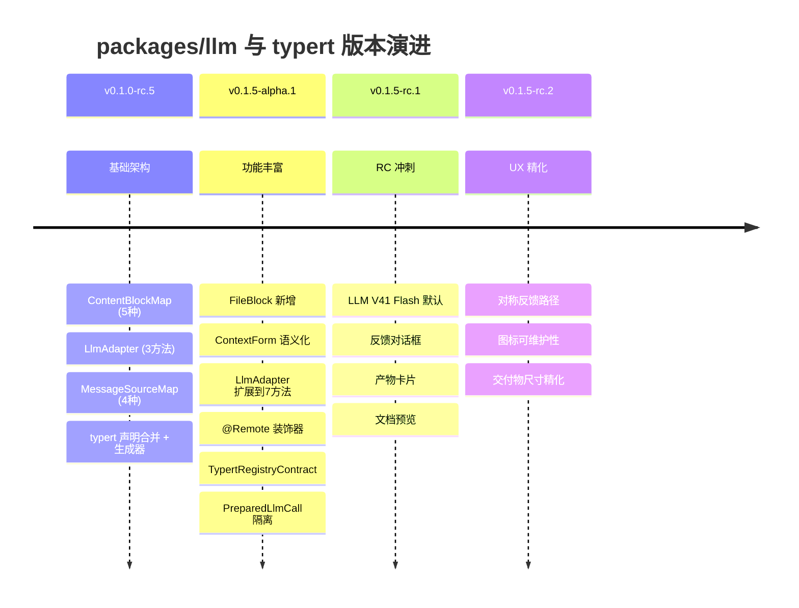

# 【第 04 篇】packages/llm/ 与 typert：模型适配缝与类型系统

> **版本**：v0.1.5-rc.2 · 难度：🟡 进阶（建议先读第 02 篇）
> 前置阅读：`第02篇-core产品主干.md`
> 对应目录：`deepseek-harness/packages/llm/`、`deepseek-harness/packages/typert/`

## 目录

- [0 功能需求（WHY）](#0-功能需求why)
- [1 架构设计（WHAT）](#1-架构设计what)
- [2 实现落点（HOW）](#2-实现落点how)
- [3 产物演示（EXAMPLE）](#3-产物演示example)
- [4 动手验证](#4-动手验证)
- [5 FAQ 与自测](#5-faq-与自测)
- [6 版本演进（v0.1.0-rc.5 → v0.1.5-rc.2）](#6-版本演进v010-rc5--v015-rc2)
- [7 延伸阅读](#7-延伸阅读)

---

## 0 功能需求（WHY）

### 0.1 背景与场景

第 02 篇讲过：core 的循环"流式获取模型响应"（`llm/stream`），但 core **不拥有**模型协议——模型词汇、流式协议、适配器契约全部属于 `packages/llm/`。为什么这样切？两个场景：

1. **多提供商**：同一产品要接 DeepSeek、PI-AI、用户自建网关——每次请求都不同，但循环代码必须**一行不改**；
2. **远程调用类型安全**：GUI 前端、SDK 客户端要调用宿主的能力（查会话、查工具），走的是**生成式类型契约**（typert）——"远程方法"在编译期就有类型，而不是手写 JSON。

v0.1.5-rc.2 在 v0.1.0-rc.5 基础上新增了三个关键场景：

3. **可配置提供商发现**：用户可以通过 Settings 页面添加自定义 Provider 端点，系统需要**动态发现模型**并注册到路由表；
4. **文件附件透传**：模型需要处理用户上传的文件（PDF、代码等），但文件**从不原样发送给提供商**，而是投影为确定性的句柄文本；
5. **Remote 装饰器驱动**：typert 从"声明合并 + 生成器"演进到**装饰器标记 + 运行时注册**，Host 方法通过 `@Remote` 装饰器直接暴露为远程端点。

### 0.2 需求陈述

**R1 · 词汇统一**——`Message` / `ContentBlock` 是**唯一**的会话词汇：投递（delivery）、持久历史（durable history）、模型请求（model request）三处共用同一份类型。

- 实例：官方表述 *"One immutable message representation shared by delivery, durable history, and model requests"*（[message.ts 第 130 行](../deepseek-harness/packages/llm/llm/src/message.ts)）。
- 为什么必须：三处各建一套消息类型 = 三份转换代码 + 三份漂移风险。

**R2 · 适配可插拔**——`LlmAdapter` 是适配器契约；任何提供商实现它即可接入，循环只依赖契约不依赖具体适配器。

- 实例：`llm-deepseek` 与 `llm-pi-ai` 是两个适配器包，配置换一行即切换。
- 为什么必须：模型生态演进快，适配器必须能独立发布、独立升级。

**R3 · 元数据权威单点**——contextWindow、reasoningEffort 等"精确路由"元数据，由**服务该路由的适配器**解析，消费者不重复解析、不自行猜测。

- 实例：`LlmResolvedModelInfo` 扩展自 `LlmModelInfo`，增加 `context`、`defaultMaxTokens`、`reasoning`、`systemPromptUpdate` 四个精确字段——全部由适配器权威解析。
- 为什么必须：模型能力（上下文窗口、思考档位）只有适配器最清楚；多份解析必然打架。

**R4 · 类型安全远程调用（typert）**——宿主能力通过**装饰器标记 + 生成式类型契约**暴露给远程消费者：wire 上只传 endpoint + 命名参数，类型与 schema 由生成器保证。

- 实例：`@Remote` 装饰器标记 Host 方法，`InvocationDescriptor` 描述参数与返回值，`TypertRegistryContract` 提供运行时注册。
- 为什么必须：手写 JSON-RPC 的调用方与实现方必然漂移；生成式契约让漂移在编译期暴露。

**R5 · 动态提供商发现（v0.1.5 新增）**——用户可通过 Settings 添加自定义端点，适配器通过 `discoverModels()` 从端点**实时发现**可用模型。

- 实例：`LlmModelDiscoveryRequest` + `LlmDiscoveredModel` + `registerModelDiscovery()` 三件套。
- 为什么必须：自定义端点的模型列表不可能预先枚举；发现机制让"添加端点"成为产品化能力。

**R6 · 文件附件安全投影（v0.1.5 新增）**——文件块在请求组装时**无条件投影为句柄文本**，任何提供商都不会收到文件块本身。

- 实例：`content.ts` 中 `projectFilesToText()` 将每个 `FileBlock` 替换为 `fileHandleText()` 生成的确定性文本。
- 为什么必须：提供商不原样处理文件；持久日志保留结构引用，请求保留句柄文本——两个世界各得其所。

### 0.3 非功能需求

| 编号 | 约束 | 衡量方式 |
|---|---|---|
| N1 | **可重放**：assistant 消息携带适配器私有的 `ReplayEnvelope`（含 response 级和 block 级元数据），可无损重放提供商响应 | replay 与原始响应逐 token 一致 |
| N2 | **模态可声明**：模型能力（文本/图像等 inputModalities）由适配器声明，缺省表示未知、显式缺项表示不支持 | 路由选择不会把图像请求发给纯文本模型 |
| N3 | **advisory 与权威分离**：模型目录（catalog）是建议性的，不参与请求校验；权威解析只来自服务路由的适配器 | 目录与解析结果不一致时以解析为准 |
| N4 | **branded 标识**：跨边界的不透明 id（如 `ReasoningEffortId`、`LlmAttemptId`）一律品牌化，禁止裸 string | 类型系统拒绝把 effort id 当普通字符串 |
| N5 | **准备调用隔离**：`PreparedLlmCall` 将配置解析与流式分发绑定在同一适配器注册世代，防止 HMR 期间能力与端点错配 | 每个 prepared call 只能 dispatch 一次 |
| N6 | **文件投影确定性**：同一文件引用在不同请求中投影为完全相同的句柄文本 | 快照可比对、日志可重放 |

### 0.4 验收标准

| 需求 | 验收示例（做到 = 通过） | 失败示例（做不到 = 没通过） |
|---|---|---|
| R1 | 同一 `Message` 类型贯穿投递、日志、请求三处，无转换层 | 三处各有一份消息结构 |
| R2 | 新提供商只实现 `LlmAdapter` + 注册，循环零改动 | 接新模型要改 agent-loop |
| R3 | 同一模型路由的 contextWindow 只有一个解析来源 | 多处解析出现不同值 |
| R4 | 远程调用参数类型错误在编译期报错 | 运行时才发现字段名写错 |
| R5 | 添加自定义端点后，`discoverModels()` 返回该端点的模型列表 | 添加端点后模型列表为空 |
| R6 | FileBlock 在请求组装后变为文本句柄，提供商看到的是 `[File "name" (...)]` | 提供商收到原始文件块 |

### 0.5 边界与不做什么

- **不做会话与循环**：那是 core 的职责；llm 只提供"词汇 + 适配契约 + 流"。
- **不做工具执行**：`tool-call` 只是词汇块，执行仍走 `ctx.tools` 守卫管线。
- **不做业务 RPC**：typert 是类型与传输机制；具体业务对象（会话、工具）由各自包声明 `TypertLookupMap` 扩展。
- **不做模型选择 UI**：那是 `client/` 的 `ui-model-selection`。
- **不做文件存储**：`ContentBlock` 定义文件块的词汇；持久存储由 `dsh-attachment` 负责。
- **不做图像归一化**：`ImageBlock` 携带归一化后的引用；归一化由 attachment 服务完成。

### 0.6 设计哲学（原则 → 引出的需求）

| 原则 | 内容 | 引出的需求 |
|---|---|---|
| P1 一份词汇，三处共用 | Message/ContentBlock 是会话语言的唯一载体 | R1 |
| P2 契约优于实现 | 循环依赖 LlmAdapter 契约，不依赖任何适配器包 | R2 |
| P3 权威在拥有者 | 精确路由元数据由服务它的适配器解析，advisory 数据不进校验 | R3 / N3 |
| P4 声明合并扩展 | 内容块、消息来源、typert 查找表全部用声明合并扩展 | R1/R4 |
| P5 品牌化边界 | 跨边界的 opaque id 全部 Branded | N4 |
| P6 安全投影 | 文件/图像在请求组装时无条件投影为安全表示 | R6 / N6 |
| P7 装饰器即契约 | @Remote 装饰器标记远程方法，运行时注册由框架自动完成 | R4/R5 |

### 0.7 备选技术路径

| 路径 | 思路 | 优势 | 代价 | 需求匹配 |
|---|---|---|---|---|
| A. 各层自建消息类型 | 投递/日志/请求各定义一套，层间转换 | 层内自由 | 三份类型三份转换，漂移不可避免 | R1 落空 |
| B. 硬编码提供商 | 循环直接 import DeepSeek SDK | 最少抽象 | 换模型改循环；多提供商无法并存 | R2 落空 |
| C. 适配器契约（**本项目**） | 统一词汇 + LlmAdapter + 权威解析 | 生态可扩展、可独立发布 | 契约要治理（JSDoc 全覆盖） | 满足 R1~R3 |
| D. 手写 JSON-RPC | 远程调用手写协议与校验 | 无生成器依赖 | 调用方与实现方必然漂移；无类型保障 | R4 落空 |
| E. 生成式类型契约 + 装饰器（**本项目**） | 生成器从 @Remote 装饰器产出契约，wire 只传 endpoint+args | 漂移在编译期暴露；装饰器即文档 | 生成器是新增基础设施 | 满足 R4/R5 |

**选型结论**：会话语言（词汇）与传输语言（typert 契约）都选择"**一份权威类型，其余全派生**"——与第 02 篇的事件溯源是同一哲学在不同层的投影：真相只有一个，视图全部派生。

## 1 架构设计（WHAT）

### 1.1 总体架构：三条"语言"通道

```mermaid
flowchart LR
    subgraph 会话通道（llm）
      LOOP["core 循环<br/>llm/stream"] --> VOCAB["Message / ContentBlock<br/>统一词汇"]
      VOCAB --> AD1["LlmAdapter: llm-deepseek"]
      VOCAB --> AD2["LlmAdapter: llm-pi-ai"]
      VOCAB --> AD3["LlmAdapter: 用户自建"]
      AD1 --> API1["DeepSeek API"]
      AD2 --> API2["PI-AI API"]
    end
    subgraph 发现通道（llm + settings）
      SETTINGS["Settings UI"] --> DISC["registerModelDiscovery()"]
      DISC --> ENDPOINT["Provider 端点"]
      ENDPOINT --> DISCOVERED["LlmDiscoveredModel[]"]
    end
    subgraph 远程通道（typert）
      HOST["Host 端<br/>@Remote 装饰器"] --> GEN["generator<br/>InvocationDescriptor"]
      GEN --> REG["运行时注册表<br/>TypertRegistryContract"]
      REG --> CON["消费者端<br/>GUI / SDK 客户端"]
    end
```

**四步读懂**：

1. **会话通道**：core 循环只认识 `Message`/`StreamChunk` 词汇与 `LlmAdapter` 契约；具体适配器把词汇翻译成各家 API 的协议（R1/R2）；
2. **发现通道**：Settings UI 通过 `registerModelDiscovery()` 注册发现函数，适配器通过 `discoverModels()` 从端点实时发现可用模型（R5）；
3. **远程通道**：typert 装饰器标记 Host 方法 → 生成器产出 `InvocationDescriptor` → 运行时注册表 `TypertRegistryContract` 管理所有远程端点（R4）；
4. **三条通道交汇**：会话通道承载"人与模型的对话"，发现通道承载"用户配置新端点"，远程通道承载"程序与宿主的对话"——三者各司其职。

### 1.2 关键架构决策（需求 → 方案 → 权衡）

| # | 决策 | 对应需求 | 权衡 |
|---|---|---|---|
| D1 | **合并可扩展的 ContentBlockMap**：新块类型经声明合并加入，但必须同时具备 adapter/UI/compaction/replay 支持 | R1 | 新模态门槛高；换来词汇不会半成品化 |
| D2 | **ReplayEnvelope 结构化**：从 `unknown` 升级为含 `response` + `blocks[]` 的结构化信封，assembly 可保持存储元数据与存储内容对齐 | N1 | 适配器仍可选择不填充 blocks；换来更精确的重放 |
| D3 | **advisory 目录与权威解析分离**：模型目录是建议性的，不进请求校验 | R3 / N3 | 目录与解析可能不一致；换来解析永不打架 |
| D4 | **typert 装饰器 + 运行时注册表**：`@Remote` 装饰器标记方法 → `remoteMethods()` 读取标记 → Gateway 生成描述符 → 注册表管理 | R4 | 装饰器是新增基础设施；换来编译期类型保障 + 运行时自省 |
| D5 | **prepareCall 世代隔离**：`PreparedLlmCall` 绑定一次适配器注册，跨异步解析保持绑定 | N5 | 每次调用都要 prepare；换来 HMR 安全 |
| D6 | **文件无条件投影**：FileBlock 在请求组装时无条件投影为句柄文本，提供商永远看不到文件块 | R6 / N6 | 丢失了"原样发送"的可能性；换来安全与确定性 |

### 1.3 关系网

```mermaid
graph TD
    CORE["core/agent-loop"] -->|llm/stream| LLM["llm/llm<br/>LlmRuntime"]
    LLM -->|抽象| ADAPTER["llm/llm-deepseek<br/>DeepSeekAdapter"]
    LLM -->|抽象| PI["llm/llm-pi-ai<br/>PI-AI Adapter"]
    LLM -->|retry-policy| RETRY["llm/llm-retry"]
    LLM -->|ContentBlock| TOOLS["core/tools<br/>ToolSchema"]
    LLM -->|TokenUsage| METER["session/token-meter"]
    LLM -->|ReplayEnvelope| HISTORY["session/durable-history"]
    
    TYPERT["typert/protocol<br/>TypertRegistryContract"] -->|@Remote| HOST["api/gateway<br/>Host 端"]
    TYPERT -->|InvocationDescriptor| CLIENT["client/GUI"]
    TYPERT -->|TypertLookupMap| BUSINESS["core/session<br/>business objects"]
    
    LLM -->|TypertRemoteService| TYPERT
    
    SETTINGS["settings/"] -->|registerModelDiscovery| LLM
    ATTACHMENTS["attachment/"] -->|ImageAttachmentRef| LLM
    FS["fs/"] -->|fileHostPath| LLM
```

- **下游**：`core` 的循环消费 llm 缝（`llm/stream` 瀑布事件）；`tools` 注册表的 `ToolSchema` 与 llm 的请求词汇互操作；
- **上游**：`llm-deepseek` 等适配器依赖 `dsh-llm` 的契约；`token-meter` 消费流块做 token 计量（compaction 的输入之一）；
- **平级**：`typert` 的 registry/loader 供 `api/gateway` 使用；gateway 是远程通道的 Host 端出口；`LlmRuntime` 继承 `TypertRemoteService`，自身也是远程服务。

## 2 实现落点（HOW）

### 2.1 文件导航表（按阅读顺序）

| 顺序 | 文件 | 关注点 | 对应需求 |
|---|---|---|---|
| 1 | [packages/llm/llm/src/types.ts](../deepseek-harness/packages/llm/llm/src/types.ts) | `ContentBlockMap`、`Message`、`StreamChunk`、`FinishReasonMap`、`LlmResolvedModelInfo` | R1 / N1 |
| 2 | [packages/llm/llm/src/message.ts](../deepseek-harness/packages/llm/llm/src/message.ts) | `MessageSourceMap`、`ContextForm`、`AssistantProvenance`、不可变构造函数 | R1 / N1 |
| 3 | [packages/llm/llm/src/brand.ts](../deepseek-harness/packages/llm/llm/src/brand.ts) | `MessageId`、`ToolCallId`、`ReasoningEffortId`、`LlmAttemptId` 品牌化 id | N4 |
| 4 | [packages/llm/llm/src/index.ts](../deepseek-harness/packages/llm/llm/src/index.ts) | `LlmAdapter` 抽象类、`LlmRuntime` 服务、`PreparedLlmCall`、`registerAdapter()` | R2 / R3 / R5 |
| 5 | [packages/llm/llm/src/content.ts](../deepseek-harness/packages/llm/llm/src/content.ts) | `projectFilesToText()`、`projectImagesForTextModel()`、`offloadRequestImagesWithPolicy()` | R6 |
| 6 | [packages/llm/llm/src/retry-policy.ts](../deepseek-harness/packages/llm/llm/src/retry-policy.ts) | `RetryPolicyConfig`、`resolveRetryPolicy()`、normal/always 两种模式 | R2 |
| 7 | [packages/llm/llm/src/call-config.ts](../deepseek-harness/packages/llm/llm/src/call-config.ts) | `LlmCallConfig`、`callConfigEquals()`、`markAgentLoopRequest()` | N5 |
| 8 | [packages/llm/llm/src/assistant-stream.ts](../deepseek-harness/packages/llm/llm/src/assistant-stream.ts) | `AssistantStreamAccumulator`、紧凑流记录、`expandAssistantStream()` | N1 |
| 9 | [packages/llm/llm-deepseek/src/adapter.ts](../deepseek-harness/packages/llm/llm-deepseek/src/adapter.ts) | `DeepSeekAdapter` 实现（对照理解契约） | R2 / R5 |
| 10 | [packages/typert/protocol/src/types.ts](../deepseek-harness/packages/typert/protocol/src/types.ts) | `TypertLookupMap` / `TypertContextMap` / `TypertCodec` / `InvocationDescriptor` | R4 |
| 11 | [packages/typert/protocol/src/index.ts](../deepseek-harness/packages/typert/protocol/src/index.ts) | `@Remote` 装饰器、`TypertRemoteService`、`remoteMethods()` | R4 |

### 2.2 关键实现片段

**片段 A：内容块词汇表**（[types.ts 第 112-119 行](../deepseek-harness/packages/llm/llm/src/types.ts)）

```ts
interface ContentBlockMap {
  'text': TextBlock
  'reasoning': ReasoningBlock
  'image': ImageBlock
  'file': FileBlock          // ← v0.1.5 新增
  'tool-call': ToolCallBlock
  'tool-result': ToolResultBlock
}
```

翻译：v0.1.5 新增 `FileBlock`，用于表示用户上传的持久文件引用。文件**从不原样发送给提供商**——请求组装时 `projectFilesToText()` 无条件将每个 `FileBlock` 投影为确定性句柄文本（R6）。新块不是"加个类型"这么简单——官方注释明确：*"New core blocks must land with adapter, UI, and compaction support"*（决策 D1）。

**片段 B：消息来源的语义化扩展**（[message.ts 第 50-96 行](../deepseek-harness/packages/llm/llm/src/message.ts)）

```ts
type ContextForm =
  | 'instructions' | 'catalog' | 'snapshot'
  | 'notice' | 'relay' | 'recall'

type ContextFormed =
  | { readonly form?: never }
  | { readonly form: 'instructions' }
  | { readonly form: 'catalog' }
  | { readonly form: 'snapshot'; readonly sections: readonly ContextSnapshotSection[] }
  | { readonly form: 'notice'; readonly summary: string }
  | { readonly form: 'relay' }
  | { readonly form: 'recall' }

interface MessageSourceMap {
  user: { kind: 'user' }
  plugin: { kind: 'plugin'; plugin: string } & ContextFormed
  model: ModelMessageSource
  tool: ToolMessageSource
}
```

翻译：v0.1.5 将消息来源从简单的 `kind` 标记扩展为**语义化的 `ContextForm`**。`plugin` 类型的消息现在携带 `form` 字段，区分"指令"、"目录"、"快照"、"通知"、"中继"、"回溯"六种语义。`snapshot` 形式还附带 `sections` 数组，记录每个子系统的贡献文本。这让 UI 层可以根据 `form` 类型选择不同的展示方式，而不是把所有插件消息当作不透明内容。

**片段 C：一条消息的完整定义**（[message.ts 第 131-140 行](../deepseek-harness/packages/llm/llm/src/message.ts)）

```ts
interface Message {
  readonly id: MessageId
  readonly role: 'system' | 'user' | 'assistant'
  readonly content: ContentBlock[]
  readonly source: MessageSource
}
```

翻译：`Message` 只有四个字段，但每一处都有讲究。`id` 跨所有表示边界保持稳定（投递、日志、请求里是同一个 id）；`role` 是提供商中立的三种角色；`content` 是精确的模型可见块；`source` 记录"这条消息从哪来"（用户/插件/模型/工具），本身也是合并可扩展的（`MessageSourceMap`）。官方称其为 *"One immutable message representation shared by delivery, durable history, and model requests"*——这就是 R1 的代码形态。

**片段 D：品牌化 id 系统**（[brand.ts](../deepseek-harness/packages/llm/llm/src/brand.ts)）

```ts
type MessageId = Branded<'MessageId'>
type ToolCallId = Branded<'ToolCallId'>
type ProviderRequestId = Branded<'ProviderRequestId'>
type LlmAttemptId = Branded<'LlmAttemptId'>           // ← v0.1.5 新增
type ReasoningEffortId = Branded<'ReasoningEffortId'>
```

翻译：五个品牌化 id 覆盖了消息身份、工具调用关联、提供商标识、流式尝试标识和推理档位。`LlmAttemptId` 是 v0.1.5 新增的——它标识 Agent 生命周期内的一次流式尝试，用于 replay 与日志的精确定位。品牌化确保这些 id 在类型层面不能互相混淆（N4）。

**片段 E：适配器契约与准备调用**（[index.ts 第 200-282 行](../deepseek-harness/packages/llm/llm/src/index.ts)）

```ts
abstract class LlmAdapter {
  providerInfo(provider: string): LlmProviderInfo { ... }
  providerRetryPolicy(_provider: string): ResolvedRetryPolicy | undefined { ... }
  imageRequestPricing(_provider: string, _model: string): LlmImageRequestPricing | undefined { ... }
  listModels(_provider: string): Promise<readonly LlmModelInfo[]> { ... }
  resolveModel(provider: string, model: string, _signal?: AbortSignal): Promise<LlmResolvedModelInfo> { ... }
  prepareCall(provider: string, model: string, signal?: AbortSignal): Promise<PreparedAdapterCall> { ... }
  abstract stream(options: GenerateOptions): AsyncIterable<StreamChunk>
}
```

翻译：v0.1.5 的 `LlmAdapter` 从 v0.1.0 的 3 个方法扩展到 7 个。新增的 `providerInfo()` 返回提供商品牌名称；`providerRetryPolicy()` 返回提供商级重试策略；`imageRequestPricing()` 返回图像计费信息；`prepareCall()` 是 v0.1.5 的关键新增——它将模型解析与流式分发绑定到同一适配器注册世代，防止 HMR 期间的错配（N5）。

**片段 F：@Remote 装饰器**（[protocol/src/index.ts 第 174-201 行](../deepseek-harness/packages/typert/protocol/src/index.ts)）

```ts
export function Remote<This extends object, Args extends unknown[], Result>(
  _method: (this: This, ...args: Args) => Result,
  context: ClassMethodDecoratorContext<This, ...>,
): void
// 也支持别名模式：
export function Remote(option: string | RemoteMethodOptions): RemoteMethodDecorator
```

翻译：`@Remote` 装饰器标记一个 public instance method 为远程端点。标记后的信息存储在类的 prototype 上（`REMOTE_METHOD_DESCRIPTOR` 属性），运行时通过 `remoteMethods(service)` 读取。Gateway 的源模式发现会扫描这些标记，生成 `InvocationDescriptor` 描述符。这比 v0.1.0 的纯声明合并更进一步——装饰器既是文档又是注册机制。

**片段 G：ReplayEnvelope 结构化**（[types.ts 第 368-380 行](../deepseek-harness/packages/llm/llm/src/types.ts)）

```ts
interface ReplayEnvelope {
  response: unknown
  blocks?: readonly unknown[]
}
```

翻译：v0.1.5 将 `replayState: unknown` 升级为结构化的 `ReplayEnvelope`。`response` 携带响应级适配器私有元数据（ids、原生停止原因）；`blocks` 是按流顺序排列的逐块元数据，长度与发出的块数对齐——当 assembly 丢弃一个块时也丢弃对应条目。这让 assembly 可以在不读取两半内容的情况下保持存储元数据与存储内容的对齐。

## 3 产物演示（EXAMPLE）

### 3.1 输入

模型的适配器组合配置（[examples/headless-agent/cordis.yml 第 23~32 行](../deepseek-harness/examples/headless-agent/cordis.yml)）：

```yaml
- id: llm-deepseek
  name: '@deepseek-ai/dsh-llm-deepseek'
  config:
    thinking: enabled
    reasoningEffort: max
    models:
      - id: deepseek-v4-pro
        contextWindow: 128000
      - id: deepseek-v4-flash
        contextWindow: 128000
```

### 3.2 产物（真实请求头事件）

> 以下为仓库现存快照 `examples/acp-agent/tests/snapshots/bash-tool-turn/session.jsonl` 的**逐字符拷贝**；行号与注释列为本文档添加。

<table style="border-collapse:collapse;width:100%;font-size:13px">
  <tr style="background:#f6f8fa">
    <th style="border:1px solid #d0d7de;padding:5px 8px;width:36px">行</th>
    <th style="border:1px solid #d0d7de;padding:5px 8px">真实产物（JSONL）</th>
    <th style="border:1px solid #d0d7de;padding:5px 8px">行内注释</th>
  </tr>
  <tr style="background:#fff8c5">
    <td style="border:1px solid #d0d7de;padding:5px 8px;text-align:center;color:#57606a">1</td>
    <td style="border:1px solid #d0d7de;padding:5px 8px;font-family:monospace">{"type":"request/header","seq":7,"time":1785498771361,"data":{"header":{"config":{"provider":"deepseek-official","model":"deepseek-v4-flash"},"system":"{{system}}","tools":"{{tools}}"},"reason":"initial"}}</td>
    <td style="border:1px solid #d0d7de;padding:5px 8px"><b>🎯 请求头</b>：provider=deepseek-official、model=deepseek-v4-flash（与输入配置对应）；system/tools 为快照归一化占位</td>
  </tr>
  <tr>
    <td style="border:1px solid #d0d7de;padding:5px 8px;text-align:center;color:#57606a">2</td>
    <td style="border:1px solid #d0d7de;padding:5px 8px;font-family:monospace">{"type":"request/context","seq":8,"time":1785730424636,"data":{"provider":"deepseek-official","model":"deepseek-v4-flash"}}</td>
    <td style="border:1px solid #d0d7de;padding:5px 8px">请求上下文：同一路由的权威解析结果（R3）</td>
  </tr>
  <tr>
    <td style="border:1px solid #d0d7de;padding:5px 8px;text-align:center;color:#57606a">3</td>
    <td style="border:1px solid #d0d7de;padding:5px 8px;font-family:monospace">{"type":"assistant/message","seq":99,…"source":{"kind":"model","provider":"deepseek-official","model":"deepseek-v4-flash"},…}</td>
    <td style="border:1px solid #d0d7de;padding:5px 8px">模型产出的消息携带 <b>AssistantProvenance</b>（provider+model，见片段 C）</td>
  </tr>
</table>

### 3.3 发生了什么（配置 → 请求 → 产出的四步）

1. 组合配置声明 `llm-deepseek` 适配器与两个模型（deepseek-v4-pro / deepseek-v4-flash，均 128000 上下文）；
2. 循环发起请求时，适配器把配置中的 `thinking: enabled`、`reasoningEffort: max` 与模型路由解析成请求头（产物行 1）；
3. 同一路由的权威元数据（contextWindow 等）解析结果记录在 `request/context`（产物行 2，R3 的落点）；
4. 模型产出的每条 assistant 消息都带 provider/model 出身（产物行 3），供派生历史与重放使用（N1）。

### 3.4 观察点（对应产物表中的行号）

- **行 1 的 `reason:"initial"`**：请求头的生成原因（initial/retry 等）被记录——可审计（呼应第 02 篇 N1）；
- **行 1 的 `"system":"{{system}}"`**：快照录制时对系统提示词做了归一化——快照可比对的前提；
- **行 2 与行 1 的 provider/model 完全一致**：请求上下文与请求头来自同一权威解析（R3 无漂移）。

## 4 动手验证

> 以下命令已在本机实测（仓库根目录 `deepseek-harness\deepseek-harness` 下执行）。

### 任务 1：在真实会话里找"请求头"事件

```powershell
Select-String -Path "examples\acp-agent\tests\snapshots\bash-tool-turn\session.jsonl" -Pattern '"type":"request/header"'
```

**预期**：命中一行，含 `"provider":"deepseek-official"` 与 `"model":"deepseek-v4-flash"`。**判据**：把该行与 [examples/headless-agent/cordis.yml 第 23~32 行](../deepseek-harness/examples/headless-agent/cordis.yml) 对照——模型 id 出现在配置的 `models` 列表里。

### 任务 2：读适配器契约

打开 [packages/llm/llm/src/index.ts](../deepseek-harness/packages/llm/llm/src/index.ts)，找到 `LlmAdapter` 抽象类，数一数它声明了哪些能力（providerInfo、providerRetryPolicy、imageRequestPricing、listModels、resolveModel、prepareCall、stream）。然后打开 [packages/llm/llm-deepseek/src/adapter.ts](../deepseek-harness/packages/llm/llm-deepseek/src/adapter.ts) 对照实现。

### 任务 3：看 ContentBlockMap 的扩展

打开 [packages/llm/llm/src/types.ts](../deepseek-harness/packages/llm/llm/src/types.ts)，找到 `ContentBlockMap`，确认 v0.1.5 新增的 `file` 块类型。然后打开 [packages/llm/llm/src/content.ts](../deepseek-harness/packages/llm/llm/src/content.ts)，阅读 `projectFilesToText()` —— 它如何把 FileBlock 转换为句柄文本。

### 任务 4（进阶）：看 typert 的装饰器标记

```powershell
Select-String -Path "packages\typert\protocol\src\index.ts" -Pattern '@Remote' | Select-Object -First 5
```

**预期**：看到 `@Remote` 装饰器的定义和使用。**判据**：打开 [docs/subsystems/typert.md](../deepseek-harness/docs/subsystems/typert.md) 确认——装饰器标记的 method 通过 `remoteMethods()` 读取，Gateway 据此生成 `InvocationDescriptor`。

### 任务 5（进阶）：看 PreparedLlmCall 的一次分发

打开 [packages/llm/llm/src/index.ts](../deepseek-harness/packages/llm/llm/src/index.ts)，找到 `prepareCall()` 方法，观察它如何将 `registration`、`config`、`modelInfo`、`dispatch` 四个值绑定到同一个 `PreparedLlmCall` 对象上。然后阅读 `stream()` 方法中的 `if (dispatched)` 检查——这保证了 prepared call 只能分发一次。

## 5 FAQ 与自测

### FAQ

- **Q1：llm 组和 core 组什么关系？** core 是消费者：循环经 `llm/stream` 瀑布调用适配器；llm 组是词汇与契约的**拥有者**（R1）。官方分工：*"The core packages hold and log these values on every turn; this page declares them."*
- **Q2：为什么 Message 要三处共用？** 投递、日志、请求三处各建一份类型，就要三份转换代码、三处漂移点（0.7 路径 A）；共用一份让"模型可见 ⟺ 已记录"（第 02 篇 P1）在类型层面直接成立。
- **Q3：advisory 目录和权威解析什么区别？** 模型目录（`LlmModelInfo`）是**建议性**的（供选择器展示）；请求真正依赖的 contextWindow、默认档位由服务该路由的适配器**权威解析**（`LlmResolvedModelInfo`），目录不参与校验（N3）。
- **Q4：typert 和普通 JSON-RPC 什么区别？** 普通 RPC 手写协议与校验；typert 由装饰器标记方法 + 生成器产出两套契约，wire 只传 endpoint + args，参数类型错误在编译期暴露（R4）。
- **Q5：我想接一个新模型提供商，要动哪些地方？** 实现 `LlmAdapter`（词汇翻译 + 路由解析），注册到 `ctx.llm`，配置里声明路由——循环、日志、UI 零改动（R2）。
- **Q6：FileBlock 是怎么"消失"的？** FileBlock 在请求组装时被 `projectFilesToText()` 无条件替换为确定性文本句柄 `[File "name" (1234 bytes, sha256:abcdef01): ...]`。提供商永远看不到文件块；持久日志保留结构引用（R6）。
- **Q7：prepareCall 解决了什么问题？** HMR（热模块替换）期间，适配器注册可能更新。`prepareCall()` 将模型解析结果与流式分发绑定到同一注册世代，防止一个世代的能力结果与另一个世代的端点错配（N5）。
- **Q8：ContextForm 有什么用？** 它让 UI 层根据消息来源的语义类型（指令/目录/快照/通知/中继/回溯）选择不同的展示方式，而不是把所有插件消息当作不透明内容。

### 自测（答案折叠在下方）

1. `ContentBlockMap` 是哪种扩展模式？v0.1.5 新增了哪个块类型？
2. `AssistantProvenance` 里的 `replayState` 在什么条件下才会暴露给适配器？
3. 产物表里哪个字段证明"请求头来自配置"？
4. typert 的 wire 上只传什么？
5. `@Remote` 装饰器标记的方法信息存储在哪里？
6. 下列哪个不属于 llm 组的职责？A. Message 词汇 B. LlmAdapter 契约 C. 工具执行 D. 精确路由解析
7. `ContextForm` 的六种值分别是什么？

<details>
<summary>点开看答案</summary>

1. 合并可扩展（声明合并）。v0.1.5 新增 `file` 块类型（FileBlock），用于表示用户上传的持久文件引用。
2. 只有当目标适配器实例同时拥有该历史 provider 与目标 provider 时（防止重放数据泄漏）。
3. 产物行 1 的 `"model":"deepseek-v4-flash"` 与配置 `models` 列表中的 id 对应。
4. endpoint + 命名参数（args）；类型与 schema 由生成器保证。
5. 存储在类的 prototype 上，通过 `remoteMethods(service)` 读取。
6. C。工具执行属于 core 的 `ctx.tools` 守卫管线。
7. instructions、catalog、snapshot、notice、relay、recall。

</details>

## 6 版本演进（v0.1.0-rc.5 → v0.1.5-rc.2）

### 6.1 演进总览



### 6.2 关键差异对比

| 维度 | v0.1.0-rc.5 | v0.1.5-rc.2 | 变化说明 |
|------|-------------|-------------|----------|
| **ContentBlockMap** | text, reasoning, image, tool-call, tool-result (5种) | + file (6种) | 新增文件块，支持文件附件 |
| **MessageSourceMap** | user, plugin, model, tool (4种) | 同，但 plugin 携带 `ContextForm` | 语义化插件消息来源 |
| **ContextForm** | 不存在 | instructions / catalog / snapshot / notice / relay / recall (6种) | 新增消息语义分类 |
| **AssistantProvenance.replayState** | `unknown` | `ReplayEnvelope` (response + blocks) | 结构化重放信封 |
| **LlmAdapter 方法** | stream, resolveModel, listModels (3个) | + providerInfo, providerRetryPolicy, imageRequestPricing, prepareCall (7个) | 新增提供商信息、重试策略、图像计费、准备调用 |
| **Branded IDs** | MessageId, ToolCallId, ProviderRequestId, ReasoningEffortId (4个) | + LlmAttemptId (5个) | 新增流式尝试标识 |
| **PreparedLlmCall** | 不存在 | 准备调用绑定注册世代，一次性分发 | HMR 安全隔离 |
| **LlmCallConfig** | 不存在 | provider, model, reasoningEffort, temperature, maxTokens, stop | 请求配置结构化 |
| **@Remote 装饰器** | 不存在 | 标记方法 → prototype → remoteMethods() → Gateway | 装饰器驱动远程暴露 |
| **TypertRegistryContract** | 不存在 | local, remotes, lookups, contexts 四子注册表 | 运行时注册表体系 |
| **InvocationDescriptor** | 不存在 | 描述远程方法的完整元数据 | 生成式契约的数据载体 |
| **TypertClientRemote** | 不存在 | $mount, $on 方法 | 客户端远程能力 |
| **TypertClientContextAdapter** | 不存在 | identity, resolve 方法 | 双向 Context 适配 |
| **LlmError** | 简单 Error | HarnessError 子类，结构化 failure | 类型化错误体系 |
| **RetryPolicy** | 简单配置 | normal/always 两种模式 + backoff | 重试策略精细化 |
| **文件投影** | 不存在 | projectFilesToText() 无条件投影 | 文件安全透传 |
| **图像卸载** | 基础 | offloadRequestImagesWithPolicy() 量子化策略 | 图像预算管理 |
| **模型发现** | 不存在 | registerModelDiscovery() + discoverModels() | 动态端点发现 |

### 6.3 架构层面的演进

**v0.1.0-rc.5 的架构核心**：
```
会话词汇（Message/ContentBlock）+ 适配器契约（LlmAdapter）+ typert 声明合并
```

**v0.1.5-rc.2 的架构核心**：
```
会话词汇（+FileBlock +ContextForm）+ 适配器契约（+7方法 +PreparedCall）
+ typert 装饰器 + 运行时注册表 + 模型发现 + 文件投影 + 结构化错误
```

**演进方向**：从"能跑"到"能生产"——v0.1.0-rc.5 建立了基础词汇和契约；v0.1.5-rc.2 在此基础上补齐了文件处理、动态发现、类型安全远程调用、结构化错误、HMR 安全等生产化能力。

### 6.4 向后兼容性

| 变更 | 影响 | 说明 |
|------|------|------|
| `ContentBlockMap` 新增 `file` | ⚠️ 中 | 已有 switch-case 需要处理新块类型 |
| `ContextForm` 新增 | ⚠️ 中 | 插件消息的 `form` 字段为可选，未声明则保持默认行为 |
| `LlmAdapter` 新增方法 | ✅ 无 | 新方法都有默认实现，现有适配器无需立即实现 |
| `ReplayEnvelope` 结构化 | ⚠️ 中 | 适配器需要从 `unknown` 迁移到结构化信封 |
| `@Remote` 装饰器 | ✅ 无 | 全新机制，不影响现有代码 |
| `TypertRegistryContract` | ✅ 无 | 全新运行时注册表，不影响现有 typert 声明合并 |
| `PreparedLlmCall` | ✅ 无 | 新增 API，现有调用路径不受影响 |
| `LlmAttemptId` 新增 | ✅ 无 | 全新品牌化 id，不影响现有代码 |
| `LlmError` 结构化 | ⚠️ 低 | 从普通 Error 迁移到 HarnessError 子类，catch 代码基本兼容 |

## 7 延伸阅读

**官方（权威来源）**：

- [docs/subsystems/llm-streaming.md](../deepseek-harness/docs/subsystems/llm-streaming.md) —— 消息词汇、流协议、适配器契约全文（888 行）
- [docs/subsystems/typert.md](../deepseek-harness/docs/subsystems/typert.md) —— typert 公开契约（lookup/context 声明、codec、装饰器）
- [packages/llm/README.md](../deepseek-harness/packages/llm/README.md) —— llm 组包清单与扩展点
- [packages/typert/README.md](../deepseek-harness/packages/typert/README.md) —— typert 组包清单

**决策记录（WHY 的一手来源）**：

- 🔴 [.agents/notes/implemented/architecture/2026-08-02-typert-remote-method-calls.md](../deepseek-harness/.agents/notes/implemented/architecture/2026-08-02-typert-remote-method-calls.md) —— typert 架构与传输决策
- 🔴 [.agents/notes/implemented/architecture/2026-06-21-mandatory-app-attribution-headers.md](../deepseek-harness/.agents/notes/implemented/architecture/2026-06-21-mandatory-app-attribution-headers.md) —— 归一化请求头归属决策

**外部文献（按难度递增）**：

- 🟢 [Anthropic: Function calling 文档](https://docs.anthropic.com/en/docs/build-with-claude/tool-use) —— 工具调用词汇的行业参照
- 🟡 [DeepSeek API 文档](https://api-docs.deepseek.com/) —— 适配器 llm-deepseek 对接的官方协议
- 🔴 [TypeScript Declaration Merging](https://www.typescriptlang.org/docs/handbook/declaration-merging.html) —— 本项目"合并可扩展"机制的底层语言能力
- 🔴 [TypeScript Decorators](https://www.typescriptlang.org/docs/handbook/decorators.html) —— @Remote 装饰器机制的底层语言能力

---

**下一篇预告**：【第 05 篇】能力族全景：fs / subprocess / sandbox ——"执行世界"的家族图谱。

---

> **数据来源**：本文档基于 `deepseek-ai/deepseek-harness` 仓库源码分析，版本对比基于 `dsh-v0.1.0-rc.5` 与 `dsh-v0.1.5-rc.2` 标签。变更日志数据源：`git diff dsh-v0.1.5-rc.1..dsh-v0.1.5-rc.2`。代码片段引用均标注了文件路径和行号，可直接在仓库中查阅。
