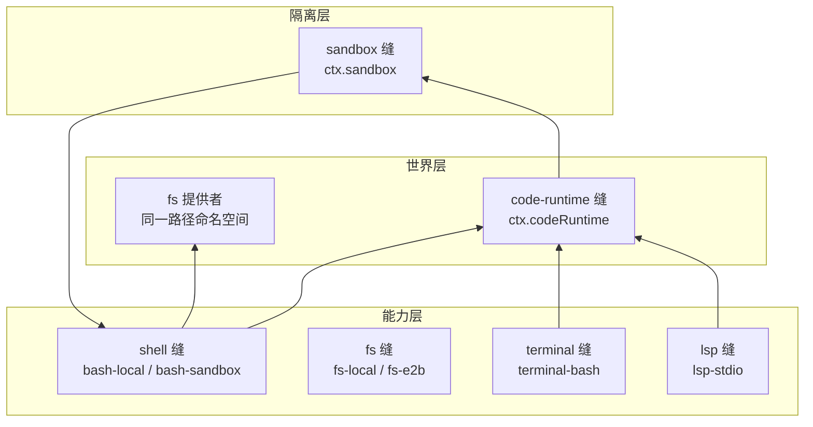
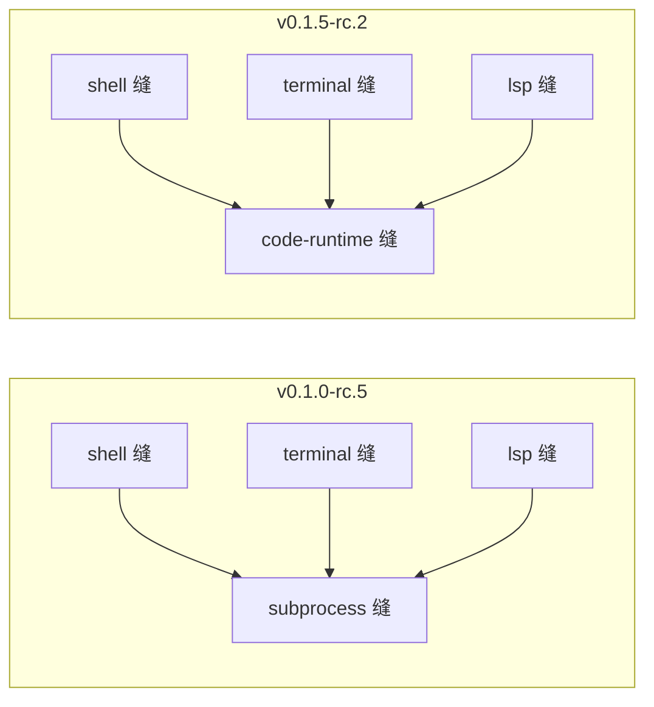

# 【第 05 篇】执行世界：fs / sandbox / code-runtime——Agent 的"手脚"家族

> **版本**：v0.1.5-rc.2
> 难度：🟡 进阶（建议先读第 02、03 篇）
> 前置阅读：`第03篇-shell能力缝.md`
> 对应目录：`deepseek-harness/packages/fs/`、`deepseek-harness/packages/sandbox/`、`deepseek-harness/packages/code-runtime/`

## 目录

- [0 功能需求（WHY）](#0-功能需求why)
- [1 架构设计（WHAT）](#1-架构设计what)
- [2 实现落点（HOW）](#2-实现落点how)
- [3 产物演示（EXAMPLE）](#3-产物演示example)
- [4 动手验证](#4-动手验证)
- [5 FAQ 与自测](#5-faq-与自测)
- [6 版本演进（v0.1.0-rc.5 → v0.1.5-rc.2）](#6-版本演进v010-rc5--v015-rc2)
- [7 延伸阅读](#7-延伸阅读)

---

## 0 功能需求（WHY）

### 0.1 背景与场景

第 03 篇的 shell 缝给 Agent 一双手；但手要落在**真实世界**上，还需要三个基础设施：**文件**（读写什么）、**隔离**（能碰什么）、**代码执行**（跑什么程序）。这三个能力组共享一个核心假设——**同一个"执行世界"**：文件提供者与代码执行提供者指向同一套路径与进程命名空间。

三个典型场景：

1. **修改文件**：模型要"把 settings.txt 里的 blue 改成 green"——但它可能没读过这个文件就乱改；
2. **隔离执行**：同一产品在裸机（不隔离）、CI（部分隔离）、云端（强隔离）三种环境跑——隔离策略必须可配置、且**如实报告自己的完成度**；
3. **运行代码**：模型需要执行一段 TypeScript 或 Python 代码来完成计算任务——代码运行时必须安全地与宿主隔离，且能调用宿主提供的函数。

### 0.2 需求陈述

**R1 · 文件操作有界可审计（fs）**——文件操作以**不透明目标身份**（`FsTarget`）进行；写/编辑受"观察策略"约束（先读后写），操作全程有事件。

- 实例：模型直接 edit 未读过的文件 → 被拒，错误码 `FS_NOT_OBSERVED`（见第 3 节真实产物）。
- 为什么必须：模型输出不可信；"先读后写"是最小的数据卫生规则。

**R2 · 隔离可配置且如实报告（sandbox）**——三种 `SandboxMode`（read-only / workspace-write / danger-full-access），且强制执行度如实报告（`full` / `partial`），消费者不得把 partial 当 full。

- 实例：Windows ACL 后端与旧版 Landlock ABI 是当前的 partial 案例。
- 为什么必须：隔离是安全承诺；承诺必须可验证，不能静默降级。

**R3 · 代码执行安全可控（code-runtime）**——模型编写的程序通过 `ctx.codeRuntime` 执行：宿主函数通过 `CodeBindingNamespace` 暴露给程序，执行结果以结构化方式返回（`CodeRunResult`）。

- 实例：程序通过 `tools` 命名空间调用宿主提供的函数，返回值通过 JSON 边界传递。
- 为什么必须：模型代码不可信；必须在安全边界内执行，且能捕获所有输出和错误。

**R4 · 世界可整体切换**——文件、代码执行、shell 提供者共享同一执行世界；切换提供者（本地 → 沙箱 → 远程），Bash/PTY/LSP 全部跟随，无提供者分叉。

- 实例：`bash-sandbox` 消费 `ctx.sandbox` 后，模型看到的工具 schema 不变（第 03 篇 R1 的延伸）。
- 为什么必须：部署形态千差万别；"世界"必须是可整体替换的单元。

### 0.3 非功能需求

| 编号 | 约束 | 衡量方式 |
|---|---|---|
| N1 | **身份不透明**：`FsTargetKey` 是 branded opaque id，消费者不得解析、不得假设它是本地绝对路径 | 换远程后端消费者零改动 |
| N2 | **原子文本操作**：写/编辑是原子文本操作，可配 stale 守卫（文件版本 token） | 并发修改不产生半成品 |
| N3 | **环境可信**：子进程环境先丢弃残留 `DSH_*`，再合并显式条目与托管快照 | 子进程看到的事实与宿主一致 |
| N4 | **强制如实**：`SandboxEnforcement` 报告 full/partial，partial 不得被当作 full | 要求绝对边界者显式拒绝 partial |
| N5 | **代码执行隔离**：程序在 worker-thread 或子进程中执行，宿主函数通过 JSON 边界传递 | 程序无法访问宿主内存或文件系统 |

### 0.4 验收标准

| 需求 | 验收示例（做到 = 通过） | 失败示例（做不到 = 没通过） |
|---|---|---|
| R1 | 模型未读先写被拒（FS_NOT_OBSERVED）；先读后写成功 | 模型可以盲改任意文件 |
| R2 | workspace-write 模式下写工作区成功、写外部被拒；partial 环境显式报 partial | 隔离静默降级 |
| R3 | 程序调用宿主函数成功返回；程序崩溃不影响宿主；超时被正确终止 | 程序可以访问宿主内存 |
| R4 | 切换 fs/code-runtime 提供者到远程沙箱，shell/terminal/lsp 全部跟随 | 每个能力各自适配远程 |

### 0.5 边界与不做什么

- **不做 shell 语义**：命令解析、超时策略属于 `shell` 组（第 03 篇）；code-runtime 只提供"执行代码"的机制。
- **不做持久终端**：PTY 会话属于 `terminal` 组（消费 subprocess 的 terminal 原语）。
- **sandbox 只管文件效果**：网络与进程可见性不在 `SandboxMode` 词汇内。
- **不做凭据存储**：环境里的密钥来自 `credentials` 组；subprocess 负责"清洗"而非"保管"。

### 0.6 设计哲学（原则 → 引出的需求）

| 原则 | 内容 | 引出的需求 |
|---|---|---|
| P1 不透明身份 | 跨能力坐标（路径、目标）用 branded id，消费者不解读 | R1 / N1 |
| P2 策略经事件 | 文件策略（read-before-write）通过 `fs/*` 事件生效，不是写死在工具里 | R1 |
| P3 清洗再合并 | 子进程环境 = 丢弃残留 → 显式条目 → 托管快照，顺序即安全 | N3 |
| P4 承诺要可验证 | 隔离模式与强制完成度分开报告，partial 显式暴露 | R2 / N4 |
| P5 世界共享 | 文件/代码执行/shell 提供者共享执行世界，整体切换 | R4 |
| P6 安全边界 | 代码执行在隔离环境中运行，宿主函数通过 JSON 边界传递 | R3 / N5 |

### 0.7 备选技术路径

| 路径 | 思路 | 优势 | 代价 | 需求匹配 |
|---|---|---|---|---|
| A. 裸 fs 调用 | 工具直接操作文件路径字符串 | 实现最少 | 无身份抽象、无策略挂点、换远程后端要改工具 | R1 落空 |
| B. 无隔离 | 子进程裸跑 | 最快 | 命令即全权；多环境无法部署 | R2/R4 落空 |
| C. 三缝 + 世界共享（**本项目**） | fs/sandbox 缝 + code-runtime 缝 + 同世界假设 | 整体切换、策略可挂、隔离可配置 | 三个缝要协调治理 | 全面满足 R1~R4 |
| D. 全远程执行（E2B 路线） | 一切执行走云端沙箱 | 安全与隔离最强 | 本地/离线不可用 | 是 C 的一种提供者，不是替代 |

**选型结论**：需求要求"有界、可信、可切换、可验证"（R1~R4）→ 三缝 + 世界共享（C）是唯一同时满足的路线；"世界共享"是关键决策——它让"换提供者"变成"换世界"，而不是逐能力适配（R4）。

## 1 架构设计（WHAT）

### 1.1 总体架构：一个执行世界，三个缝



**四步读懂**：

1. **世界层**：`ctx.codeRuntime` 与 fs 提供者共享同一路径/进程命名空间（P5）——code-runtime 里执行的程序能打开 fs 里 `processPath(target)` 返回的真实路径；
2. **能力层**：shell / terminal / lsp 都经 code-runtime 或 subprocess 启动进程；bash-sandbox 额外把自己的 argv 交给 sandbox 缝包裹（第 03 篇 D5）；
3. **隔离层**：`ctx.sandbox` 是"包裹 argv"的缝——消费者把将要 spawn 的精确 argv 交给它，由后端（bwrap/Landlock/Seatbelt/Windows ACL）按 per-call 策略包裹（R2）；
4. **切换即换世界**：把世界层提供者指向远程沙箱，Bash、PTY、LSP、fs 全部跟随（R4）。

### 1.2 关键架构决策（需求 → 方案 → 权衡）

| # | 决策 | 对应需求 | 权衡 |
|---|---|---|---|
| D1 | **FsTarget 不透明身份**：resolve() 先于一切操作，targetKey branded、displayPath 仅展示 | R1 / N1 | 本地路径无法直接字符串拼接；换来远程后端可插 |
| D2 | **观察策略经事件**：read-before-write 是 `fs/*` 事件门插件，工具不调用策略方法 | R1 | 不带策略插件 = 无约束缝（部署方自选）；换来策略可换可摘 |
| D3 | **SandboxMode + Enforcement 分离**：模式是请求、enforcement 是报告 | R2 / N4 | 消费者要处理 partial；换来承诺可验证 |
| D4 | **danger-full-access 绕过**：全权消费者直接 spawn 原 argv，不调 ctx.sandbox | R2 | 模式词汇混入"不隔离"；换来策略解析一次完成 |
| D5 | **CodeRuntime 隔离执行**：程序在 worker-thread 或子进程中执行，宿主函数通过 JSON 边界传递 | R3 / N5 | 跨进程序列化开销；换来安全隔离 |

### 1.3 关系网

- **上游**：shell/terminal/lsp 缝消费 subprocess；`bash-sandbox`/`pwsh-sandbox` 消费 sandbox 缝；sandbox-local 的 Linux 后端使用 bwrap/Landlock（native/landlock-run 是 Landlock 后端的原生模块来源）；
- **下游**：code-runtime 消费 fs 提供者做 `processPath` 转换；`fs-local` 的 cwd 来自会话（`!!js process.cwd()`）；
- **平级**：`fs-observation-policy` 与 `sandbox-policy` 都是"策略门"插件——前者管文件观察，后者管隔离默认模式与工作区根。

## 2 实现落点（HOW）

### 2.1 文件导航表（按阅读顺序）

| 顺序 | 文件（点击直达） | 关注点 | 对应需求 |
|---|---|---|---|
| 1 | [packages/fs/fs/src/types.ts](../../deepseek-harness/packages/fs/fs/src/types.ts) | `FsTarget` / `FsTargetKey`（第 16~68 行） | R1 / N1 |
| 2 | [packages/fs/fs-observation-policy/src/types.ts](../../deepseek-harness/packages/fs/fs-observation-policy/src/types.ts) | 观察策略的 `fs/*` 事件语义 | R1 |
| 3 | [packages/sandbox/sandbox/src/index.ts](../../deepseek-harness/packages/sandbox/sandbox/src/index.ts) | `SandboxMode` / `SandboxEnforcement` | R2 |
| 4 | [packages/sandbox/sandbox-local/src/index.ts](../../deepseek-harness/packages/sandbox/sandbox-local/src/index.ts) | 各平台后端（bwrap/Landlock/Seatbelt/Windows ACL） | R2 |
| 5 | [packages/code-runtime/code-runtime/src/types.ts](../../deepseek-harness/packages/code-runtime/code-runtime/src/types.ts) | `CodeRunRequest` / `CodeRunResult`（第 73~131 行） | R3 / N5 |
| 6 | [packages/code-runtime/code-runtime/src/index.ts](../../deepseek-harness/packages/code-runtime/code-runtime/src/index.ts) | `CodeRuntime` 服务定义 | R3 |

### 2.2 关键实现片段

**片段 A：文件目标身份**（[fs/src/types.ts 第 16~68 行](../../deepseek-harness/packages/fs/fs/src/types.ts)）

```ts
type FsTargetKey = Branded<'FsTargetKey'>

interface FsTarget {
  /** Opaque key for stale guards and target lookup. */
  targetKey: FsTargetKey
  /**
   * Path for model/UI-facing output. May be a local absolute path,
   * workspace-relative path, or remote URI depending on the backend.
   */
  displayPath: string
}
```

翻译：一次路径解析（`resolve()`）产生一个**不透明目标**：`targetKey` 是 branded id（本地后端是 realpath 式字符串，远程后端可能是 URI 或 file id——**消费者禁止解析它**，N1）；`displayPath` 仅供模型/UI 展示，可能是相对路径或远程 URI。官方注释明确：*"Consumers MUST NOT parse it or assume it is a local absolute path"*（第 14~15 行）。想拿到子进程能打开的真实路径？用提供者的 `processPath(target)`——**跨能力坐标由提供者翻译，不由消费者猜**（P1）。

**片段 B：沙箱模式与强制执行**（[sandbox/src/index.ts 第 29~59 行](../../deepseek-harness/packages/sandbox/sandbox/src/index.ts)）

```ts
type SandboxMode = 'read-only' | 'workspace-write' | 'danger-full-access'

type SandboxEnforcement = 'full' | 'partial'
```

翻译：`SandboxMode` 是请求——消费者"想要"什么级别的隔离；`SandboxEnforcement` 是报告——后端"实际能做到"什么。`partial` 意味着后端或内核 ABI 只能保证模式承诺的一部分文件效果（如 Windows ACL 的 Everyone 边界、旧版 Landlock）。要求绝对边界的消费者必须显式处理 partial，不能当 full 用（N4）。

**片段 C：代码运行时服务定义**（[code-runtime/src/index.ts 第 101~135 行](../../deepseek-harness/packages/code-runtime/code-runtime/src/index.ts)）

```ts
export abstract class CodeRuntime extends Service {
  /** The source language `run` expects `program` to be written in. */
  abstract readonly language: string

  /** The execution substrate, as a lowercase identifier. */
  abstract readonly isolation: string

  /**
   * Execute one program against the request's bindings and capture what it
   * emitted.
   */
  abstract run(request: CodeRunRequest): Promise<CodeRunResult>
}
```

翻译：`CodeRuntime` 是代码执行能力缝的服务定义（Service Definition）。它暴露三个关键属性：
- `language`：程序源代码的语言（如 `'typescript'`、`'python'`），供消费者展示和生成 SDK stub；
- `isolation`：执行基底（如 `'worker-thread'`、`'process'`、`'container'`），供诊断和部署区分；
- `run()`：执行一次程序，返回结构化结果（完成值 + 日志 + 错误）。

**片段 D：代码执行请求与结果**（[code-runtime/src/types.ts 第 73~131 行](../../deepseek-harness/packages/code-runtime/code-runtime/src/types.ts)）

```ts
interface CodeRunRequest {
  /** The program source, in the runtime's language. */
  program: string
  /** Host functions exposed to the program, one global object per namespace. */
  bindings: CodeBindingNamespace[]
  /** Abort the run: the runtime stops the program. */
  signal?: AbortSignal
}

interface CodeRunResult {
  /** The program's completion value (its top-level `return`). */
  value?: CodeJsonValue
  /** Captured text. */
  logs: string[]
  /** Present iff the run failed. */
  error?: CodeRunFailure
}

interface CodeRunFailure {
  /** The failure class. */
  kind: 'exception' | 'timeout' | 'abort' | 'worker-exit' | 'invalid-output' | 'output-limit'
  /** Human-readable detail. */
  message: string
}
```

翻译：`CodeRunRequest` 携带程序源代码、宿主函数绑定和中止信号；`CodeRunResult` 返回完成值（当可传递时）、捕获的日志和错误（如果有）。错误分类（`CodeRunFailure.kind`）是正交的：
- `exception`：程序抛出或解析失败；
- `timeout`：预算超时；
- `abort`：中止信号触发；
- `worker-exit`：执行基底死亡（如 OOM）；
- `invalid-output`：完成值不是无损 JSON；
- `output-limit`：输出超过配置上限。

### 2.3 符号 hover 指引

在 VS Code 打开 [packages/fs/fs/src/types.ts](../../deepseek-harness/packages/fs/fs/src/types.ts) hover `FsTarget`；打开 [packages/sandbox/sandbox/src/index.ts](../../deepseek-harness/packages/sandbox/sandbox/src/index.ts) hover `SandboxMode` 与 `SandboxEnforcement` 查看官方 JSDoc（含 partial 案例说明）；打开 [packages/code-runtime/code-runtime/src/types.ts](../../deepseek-harness/packages/code-runtime/code-runtime/src/types.ts) hover `CodeRunFailure.kind` 查看每种失败的语义。

## 3 产物演示（EXAMPLE）

### 3.1 输入

真实快照 `examples/acp-agent/tests/snapshots/fs-policy-reject/session.jsonl` 中，模型**第一次**尝试修改文件（未先读）：

```json
{"type":"tool/call","seq":82,"data":{"callId":"call_00_x0zlnXl5JOxLrAYL9y7P0119","name":"edit","arguments":"{\"file_path\": \"settings.txt\", \"old_string\": \"blue\", \"new_string\": \"green\"}"}}
```

### 3.2 产物（真实策略拒绝与成功重试）

> 以下为仓库现存快照的**逐字符拷贝**（seq 82~150 节选）；行号与注释列为本文档添加。

| 行 | 真实产物（JSONL） | 行内注释 |
|---|---|---|
| 1 | `{"type":"tool/call","seq":82,…"name":"edit","arguments":"{\"file_path\": \"settings.txt\", \"old_string\": \"blue\", \"new_string\": \"green\"}"}` | 模型直接尝试 edit（**未先读**该文件） |
| 2 | `{"type":"tool/result","seq":83,…"text":"Error: edit requires reading \"{{cwd}}/settings.txt\" first — read the file, then retry","isError":true}…"error":{"name":"FsError","code":"FS_NOT_OBSERVED"}}` | **🎯 策略拒绝**：isError=true、错误码 FS_NOT_OBSERVED——read-before-write 生效（R1） |
| 3 | `{"type":"tool/call","seq":149,…"name":"read","arguments":"{\"file_path\": \"settings.txt\"}"}` | 模型遵循提示先 read（step 2） |
| 4 | `{"type":"tool/result","seq":150,…"content":"<path>{{cwd}}/settings.txt</path>\n<type>file</type>\n<content>\n1: color: blue…","isError":false,…"meta":{"path":"{{cwd}}/settings.txt","offset":1,"lines":[{"number":1,…}]}}` | read 成功：带行号渲染 + `meta.lines` 供后续编辑定位（N2 原子编辑的输入） |

### 3.3 发生了什么（模型盲改 → 被拒 → 先读 → 再改的四步）

1. 模型直接调用 `edit`（行 1），参数里有 old_string/new_string——它**假设**文件内容是 blue；
2. `fs-observation-policy` 在 `fs/*` 事件门上发现该文件从未被观察 → 拒绝（行 2），错误码 `FS_NOT_OBSERVED`，并在错误文本里给出可操作指引（"read the file, then retry"）；
3. 模型按指引先 `read`（行 3），返回带行号的真实内容（行 4）——blue 确实在第 1 行；
4. 模型随后带着"已观察"状态重试 edit，成功（快照中第三个 tool/call 之后是成功的 tool/result）。

### 3.4 观察点（对应产物表中的行号）

- **行 2 的 `"error":{"code":"FS_NOT_OBSERVED"}`**：策略拒绝有**稳定错误码**——模型与 UI 都能据此做出不同反应（R1 可编程性）；
- **行 2 的 `isError:true`**：与第 03 篇的 `isError:false` 形成对照——成功与失败都走同一事件对（N4 审计）；
- **行 4 的 `meta.lines`**：read 附带行号元数据——编辑工具据此定位 old_string，原子替换（N2）的输入就绪；
- **行 1~4 的 seq 连续**：拒绝-重试的完整过程全部落账（可回放，呼应第 02 篇 R1）。

## 4 动手验证

> 以下命令已在本机实测（仓库根目录 `deepseek-harness` 下执行）。

### 任务 1：亲手复现"策略拒绝"证据

```powershell
Select-String -Path "examples\acp-agent\tests\snapshots\fs-policy-reject\session.jsonl" -Pattern 'FS_NOT_OBSERVED'
```

**预期**：命中一行（tool/result 事件）。**判据**：对照第 3.2 节行 2——错误文本包含 "read the file, then retry"。

### 任务 2：读三种隔离模式

打开 [packages/sandbox/sandbox/src/index.ts](../../deepseek-harness/packages/sandbox/sandbox/src/index.ts)，找到 `SandboxMode`，回答：三种模式分别允许什么？（答案：read-only 只读 + 必要 sink；workspace-write 加工作区与后端临时区；danger-full-access 绕过全部限制。）

### 任务 3：看 code-runtime 的保留字

打开 [packages/code-runtime/code-runtime/src/index.ts](../../deepseek-harness/packages/code-runtime/code-runtime/src/index.ts)，找到 `RESERVED_BINDING_GLOBALS`，回答：哪些全局名被保留？为什么？（答案：`console`、`__dsh_main__`、`__builtins__`、`__name__`、`__debug__`——每个都是某个后端的保留槽位，共享集合保证跨后端可移植性。）

### 任务 4（进阶）：看策略插件的"门"

```powershell
Get-ChildItem "packages\fs\fs-observation-policy\src" -Recurse -File | Select-Object Name
```

**预期**：看到策略实现文件。**判据**：官方文档确认——*"The policy plugin changes these operations by deciding the `fs/*` waterfalls"*：策略是**事件门**，不是工具内部的 if（P2）。

## 5 FAQ 与自测

### FAQ

- **Q1：`FsTargetKey` 为什么禁止解析？** 因为本地后端它是路径字符串，远程后端可能是 URI 或 file id（N1）。消费者解析它 = 假设后端是本地 = 换远程就炸。需要真实路径请用 `processPath(target)`——由提供者翻译。

- **Q2：read-before-write 是写死在工具里的吗？** 不是。它是 `fs-observation-policy` 这个**可选插件**通过 `fs/*` 事件门实现的（P2）。不带这个插件，fs 缝就是无约束的（官方文档明确说明）；部署方预期会带。

- **Q3：SandboxMode 只管文件效果？** 对。网络与进程可见性**不在词汇内**——它是"文件效果策略"，不是完整沙箱。

- **Q4：partial enforcement 是什么意思？** 后端或内核 ABI 只能保证模式承诺的一部分文件效果（如旧 Landlock、Windows ACL 的 Everyone 边界）。要求绝对边界的消费者必须显式处理 partial，不能当 full 用（N4）。

- **Q5：code-runtime 和 subprocess 什么关系？** subprocess 是"启动进程"的底层机制；code-runtime 是"执行模型代码"的高层能力缝。code-runtime 的 worker-thread 实现使用 worker_threads 模块（不是 subprocess），但它也遵循相同的执行世界假设——能访问 fs 提供者暴露的路径。

- **Q6：执行世界和沙箱什么关系？** 世界 = 文件+代码执行的统一命名空间（R4）；沙箱 = 包裹这个世界里"进程的文件效果"的缝（R2）。沙箱是世界之上的策略层，不是另一个世界。

### 自测（答案折叠在下方）

1. `FsTarget` 的两个字段分别是什么？消费者可以解析哪个？
2. read-before-write 策略通过什么机制生效？
3. `SandboxEnforcement` 的两种取值是什么？partial 意味着什么？
4. `CodeRunFailure.kind` 有哪六种失败类型？
5. 下列哪个不属于本组的职责？A. 文件观察策略 B. 进程隔离 C. 命令解析与超时 D. 代码执行

<details>
<summary>点开看答案</summary>

1. `targetKey`（branded opaque，禁止解析）与 `displayPath`（仅展示）。
2. `fs/*` 事件门（fs-observation-policy 插件），不是工具内部的 if。
3. `full` / `partial`。partial = 后端或内核 ABI 无法保证模式承诺的全部文件效果。
4. `exception`、`timeout`、`abort`、`worker-exit`、`invalid-output`、`output-limit`。
5. C。命令解析与超时属于 `shell` 组。

</details>

## 6 版本演进（v0.1.0-rc.5 → v0.1.5-rc.2）

### 6.1 变更总览

| 维度 | v0.1.0-rc.5 | v0.1.5-rc.2 | 变化 |
|---|---|---|---|
| **执行能力缝** | fs + subprocess + sandbox | fs + sandbox + code-runtime | subprocess 被 code-runtime 替代 |
| **进程启动** | `ctx.subprocess` | `ctx.codeRuntime` | 高层能力缝替代底层机制 |
| **代码执行** | 无（仅 shell） | `CodeRuntime` 服务定义 | 新增代码执行能力 |
| **隔离后端** | bwrap/Landlock/Seatbelt/Windows ACL | 同上 | 无变化 |
| **文件系统** | FsTarget + observation-policy | 同上 | 无变化 |

### 6.2 核心差异详解

#### 6.2.1 从 subprocess 到 code-runtime

v0.1.0-rc.5 使用 `ctx.subprocess` 作为进程启动的统一机制；v0.1.5-rc.2 引入 `ctx.codeRuntime` 作为代码执行的高层能力缝。



**设计意图**：
- `subprocess` 是"启动任何进程"的底层机制；
- `code-runtime` 是"执行模型代码"的高层抽象，专注于代码执行的安全边界和结果捕获；
- shell/terminal/lsp 缝仍然消费底层的 subprocess 能力，但 code-runtime 为模型代码提供了更安全的执行环境。

#### 6.2.2 code-runtime 的新增能力

| 能力 | 说明 | 对应需求 |
|---|---|---|
| **宿主函数绑定** | 通过 `CodeBindingNamespace` 将宿主函数暴露给程序 | R3 |
| **结构化结果** | `CodeRunResult` 返回完成值 + 日志 + 错误 | R3 |
| **失败分类** | `CodeRunFailure.kind` 区分六种正交失败 | N5 |
| **安全边界** | 程序在 worker-thread 中执行，通过 JSON 边界传递 | N5 |
| **跨后端可移植** | `RESERVED_BINDING_GLOBALS` 保证命名空间在所有后端一致 | N5 |

#### 6.2.3 sandbox 的增强

v0.1.5-rc.2 的 sandbox 包增加了 `RunnerFailureRule` 类型，用于结构化地区分"运行器失败"和"命令被拒绝"：

```ts
interface RunnerFailureRule {
  /** Nonzero process exit codes on which this rule may match. */
  allowedExitCodes?: readonly number[]
  /** Non-empty substrings identifying a fatal runner diagnostic. */
  fatalSignatures: readonly string[]
  /** Benign stderr lines excluded before fatal matching. */
  informationalLines?: readonly string[]
}
```

**为什么需要**：运行器失败（如 bwrap 无法启动）意味着命令从未执行；命令被拒绝（如只读模式下尝试写入）意味着隔离正常工作。两者需要不同的处理策略。

### 6.3 向后兼容性

| 组件 | 兼容性 | 说明 |
|---|---|---|
| `FsTarget` / `FsTargetKey` | ✅ 完全兼容 | 接口未变 |
| `SandboxMode` / `SandboxEnforcement` | ✅ 完全兼容 | 接口未变 |
| `ctx.subprocess` | ⚠️ 已移除 | 被 `ctx.codeRuntime` 替代 |
| `CodeRuntime` | ✅ 新增 | 全新服务定义 |
| `RunnerFailureRule` | ✅ 新增 | 全新类型，向后兼容 |

### 6.4 升级影响

如果你的插件或自定义代码扩展了执行世界：

1. **直接调用 `ctx.subprocess`** → 改为使用 `ctx.codeRuntime` 或底层的 worker_threads/child_process；
2. **依赖 `subprocess` 的 `DshEnvironment`** → 检查 `code-runtime` 的绑定命名空间是否满足需求；
3. **使用 `RunnerFailureRule`** → 新增能力，无需迁移。

## 7 延伸阅读

**官方（权威来源）**：

- [docs/subsystems/filesystem.md](../../deepseek-harness/docs/subsystems/filesystem.md) —— fs 缝四部件与观察策略
- [docs/subsystems/sandbox.md](../../deepseek-harness/docs/subsystems/sandbox.md) —— 模式与强制语义
- [docs/architecture.md](../../deepseek-harness/docs/architecture.md) —— "Capability seams" 一节（世界共享论点）
- [packages/code-runtime/code-runtime/README.md](../../deepseek-harness/packages/code-runtime/code-runtime/README.md) —— code-runtime 服务定义文档

**外部文献（按难度递增）**：

- 🟢 [bubblewrap 文档](https://github.com/containers/bubblewrap) —— Linux 沙箱后端之一
- 🟡 [Landlock LSM 内核文档](https://docs.kernel.org/userspace-api/landlock.html) —— 无特权用户沙箱机制（native/landlock-run 的基础）
- 🔴 [Windows Restricted Tokens](https://learn.microsoft.com/en-us/windows/win32/secauthz/restricted-tokens) —— Windows ACL 后端的机制参照
- 🔴 [Node.js worker_threads](https://nodejs.org/api/worker_threads.html) —— code-runtime 的 TypeScript 后端执行基底

---

**下一篇预告**：【第 06 篇】记忆的落地：session 持久化 / session-query / compaction。

---

**数据来源**：

- 本文档基于 DeepSeek Harness v0.1.5-rc.2 源码分析
- 参考文档：v0.1.0-rc.5 的 `05-execution-world.md`
- 变更日志：`dsh-v0.1.5-rc.1..dsh-v0.1.5-rc.2`（334 files changed, 1050 insertions(+), 1050 deletions(-)）
- 代码快照：2026-09-11
