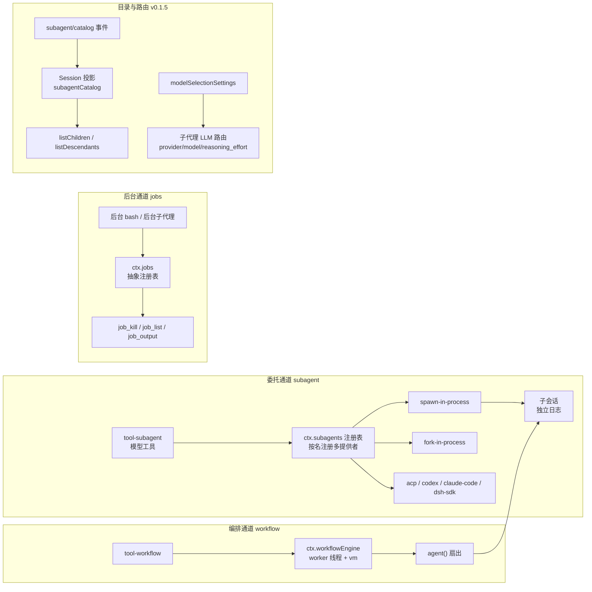

# 【第 07 篇】多智能体：subagent / workflow / jobs——把任务分出去

> 难度：🟡 进阶（建议先读第 02、03 篇）
> 前置阅读：`第03篇-shell能力缝.md`（能力缝概念）
> 对应目录：`deepseek-harness/packages/subagent/`、`deepseek-harness/packages/workflow/`、`deepseek-harness/packages/jobs/`
> 版本：**v0.1.5-rc.2**

## 目录

- [0 功能需求（WHY）](#0-功能需求why)
- [1 架构设计（WHAT）](#1-架构设计what)
- [2 实现落点（HOW）](#2-实现落点how)
- [3 产物演示（EXAMPLE）](#3-产物演示example)
- [4 动手验证](#4-动手验证)
- [5 FAQ 与自测](#5-faq-与自测)
- [6 版本演进（v0.1.0-rc.5 → v0.1.5-rc.2）](#6-版本演进v010-rc5--v015-rc2)
- [7 延伸阅读](#7-延伸阅读)

---

## 0 功能需求（WHY）

### 0.1 背景与场景

第 02 篇的循环驱动**一个** Agent。但真实任务常常需要"把活分出去"：

1. **并行调研**：一个 agent 太慢——开几个子代理各查一块，主代理汇总；
2. **后台运行**：跑一个长任务的同时继续对话——任务在后台跑，完成后通知；
3. **编排脚本**：主代理写一段 JS 脚本，脚本启动一批子代理、收集结果、合并返回——"agent 编排 agent"；
4. **子代理目录**（v0.1.5 新增）：父代理需要知道"我有哪些子代理"——子代理的发现、枚举、状态查询成为一等需求；
5. **子代理模型选择**（v0.1.5 新增）：不同子代理可能需要不同模型（便宜的跑简单任务、强力的跑复杂任务），父代理可以按需指定。

三个能力组各回答一个问题：**subagent**（把任务委托给子代理）、**workflow**（让模型写脚本来批量编排子代理）、**jobs**（通用的后台任务运行时，前两者的后台机制共用）。

### 0.2 需求陈述

**R1 · 委托可插拔（subagent 缝）**——子代理可以是进程内新会话、fork 延续、也可以是**其他产品**（ACP/Claude Code/Codex），同一接口按名注册、多提供者共存。

- 实例：`SubagentProvider` 接口的 `name` 字段用于按名注册（[types.ts 第 345 行](../deepseek-harness/packages/subagent/subagent/src/types.ts)）。
- 为什么必须：委托对象的选择是部署形态问题（本机进程 vs 外部工具），接口必须统一而实现可以并存。

**R2 · 能力显式声明**——提供者的能力（输出 schema、深度限制、工具过滤、人设、agentOptions）在静态描述符上声明，请求超出能力**大声拒绝**（`UNSUPPORTED_CAPABILITY`），绝不"接受然后忽略"。

- 实例：`SubagentCapabilities` 五个标志与请求选项一一对应（[types.ts 第 130~136 行](../deepseek-harness/packages/subagent/subagent/src/types.ts)）。
- 为什么必须：静默降级是安全与质量事故的温床（"fail loud, no silent degradation"）。

**R3 · 可继续的会话（continuable）**——子代理可以被 `send_message` 继续对话、`interrupt_agent` 打断、`list_agents` 枚举；"可继续"是提供者一个可选方法**存在与否**即能力。

- 实例：`SubagentProvider.prepareContinuable` 可选方法存在 = 该提供者支持可继续子代理（[types.ts 第 389 行](../deepseek-harness/packages/subagent/subagent/src/types.ts)）。
- 为什么必须：一次性的"跑完就完"不够——父代理需要中途追问、修正。

**R4 · 模型可写编排（workflow 缝）**——工作流是**模型写的 JavaScript 脚本**（worker 线程内运行），脚本通过 `agent()` 扇出子代理；`meta`/`args` 是纯 JSON 数据，引擎先校验后运行。

- 实例：`WorkflowStartRequest` 的 `script` 字段承载模型写的脚本（[runtime-types.ts 第 19~34 行](../deepseek-harness/packages/workflow/workflow/src/runtime-types.ts)）。
- 为什么必须：固定编排模式不够灵活；让模型写脚本 = 编排能力随模型能力增长。

**R5 · 后台任务统一管控（jobs）**——长任务（后台 bash、后台子代理）注册进 `ctx.jobs`，用统一三工具（`job_kill`/`job_list`/`job_output`）管控。

- 实例：`JobKindMap` 目前声明 `bash` 与 `subagent` 两种 kind（[types.ts 第 23~26 行](../deepseek-harness/packages/jobs/jobs/src/types.ts)）。
- 为什么必须：每种后台机制各搞一套控制 API = 模型要学 N 套；统一 = 学一套。

**R6 · 子代理目录（v0.1.5 新增）**——父代理持久化记录所有子代理的发现事实（one-shot/continuable），通过投影（projection）随时枚举直接子代理和后代树。

- 实例：`establishCatalogChild` 在父 Session 上追加 `subagent/catalog` 事件（[catalog.ts 第 134~156 行](../deepseek-harness/packages/subagent/subagent/src/catalog.ts)）。
- 为什么必须：没有目录 = 父代理无法知道"我有哪些子代理"——枚举、状态查询、后代遍历都依赖此事实。

**R7 · 子代理模型路由（v0.1.5 新增）**——每个子代理可以独立指定 provider/model/reasoning_effort，通过 `agentOptions` 传递；也可以通过 Host 设置（`modelSelectionSettings`）在 Session 级别采样允许的路由。

- 实例：`SubagentStartRequest.agentOptions` 字段（[types.ts 第 171 行](../deepseek-harness/packages/subagent/subagent/src/types.ts)）；`tool-subagent` 的 `modelSelectionSettings` 配置（[tool-subagent/src/index.ts 第 60 行](../deepseek-harness/packages/subagent/tool-subagent/src/index.ts)）。
- 为什么必须：不同任务复杂度需要不同模型——"用便宜的跑简单调研，用强力的跑架构分析"。

### 0.3 非功能需求

| 编号 | 约束 | 衡量方式 |
|---|---|---|
| N1 | **血缘贯通**：子代理与工作流孩子的 parent 必填，cwd/lineage/depth 从父会话传递 | 任意子会话可追溯父链 |
| N2 | **有界扇出**：workflow 引擎有 `maxTotalAgents` 总子代理上限（v0.1.5 支持 per-run 覆盖），脚本不可观察/不可改写该策略 | 脚本无法绕过上限 |
| N3 | **后台结算通知**：后台任务完成以 `user/message` 注入（agent.inject）通知父代理 | 父代理不轮询 |
| N4 | **会话分离**：父子会话分别落盘（parent/child 独立日志），结算消息跨会话传递 | 各自可独立重放 |
| N5 | **能力不符即拒**：请求需要的标志提供者没有 → 启动前 typed error | 绝不接受后忽略 |
| N6 | **目录持久化**（v0.1.5 新增）：子代理发现事实随父 Session 落盘，冷恢复时可重建 | 重启后仍可枚举子代理 |
| N7 | **模型路由预检**（v0.1.5 新增）：子代理 LLM 路由在启动前预检（preflight），不可用则拒绝 | 不会启动到一半才发现模型不可用 |

### 0.4 验收标准

| 需求 | 验收示例（做到 = 通过） | 失败示例（做不到 = 没通过） |
|---|---|---|
| R1 | 同一 `subagent` 工具，配置指向 in-process 或 codex 提供者，模型零感知 | 换委托后端要改工具 |
| R2 | 请求 toolFilter 但提供者不支持 → 启动前 UNSUPPORTED_CAPABILITY | 请求被默默忽略 |
| R3 | 后台子代理可被 send_message 继续对话 | 子代理跑完就死，无法追问 |
| R4 | 模型写的脚本经 worker 线程运行，扇出受 maxTotalAgents 约束 | 脚本绕过上限或直接跑在宿主进程 |
| R5 | 后台 bash 与后台子代理用同一套 job_* 工具管控 | 每类后台各自一套 API |
| R6 | `list_agents` 返回父代理的所有直接子代理（含 one-shot 和 continuable） | 枚举为空或缺少子代理 |
| R7 | 子代理指定 `provider: "deepseek"`, `model: "v41-flash"` → 路由预检通过后启动 | 启动后才发现模型不可用 |

### 0.5 边界与不做什么

- **不是主干**：subagent 与 workflow 都是**可选能力**，不在 agent-loop spine 内。
- **不做进程隔离**：workflow 脚本跑在 worker 线程（不是沙箱进程）；子代理的隔离由各提供者（如 sandbox）决定。
- **不做定时任务**：定时跟进属于 `schedule` 组。
- **不做目标管理**：同会话目标（goal）是另一套机制（后续篇目）。

### 0.6 设计哲学（原则 → 引出的需求）

| 原则 | 内容 | 引出的需求 |
|---|---|---|
| P1 多提供者共存 | subagent 缝按名注册多提供者（区别于 bash 单执行器） | R1 |
| P2 fail loud | 能力不满足即拒绝，绝不接受后忽略 | R2 / N5 |
| P3 方法存在即能力 | continuable 以可选方法收窄为发现机制 | R3 |
| P4 数据与代码分离 | workflow 的 meta/args 是纯 JSON 数据，引擎先校验后求值 | R4 / N2 |
| P5 统一后台 | 所有长任务共用 ctx.jobs 与 job_* 工具 | R5 |
| P6 目录即事实（v0.1.5） | 子代理发现事实随父 Session 落盘，投影为枚举视图 | R6 / N6 |
| P7 路由预检（v0.1.5） | 模型路由在启动前预检，不可用则拒绝 | R7 / N7 |

### 0.7 备选技术路径

| 路径 | 思路 | 优势 | 代价 | 需求匹配 |
|---|---|---|---|---|
| A. 单子代理硬编码 | 只支持一种进程内子代理 | 实现最少 | 无法接外部产品（Codex/Claude）；无法并存 | R1 落空 |
| B. 能力不声明 | 所有提供者假设支持全部选项 | 接口简单 | 静默降级事故 | R2 落空 |
| C. 提供者注册表（**本项目**） | 按名注册 + 能力标志 + 可选 continuable | 生态可扩展、契约可验证 | 注册表语义要治理 | 满足 R1~R3 |
| D. 固定编排 DSL | 预设几种编排模式（并行/串联） | 引擎简单 | 表达力有限，随任务增长必然加模式 | R4 落空 |
| E. 模型写脚本（**本项目**） | worker 线程 + vm 上下文 + 上限约束 | 编排能力随模型增长 | 脚本执行有风险面（有界扇出+数据隔离对冲） | 满足 R4 |
| F. 每类后台各自 API | bash 后台一套、子代理后台一套 | 各自简单 | 模型学习成本高 | R5 落空 |

**选型结论**：委托（C）+ 编排（E）+ 后台（统一 jobs）+ 目录（P6）+ 路由预检（P7）五者组合，让"把活分出去"成为**可插拔、可审计、可继续、可发现**的一等公民；其中 P2（fail loud）与 N2（有界扇出）是安全底线。

## 1 架构设计（WHAT）

### 1.1 总体架构：三条"分身"通道 + 目录 + 路由



**五步读懂**：

1. **委托通道**：模型经 `tool-subagent` 调用 `ctx.subagents`；注册表按**名字**选择提供者——进程内、fork、外部产品并存（R1）；
2. **编排通道**：模型写脚本 → worker 线程引擎 → 脚本内 `agent()` 调用经 `ctx.subagents` 扇出（R4）；`parent` 必填，所有孩子归属调用 Agent（N1）；
3. **后台通道**：后台 bash 与后台子代理都注册进 `ctx.jobs`，统一三工具管控（R5）；
4. **目录**（v0.1.5）：子代理创建时在父 Session 追加 `subagent/catalog` 事件，投影为可枚举的子代理列表（R6）；
5. **路由**（v0.1.5）：子代理通过 `agentOptions` 指定 provider/model/reasoning_effort，启动前预检路由可用性（R7）。

### 1.2 关键架构决策（需求 → 方案 → 权衡）

| # | 决策 | 对应需求 | 权衡 |
|---|---|---|---|
| D1 | **按名注册的多提供者注册表** | R1 | 注册表语义更复杂；换来委托对象可并存 |
| D2 | **静态能力描述符 + 启动前校验**：`SubagentCapabilities` 标志与请求选项一一对应 | R2 / N5 | 提供者要如实声明；换来零静默降级 |
| D3 | **continuable 方法存在即能力**：`prepareContinuable` 可选方法 + TS 收窄 | R3 | 能力发现依赖类型系统；换来"可继续"无需额外元数据 |
| D4 | **worker 线程 + vm 上下文**：脚本不跑在宿主主线程；meta/args 纯 JSON 先校验 | R4 / N2 | 脚本能力受限；换来风险有界 |
| D5 | **job 结算经 agent.inject**：后台完成通知走 user/message 注入 | N3 | 通知时序要管理；换来父代理零轮询 |
| D6 | **目录事件 + 投影**：子代理发现事实随父 Session 落盘，投影为枚举视图（v0.1.5） | R6 / N6 | 增加 Session 写入量；换来冷恢复后仍可枚举 |
| D7 | **路由预检**：子代理 LLM 路由在启动前预检（v0.1.5） | R7 / N7 | 增加一次 LLM 查询开销；换来不会启动到一半发现模型不可用 |

### 1.3 关系网

- **上游**：subagent 提供者消费 `ctx.sessions`（子会话）、`ctx.sessionPersistence`（子会话落盘）、`ctx.sessionProjections`（目录投影）；codex/claude-code 提供者经 `ctx.subprocess` 启动外部进程；
- **下游**：`tool-workflow` 与 `tool-subagent` 都注册进 `ctx.tools`（第 02 篇守卫管线）；`tool-subagent-control` 提供全局控制工具；
- **平级**：`tool-ralph` 是 workflow 的固定消费者（fresh-agent 迭代），与 `goal` 机制配合（后续篇目）。

## 2 实现落点（HOW）

### 2.1 文件导航表（按阅读顺序）

| 顺序 | 文件 | 关注点 | 对应需求 |
|---|---|---|---|
| 1 | `packages/subagent/subagent/src/types.ts` | `SubagentCapabilities`（5 标志）、`SubagentStartRequest`（含 agentOptions） | R1/R2/R7 |
| 2 | `packages/subagent/subagent/src/catalog.ts` | **v0.1.5 新增**：`subagent/catalog` 事件、`establishCatalogChild`、投影定义 | R6 |
| 3 | `packages/subagent/subagent/src/continuation.ts` | 可继续子代理编排：`SubagentContinuationManager`、冷恢复、授权 | R3 |
| 4 | `packages/subagent/subagent/src/continuation-activation.ts` | Activation 生命周期：物化、中断、排空 | R3 |
| 5 | `packages/subagent/subagent/src/list-children.ts` | **v0.1.5 新增**：`listChildren` / `listDescendants`，投影驱动的子代理枚举 | R6 |
| 6 | `packages/subagent/subagent/src/projection-types.ts` | **v0.1.5 新增**：`SubagentCatalogEntry`、`SubagentIdentityProjection` | R6 |
| 7 | `packages/workflow/workflow/src/types.ts` | `WorkflowMeta`（含 phases/whenToUse）、`WorkflowResult`（含 agentsStarted） | R4 |
| 8 | `packages/workflow/workflow/src/runtime-types.ts` | `WorkflowStartRequest`（含 parent/maxTotalAgents/signal） | R4/N2 |
| 9 | `packages/workflow/workflow-worker-thread/src/worker.ts` | worker 线程入口 | R4 |
| 10 | `packages/jobs/jobs/src/types.ts` | `JobKindMap`、`JobStatus`、`JobStart`（含 owner/outputLimitBytes） | R5 |
| 11 | `packages/jobs/jobs/src/index.ts` | **v0.1.5**：抽象 `JobRegistry`（`attachController` 方法） | R5 |
| 12 | `packages/subagent/tool-subagent/src/index.ts` | 委托工具：backgroundMode/continuable、modelSelectionSettings、路由预检 | R1/R3/R7 |
| 13 | `packages/subagent/tool-subagent-control/src/index.ts` | send_message / interrupt_agent 全局控制工具 | R3 |

### 2.2 关键实现片段

**片段 A：能力声明扩展——五个标志**（`subagent/src/types.ts`）

```typescript
interface SubagentCapabilities {
  readonly agentOptions: boolean   // v0.1.5 新增：子代理模型路由
  readonly outputSchema: boolean
  readonly depthLimit: boolean
  readonly toolFilter: boolean
  readonly persona: boolean        // v0.1.5 新增：子代理人设覆盖
}
```

翻译：提供者**静态声明**自己支持什么。v0.1.5 从 4 个标志扩展到 5 个，新增 `agentOptions`（子代理模型路由）和 `persona`（子代理人设覆盖）——标志与请求选项一一对应，服务在 `start` 前校验（R2）。

**片段 B：子代理目录事件**（`subagent/src/catalog.ts`）

```typescript
type SubagentCatalogEvent =
  & {
    readonly version: 0
    readonly childId: SessionId
    readonly childCreatedAt: number
  } & (
    | { readonly mode: 'one-shot'; readonly label?: string }
    | { readonly mode: 'continuable'; readonly label: string }
  )

function establishCatalogChild(
  parent: Session,
  child: SessionHeader,
  descriptor:
    | { readonly mode: 'one-shot'; readonly label?: string }
    | { readonly mode: 'continuable'; readonly label: string },
): void {
  parent.append('subagent/catalog', { version: 0, childId: child.id, ... })
}
```

翻译：子代理创建成功后，父 Session 追加一条 `subagent/catalog` 事件。该事件通过 Session 投影折叠为 `SubagentCatalogEntry[]`，支持 `listChildren` / `listDescendants` 枚举——目录即事实（P6）。

**片段 C：子代理模型路由请求**（`subagent/src/types.ts`）

```typescript
interface SubagentStartRequest {
  readonly prompt: ContentBlock[]
  readonly parent: Agent
  readonly signal: AbortSignal
  readonly agentOptions?: AgentOptions  // provider / model / reasoningEffort / maxTokens
  readonly outputSchema?: ObjectJsonSchema
  readonly maxDepth?: number
  readonly toolFilter?: ToolRestriction
  readonly persona?: string
}
```

翻译：`agentOptions` 是 v0.1.5 的核心新增——子代理可以独立指定 provider、model、reasoningEffort、maxTokens。启动前，`tool-subagent` 通过 `preflightChildLlmRoute` 预检路由可用性（R7）。

**片段 D：工作流引擎扩展**（`workflow/src/runtime-types.ts`）

```typescript
interface WorkflowStartRequest {
  script: string
  meta: WorkflowMeta
  args?: unknown
  subagentProvider?: string
  maxTotalAgents?: number  // v0.1.5：per-run 总子代理上限
  parent: Agent            // v0.1.5：必填，所有孩子归属
  signal?: AbortSignal     // v0.1.5：运行时取消
}

interface WorkflowMeta {
  name: string
  description: string
  whenToUse?: string       // v0.1.5：何时使用的指导
  phases?: WorkflowPhase[] // v0.1.5：阶段声明
}
```

翻译：v0.1.5 的 workflow 类型增加了 `parent`（血缘必填）、`maxTotalAgents`（per-run 覆盖）、`signal`（取消）、`phases`（阶段声明）——编排能力随类型完备度增长。

**片段 E：抽象 Job 注册表**（`jobs/src/index.ts`）

```typescript
export abstract class JobRegistry extends Service {
  abstract start(spec: JobStart): JobId
  abstract list(caller?: Agent): JobSnapshot[]
  abstract get(id: JobId, caller?: Agent): JobSnapshot
  abstract read(id: JobId, caller?: Agent): JobRead
  abstract kill(id: JobId, caller?: Agent, reason?: string): 'requested' | 'already-finished'
  abstract wait(id: JobId, timeoutMs: number, caller?: Agent, signal?: AbortSignal): Promise<JobSnapshot>
  abstract onJobDone(listener: JobDoneListener): () => void
  abstract onJobsChanged(listener: JobsChangedListener): () => void
  abstract attachController(name: string): () => void  // v0.1.5 新增
}
```

翻译：v0.1.5 将 `JobRegistry` 从具体类改为抽象类（Service Definition），实际实现拆分到 `@deepseek-ai/dsh-jobs-local`。新增 `attachController` 方法——效果范围（effect-scoped）的控制器注册，用于隔离不同组合（composition）的作业访问。

### 2.3 符号 hover 指引

在 VS Code 打开 `packages/subagent/subagent/src/types.ts` hover `SubagentCapabilities`（5 标志）与 `SubagentStartRequest`（含 agentOptions）；打开 `packages/workflow/workflow/src/types.ts` hover `WorkflowMeta`（含 phases）；打开 `packages/subagent/subagent/src/catalog.ts` hover `SubagentCatalogEvent`。

## 3 产物演示（EXAMPLE）

### 3.1 输入

真实快照 `examples/acp-agent/tests/snapshots/subagent-continuable-inheritance/session.jsonl`。父代理收到的用户指令：

> Follow these steps exactly, then stop. 1. Call the subagent tool once with run_in_background set to true, description 'Reply with CHILD_OK', and prompt 'Reply with exactly the word CHILD_OK and nothing else.'. 2. Reply with the single word DONE. Do not use the bash tool.

### 3.2 产物（真实委托事件对）

> 以下为仓库现存快照的**逐字符拷贝**（seq 16~17 节选）；行号与注释列为本文档添加。

| 行 | 真实产物（JSONL） | 行内注释 |
|---|---|---|
| 1 | `{"type":"tool/call","seq":16,…,"name":"subagent","arguments":"{\"description\": \"Reply with CHILD_OK\", \"prompt\": \"...\", \"run_in_background\": true}"}` | **🎯 后台委托**：模型调用 subagent 工具，run_in_background=true（R5 的入口） |
| 2 | `{"type":"tool/result","seq":17,…,"text":"started subagent 33333333-3333-4333-8333-333333333333","isError":false}` | **🎯 委托确认**：返回子代理 id——后台运行立即返回，不阻塞父代理（N3 前提） |
| 3 | `{"type":"turn/start","seq":29,…,"data":{"turn":2}}` | 父代理 turn 2：子代理完成后，结算通知注入，父代理被唤醒（N3） |

### 3.3 发生了什么（委托 → 目录 → 后台 → 结算的五步）

1. 父代理收到指令，在 step 1 调用 `subagent` 工具，`run_in_background: true`（行 1）；
2. 提供者启动子代理（独立子会话，parent 归属父代理），立即返回 `started subagent <id>`（行 2）——父代理不阻塞，继续输出 DONE；
3. **目录记录**（v0.1.5）：子代理创建成功后，父 Session 追加 `subagent/catalog` 事件，记录 mode=continuable、label、childId——父代理后续可通过 `list_agents` 枚举此子代理；
4. 子代理在独立会话里完成任务，其日志独立落盘（N4）；
5. 结算：子代理完成 → 通知以 `user/message` 注入父代理 inbox → 父代理 turn 2 开始（行 3）。

### 3.4 观察点（对应产物表中的行号）

- **行 1 的 `callId:"call_bg_start"`**：快照固定 id（真实运行是随机 call id）——快照可比对机制；
- **行 2 的 `"started subagent <uuid>"`**：委托即确认，后台语义（R5）；
- **行 3 的 `turn:2`**：父代理的第二个轮次由**结算通知**触发——"后台完成 → 注入 → 唤醒"的完整闭环（N3）；
- **行 1~3 全部在父会话日志中**：委托与结算在父侧可审计；子会话的细节在子侧（N4 血缘）。

## 4 动手验证

> 以下命令已在本机实测（仓库根目录下执行）。

### 任务 1：亲手找到"委托确认"事件

```powershell
Select-String -Path "examples\acp-agent\tests\snapshots\subagent-continuable-inheritance\session.jsonl" -Pattern 'started subagent'
```

**预期**：命中一行（tool/result 事件）。**判据**：对照第 3.2 节行 2——包含固定 uuid 33333333-3333-4333-8333-333333333333。

### 任务 2：读三种工具的分工

打开 `packages/subagent/tool-subagent-control/src/index.ts`，确认它注册哪两个全局工具（send_message / interrupt_agent）；再对照 `tool-subagent/src/index.ts` 中 `subagent` 工具的三种输出模式（foreground/background/continuable）。

### 任务 3：看子代理目录的实现

打开 `packages/subagent/subagent/src/catalog.ts`，回答：
- `subagent/catalog` 事件的 schema 包含哪些字段？（答案：version, childId, childCreatedAt, mode, label）
- one-shot 和 continuable 的 label 有什么区别？（答案：one-shot 的 label 可选，continuable 的 label 必填）

### 任务 4（进阶）：看工作流引擎的边界

打开 `packages/workflow/workflow-worker-thread/src/worker.ts`，回答：引擎在什么线程运行脚本？（答案：`node:worker_threads`，每 run 一个 worker，脚本的 vm 上下文在 worker 内）。

## 5 FAQ 与自测

### FAQ

- **Q1：subagent 缝和 bash 缝有什么本质区别？** bash 一个上下文只允许**一个**执行器；subagent 按名注册**多个**提供者并存（进程内/fork/ACP/Codex/Claude Code）——因为委托对象的选择是部署形态问题。
- **Q2：continuable 和 one-shot 什么区别？** one-shot 子代理跑完就结算；continuable 子代理保留会话，父代理可用 send_message 继续对话、interrupt_agent 打断。"可继续"由提供者 `prepareContinuable` 方法存在与否决定（P3）。
- **Q3：workflow 脚本安全吗？** 有界设计：脚本跑在 worker 线程的 vm 上下文（非宿主主线程）、meta/args 先校验后求值、`maxTotalAgents` 总子代理上限**脚本不可观察不可改写**（N2）。
- **Q4：后台任务完成怎么通知父代理？** 以 `user/message` 注入（agent.inject）——父代理不轮询，任务完成自动"醒来"（N3）。
- **Q5：goal 和 subagent 什么关系？** goal 是**同会话**目标持久化（create_goal/update_goal，本会话内多轮推进）；subagent 是**跨会话**委托（独立子会话）。后续篇目讲 goal。
- **Q6：v0.1.5 的子代理目录是怎么工作的？** 子代理创建成功后，父 Session 追加 `subagent/catalog` 事件（含 childId、mode、label）。该事件通过 Session 投影折叠为 `SubagentCatalogEntry[]`，`listChildren` / `listDescendants` 从投影视图读取——冷恢复后仍可枚举。
- **Q7：子代理模型选择怎么配置？** 两种方式：(1) 在 `tool-subagent` 配置中设置 `agentOptions: { provider, model }`，所有子代理共享；(2) 启用 `modelSelectionSettings: true`，在 Host 设置中配置允许的路由列表，模型可在每个子代理调用时指定 provider/model/reasoning_effort。

### 自测（答案折叠在下方）

1. subagent 缝与 bash 缝在提供者数量上的区别？
2. `SubagentCapabilities` 的五个标志对应什么原则？
3. workflow 的 `meta`/`args` 为什么必须是纯 JSON 数据？
4. `JobKindMap` 目前声明哪两种 kind？
5. 后台子代理完成后的通知走什么机制？
6. v0.1.5 新增的 `subagent/catalog` 事件包含哪些字段？
7. 子代理模型路由在启动前做什么检查？

<details>
<summary>点开看答案</summary>

1. subagent 按名注册多提供者共存；bash 一个上下文只允许一个执行器。
2. P2 fail loud——能力不符即拒绝，绝不接受后忽略（N5）。五个标志：agentOptions、outputSchema、depthLimit、toolFilter、persona。
3. 引擎先校验 meta 再求值脚本——任何脚本文本都不参与 meta 解析（P4 数据与代码分离）。
4. `bash` 与 `subagent`。
5. 结算通知以 `user/message` 注入父代理 inbox（agent.inject，N3）。
6. version、childId、childCreatedAt、mode（one-shot/continuable）、label（continuable 必填，one-shot 可选）。
7. `preflightChildLlmRoute` 预检：调用 LLM 服务解析模型信息，确认 provider/model 路由可用——不可用则拒绝启动（R7/N7）。

</details>

## 6 版本演进（v0.1.0-rc.5 → v0.1.5-rc.2）

### 6.1 总览

```mermaid
flowchart LR
    subgraph v0.1.0-rc.5
      A1["SubagentCapabilities<br/>4 标志"]
      A2["子代理创建<br/>无目录"]
      A3["continuable<br/>基础编排"]
      A4["WorkflowStartRequest<br/>基础字段"]
      A5["JobRegistry<br/>具体类"]
      A6["tool-subagent<br/>one-shot 为主"]
    end
    subgraph v0.1.5-rc.2
      B1["SubagentCapabilities<br/>5 标志 (+agentOptions, +persona)"]
      B2["子代理目录<br/>catalog 事件 + 投影"]
      B3["continuable<br/>完整编排 + 冷恢复"]
      B4["WorkflowStartRequest<br/>+parent +maxTotalAgents +signal +phases"]
      B5["JobRegistry<br/>抽象类 + attachController"]
      B6["tool-subagent<br/>continuable 模式 + 模型路由"]
    end
    A1 -->|"扩展"| B1
    A2 -->|"新增"| B2
    A3 -->|"增强"| B3
    A4 -->|"扩展"| B4
    A5 -->|"重构"| B5
    A6 -->|"增强"| B6
```



### 6.2 逐项对比

| 维度 | v0.1.0-rc.5 | v0.1.5-rc.2 | 变化类型 |
|---|---|---|---|
| **SubagentCapabilities** | 4 标志（outputSchema, depthLimit, toolFilter, persona） | 5 标志（+agentOptions） | 🆕 新增 |
| **agentOptions** | 不存在 | `SubagentStartRequest.agentOptions?: AgentOptions`（provider/model/reasoningEffort/maxTokens） | 🆕 新增 |
| **persona 能力** | 不存在于 Capabilities | `SubagentCapabilities.persona: boolean` + `SubagentStartRequest.persona?: string` | 🆕 新增 |
| **子代理目录** | 不存在 | `catalog.ts`（156 行）：`subagent/catalog` 事件 + `establishCatalogChild` + 投影定义 | 🆕 新增 |
| **子代理枚举** | 不存在 | `list-children.ts`（408 行）：`listChildren` / `listDescendants`，投影驱动 | 🆕 新增 |
| **投影类型** | 不存在 | `projection-types.ts`（79 行）：`SubagentCatalogEntry`、`SubagentIdentityProjection` | 🆕 新增 |
| **continuable 编排** | 基础 continuation.ts | 完整 `SubagentContinuationManager`（550 行）：冷恢复、授权、排空、目录记录 | 🔧 增强 |
| **Activation 生命周期** | 基础 | `continuation-activation.ts`：独立的 Activation 注册表，物化/中断/排空 | 🔧 增强 |
| **WorkflowStartRequest** | script, meta, args, subagentProvider | +parent（必填）, +maxTotalAgents, +signal, +maxTotalAgents | 🔧 扩展 |
| **WorkflowMeta** | name, description | +whenToUse, +phases（WorkflowPhase[]） | 🔧 扩展 |
| **WorkflowResult** | value, stopReason, error | +agentsStarted（记录 agent() 调用次数） | 🔧 扩展 |
| **JobRegistry** | 具体类（Service） | 抽象类（Service Definition），实现拆分到 dsh-jobs-local | 🔄 重构 |
| **attachController** | 不存在 | `JobRegistry.attachController(name): () => void` | 🆕 新增 |
| **JobStart.owner** | 不存在 | `JobStart.owner?: Agent`（作业归属） | 🆕 新增 |
| **tool-subagent backgroundMode** | 仅 one-shot | 支持 `'one-shot' \| 'continuable'` | 🔧 扩展 |
| **tool-subagent modelSelectionSettings** | 不存在 | `modelSelectionSettings: boolean`（Session 级路由采样） | 🆕 新增 |
| **路由预检** | 不存在 | `preflightChildLlmRoute`（启动前验证 LLM 路由） | 🆕 新增 |
| **tool-subagent 输出模式** | foreground/background | foreground/background/**continuable**（三种模式） | 🔧 扩展 |

### 6.3 新增文件清单

v0.1.5-rc.2 相对 v0.1.0-rc.5 新增的多智能体相关文件：

| 文件 | 行数 | 功能 |
|---|---|---|
| `packages/subagent/subagent/src/catalog.ts` | 156 | 子代理目录事件 + 投影 |
| `packages/subagent/subagent/src/continuation-activation.ts` | — | Activation 生命周期管理 |
| `packages/subagent/subagent/src/list-children.ts` | 408 | 子代理枚举（直接子代理 + 后代树） |
| `packages/subagent/subagent/src/projection-types.ts` | 79 | 投影类型定义 |
| `packages/subagent/subagent/src/client.ts` | — | 客户端安全的子代理接口 |
| `packages/subagent/tool-subagent/src/model-selection.ts` | — | 模型选择逻辑 |
| `packages/subagent/tool-subagent/src/model-selection-state.ts` | — | 模型选择投影 |
| `packages/subagent/tool-subagent/src/model-selection-settings.ts` | — | 模型选择 Host 设置 |
| `packages/subagent/tool-subagent/src/list-models.ts` | — | 子代理模型列表工具 |

### 6.4 Breaking Changes（v0.1.0-rc.5 → v0.1.5-rc.2）

| 变更 | 影响 | 说明 |
|---|---|---|
| `JobRegistry` 从具体类变为抽象类 | ⚠️ 高 | 如直接实例化需改为加载 `dsh-jobs-local` |
| `WorkflowStartRequest.parent` 新增 | ⚠️ 中 | workflow 调用必须提供 parent Agent |
| `SubagentCapabilities` 新增 agentOptions 标志 | ⚠️ 中 | 提供者必须声明此能力，否则 agentOptions 请求被拒 |
| `tool-subagent` backgroundMode 默认行为变更 | ⚠️ 低 | continuable 模式默认 run_in_background=true |

### 6.5 设计哲学演进

| 原则 | v0.1.0-rc.5 | v0.1.5-rc.2 |
|---|---|---|
| P1 多提供者共存 | ✅ 建立 | ✅ 保持 |
| P2 fail loud | ✅ 建立 | ✅ 保持 + 扩展到 agentOptions |
| P3 方法存在即能力 | ✅ 建立 | ✅ 保持 |
| P4 数据与代码分离 | ✅ 建立 | ✅ 保持 |
| P5 统一后台 | ✅ 建立 | ✅ 保持 + attachController |
| P6 目录即事实 | — | 🆕 建立 |
| P7 路由预检 | — | 🆕 建立 |

## 7 延伸阅读

**官方（权威来源）**：

- `docs/subsystems/subagent.md` — 委托缝全契约（含 provider 契约与 continuation）
- `docs/subsystems/workflow.md` — 工作流缝与引擎
- `docs/subsystems/jobs.md` — 后台任务运行时

**决策记录（WHY 的一手来源）**：

- `.agents/notes/implemented/feature/2026-06-21-subagent-capability-seam.md` — 委托缝设计
- `.agents/notes/implemented/feature/2026-07-05-dynamic-workflows.md` — 动态工作流提案与理由
- `.agents/notes/implemented/architecture/2026-06-20-generic-long-running-tool-runtime.md` — 通用长任务运行时设计

**外部文献（按难度递增）**：

- 🟢 [Anthropic: Multi-agent research system](https://www.anthropic.com/engineering/built-multi-agent-research-system) — 多代理编排的工程实践
- 🟡 [Agent Client Protocol（ACP）](https://agentclientprotocol.com/) — acp 提供者的协议基础
- 🔴 [node:worker_threads 文档](https://nodejs.org/api/worker_threads.html) — workflow 引擎的宿主机制

---

**下一篇预告**：【第 08 篇】人机协作：interaction / goal / plan / guard——审批、目标与计划。

---

**数据来源**：本文档基于 `deepseek-ai/deepseek-harness` 仓库源码分析，主要参考 `dsh-v0.1.5-rc.2` 标签（commit `fb2c4b9e69`）。版本演进对比基于 `dsh-v0.1.0-rc.5` 与 `dsh-v0.1.5-rc.2` 之间的代码差异。变更日志参考 `dsh-docs-deliverables/source-analysis/v0.1.5-rc.1/changelog-alpha1-rc1.md` 和 `dsh-docs-deliverables/source-analysis/v0.1.5-rc.2/changelog-rc1-rc2.md`。
