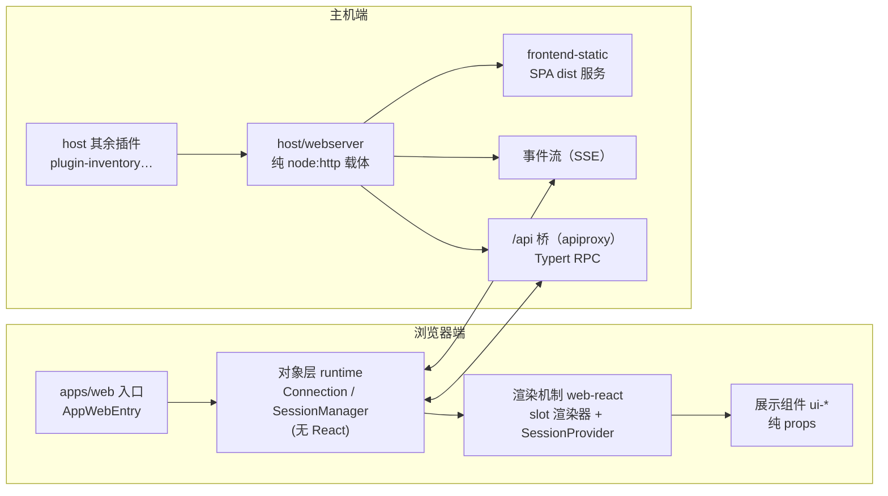
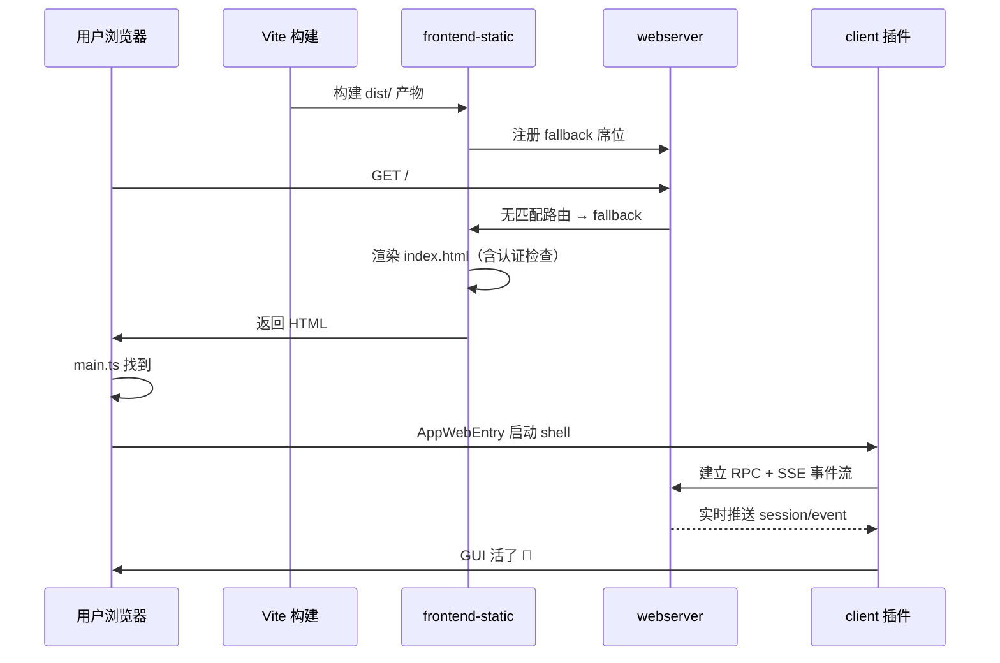
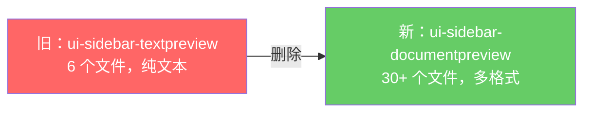
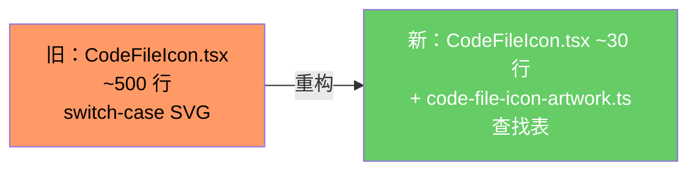

# 【第 10 篇】GUI 前后端：apps/web + host + client——浏览器到主机的桥梁

> **版本**：v0.1.5-rc.2
> 难度：🟢 入门（前端只讲架构组织，不抠技术细节）
> 前置阅读：`第09篇-应用层cli与boot.md`
> 对应目录：`deepseek-harness/apps/web/`、`deepseek-harness/packages/host/`、`deepseek-harness/packages/client/`

## 目录

- [0 功能需求（WHY）](#0-功能需求why)
- [1 架构设计（WHAT）](#1-架构设计what)
- [2 实现落点（HOW）](#2-实现落点how)
- [3 产物演示（EXAMPLE）](#3-产物演示example)
- [4 动手验证](#4-动手验证)
- [5 FAQ 与自测](#5-faq-与自测)
- [6 版本演进（v0.1.0-rc.5 → v0.1.5-rc.2）](#6-版本演进v010-rc5--v015-rc2)
- [7 延伸阅读](#7-延伸阅读)

---

## 0 功能需求（WHY）

### 0.1 背景与场景

前九篇的产品都是"无头"的（headless 跑任务、日志可审计）。但产品要给**人**用，就需要一个 GUI。三个场景：

1. **实时会话**：用户在浏览器里看到 Agent 的思考、工具调用、结果**实时滚动**（SSE 事件流）；
2. **界面可扩展**：GUI 的每个区块（对话、侧边栏、设置、工具视图）都要能由插件贡献——UI 本身也是插件；
3. **职责不混**：浏览器只管"怎么画"，模型可见的事实永远来自会话日志——**UI 是纯展示层**。

### 0.2 需求陈述

**R1 · 浏览器载体与业务分离（host）**——`dsh-host-webserver` 是纯 `node:http` 载体：**不知道任何 harness 概念**，只提供命名路由注册、index.html 变换、一个 fallback 席位；所有功能路由（/api 桥、插件 bundle、HMR 事件流）由插件注册。

- 实例：官方原文 *"It is not part of the agent loop and not a capability seam; it knows no harness concepts, and another plugin registers every feature route"*。
- 为什么必须：HTTP 服务器是"管道"，业务是"水"——管道不装水，水由插件注入。

**R2 · UI 即插件（client）**——浏览器端由插件组合：`ui-slots` 定义注册/渲染协议（`slots.register`），47 个 `ui-*` 包各贡献一个界面区域。

- 实例：官方原文 *"a plugin composes UI only through `ctx.slots.register({ name, children?, store?, inject? }, Component)"*（[packages/client/AGENTS.md](../../deepseek-harness/packages/client/AGENTS.md)）。
- 为什么必须：UI 与功能同构（一切皆插件，第 01 篇 P1 在浏览器端的延伸）。

**R3 · 三层分离**——浏览器端严格分三层：**数据对象层**（`runtime`，无 React：连接/会话/重连状态机）、**渲染机制**（`web-react`，shell 专属：ctx→React 的桥）、**展示组件**（各 ui-* 包的 `src/client/`，纯 props）。

- 实例：官方原文 *"Business data lives in the object layer, never a store"*（[packages/client/AGENTS.md](../../deepseek-harness/packages/client/AGENTS.md)）。
- 为什么必须：业务状态与展示分离 = 可测试、可重放、可重写 UI。

**R4 · 实时事件流**——浏览器经 SSE 事件流观察 `session/event`，会话进展实时渲染；连接由 `connection` 包维护（RPC + 事件投递 + 重连）。

- 实例：第 02 篇的"循环可观测"（R3）在浏览器端的消费方式——UI 渲染来自事件流，不是轮询。
- 为什么必须：Agent 过程是流式的；轮询 = 假实时。

**R5 · 纯展示原则**——Web 层是纯展示：模型可见的新输入**仍然必须**是会话事件（仓库级规则），UI 从不绕过日志直接喂模型。

- 实例：官方原文 *"The web layer is pure presentation. … A new model-visible input still requires a session event (repo-wide rule)"*（[packages/client/AGENTS.md](../../deepseek-harness/packages/client/AGENTS.md)）。
- 为什么必须：UI 是日志的"渲染器"之一——绕过日志 = 破坏第 02 篇 R1。

### 0.3 非功能需求

| 编号 | 约束 | 衡量方式 |
|---|---|---|
| N1 | **监听安全**：webserver 默认只听 `127.0.0.1`；`0.0.0.0` 是显式网络暴露（无 TLS/auth/来源策略） | 默认姿态 = loopback |
| N2 | **SPA 语义**：dist 静态服务锁定规则（非 GET/HEAD=405、越界=403、miss 回 index.html=200） | 刷新路由不 404 |
| N3 | **连接自愈**：connection 包维护 RPC + 事件 + 重连状态机 | 断线自动重连 |
| N4 | **纯 JSON 通信**：UI 域间只共享 JSON 兼容数据与回调（slot 协议） | 无跨包 ReactNode 泄漏 |
| N5 | **可重放渲染**：展示组件吃 props，事件窗口按 seq 重放 | UI 可回放历史 |
| N6 | **响应压缩**：webserver 支持可选 gzip 压缩（`compression: 'gzip'`，默认 `none`） | 压缩可配置 |
| N7 | **认证保护**：index 页面需要有效进程令牌或浏览器 Cookie | 未认证返回 401 |

### 0.4 验收标准

| 需求 | 验收示例（做到 = 通过） | 失败示例（做不到 = 没通过） |
|---|---|---|
| R1 | 新增功能路由 = 注册一个插件路由，不动 webserver | 加功能要改 HTTP 服务器 |
| R2 | 新增界面区域 = 注册一个 slot 贡献，不动 shell | 加 UI 要改入口文件 |
| R3 | runtime 包零 React import（grep 可断言）；展示组件无业务逻辑 | 业务状态泄漏进组件 |
| R4 | 模型流式输出在浏览器实时渲染 | 只能等最终结果 |
| R5 | 用户输入经 session 事件落账后才进模型请求 | UI 绕过日志直发模型 |
| N6 | `compression: 'gzip'` 启用后响应正确压缩 | 压缩无法配置或不生效 |
| N7 | 无有效令牌访问 index 返回 401 | 未认证可直接访问页面 |

### 0.5 边界与不做什么

- **webserver 不鉴权**：loopback 默认姿态即安全边界；网络暴露是显式选择（N1）。但 `frontend-static` 通过 `ctx.connection.authorizeIndex` 对 index 页面提供令牌/Cookie 认证（N7）。
- **不做渲染细节**：CSS 细节、组件库选型是 `ui-theme`/`ui-primitives` 的事；本篇只讲架构组织。
- **不做 Electron**：Electron 走 `file://` + IPC 桥，不经 webserver。
- **UI 不产生模型可见输入**：一切模型可见内容仍须会话事件（R5）。

### 0.6 设计哲学（原则 → 引出的需求）

| 原则 | 内容 | 引出的需求 |
|---|---|---|
| P1 管道不装水 | webserver 纯载体，功能路由全由插件注册 | R1 |
| P2 UI 也是插件 | 界面区域经 slot 系统注册/组合 | R2 |
| P3 数据与渲染分离 | 对象层无 React，组件层无业务 | R3 |
| P4 事件驱动渲染 | 浏览器消费 session/event 流 | R4 |
| P5 展示不造事实 | UI 是渲染器，模型可见输入必须过日志 | R5 |

### 0.7 备选技术路径

| 路径 | 思路 | 优势 | 代价 | 需求匹配 |
|---|---|---|---|---|
| A. 全栈单体 | 一个服务器既管 HTTP 又写死页面路由 | 部署简单 | 加功能改服务器；前后端耦合 | R1 落空 |
| B. 静态 UI + 轮询 | 前端轮询最终结果 | 实现简单 | 无实时性；无插件化 | R2/R4 落空 |
| C. 载体 + 路由注册（**本项目**） | webserver 纯载体，插件注册路由 | 功能路由自由生长 | 路由契约要治理（重复注册抛错） | 满足 R1 |
| D. 大组件库硬编码 | 界面写死在一个包 | 简单直接 | 无法扩展、无法裁剪 | R2 落空 |
| E. slot 插件系统（**本项目**） | register/renderSlot + 四份 props | 界面完全插件化 | slot 契约复杂（声明即授权） | 满足 R2/R3 |
| F. UI 直发模型 | 前端直接调模型接口 | 路径短 | 绕过日志，破坏可重放 | R5 落空 |

**选型结论**：浏览器端复刻了产品端的全部哲学——**插件化（P2）、分层（P3）、事件驱动（P4）、日志为唯一真相（P5）**。GUI 不是"另一个产品"，而是同一产品的另一种视图。

## 1 架构设计（WHAT）

### 1.1 总体架构：浏览器与主机之间的两座桥



**四步读懂**：

1. **入口**（apps/web/src/main.ts）是 6 行薄壳：找 `#root`，启动 `AppWebEntry`——一切装载逻辑在 `client-web` 包（R2）；
2. **浏览器三层**：对象层管"事实"（连接/会话，无 React）、渲染机制管"桥"（ctx→React，shell 专属）、展示组件管"画"（纯 props）——R3 的物理分层；
3. **主机端**：webserver 是纯载体；`apiproxy` 提供 /api 桥（Typert RPC，第 04 篇）、SSE 提供事件流（R4）——两者都是注册进 webserver 的插件路由（R1）；`frontend-static` 认领 fallback 席位，服务 SPA dist（N2）；
4. **通信规则**：浏览器↔主机走 RPC + 事件流；UI 想给模型说话，必须经会话事件落账（R5）。

### 1.2 关键架构决策（需求 → 方案 → 权衡）

| # | 决策 | 对应需求 | 权衡 |
|---|---|---|---|
| D1 | **webserver 纯载体 + 路由注册**：named route + fallback 席位（第二注册抛错） | R1 / N1 | 路由契约要治理；换来功能路由自由生长 |
| D2 | **slot 系统声明即授权**：`children` 声明 + 渲染即渲染声明过的 hole；冲突在加载时报错 | R2 | slot 命名要镜像组合路径；换来插件间零隐式耦合 |
| D3 | **三层分离 + 对象层无 React**（grep 可断言） | R3 | 组件要经 props 拿一切；换来可测试可重放 |
| D4 | **SSE 事件流 + 重连状态机** | R4 / N3 | 连接状态机复杂；换来真实时 |
| D5 | **UI 不产生模型可见输入** | R5 | 新输入必须走会话事件；换来"模型可见⟺已记录"不破 |
| D6 | **gzip 压缩可选**：`compression: 'gzip'` + 独立级别/阈值配置 | N6 | 增加配置复杂度；换来网络性能 |
| D7 | **index 页面认证**：进程令牌 + Cookie 双通道 | N7 | 增加认证开销；换来未授权访问防护 |

### 1.3 关系网

- **上游**：host 的 webserver 被 `frontend-static`（SPA 静态服务，认领 fallback 席位）、`apiproxy`（/api 桥）、`plugin-inventory`（插件目录）等消费；`client/modules` 用 `tapIndex` 注入启动 manifest；
- **下游**：client 的 `connection` 与主机通信；`runtime` 消费 `session/event`；47 个 ui-* 包经 `ui-slots` 注册进 shell；
- **平级**：`apps/web` 是构建入口（Vite），构建产物由 `frontend-static` 服务。

### 1.4 客户端包清单（v0.1.5-rc.2）

v0.1.5-rc.2 的客户端包从 v0.1.0-rc.5 的 39 个增长到 **47 个**，新增了反馈、交付物、文档预览等 UI 插件：

| 类别 | 包名 | 职责 |
|---|---|---|
| **基础设施** | `web` | 浏览器 shell 启动 |
| | `modules` | 浏览器端客户端模块加载 |
| | `connection` | 浏览器-主机 RPC 通信和事件投递 |
| | `file-upload` | 页面线程外发送 Blob 和字节流 |
| | `store` | React-free 可观察和快照存储原语 |
| | `hmr` | 开发时客户端插件热刷新 |
| | `locale` | 本地化偏好和消息字典 |
| | `resources` | 统一资源模型（`useResource`） |
| **渲染框架** | `ui-renderer` | 将 slot 数据绑定到 React |
| | `ui-slots` | UI 功能注册和组合扩展 slot |
| | `ui-session` | Session Controller 状态适配 |
| | `ui-theme` | 颜色主题应用 |
| | `ui-primitives` | 共享 React 控件、图标和内容渲染器 |
| **布局与导航** | `ui-layout` | 主应用区域布局 |
| | `ui-sidebar` | 工作区和会话导航 |
| | `ui-sidebar-right` | 右侧边栏基础设施 |
| | `ui-sidebar-files` | 右侧边栏文件树 |
| | `ui-dockkit` | 可逆停靠引擎 |
| **对话核心** | `ui-conversation` | 活动对话和输入界面 |
| | `ui-chat` | Chat 对话目标投影和渲染 |
| | `ui-attachment` | 附件展示 |
| **交互功能** | `ui-approval` | 审批请求和用户决策 |
| | `ui-commands` | 会话感知的命令发现和调度 |
| | `ui-input-trigger` | 内联命令和引用建议 |
| | `ui-model-selection` | 模型选择 |
| | `ui-permission-presets` | 权限预设 |
| | `ui-user-questions` | 交互式问题 |
| **内容展示** | `ui-tool` | 工具调用树和键控视图 |
| | `ui-trajectory` | Agent 活动替代视图 |
| | `ui-goal` | 当前目标展示和管理 |
| | `ui-plan` | 活跃计划模式状态 |
| | `ui-workflow-run` | 工作流运行回放 |
| | `ui-schedule` | 提醒目录 |
| | `ui-jobs` | 后台任务列表 |
| **v0.1.5 新增** | `ui-message-feedback` ⭐ | 消息反馈（Like/Dislike + 对话框） |
| | `ui-deliverables` ⭐ | 交付物卡片和文件引用 |
| | `ui-sidebar-documentpreview` ⭐ | 文档预览（PDF/HTML/图片/Markdown/代码） |
| **设置与品牌** | `ui-settings` | 设置界面 |
| | `ui-settings-general` | 通用设置 |
| | `ui-settings-models` | 模型提供者配置 |
| | `ui-settings-plugins` | 插件设置 |
| | `ui-settings-plugin-inventory` | 插件清单 |
| | `ui-brand-official` | 官方品牌 |
| **其他** | `ui-reference` | Web `@file` / `@session` 引用源 |
| | `ui-skill` | 技能引用 |
| | `ui-subagent` | 子代理导航和引用 |
| | `ui-agent-preset` | 代理预设选择 |
| | `ui-workspace` | 工作区选择和创建 |
| | `ui-open-in-app` | 在应用中打开 |
| | `ui-directory-picker-browse` | 目录浏览 |
| | `ui-directory-picker-native` | 原生目录选择器 |

## 2 实现落点（HOW）

### 2.1 文件导航表（按阅读顺序）

| 顺序 | 文件 | 关注点 | 对应需求 |
|---|---|---|---|
| 1 | `apps/web/src/main.ts` | 入口薄壳（6 行，全部逻辑在 client-web） | R2 |
| 2 | `packages/host/webserver/src/index.ts` | `WebRoute`/`WebRouteKind`、`Config`（host/port）、gzip 压缩 | R1 / N1 / N6 |
| 3 | `packages/host/frontend-static/src/index.ts` | SPA 静态服务（405/403/回退 200 + 认证） | N2 / N7 |
| 4 | `packages/client/connection/src` | RPC + 事件投递 + 重连 | R4 / N3 |
| 5 | `packages/client/runtime/src` | 对象层：ConnectionController → SessionManager → Session | R3 |
| 6 | `packages/client/web-react/src` | ctx→React 桥（slot 渲染器、SessionProvider） | R2/R3 |
| 7 | `packages/client/ui-slots/src` | slot 注册/渲染协议 | R2 |
| 8 | `packages/client/ui-message-feedback/src` | 反馈对话框、Like/Dislike 对称交互 | v0.1.5 新增 |
| 9 | `packages/client/ui-deliverables/src` | 交付物卡片、文件引用 | v0.1.5 新增 |
| 10 | `packages/client/ui-sidebar-documentpreview/src` | 文档预览（多格式） | v0.1.5 新增 |

### 2.2 关键实现片段

**片段 A：6 行的应用入口**（`apps/web/src/main.ts`）

```ts
/** Browser entry for the Web client. */
import { AppWebEntry } from '@deepseek-ai/dsh-client-web'

const el = document.getElementById('root')
if (el === null) throw new Error('web app: missing #root')
void new AppWebEntry(el).run()
```

翻译：整个前端入口只有三件事——找挂载点、检查存在、启动。所有装载逻辑在 `@deepseek-ai/dsh-client-web`——入口薄、逻辑进插件（R2）。

**片段 B：路由契约 + gzip 压缩**（`packages/host/webserver/src/index.ts`）

```ts
type WebRouteKind = 'exact' | 'prefix'

interface WebRoute {
  kind: WebRouteKind
  path: string
  handler: (req: IncomingMessage, res: ServerResponse) => void | Promise<void>
}

interface Config {
  host: '127.0.0.1' | '0.0.0.0'
  port: number
  compression?: 'none' | 'gzip'       // v0.1.5 新增
  compressionLevel?: number            // v0.1.5 新增（默认 1）
  compressionThresholdBytes?: number   // v0.1.5 新增（默认 1024）
}
```

翻译：路由契约只有三字段——匹配方式（精确/前缀）、路径、处理器（可持开响应，如 SSE）。`host` 只接受两个值——loopback（默认姿态）与 all-interfaces（显式网络暴露）。v0.1.5 新增了 gzip 压缩配置，SSE 流和非 socket 请求自动跳过压缩。

**片段 C：路由匹配与 fallback**（`packages/host/webserver/src/index.ts`）

```ts
/** Longest-prefix-wins over the prefix table after an exact-table miss. */
private match(pathname: string): WebRoute | undefined {
  const exact = this.exact.get(pathname)
  if (exact !== undefined) return exact
  let best: WebRoute | undefined
  for (const [prefix, route] of this.prefixes) {
    if (pathname !== prefix && !pathname.startsWith(`${prefix}/`)) continue
    if (best === undefined || prefix.length > best.path.length) best = route
  }
  return best
}
```

翻译：匹配顺序固定——exact 表 → 最长前缀 → fallback。fallback 席位只有一个主人，第二注册抛错（R1 的契约治理）。

**片段 D：对称反馈交互**（`packages/client/ui-message-feedback/src/client/MessageFeedbackActions.tsx`）

```tsx
// v0.1.5-rc.2：Like 和 Dislike 统一走对话框
const choose = useCallback((nextRating: MessageFeedbackRating) => {
  setPending(true); setFailure(null)
  void ensure().then((loaded) => {
    if (!alive.current) return
    if (!loaded.ok || current(messageId)?.rating !== nextRating) {
      setPending(false); openDialog(messageId, nextRating)  // ← 打开对话框
      return
    }
    void retract(messageId, nextRating).then((result) => {
      if (!alive.current) return; setPending(false)
      if (!result.ok) setFailure(errorCopy(result))
    })
  })
}, [current, ensure, retract])
const onLike = useCallback(() => { choose('positive') }, [choose])
const onDislike = useCallback(() => { choose('negative') }, [choose])
```

翻译：v0.1.5-rc.2 的关键变更——Like 不再立即记录，而是与 Dislike 走相同的对话框路径。用户可以在对话框中选择分类、填写备注后再提交。

**片段 E：交付物卡片渲染**（`packages/client/ui-deliverables/`）

交付物卡片的 CSS 尺寸（v0.1.5-rc.2 精化后）：

| CSS 选择器 | 属性 | 值 |
|---|---|---|
| `.file` | height | 60px |
| `.fileIcon` | width/height | 40×40 |
| `.fileName` | font-size | 13px |
| `.description` | font-size | 10px |
| `.open` | font-size | 12px |

### 2.3 符号 hover 指引

在 VS Code 打开 `packages/host/webserver/src/index.ts` hover `WebRoute`、`register`、`tapIndex`；打开 `packages/client/ui-slots/src` hover `SlotCore`、`SlotMap`。

## 3 产物演示（EXAMPLE）

### 3.1 输入

两个真实文件：前端入口（`apps/web/src/main.ts`，6 行）与主机路由契约（`packages/host/webserver/src/index.ts` 的 `WebRoute`/`Config`，见 2.2 片段 B/C）。

### 3.2 产物（真实前端构建产物目录）

> 以下为仓库现存构建输出的目录结构（`apps/web/dist`，Vite 构建产物）；命令与产物已在本机实测。

```text
apps/web/dist/
├── index.html          # 挂载 #root 的入口页（AppWebEntry 的宿主）
├── assets/             # 打包后的 JS/CSS 资源（client 插件 bundle 的产物）
└── …（Vite 标准输出）
```

配套产物——`frontend-static` 对这份产物的服务语义：

> the SPA dist server with locked semantics: non-GET/HEAD is 405, traversal outside the dist root is 403, any miss falls back to `index.html` with HTTP 200 (SPA routing), and unknown extensions ship as octet-stream. Index access requires a valid process token or browser cookie.

### 3.3 发生了什么（源码 → 浏览器页面的四步）



### 3.4 观察点（对应产物中的行号/文件）

- **`main.ts` 只有 6 行**：入口薄壳原则（R2）——所有装载逻辑在 `client-web` 插件包里；
- **`Config.host` 只有两个取值**：loopback 默认姿态（N1）——"默认安全、显式暴露"；
- **fallback 席位单主人**：`frontend-static` 认领后第二注册抛错（R1 契约治理）；
- **gzip 压缩可选**：SSE 流自动跳过，非 socket 请求自动跳过（N6）；
- **index 认证**：进程令牌或 Cookie，未认证返回 401（N7）。

## 4 动手验证

> 以下命令已在本机实测（仓库根目录 `deepseek-harness` 下执行）。

### 任务 1：读入口薄壳

```powershell
Get-Content "apps\web\src\main.ts"
```

**预期**：6 行，只做三件事（找 #root、检查、启动）。**判据**：对照第 2.2 节片段 A——所有逻辑都在 `@deepseek-ai/dsh-client-web`。

### 任务 2：数一数浏览器插件

```powershell
(Get-ChildItem "packages\client" -Directory | Where-Object { Test-Path (Join-Path $_.FullName 'package.json') }).Count
```

**预期**：输出 47 左右（ui-* 与基础设施包）。**判据**：对照 [packages/client/README.md](../../deepseek-harness/packages/client/README.md) 的包清单——每个 UI 功能一个插件包（R2）。

### 任务 3（进阶）：看对象层无 React 的断言

打开 `packages/client/AGENTS.md`，grep "Zero React imports" 字样；再对照 `packages/client/runtime/src` 的源码——对象层零 React import（R3 的物理保证）。

### 任务 4：验证 gzip 压缩配置

```powershell
Select-String -Path "packages\host\webserver\src\index.ts" -Pattern "compression" | Select-Object -First 5
```

**预期**：能看到 `compression`、`compressionLevel`、`compressionThresholdBytes` 配置项。

### 任务 5：验证反馈对称交互

```powershell
Select-String -Path "packages\client\ui-message-feedback\src\client\MessageFeedbackActions.tsx" -Pattern "choose\(" | Select-Object -First 3
```

**预期**：能看到 `choose('positive')` 和 `choose('negative')`——Like 和 Dislike 统一路径。

## 5 FAQ 与自测

### FAQ

- **Q1：浏览器和主机怎么通信？** 两层：RPC（`connection` 包的请求/响应，如 Typert 远程调用）+ 事件流（SSE 推送 `session/event`）——实时渲染靠后者（R4）。
- **Q2：我想给 GUI 加一个界面区块，改哪里？** 新建一个 `ui-*` 插件包，用 `ctx.slots.register` 注册进某个 slot——shell、入口、webserver 都不用动（R2）。
- **Q3：webserver 为什么"不知道 harness 概念"？** 因为它是管道：路由、SPA 语义、fallback 都是插件的契约；它只管 HTTP（R1）。这样换载体（如 Electron 的 IPC 桥）不影响功能路由。
- **Q4：UI 能不能直接给模型发消息？** 不能绕过日志。用户输入必须经会话事件落账后才进入模型请求（R5）——这是"模型可见⟺已记录"（第 02 篇 P1）在 GUI 端的延伸。
- **Q5：前端为什么要三层分离？** 对象层（事实）无 React → 可在 Node 里测试与重放；展示组件（画）纯 props → 可整包重写；渲染机制（桥）只此一家 → 变更收敛。任何一层可独立演进（R3）。
- **Q6：v0.1.5-rc.2 的 Like 和 Dislike 交互有什么变化？** RC.1 中 Like 立即记录、Dislike 走对话框（不对称）。RC.2 改为统一路径：两者都打开对话框，用户可填写分类和备注后再提交（对称反馈）。
- **Q7：交付物卡片的尺寸在 v0.1.5-rc.2 有什么变化？** 卡片高度从 72px 缩减到 60px（-17%），图标从 48×48 缩减到 40×40（-17%），间距更紧凑，整体更密集。
- **Q8：`CodeFileIcon` 在 v0.1.5-rc.2 有什么重构？** 490 行的内联 SVG 提取为 `code-file-icon-artwork.ts` 数据文件，渲染逻辑精简到 ~30 行，从 switch-case 分支改为查找表。

### 自测（答案折叠在下方）

1. webserver 的 fallback 席位有什么约束？
2. UI 插件通过什么注册进 shell？
3. 浏览器端哪一层"无 React"？为什么？
4. `Config.host` 的两个取值分别意味着什么？
5. 下列哪个不属于本组职责？A. 浏览器 RPC B. 会话日志 C. SSE 事件流 D. slot 渲染
6. v0.1.5-rc.2 的反馈交互相比 RC.1 最大的变化是什么？
7. `ui-sidebar-textpreview` 在 v0.1.5 中被什么取代？

<details>
<summary>点开看答案</summary>

1. 单主人：一个插件认领（shipped 组合是 frontend-static），第二注册抛错（R1）。
2. `ctx.slots.register({ name, children?, store?, inject? }, Component)`（ui-slots 协议，R2）。
3. 数据对象层 `runtime`——无 React 才能独立测试与重放（grep 可断言，R3）。
4. `127.0.0.1` = loopback 默认姿态；`0.0.0.0` = 显式网络暴露（无鉴权兜底，N1）。
5. B。会话日志属于 core/session（第 02 篇）。
6. Like 和 Dislike 统一走对话框（对称路径），不再有"Like 即时记录"的快捷方式。
7. `ui-sidebar-documentpreview`——支持 PDF/HTML/图片/Markdown/代码/纯文本的 inline 预览。

</details>

## 6 版本演进（v0.1.0-rc.5 → v0.1.5-rc.2）

### 6.1 变更全景

v0.1.0-rc.5 → v0.1.5-rc.2 经历了三个阶段：

```mermaid
gitgraph
    commit id: "v0.1.0-rc.5（基线）"
    branch release
    commit id: "v0.1.5-alpha.1"
    commit id: "v0.1.5-rc.1（140+ commit）"
    commit id: "v0.1.5-rc.2（4 commit backport）"
```

| 阶段 | 版本 | 核心变化 |
|---|---|---|
| 基线 | v0.1.0-rc.5 | 39 个客户端包、基础架构 |
| Alpha | v0.1.5-alpha.1 | 大规模功能引入（反馈、交付物、文档预览） |
| RC.1 | v0.1.5-rc.1 | 140+ 非 merge 提交，功能基本完整 |
| RC.2 | v0.1.5-rc.2 | 4 个 commit，UX 对称化 + UI 精化 |

### 6.2 关键变更对比

#### 🔄 Sidebar 重写：`ui-sidebar-textpreview` → `ui-sidebar-documentpreview`

| 维度 | v0.1.0-rc.5 | v0.1.5-rc.2 |
|---|---|---|
| 包名 | `ui-sidebar-textpreview` | `ui-sidebar-documentpreview` |
| 支持格式 | 纯文本 | PDF、HTML、图片、Markdown、代码、纯文本 |
| 文件数量 | 6 个 | 30+ 个 |
| 渲染方式 | 简单文本 | 多渲染器注册、按需选择 |
| 代码高亮 | 无 | 有（code-body + languages.ts） |
| PDF 支持 | 无 | pdf.js 渲染 |
| HTML 沙箱 | 无 | `sandbox="allow-scripts"` 无 `allow-same-origin` |



#### 💬 反馈对话框：全新功能

| 维度 | v0.1.0-rc.5 | v0.1.5-rc.2 |
|---|---|---|
| Like 行为 | 无反馈系统 | 打开对话框 → 选分类 → 写备注 → 提交 |
| Dislike 行为 | 无反馈系统 | 打开对话框 → 选分类 → 写备注 → 提交 |
| 交互对称性 | — | ✅ 统一路径 |
| 控制器 | — | `MessageFeedbackController` + `FeedbackDialogController` |
| 失败提示 | — | Toast 通知（带警告图标，6 秒自动消失） |
| 分类数量 | — | 7 个（任务结果、指令理解、产品功能、稳定性和速度、资源使用、安全隐私、其他） |
| 备注限制 | — | 8192 字节（Host 策略） |

#### 📦 交付物卡片：全新功能

| 维度 | v0.1.0-rc.5 | v0.1.5-rc.1 | v0.1.5-rc.2 |
|---|---|---|---|
| 功能 | 无 | 产物卡片系统 | 同 RC.1 + 尺寸精化 |
| 卡片高度 | — | 72px | **60px**（-17%） |
| 图标尺寸 | — | 48×48 | **40×40**（-17%） |
| 间距 | — | 16px | **4px**（-75%） |
| 智能间距 | — | 无 | `data-after-produced-files` 自动消除双重间隔 |

#### 🎨 `CodeFileIcon` 重构

| 维度 | v0.1.0-rc.5 | v0.1.5-rc.1 | v0.1.5-rc.2 |
|---|---|---|---|
| 图标数据 | 无共享图标 | 内联在组件中（490 行 SVG） | **独立数据文件**（`code-file-icon-artwork.ts`） |
| 渲染逻辑 | — | switch-case 分支（~500 行） | **查找表**（~30 行） |
| ID 管理 | — | `useId()` 绑定单个渐变 | `CODE_FILE_ICON_ID_TOKEN` 占位符 + 实例级替换 |
| 可维护性 | — | 低（数据+逻辑混合） | **高**（数据/逻辑分离） |



#### 🔧 反馈 API 变更（破坏性）

| API | v0.1.5-rc.1 | v0.1.5-rc.2 | 说明 |
|---|---|---|---|
| `toggle(messageId, rating)` | ✅ | ❌ 删除 | 替换为 `retract()` |
| `retract(messageId, rating)` | — | ✅ 新增 | 仅取消，不再写入 |
| `openDialog(messageId)` | ✅ | `openDialog(messageId, rating)` | 新增第二个参数 |
| `acknowledge()` | ✅ | ❌ 删除 | 不再需要 |
| `dismissFailure()` | — | ✅ 新增 | 独立关闭失败 toast |
| `MessageFeedbackToggleResult` | ✅ | ❌ 删除 | 不再需要 |

### 6.3 包数量变化

| 区域 | v0.1.0-rc.5 | v0.1.5-rc.2 | 变化 |
|---|---|---|---|
| 客户端包总数 | 39 | 47 | **+8** |
| host 包总数 | 7 | 8 | **+1** |
| 新增客户端包 | — | ui-message-feedback, ui-deliverables, ui-sidebar-documentpreview, ui-sidebar-right, ui-open-in-app, ui-permission-presets, ui-agent-preset, ui-workflow-run | — |
| 删除客户端包 | — | ui-sidebar-textpreview | -1 |

### 6.4 Breaking Changes 速查

| 变更 | 影响 | 说明 |
|---|---|---|
| `ui-sidebar-textpreview` 包删除 | ⚠️ 高 | 如自定义扩展需迁移到 `ui-sidebar-documentpreview` |
| `MessageFeedbackController.toggle()` 删除 | ⚠️ 高 | 替换为 `retract()`，UI 层处理写入逻辑 |
| `MessageFeedbackInjected.acknowledge` 删除 | ⚠️ 中 | 不再需要 |
| `openDialog(messageId)` 签名变更 | ⚠️ 中 | 新增第二个 `rating` 参数 |
| `FeedbackDialogTarget` 类型变更 | ⚠️ 中 | 新增 `rating` 字段 |
| `str_replace_editor` 从 minimal 移除 | ⚠️ 中 | 使用 minimal profile 的用户需注意 |

### 6.5 总结

v0.1.0-rc.5 → v0.1.5-rc.2 的核心演进：

| 方向 | 变化 | 价值 |
|---|---|---|
| **反馈系统** | 全新 + 对称化 | 用户可对消息给正/负反馈，附带分类和说明 |
| **交付物展示** | 全新 + 精化 | Agent 生成的文件有统一的卡片展示和打开方式 |
| **文档预览** | 全新 | 侧边栏支持 6 种格式的 inline 预览 |
| **图标系统** | 共享化 + 重构 | 40+ 种文件类型统一图标，可维护性大幅提升 |
| **gzip 压缩** | 新增 | 可选 gzip 压缩，SSE 自动跳过 |
| **index 认证** | 新增 | 进程令牌 + Cookie 双通道认证 |
| **客户端包** | 39 → 47 | 新增 8 个功能插件包 |

## 7 延伸阅读

**官方（权威来源）**：

- [docs/subsystems/web-server.md](../../deepseek-harness/docs/subsystems/web-server.md) — HTTP 载体契约
- [packages/client/README.md](../../deepseek-harness/packages/client/README.md) — 浏览器半区包清单
- [packages/host/README.md](../../deepseek-harness/packages/host/README.md) — 主机半区包清单
- [docs/web-styling.md](../../deepseek-harness/docs/web-styling.md) — 样式规范（--dsw-* 令牌体系）
- [packages/client/AGENTS.md](../../deepseek-harness/packages/client/AGENTS.md) — 客户端开发规则

**决策记录（WHY 的一手来源）**：

- 🔴 [.agents/notes/implemented/architecture/2026-07-19-gui-web-client-architecture.md](../../deepseek-harness/.agents/notes/implemented/architecture/2026-07-19-gui-web-client-architecture.md) — Web 客户端架构（加载链、对象层、服务）
- 🔴 [.agents/notes/implemented/architecture/2026-07-22-slot-type-chain-implementation.md](../../deepseek-harness/.agents/notes/implemented/architecture/2026-07-22-slot-type-chain-implementation.md) — slot 类型链（组合模型的定义）
- 🔴 [.agents/notes/implemented/architecture/2026-07-19-gui-layering-and-rpc-protocol.md](../../deepseek-harness/.agents/notes/implemented/architecture/2026-07-19-gui-layering-and-rpc-protocol.md) — GUI 分层与 RPC 协议
- 🆕 [.agents/notes/implemented/feature/2026-09-08-feedback-dialog-and-categories.md](../../deepseek-harness/.agents/notes/implemented/feature/2026-09-08-feedback-dialog-and-categories.md) — 反馈对话框设计
- 🆕 [.agents/notes/implemented/feature/2026-09-10-symmetric-message-feedback-submission.md](../../deepseek-harness/.agents/notes/implemented/feature/2026-09-10-symmetric-message-feedback-submission.md) — 对称反馈设计

**外部文献（按难度递增）**：

- 🟢 [Server-Sent Events（MDN）](https://developer.mozilla.org/en-US/docs/Web/API/Server-sent_events) — SSE 事件流机制
- 🟡 [12-Factor: Dev/prod parity](https://12factor.net/dev-prod-parity) — 前端构建与静态服务的部署哲学
- 🔴 [The Principles of UI Architecture（Clean Architecture 前端视角）](https://blog.cleancoder.com/uncle-bob/2016/01/04/ALittleArchitecture.html) — 三层分离的思想源头

---

**下一篇预告**：【第 11 篇】协议与 SDK：sdk / acp / hooks / mcp / python。

---

> **数据来源**：
> - 本文章基于 `deepseek-ai/deepseek-harness` 仓库的 `dsh-v0.1.5-rc.2` 标签源码分析
> - 版本演进对比基于 `dsh-v0.1.0-rc.5` → `dsh-v0.1.5-rc.1` → `dsh-v0.1.5-rc.2` 的 git diff
> - 变更日志参考：`changelog-alpha1-rc1.md`（1506 files changed, 31,725 insertions, 11,448 deletions）和 `changelog-rc1-rc2.md`（334 files changed, 1050 insertions, 1050 deletions）
> - 架构信息来源于官方文档 `docs/subsystems/web-server.md`、`packages/client/AGENTS.md`、`packages/client/README.md`、`packages/host/README.md` 及各包 README
> - 文档生成时间：2026-09-11
