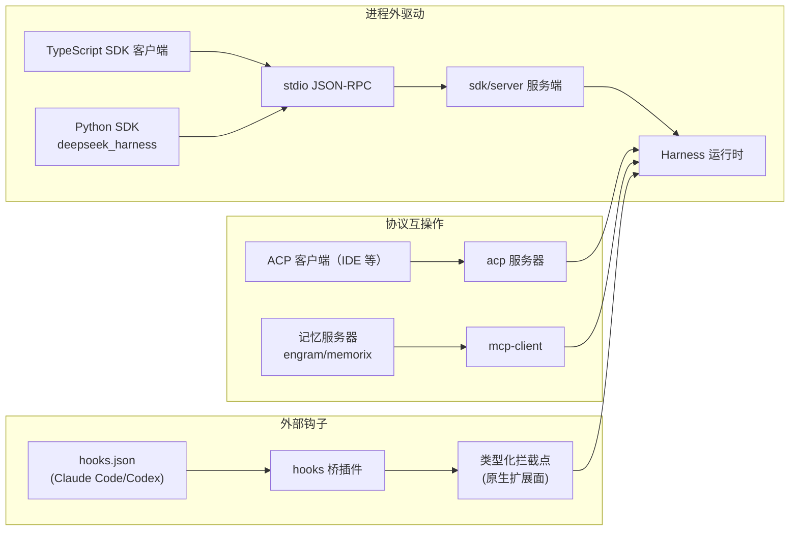
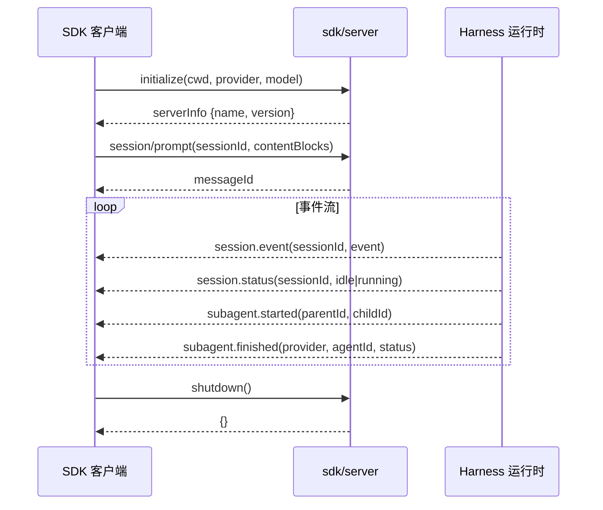

# 【第 11 篇】协议与 SDK：sdk / acp / hooks / mcp / python——把产品接出去

> **版本**：v0.1.5-rc.2
> 难度：🟢 入门（本篇偏接口视角）
> 前置阅读：`第07篇-多智能体.md`、`第04篇-llm与typert.md`
> 对应目录：`packages/sdk/`、`packages/acp/`、`packages/hooks/`、`packages/mcp/`、`python/`

## 目录

- [0 功能需求（WHY）](#0-功能需求why)
- [1 架构设计（WHAT）](#1-架构设计what)
- [2 实现落点（HOW）](#2-实现落点how)
- [3 产物演示（EXAMPLE）](#3-产物演示example)
- [4 动手验证](#4-动手验证)
- [5 FAQ 与自测](#5-faq-与自测)
- [6 版本演进（v0.1.0-rc.5 → v0.1.5-rc.2）](#6-版本演进v010-rc5--v015-rc2)
- [7 延伸阅读](#7-延伸阅读)

---

## 0 功能需求（WHY）

### 0.1 背景与场景

前九篇的产品形态都是"人在用"（GUI）或"一条命令跑完"（headless）。但产品还要能被**程序**使用：

1. **进程外驱动**：另一个程序要启动一个 Harness 运行时、跑任务、拿结果（TypeScript SDK / Python SDK）；
2. **自动化协议**：IDE 等工具按 Agent Client Protocol（ACP）标准驱动 agent（互操作传输）；
3. **外部钩子**：用户已有 Claude Code / Codex 的 `hooks.json`——不迁移，直接桥接执行；
4. **MCP 记忆**：接 MCP 记忆服务器（如 engram/memorix）让 agent 有长期记忆。

### 0.2 需求陈述

**R1 · 运行时可由外部进程驱动（sdk）**——调用方提供运行时可执行文件与 `cordis.yml`，SDK 经 **stdio 上的 JSON-RPC** 驱动运行时；SDK 组不创建、不配置、不构建、不启动开发者项目。

- 实例：官方原文 *"This group contains the protocol stack for driving a Harness runtime from another process. Callers supply the runtime executable and its `cordis.yml`"*（[packages/sdk/README.md](../deepseek-harness/packages/sdk/README.md)）。
- 为什么必须：产品边界清晰——SDK 是"司机"，运行时是"车"，项目脚手架不是 SDK 的活。

**R2 · 自动化协议互操作（acp）**——ACP 组把 agent 暴露给按 Agent Client Protocol 编程的客户端；它是**互操作传输层**，不是展示或人机交互层。

- 实例：官方原文 *"It is an interoperability transport, not a presentation or human-interaction layer"*（[packages/acp/README.md](../deepseek-harness/packages/acp/README.md)）。
- 为什么必须：生态互操作 = 说行业标准语言，而不是发明私有协议。

**R3 · 外部钩子可桥接（hooks）**——用户已有的 `hooks.json`（Claude Code/Codex 风格 shell 钩子）经桥插件在 harness 的**类型化拦截点**上忠实执行；"原生钩子"就是普通插件。

- 实例：官方原文 *"a 'native hook' is just an ordinary Cordis plugin on those extension points. These packages are the bridges that translate the external shell-hook protocol onto that same surface"*（[packages/hooks/README.md](../deepseek-harness/packages/hooks/README.md)）。
- 为什么必须：扩展面只有一个（harness 的类型化拦截点）；外部协议都是"翻译"。

**R4 · MCP 客户端可接记忆（mcp）**——`mcp-client` 提供 MCP 协议客户端，示例组合（mcp-memory）接第三方记忆服务器。

- 实例：`examples/mcp-memory/` 提供 engram/memorix 等记忆服务器的组合示例（[见仓库](../deepseek-harness/examples/mcp-memory/README.md)）。
- 为什么必须：记忆生态百花齐放（MCP 是标准），产品不该重造记忆轮子。

**R5 · Python 一等公民（python）**——官方 Python SDK：`deepseek_harness`（高层 turns API + 低层 JSON-RPC 客户端）与 `deepseek_harness_runtime`（内置运行时二进制与默认配置）。

- 实例：官方原文 *"Python packages for driving DeepSeek Harness as a subprocess. The client SDK communicates with the bundled runtime over newline-delimited JSON-RPC on stdio"*（[python/README.md](../deepseek-harness/python/README.md)）。
- 为什么必须：AI 生态的脚本语言是 Python；一等公民 SDK = 生态入口。

### 0.3 非功能需求

| 编号 | 约束 | 衡量方式 |
|---|---|---|
| N1 | **传输简单**：进程外通信走 stdio + JSON-RPC（换行分隔），无需网络端口 | 子进程即传输，无端口冲突 |
| N2 | **配置显式**：SDK 客户端选通道并给默认配置；运行时本身**总是**要求显式配置 | 运行时不被隐式配置 |
| N3 | **桥接忠实**：hooks 桥按外部协议忠实执行（含 stdin JSON payload 传递） | 外部钩子行为一致 |
| N4 | **协议可扩展**：mcp 客户端/服务端按 MCP 标准协商 | 第三方记忆服务器即插即用 |
| N5 | **图片输入**：SDK 和 ACP 支持 base64 编码的图片内容块 | 多模态 prompt 透传 |
| N6 | **子代理可观测**：SDK 客户端可订阅子代理生命周期通知 | 运行时内子代理事件可追踪 |

### 0.4 验收标准

| 需求 | 验收示例（做到 = 通过） | 失败示例（做不到 = 没通过） |
|---|---|---|
| R1 | 另一个进程经 SDK 启动运行时、跑任务、拿 final_response | 只能靠 CLI 字符串解析 |
| R2 | 符合 ACP 的客户端直接驱动 harness agent | 只支持私有协议 |
| R3 | 现有 Claude Code hooks.json 不改一行即被桥接执行 | 用户必须重写钩子 |
| R4 | 接 engram/memorix 记忆服务器（mcp-memory 示例） | 记忆只能内置实现 |
| R5 | `minimal.py` 一条命令跑完一个 Python 驱动的任务 | Python 用户被挡在门外 |
| N5 | SDK 客户端发送图片内容块，运行时正确存储并投递给模型 | 图片被静默丢弃 |
| N6 | `subscribeSessionTree()` 返回子代理 started/finished 通知 | 子代理事件不可见 |

### 0.5 边界与不做什么

- **SDK 不做项目脚手架**：不创建/配置/构建/启动开发者项目（[sdk/README.md](../deepseek-harness/packages/sdk/README.md)）。
- **ACP 不做展示层**：不负责 UI 或人机交互（那是 client/ 的事）。
- **hooks 不发明协议**：只桥接既有 shell-hook 协议；原生扩展走 harness 拦截点。
- **MCP 不内置记忆**：记忆实现来自第三方服务器，产品只提供客户端。

### 0.6 设计哲学（原则 → 引出的需求）

| 原则 | 内容 | 引出的需求 |
|---|---|---|
| P1 一个扩展面 | 所有外部协议都是"翻译"，原生扩展点唯一 | R3 |
| P2 说行业语言 | ACP/MCP/JSON-RPC 都是标准协议，不自造 | R2/R4 |
| P3 司机与车分离 | SDK 驱动运行时，不代管项目 | R1 / N2 |
| P4 语言一等公民 | Python SDK 与 TS SDK 同等地位 | R5 |

### 0.7 备选技术路径

| 路径 | 思路 | 优势 | 代价 | 需求匹配 |
|---|---|---|---|---|
| A. 仅 CLI 可编程 | 外部程序解析 `dsh` 输出 | 零新代码 | 无结构化 API、无类型、脆弱 | R1 落空 |
| B. stdio JSON-RPC SDK（**本项目**） | 协议包 + TS 客户端 + 服务端 | 结构化、可测试 | 协议要治理 | 满足 R1/R5 |
| C. 私有自动化协议 | 自造 agent 协议 | 完全可控 | 生态不认 | R2 落空 |
| D. 自造记忆系统 | 内置记忆实现 | 深度集成 | 生态隔离 | R4 落空 |
| E. MCP 客户端（**本项目**） | 接标准记忆服务器 | 生态即插即用 | 依赖第三方质量 | 满足 R4 |

**选型结论**：所有"接出去"的通道都遵守同一原则——**说标准语言（JSON-RPC/ACP/MCP），做薄翻译（hooks 桥），不越边界（不代管项目）**。

## 1 架构设计（WHAT）

### 1.1 总体架构：五条"对外"通道



**四步读懂**：

1. **进程外驱动**：TS/Python SDK 客户端 → stdio JSON-RPC → sdk/server → 运行时（R1/R5）；
2. **协议互操作**：ACP 服务器对标准 ACP 客户端暴露 agent（R2）；mcp-client 接 MCP 记忆服务器（R4）；
3. **外部钩子**：hooks.json 经桥插件翻译到 harness 的**类型化拦截点**——原生钩子 = 普通插件（R3/P1）；
4. **共同原则**：五条通道全是"翻译层"，产品核心（前九篇）完全不知道它们的存在。

### 1.2 SDK 协议栈详解（v0.1.5-rc.2 新增）

v0.1.5-rc.2 的 SDK 协议在 v0.1.0-rc.5 基础上大幅扩展，新增了图片支持、子代理生命周期通知和会话状态通知。



**协议三件套**（`packages/sdk/protocol/src/types.ts`）：

| 请求方法 | 参数 | 返回 | 用途 |
|---|---|---|---|
| `initialize` | `cwd`, `provider`, `model`, `reasoningEffort?`, `maxTokens?` | `serverInfo` | 进程级握手 |
| `session/prompt` | `sessionId`, `contentBlocks` | `messageId` | 提交用户消息 |
| `shutdown` | — | `{}` | 优雅关闭 |

**四种通知**（`HarnessSdkNotificationMap`）：

| 通知方法 | 载荷 | 用途 |
|---|---|---|
| `session.event` | `sessionId`, `event` | 会话日志事件流 |
| `session.status` | `sessionId`, `idle \| running` | Agent 生命周期状态 |
| `subagent.started` | `parentSessionId`, `childSessionId` | 子代理创建 |
| `subagent.finished` | `provider`, `agentId`, `status`, `stopReason` | 子代理结束 |

### 1.3 关键架构决策（需求 → 方案 → 权衡）

| # | 决策 | 对应需求 | 权衡 |
|---|---|---|---|
| D1 | **stdio 作传输**：子进程管道即通道，无网络端口 | N1 | 仅限本机进程；换来零配置、零端口冲突 |
| D2 | **协议包独立**：sdk 分 protocol/client/server 三包 | R1 | 包数增加；换来协议可独立演进 |
| D3 | **hooks 桥共享协议库**：hook-protocol 统一 + 每桥管方言 | R3 | 方言差异在桥内；换来共享行为单一 |
| D4 | **运行时显式配置**：SDK 可给默认，运行时本身必须显式 | N2 | 调用方要传配置；换来无隐式魔法 |
| D5 | **acp 提供者分离**：服务器在 acp 组，客户端在 subagent-acp（子代理提供者） | R2 | 跨组引用；换来职责对称（出/入） |
| D6 | **图片内联传输**：SDK/ACP 支持 base64 图片内容块，运行时经附件存储持久化 | N5 | 增加协议复杂度；换来多模态能力 |
| D7 | **子代理树订阅**：客户端按 session 树过滤通知，不接收全局事件 | N6 | 额外维护父子关系表；换来精准通知 |

### 1.4 关系网

- **上游**：sdk/server 消费运行时（core/llm 等）；hooks 桥消费 shell 缝（执行钩子命令）与拦截点；mcp-client 是独立客户端库；
- **下游**：python/sdk 复用同一 JSON-RPC 协议（python 与 TS 客户端同源协议）；`subagent-acp` 实现子代理提供者接口（第 07 篇）；
- **示例**：`examples/jsonrpc-agent`（含 minimal.py）、`examples/acp-agent`、`examples/mcp-memory` 是三条通道的可运行样板。

## 2 实现落点（HOW）

### 2.1 文件导航表（按阅读顺序）

| 顺序 | 文件（点击直达） | 关注点 | 对应需求 |
|---|---|---|---|
| 1 | [packages/sdk/protocol/src/types.ts](../deepseek-harness/packages/sdk/protocol/src/types.ts) | 运行时线协议定义（119 行） | R1, N5, N6 |
| 2 | [packages/sdk/protocol/src/transport.ts](../deepseek-harness/packages/sdk/protocol/src/transport.ts) | 换行分隔 JSON-RPC 传输层（279 行） | R1 |
| 3 | [packages/sdk/client/src/client.ts](../deepseek-harness/packages/sdk/client/src/client.ts) | TypeScript 客户端（491 行） | R1 |
| 4 | [packages/sdk/client/src/api.ts](../deepseek-harness/packages/sdk/client/src/api.ts) | 高层 DeepSeekHarness API（310 行） | R1 |
| 5 | [packages/sdk/client/src/types.ts](../deepseek-harness/packages/sdk/client/src/types.ts) | 客户端类型定义（83 行） | R1 |
| 6 | [packages/sdk/client/src/launch.ts](../deepseek-harness/packages/sdk/client/src/launch.ts) | 运行时进程启动解析（157 行） | R1 |
| 7 | [packages/sdk/server/src/server.ts](../deepseek-harness/packages/sdk/server/src/server.ts) | stdio JSON-RPC 服务端（297 行） | R1 |
| 8 | [packages/acp/acp/src/index.ts](../deepseek-harness/packages/acp/acp/src/index.ts) | ACP 服务器主入口（536 行） | R2 |
| 9 | [packages/acp/acp/src/session.ts](../deepseek-harness/packages/acp/acp/src/session.ts) | ACP 会话生命周期（524 行） | R2 |
| 10 | [packages/acp/acp/src/content.ts](../deepseek-harness/packages/acp/acp/src/content.ts) | ACP 内容准入与投射（237 行） | R2, N5 |
| 11 | [packages/acp/acp/src/model-control.ts](../deepseek-harness/packages/acp/acp/src/model-control.ts) | ACP 标准配置选项（237 行） | R2 |
| 12 | [packages/acp/acp/src/mcp.ts](../deepseek-harness/packages/acp/acp/src/mcp.ts) | ACP MCP 服务器挂载（143 行） | R2, R4 |
| 13 | [packages/hooks/hook-protocol/src/types.ts](../deepseek-harness/packages/hooks/hook-protocol/src/types.ts) | 共享 shell-hook 协议类型（137 行） | R3 |
| 14 | [packages/hooks/hook-protocol/src/index.ts](../deepseek-harness/packages/hooks/hook-protocol/src/index.ts) | 共享协议库导出（25 行） | R3 |
| 15 | [packages/mcp/mcp-client/src/index.ts](../deepseek-harness/packages/mcp/mcp-client/src/index.ts) | MCP 客户端插件（188 行） | R4 |
| 16 | [python/sdk/src/deepseek_harness/client.py](../deepseek-harness/python/sdk/src/deepseek_harness/client.py) | Python 客户端（589 行） | R5 |
| 17 | [python/sdk/src/deepseek_harness/api.py](../deepseek-harness/python/sdk/src/deepseek_harness/api.py) | Python 高层 API（248 行） | R5 |

### 2.2 关键实现片段

**片段 A：Python 最小驱动**（[python/sdk/src/deepseek_harness/api.py](../deepseek-harness/python/sdk/src/deepseek_harness/api.py)）

```python
with DeepSeekHarness(config=DeepSeekHarnessConfig(
    provider="deepseek-official",
    model="deepseek-v4-flash",
    cwd=str(workspace),
)) as harness:
    result = harness.run("1+1等于几")
print(result.final_response)
```

翻译：Python 一等公民（R5）的最小形态——`DeepSeekHarness` 上下文管理器：传入配置，`run()` 一个任务，打印 `final_response`。`DeepSeekHarnessConfig` 支持 `provider`、`model`、`cwd`、`base_url`、`api_key` 等完整配置项。

**片段 B：sdk 组的三包分工**（[packages/sdk/README.md](../deepseek-harness/packages/sdk/README.md)）

| Package | Role |
|---|---|
| `protocol/` | Defines the SDK runtime wire protocol |
| `client/` | Drives a Harness runtime through the TypeScript client API |
| `server/` | Serves out-of-process SDK clients over stdio JSON-RPC |

翻译：三包分工即决策 D2——协议独立定义、TS 客户端消费、服务端承接。注意官方边界声明：*"Callers supply the runtime executable and its cordis.yml; this group does not create, configure, build, or launch developer projects"*——SDK 不代管项目（P3）。

**片段 C：hooks 的桥接定位**（[packages/hooks/README.md](../deepseek-harness/packages/hooks/README.md)）

> a "native hook" is just an ordinary Cordis plugin on those extension points. These packages are the **bridges** that translate the external shell-hook protocol onto that same surface, plus the shared wire-protocol library they build on.

翻译：harness 的**类型化拦截点**是唯一扩展面（第 02 篇的 waterfall 事件）；hooks 包只是把外部 shell-hook 协议**翻译**到这个面上（R3/P1）——用户已有的 Claude Code/Codex hooks.json 不改一行即可桥接。

**片段 D：SDK 图片内容块**（[packages/sdk/protocol/src/types.ts 第 43~53 行](../deepseek-harness/packages/sdk/protocol/src/types.ts)）

```typescript
export interface SdkEncodedImageBlock {
  type: 'image'
  data: string          // base64 编码的图片字节
  mimeType: 'image/png' | 'image/jpeg' | 'image/webp' | 'image/gif'
}

export type SdkPromptContentBlock = ContentBlock | SdkEncodedImageBlock
```

翻译：v0.1.5-rc.2 新增的图片支持——SDK 客户端可发送 base64 编码的图片内容块，服务端通过 `admitEncodedImages` 持久化到附件存储，再以 `ImageAttachmentRef` 投递给模型。支持 PNG/JPEG/WebP/GIF 四种格式。

**片段 E：ACP 标准配置选项**（[packages/acp/acp/src/model-control.ts](../deepseek-harness/packages/acp/acp/src/model-control.ts)）

```typescript
// AcpModelControl 通过 ACP 标准 config_option 协议暴露模型选择
const options: SessionConfigOption[] = [{
  id: 'model',           // 标准配置 id
  name: 'Model',
  category: 'model',
  type: 'select',
  currentValue,          // 当前选中的 [provider, model] 值
  options: groups,       // 按 provider 分组的模型列表
}]
// 还支持 reasoning_effort 配置选项
```

翻译：ACP 的模型控制通过标准 `config_option` 协议暴露——客户端可在运行时切换模型和推理强度，无需重启会话。这是 ACP "自动化协议" 的核心能力之一。

**片段 F：MCP 客户端双传输**（[packages/mcp/mcp-client/src/index.ts](../deepseek-harness/packages/mcp/mcp-client/src/index.ts)）

```typescript
// 两种传输模式
type Config = StdioConfig | StreamableHttpConfig

// stdio：子进程管道
{ transport: 'stdio', serverName: 'my-server', command: '/path/to/server', args: [], env: {} }

// streamable-http：HTTP(S) 连接
{ transport: 'streamable-http', serverName: 'my-server', url: 'https://...' }
```

翻译：MCP 客户端支持两种传输——stdio（子进程管道）和 streamable-http（HTTP SSE）。工具注册名遵循 `mcp__<serverName>__<rawName>` 命名空间规则，支持自动重连策略。

## 3 产物演示（EXAMPLE）

### 3.1 输入

真实文件 [examples/jsonrpc-agent/minimal.py](../deepseek-harness/examples/jsonrpc-agent/minimal.py)（官方 Python 最小示例），配套组合 [minimal.cordis.yml](../deepseek-harness/examples/jsonrpc-agent/minimal.cordis.yml)：

```powershell
python examples/jsonrpc-agent/minimal.py "1+1等于几" --model deepseek-v4-flash
```

### 3.2 产物（真实示例文件结构）

| 文件 | 内容 | 对应需求 |
|---|---|---|
| `minimal.py` | Python：解析参数 → `DeepSeekHarness` 上下文 → `run()` → 打印 final_response | R5 |
| `minimal.cordis.yml` | 最小组合（对应 minimal.py 的 `CONFIG` 引用） | R1 |
| `minimal.snapshot.cordis.yml` | 快照组合（测试回放用） | 快照文化 |

### 3.3 发生了什么（Python 命令 → 运行时任务的四步）

1. `minimal.py` 解析参数（provider/model/workspace/session-root/cordis 路径）；
2. `DeepSeekHarness` 上下文启动**内置运行时**子进程（python 包 `deepseek_harness_runtime` 提供二进制与默认配置，R5）；
3. 客户端经 stdio JSON-RPC 与运行时通信，`run()` 提交任务（R1）；
4. 运行时跑完一轮 agent 任务，返回 `final_response`，Python 打印（N1 传输 = 子进程管道）。

### 3.4 观察点

- **`DeepSeekHarnessConfig` 的 `cwd` 参数**：配置显式传入（N2 运行时总是显式配置）；
- **`harness.run(...)`**：高层 turns API（R5 的一等公民体验）；
- **`minimal.snapshot.cordis.yml` 的存在**：快照文化延伸到 Python 通道（第 01 篇提及的 keyless 测试体系）。

### 3.5 SDK 客户端订阅示例

```typescript
import { DeepSeekHarness } from '@deepseek-ai/dsh-sdk-client'

const harness = new DeepSeekHarness({ model: 'deepseek-v4-flash' })
await harness.start()

// 订阅会话树（含子代理）
const session = harness.session('my-session')
const subscription = harness.client.subscribeSessionTree(session.id)

// 后台消费通知
const collect = async () => {
  for await (const notification of subscription) {
    console.log(`[${notification.method}]`, notification.params)
  }
}
collect()

// 运行任务
const result = await session.run('写一首诗')
console.log(result.finalResponse)

await harness.close()
```

## 4 动手验证

> 以下命令可在仓库根目录下执行。

### 任务 1：读 Python 最小示例

```powershell
Get-Content "examples\jsonrpc-agent\minimal.py"
```

**预期**：Python 文件。**判据**：对照第 3.2 节——`DeepSeekHarness` 上下文管理器 + `run()` + `final_response` 三件套齐全。

### 任务 2：数 SDK 三包

```powershell
Get-ChildItem "packages\sdk" -Directory | Select-Object Name
```

**预期**：protocol / client / server。**判据**：对照 [packages/sdk/README.md](../deepseek-harness/packages/sdk/README.md) 的分工表。

### 任务 3：看 ACP 源文件

```powershell
Get-ChildItem "packages\acp\acp\src" -File | Select-Object Name
```

**预期**：codec.ts / content.ts / index.ts / mcp.ts / model-control.ts / updates.ts / session.ts。**判据**：7 个文件覆盖 ACP 的编解码、内容准入、MCP 挂载、模型控制、更新投射、会话生命周期。

### 任务 4：看 hooks 桥的方言

```powershell
Get-ChildItem "packages\hooks" -Directory | Select-Object Name
```

**预期**：hook-protocol / hooks-claude-code / hooks-codex。**判据**：共享协议库 + 每桥管方言（D3）。

### 任务 5：看 MCP 客户端传输

```powershell
Get-ChildItem "packages\mcp\mcp-client\src" -File | Select-Object Name
```

**预期**：connection.ts / index.ts / transport.ts / tools.ts。**判据**：连接管理 + 插件入口 + 传输实现 + 工具注册。

## 5 FAQ 与自测

### FAQ

- **Q1：sdk 和 cli 什么区别？** cli 是给人敲的命令（第 09 篇）；sdk 是给程序用的 API——结构化请求/响应、类型保障，经 stdio JSON-RPC 驱动同一运行时。
- **Q2：ACP 和 sdk 什么区别？** sdk 是 dsh 自家的驱动协议（JSON-RPC）；ACP 是行业标准（Agent Client Protocol），让任何符合标准的客户端驱动 agent（R2）。两者传输层不同，但驱动的是同一个运行时。
- **Q3：hooks 桥是不是"给旧用户留的后门"？** 不是后门——它把外部协议翻译到 harness 唯一的类型化拦截点；原生钩子 = 普通插件（R3/P1）。桥的存在让迁移零成本。
- **Q4：MCP 记忆和会话日志什么关系？** 会话日志是 dsh 自己的真相源（第 02 篇）；MCP 记忆是**外部**长期记忆（第三方服务器）——两者互补：日志管"这次会话说过什么"，MCP 管"跨会话记住什么"。
- **Q5：Python SDK 和 TypeScript SDK 协议一样吗？** 同一协议（stdio JSON-RPC），两种语言客户端——"说标准语言"原则（P2）让多语言客户端共享同一线协议。
- **Q6：SDK 支持图片输入吗？** v0.1.5-rc.2 新增支持。客户端发送 `SdkEncodedImageBlock`（base64 编码），服务端通过 `admitEncodedImages` 持久化到附件存储，再以 `ImageAttachmentRef` 投递给模型。支持 PNG/JPEG/WebP/GIF 四种格式。
- **Q7：ACP 的 config_option 是什么？** ACP 标准协议的会话配置选项——客户端可在运行时切换模型（`model`）和推理强度（`reasoning_effort`），无需重启会话。`AcpModelControl` 类管理这些选项的发现、验证和应用。
- **Q8：子代理事件怎么订阅？** SDK 客户端使用 `subscribeSessionTree(sessionId)` 方法——它自动跟踪 `subagent.started` 建立的父子关系，只返回目标会话树内的通知（包括子代理的 `started`/`finished` 事件）。

### 自测（答案折叠在下方）

1. sdk 组三个包分别干什么？
2. ACP 组的定位是什么？（一句话）
3. "原生钩子"是什么？
4. Python SDK 与运行时如何通信？
5. SDK 协议支持哪四种通知？
6. MCP 客户端支持哪两种传输？
7. 下列哪个不属于本组职责？A. stdio JSON-RPC 服务端 B. 会话日志 C. MCP 客户端 D. hooks 桥

<details>
<summary>点开看答案</summary>

1. protocol 定义线协议、client 是 TS 客户端、server 是 stdio JSON-RPC 服务端。
2. 互操作传输层，把 agent 暴露给符合 ACP 标准的客户端（不是展示层）。
3. 挂在 harness 类型化拦截点上的普通 Cordis 插件（hooks 桥翻译外部协议到这个面）。
4. 换行分隔的 stdio JSON-RPC（子进程管道即传输）。
5. `session.event`、`session.status`、`subagent.started`、`subagent.finished`。
6. stdio（子进程管道）和 streamable-http（HTTP SSE）。
7. B。会话日志属于 core/session。

</details>

## 6 版本演进（v0.1.0-rc.5 → v0.1.5-rc.2）

### 6.1 变更概览

v0.1.5-rc.2 在 v0.1.0-rc.5 的协议与 SDK 基础上进行了**结构性扩展**，核心变化集中在三个方面：图片多模态支持、子代理可观测性、ACP 标准协议完善。

| 维度 | v0.1.0-rc.5 | v0.1.5-rc.2 | 变化 |
|---|---|---|---|
| SDK 协议通知数 | 2 种 | 4 种 | +2（session.status, subagent.*） |
| SDK 图片支持 | ❌ | ✅ | 新增 SdkEncodedImageBlock |
| SDK 会话状态通知 | ❌ | ✅ | 新增 session.status |
| SDK 子代理通知 | ❌ | ✅ | 新增 subagent.started/finished |
| ACP 会话恢复 | 基础 | 完善 | resumeSession 支持 cwd 校验 |
| ACP 模型配置 | 基础 | 完善 | reasoning_effort 动态切换 |
| ACP 图片提示 | 不支持 | 支持 | supportsAcpImagePrompts 检测 |
| MCP 双传输 | stdio only | stdio + streamable-http | 新增 HTTP 传输 |
| MCP 重连策略 | 无 | 可配置重连 | reconnect 配置项 |
| Python SDK 高层 API | 基础 | 完善 | DeepSeekHarness + Session |
| Python SDK 配置 | 基础 | 完善 | base_url / api_key 支持 |
| hooks 会话事件 | 无 | hook/invoked + hook/result | 新增持久化事件 |

### 6.2 协议层演进

#### 6.2.1 新增图片内容块

v0.1.0-rc.5 的 `SessionPromptParams.contentBlocks` 仅支持 `ContentBlock`；v0.1.5-rc.2 新增 `SdkEncodedImageBlock` 联合类型：

```typescript
// v0.1.0-rc.5
contentBlocks: ContentBlock[]

// v0.1.5-rc.2
type SdkPromptContentBlock = ContentBlock | SdkEncodedImageBlock
contentBlocks: SdkPromptContentBlock[]
```

服务端通过 `admitEncodedImages()` 将 base64 图片持久化为 `ImageAttachmentRef`，再投递给模型。

#### 6.2.2 新增子代理通知

v0.1.0-rc.5 仅有 `session.event` 和 `session.status` 两种通知；v0.1.5-rc.2 新增子代理生命周期通知：

```typescript
// v0.1.5-rc.2 新增
'SubagentStartedNotification': {
  parentSessionId: string
  childSessionId: string
}
'SubagentFinishedNotification': {
  provider: string
  agentId: string
  parentSessionId: string
  childSessionId: string
  status: SdkRunStatus        // 'ok' | 'error'
  stopReason: SubagentStopReason
  lastAssistantMessage?: ContentBlock[]
}
```

客户端新增 `subscribeSessionTree(sessionId)` 方法，自动跟踪子代理父子关系，只返回目标会话树内的通知。

### 6.3 ACP 层演进

| 能力 | v0.1.0-rc.5 | v0.1.5-rc.2 |
|---|---|---|
| 会话创建 | ✅ newSession | ✅ 同 + MCP 服务器挂载 |
| 会话恢复 | ✅ resumeSession | ✅ 同 + cwd 严格校验 |
| 会话列表 | ✅ listSessions | ✅ 同 + 游标分页 |
| 模型配置 | ✅ setConfigOption | ✅ 同 + reasoning_effort |
| 图片提示 | ❌ | ✅ 按模型能力动态启用 |
| 权限请求 | 基础 | 完善（one-shot allow/reject） |
| MCP 挂载 | stdio only | stdio + streamable-http |
| 内容投射 | 文本 only | 文本 + 图片 |

### 6.4 Python SDK 演进

| 维度 | v0.1.0-rc.5 | v0.1.5-rc.2 |
|---|---|---|
| 高层 API | `DeepSeekHarness` 基础 | `DeepSeekHarness` + `Session` + `RunResult` |
| 配置类 | 基础参数 | `DeepSeekHarnessConfig`（含 base_url/api_key） |
| 通知订阅 | 基础 | `NotificationSubscription` + `subscribeSessionNotifications` |
| 会话树过滤 | 基础 | `_notification_belongs_to_session_tree` |
| 错误诊断 | 基础 | stderr tail + 进程诊断 |
| 关闭策略 | 基础 | shutdown → stdin EOF → SIGTERM → SIGKILL 梯级 |

### 6.5 MCP 客户端演进

| 维度 | v0.1.0-rc.5 | v0.1.5-rc.2 |
|---|---|---|
| 传输 | stdio only | stdio + streamable-http |
| 重连 | 无 | 可配置重连策略 |
| 命名空间 | 基础 | WeakMap 域隔离 |
| 工具注册 | 基础 | `mcp__<server>__<name>` 命名空间 |

### 6.6 hooks 演进

| 维度 | v0.1.0-rc.5 | v0.1.5-rc.2 |
|---|---|---|
| 会话事件 | 无 | `hook/invoked` + `hook/result` |
| 方言类型 | 基础 | `HookDialect: 'claude-code' \| 'codex'` |
| 决策合并 | 基础 | 限制性合并（restrictive merge） |
| 脱离运行 | 基础 | `createDetachedRuns` |

### 6.7 Breaking Changes（升级注意）

| 变更 | 影响范围 | 说明 |
|---|---|---|
| `SdkPromptContentBlock` 联合类型 | SDK 客户端 | 新增图片块，原有 ContentBlock 仍兼容 |
| `subscribeSessionTree()` 新增 | SDK 客户端 | 新方法，不影响现有 `subscribe()` |
| `AcpModelControl` 接口 | ACP 扩展者 | 新增 `pinTurn`/`releaseTurn` 方法 |
| `HarnessClientOptions` 扩展 | SDK 客户端 | 新增 `env`、`disposeEofGraceMs` 等选项 |
| `DeepSeekHarnessConfig` 扩展 | Python SDK | 新增 `base_url`、`api_key` 字段 |

## 7 延伸阅读

**官方（权威来源）**：

- [packages/sdk/README.md](../deepseek-harness/packages/sdk/README.md) —— SDK 组边界与三包
- [packages/acp/README.md](../deepseek-harness/packages/acp/README.md) —— ACP 组定位
- [packages/hooks/README.md](../deepseek-harness/packages/hooks/README.md) —— hooks 桥架构
- [packages/mcp/mcp-client/README.md](../deepseek-harness/packages/mcp/mcp-client/README.md) —— MCP 客户端
- [python/README.md](../deepseek-harness/python/README.md) —— Python SDK 包结构与行为
- [examples/jsonrpc-agent/minimal.py](../deepseek-harness/examples/jsonrpc-agent/minimal.py) —— 官方 Python 最小示例

**外部文献（按难度递增）**：

- 🟢 [Agent Client Protocol（ACP）](https://agentclientprotocol.com/) —— 行业标准协议
- 🟡 [Model Context Protocol（MCP）](https://modelcontextprotocol.io/) —— 记忆/工具服务器标准
- 🔴 [JSON-RPC 2.0 规范](https://www.jsonrpc.org/specification) —— stdio 线协议的底层标准

---

**数据来源**：本文档基于 `deepseek-ai/deepseek-harness` 仓库 `dsh-v0.1.5-rc.2` 标签的源码分析，对比 `dsh-v0.1.0-rc.5` 标签的实现。代码引用以文件路径和行号标注，变更日志引用自 `changelog-alpha1-rc1.md` 和 `changelog-rc1-rc2.md`。

**下一篇预告**：【第 12 篇】工程体系：scripts / docs / .github / .agents / website / examples / native / 根配置。
