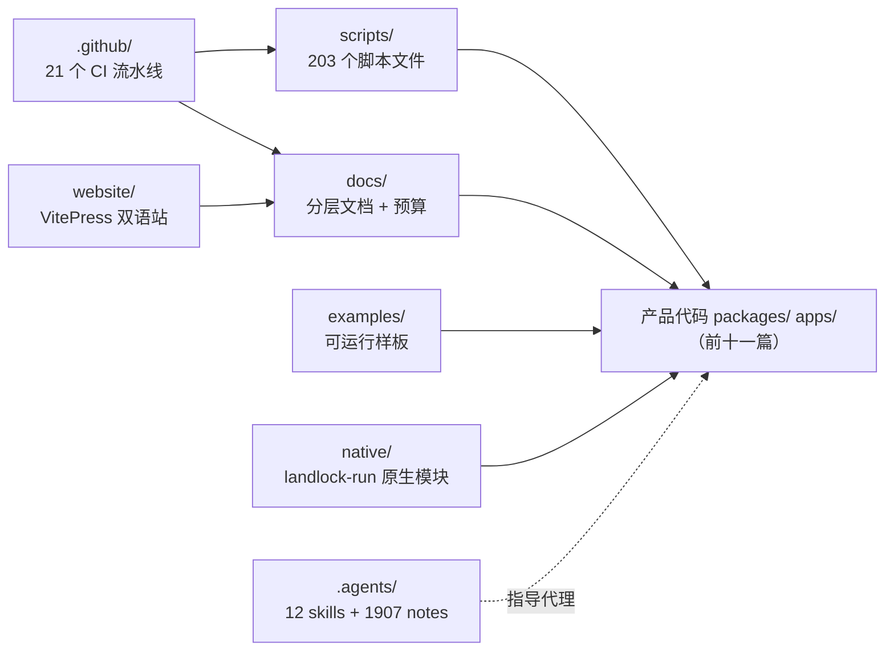
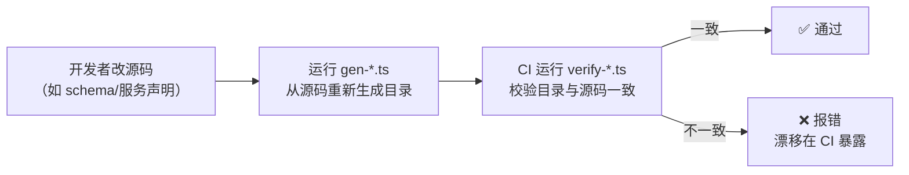
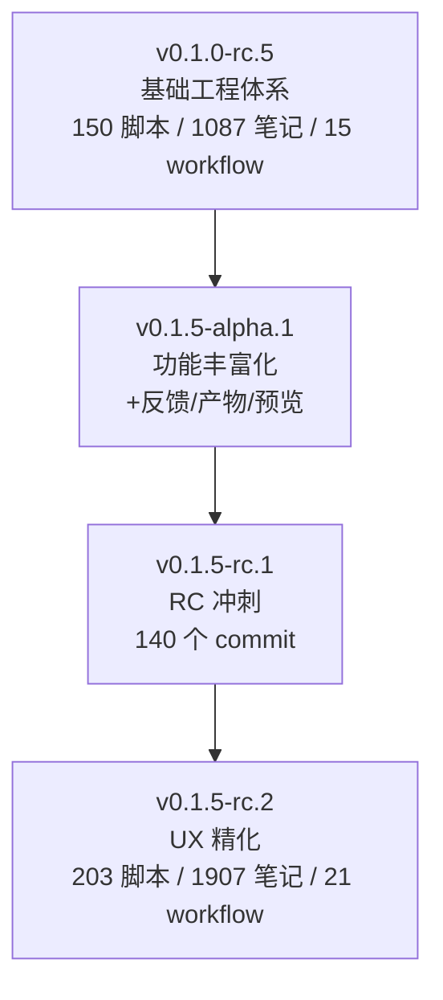

# 【第 12 篇】工程体系：scripts / docs / .github / .agents / website / examples / native

> 难度：🟢 入门（本篇是"运维视角"总览，无深代码）
> 版本：v0.1.5-rc.2
> 前置阅读：`../项目架构总览.md`
> 对应目录：`deepseek-harness/scripts/`、`docs/`、`.github/`、`.agents/`、`website/`、`examples/`、`native/`

## 目录

- [0 功能需求（WHY）](#0-功能需求why)
- [1 架构设计（WHAT）](#1-架构设计what)
- [2 实现落点（HOW）](#2-实现落点how)
- [3 产物演示（EXAMPLE）](#3-产物演示example)
- [4 动手验证](#4-动手验证)
- [5 FAQ 与自测](#5-faq-与自测)
- [6 版本演进（v0.1.0-rc.5 → v0.1.5-rc.2）](#6-版本演进v010-rc5--v015-rc2)
- [7 延伸阅读](#7-延伸阅读)

---

## 0 功能需求（WHY）

### 0.1 背景与场景

产品代码（前十一篇）之外，仓库还有一整套"让产品活下来"的工程体系。v0.1.5-rc.2 相比 v0.1.0-rc.5 扩展了五个场景：

1. **质量门禁**：每次提交/CI 都要验证——类型、lint、单测、覆盖率、快照、文档保鲜；203 个脚本文件 + 21 个 CI 流水线构成完整的门禁矩阵。
2. **文档即产品**：docs/ 有严格层级与字数预算，大部分目录表**从源码生成**、CI 保鲜；文档数量与层级在 v0.1.5 系列中显著增长。
3. **Agent 原生开发**：`.agents/` 存 12 个开发 skill 与 1907 篇决策记录——AI 编码代理的"组织记忆"。
4. **可运行样板**：`examples/` 的组合既是教程又是快照测试的真实载体。
5. **反馈驱动的 UX 精化**（v0.1.5 新增）：反馈对话框、产物卡片、文档预览等 UI 组件的工程化交付，全部纳入门禁与快照测试。

### 0.2 需求陈述

**R1 · 门禁可执行（scripts）**——质量约束写成**可运行脚本**：`run-gates.ts` 编排全部检查（16 种闸门模式）；`gen-*.ts`（21 个）从源码生成目录；`verify-*.ts`（54 个）校验保鲜；`hygiene`/`doc-sync` 是聚合闸门。

- 实例：根 package.json 的 `check:all` = `tsx scripts/run-gates.ts check-all`；`doc-sync` 聚合文档全部闸门（[package.json 第 76/169 行](../deepseek-harness/package.json)）。
- 为什么必须：规则写进文档会漂移；写进脚本才会被执行。

**R2 · 文档分层预算（docs）**——文档按层级分工（architecture → subsystems → cookbook → postmortem），每份有字数预算（`doc-budgets.manifest.json`），"一个事实只有一个家"。

- 实例：官方原文 *"Each fact has one home: the tier whose job it is; elsewhere, link there"*（[docs/AGENTS.md 第 17 行](../deepseek-harness/docs/AGENTS.md)）。
- 为什么必须：文档无限膨胀 = 没人读；预算与分层让文档保持可用。

**R3 · 生成物保鲜**——config-catalog / tool-catalog / module-graph / persistence-catalog / Cordis API / session-format / client-catalog / scoped-events / cordis-inspect-catalog 等**全部从源码生成**，CI 校验新鲜度。

- 实例：`verify-tool-catalog` = `tsx scripts/gen-tool-catalog.ts --check`（[package.json 第 153 行](../deepseek-harness/package.json)）。
- 为什么必须：手写目录必然与源码漂移；生成 + 保鲜 = 目录永远可信。

**R4 · 代理有组织记忆（.agents）**——开发 skill（12 个）与决策记录（1907 篇 Agent Notes，按 implemented/archived/proposed/rejected 归档）供编码代理遵循。

- 实例：`dsh-pre-push-checks`（推送前选择最窄检查）、`dsh-code-review`（代码评审标准）、`dsh-archive-agent-notes`（笔记归档工作流）等 skill；笔记归档策略（archived 冻结、implemented 以现在时描述现实）。
- 为什么必须：大型仓库的隐性知识必须显式化——代理（和新人）才有立足点。

**R5 · 样板即测试（examples）**——可运行组合既示范用法，又是 keyless 快照测试的真实载体。

- 实例：官方原文 *"Each example has both: Keyless — boot the real cordis.yml through the Loader, drive it, and assert output and clean exit"*（[examples/AGENTS.md](../deepseek-harness/examples/AGENTS.md)）。
- 为什么必须：快照测试需要"真实可运行的样板"——示例与测试是一体的。

**R6 · 体验可验证的 UI 交付**（v0.1.5 新增）——反馈对话框、产物卡片、文档预览等 UI 组件，通过 E2E 快照 + 几何断言 + 单元测试三重验证。

- 实例：RC.2 新增 `present.e2e.ts`（交付物布局几何）和 `produced-files.e2e.ts`（间距验证），通过 `page.evaluate()` 直接验证 DOM 尺寸。
- 为什么必须：UI 组件的回归风险高——纯代码审查无法捕获间距漂移。

### 0.3 非功能需求

| 编号 | 约束 | 衡量方式 |
|---|---|---|
| N1 | **最窄检查**：推送前按改动面选最窄检查，不默认全量 | 提交/推送延迟可控 |
| N2 | **覆盖率门限**：packages/*/*/src 每文件 100% 覆盖（client 源码在内） | `test:coverage` 是 CI 闸门 |
| N3 | **文档预算**：超预算/缺文件被 `verify-doc-budgets` 拒绝 | 预算 manifest 权威 |
| N4 | **双语配对**：文档英中成对（i18n），翻译按配对工作流更新 | 中文不落后于英文 |
| N5 | **快照可比对**：模型输出快照可回放（keyless replay） | `test:snapshot` 无 key 可跑 |
| N6 | **CI 容错切换**：Linux/Windows 自托管故障时自动切换到托管 runner | `DSH_CI_FAILOVER_*` 仓库变量 |

### 0.4 验收标准

| 需求 | 验收示例（做到 = 通过） | 失败示例（做不到 = 没通过） |
|---|---|---|
| R1 | 改了 packages 某包 → 最窄检查（单测+typecheck）绿 | 必须全量跑才知道对错 |
| R2 | 新文档超过预算 → verify-doc-budgets 拒绝 | 文档无限膨胀 |
| R3 | 工具改了 schema → verify-tool-catalog 报"目录过期" | 目录与源码漂移 |
| R4 | 非平凡改动缺 Agent Note → 审查被拒 | 决策理由无处可查 |
| R5 | 新行为有对应快照样例（keyless 可跑） | 只有 mock 单测 |
| R6 | UI 间距变更 → present.e2e.ts 几何断言捕获 | 间距漂移无感知 |

### 0.5 边界与不做什么

- **不做产品功能**：工程体系服务"开发与发布"，不参与运行时（native/landlock-run 例外，它是产品沙箱的原生模块）。
- **不做在线文档托管**：website 是 VitePress 构建，托管在 CI（docs-pages.yml）。
- **CI 拥有全量覆盖**：本地只复演最窄面（[AGENTS.md 第 7 行](../deepseek-harness/AGENTS.md)）。

### 0.6 设计哲学（原则 → 引出的需求）

| 原则 | 内容 | 引出的需求 |
|---|---|---|
| P1 规则即脚本 | 质量约束写成可执行闸门，不写在文档里 | R1 |
| P2 生成即保鲜 | 目录从源码生成，CI 校验新鲜度 | R3 |
| P3 一事实一家 | 文档分层 + 预算，"one home per fact" | R2 |
| P4 样板即测试 | examples 是教程也是快照载体 | R5 |
| P5 代理有记忆 | skill + notes 是仓库的组织记忆 | R4 |
| P6 体验可验证（v0.1.5 新增） | UI 组件的几何与交互通过自动化测试守护 | R6 |

### 0.7 备选技术路径

| 路径 | 思路 | 优势 | 代价 | 需求匹配 |
|---|---|---|---|---|
| A. 无门禁 | 靠 code review 人工把关 | 零工具 | 人为遗漏；无可重复验证 | R1 落空 |
| B. 手写目录 | 文档目录手工维护 | 无生成器 | 必然漂移 | R3 落空 |
| C. 生成 + 保鲜（**本项目**） | gen-*.ts + verify-*.ts + doc-sync | 目录永远可信 | 生成器是维护成本 | 满足 R3 |
| D. 全量 CI | 每次推送全量检查 | 无选择成本 | 延迟高、反馈慢 | N1 落空 |
| E. 最窄面 + CI 全量（**本项目**） | 本地最窄、CI 全量 | 反馈快 | 选择检查要经验 | 满足 N1 |

**选型结论**：工程体系是"产品的产品"——**规则即脚本（P1）**让约束可执行，**生成即保鲜（P2）**让文档可信，**样板即测试（P4）**让示例不腐烂，**体验可验证（P6）**让 UI 回归有感知。

## 1 架构设计（WHAT）

### 1.1 总体架构：七块拼图围绕产品代码



**四步读懂**：

1. **scripts** 是"裁判"：21 个 gen-\*.ts 从源码生成目录、54 个 verify-\*.ts 保鲜、run-gates.ts 编排 16 种闸门模式；
2. **docs** 是"说明书"：分层 + 预算 + 生成区（`cordis-surface` 等），双语配对；
3. **.github** 是"警察局"：21 个 workflow 执行门禁、发布、文档站部署、issue 机器人；
4. **.agents/website/examples/native** 是"辅助设施"：代理记忆、文档站、样板测试、原生沙箱模块。

### 1.2 关键架构决策（需求 → 方案 → 权衡）

| # | 决策 | 对应需求 | 权衡 |
|---|---|---|---|
| D1 | **run-gates 编排**：`check:ci:*` 系列细分闸门面（静态/lint/覆盖/快照/产物/消费方/windows） | R1 | 闸门面多；换来 CI 失败可定位 |
| D2 | **生成区标记**：`<!-- BEGIN GENERATED … -->` 包裹，禁手改 | R3 | 生成器要覆盖全；换来目录可信 |
| D3 | **预算 manifest**：doc-budgets.manifest.json 设限，超限/缺文件拒绝 | R2 | 提预算要走 manifest diff；换来文档克制 |
| D4 | **快照录制回放**：DSH_SNAPSHOT=record/refresh/replay 三态 | R5 / N5 | 快照要维护；换来 keyless 测试 |
| D5 | **native 独立发布**：landlock-run 有独立 workflow 与 release | —— | 多一套发布；换来沙箱模块可独立迭代 |
| D6 | **CI 容错切换**（v0.1.5 新增）：`DSH_CI_FAILOVER_*` 仓库变量切换自托管/托管 runner | N6 | 需要维护 runbook；换来 CI 高可用 |
| D7 | **UI 几何测试**（v0.1.5 新增）：`page.evaluate()` 直接断言 DOM 尺寸 | R6 | 几何断言脆弱；换来间距漂移可捕获 |

### 1.3 关系网

- **上游**：scripts 消费产品源码（生成器读类型声明）；CI workflow 调用 scripts；website 消费 docs；
- **下游**：examples 声明 packages/ 的包依赖（组合行）；native 被 sandbox-local 消费（第 05 篇）；
- **守护**：`verify-*` 系列是"文档↔源码"一致性的闭环（R3）。

## 2 实现落点（HOW）

### 2.1 文件导航表（按阅读顺序）

| 顺序 | 文件（点击直达） | 关注点 | 对应需求 |
|---|---|---|---|
| 1 | [scripts/run-gates.ts](../deepseek-harness/scripts/run-gates.ts) | CI 闸门编排入口（16 种模式） | R1 |
| 2 | [scripts/gen-tool-catalog.ts](../deepseek-harness/scripts/gen-tool-catalog.ts) | 工具目录生成器（--check 保鲜） | R3 |
| 3 | [scripts/doc-budgets.manifest.json](../deepseek-harness/scripts/doc-budgets.manifest.json) | 文档字数预算 | R2 |
| 4 | [.github/workflows/ci.yml](../deepseek-harness/.github/workflows/ci.yml) | 主 CI 流水线 | R1 |
| 5 | [.agents/skills/dsh-pre-push-checks/SKILL.md](../deepseek-harness/.agents/skills/dsh-pre-push-checks/SKILL.md) | 推送前检查 skill | R4 / N1 |
| 6 | [.agents/notes/README.md](../deepseek-harness/.agents/notes/README.md) | 决策记录规范（何时写、如何归档） | R4 |
| 7 | [website/.vitepress/config.ts](../deepseek-harness/website/.vitepress/config.ts) | 文档站配置 | —— |
| 8 | [native/system/](../deepseek-harness/native/system/) | 原生模块（node-addon-system） | —— |
| 9 | [scripts/release/bump.ts](../deepseek-harness/scripts/release/bump.ts) | 发布版本号管理 | —— |
| 10 | [scripts/release/publish.ts](../deepseek-harness/scripts/release/publish.ts) | npm 发布流程 | —— |

### 2.2 关键实现片段

**片段 A：一条闸门命令**（[package.json 第 169 行](../deepseek-harness/package.json)）

```json
"doc-sync": "tsx scripts/run-gates.ts doc-sync"
```

翻译：一条命令 = 文档全部闸门（链接、格式、预算、生成物保鲜、翻译配对）。这就是"规则即脚本"（P1）的形态——所有文档纪律收敛成可执行的单一入口。

**片段 B：生成区的禁手改标记**（[docs/persistence-catalog.md 第 1~2 行](../deepseek-harness/docs/persistence-catalog.md)）

```html
<!-- Generated by scripts/gen-persistence-catalog.ts — do not edit by hand.
     Run `pnpm run gen-persistence-catalog` to regenerate. -->
```

翻译：生成文档的开头自带"禁手改"标记与再生成命令——生成物保鲜（R3）的物理约定。v0.1.5-rc.2 有 21 个 gen-\*.ts 生成器，每个都有对应的 verify-\*.ts 保鲜闸门。

**片段 C：笔记的四类归档**（[.agents/notes/README.md](../deepseek-harness/.agents/notes/README.md)）

> implemented/ 描述已交付的现实（现在时）；archived/ 冻结为历史，永不作为当前权威；proposed/ 与 rejected/ 记录候选与放弃。

翻译：决策记录（Agent Notes）是仓库的"组织记忆"（R4）——implemented 以现在时描述已交付现实、archived 冻结为历史、proposed/rejected 记录候选与放弃。非平凡改动必须带笔记（第 01 篇 AGENTS.md 纪律），决策理由因此永远可查。

**片段 D：CI 容错切换**（[.github/workflows/ci.yml 第 39~45 行](../deepseek-harness/.github/workflows/ci.yml)）

```yaml
runs-on: >-
  ${{ vars.DSH_CI_FAILOVER_LINUX == 'selfhosted'
      && github.event.pull_request.user.login != 'dependabot[bot]'
      && fromJSON('["self-hosted", "linux", "x64", "vm-backup"]')
      || 'dsh-ubuntu-24-04-16core' }}
```

翻译：v0.1.5 系列新增 CI 容错机制——通过仓库变量 `DSH_CI_FAILOVER_LINUX` 一键切换自托管/托管 runner，故障时无需修改 workflow 文件（N6）。这是 v0.1.0-rc.5 中不存在的高可用保障。

### 2.3 符号 hover 指引

在 VS Code 打开 [scripts/run-gates.ts](../deepseek-harness/scripts/run-gates.ts) 查看闸门清单；打开 [.agents/skills/dsh-pre-push-checks/SKILL.md](../deepseek-harness/.agents/skills/dsh-pre-push-checks/SKILL.md) 查看推送前检查选择表。

## 3 产物演示（EXAMPLE）

### 3.1 输入

一行命令（**已在本机实测**，仓库根目录执行）：

```powershell
pnpm dsh --profile headless --dump-config | Select-Object -First 5
```

（演示"工程产物可审计"——但本篇的 EXAMPLE 用更贴切的产物：生成的目录文件。）

### 3.2 产物（真实生成目录）

> 以下为仓库现存生成文件的结构与开头（`docs/tool-catalog.md` 与 `docs/capability-seams.md`）。

| 生成文件 | 生成器 | 开头标记 | 保鲜闸门 |
|---|---|---|---|
| `docs/tool-catalog.md` | `scripts/gen-tool-catalog.ts` | `<!-- Generated by scripts/gen-tool-catalog.ts … -->` | `verify-tool-catalog` |
| `docs/capability-seams.md` | `scripts/gen-doc-graphs.ts` | 同上 | `verify-doc-graphs` |
| `docs/persistence-catalog.md` | `scripts/gen-persistence-catalog.ts` | 同上 | `verify-persistence-catalog` |
| `docs/config-catalog.md` | `scripts/gen-config-catalog.ts` | 同上 | `verify-config-catalog` |
| `docs/module-graph.md` | `scripts/gen-module-graph.ts` | 同上 | `verify-module-graph` |
| `docs/cordis-api/` | `scripts/gen-cordis-api.ts` | 同上 | `verify-cordis-api` |
| `docs/session-format-catalog.md` | `scripts/gen-session-format-catalog.ts` | 同上 | `verify-session-format-catalog` |

### 3.3 发生了什么（源码 → 目录 → 保鲜的三步）



1. 开发者在包源码里改 schema/服务声明（如第 03 篇的 `ctx.shell`）；
2. `pnpm run gen-tool-catalog` 从声明重新生成目录（含依赖边、事件、说明）；
3. CI 的 `verify-tool-catalog`（`--check` 模式）发现目录与源码不一致 → 报错——**漂移在 CI 暴露**（R3）。

### 3.4 观察点（对应产物文件）

- **每个生成文件开头都是"禁手改"标记**：生成物保鲜的物理约定（R3）；
- **tool-catalog**：全工具的可信目录——第 03 篇 bash 条目、第 07 篇 subagent 条目都引自它；
- **capability-seams**：第 03/05 篇引用的缝表与图的来源——"关系网"类论述的权威出处。

## 4 动手验证

> 以下命令已在本机实测（仓库根目录 `deepseek-harness\deepseek-harness` 下执行）。

### 任务 1：数生成器

```powershell
Get-ChildItem "scripts" -Filter "gen-*.ts" -File | Select-Object Name
```

**预期**：21 个 gen-\*.ts（含 spec）。**判据**：对照 package.json 的 `gen-*`/`verify-*` 脚本对。

### 任务 2：数验证器

```powershell
Get-ChildItem "scripts" -Filter "verify-*.ts" -File | Select-Object Name
```

**预期**：54 个 verify-\*.ts（含 spec）。**判据**：验证器数量远多于生成器——保鲜的覆盖面更广。

### 任务 3：验证一条保鲜闸门

```powershell
pnpm exec vitest run scripts/tool-catalog.spec.ts 2>$null | Select-Object -Last 3
```

**预期**：测试通过（目录与源码一致）。**判据**：`✓` 结果——你的本地仓库是"新鲜"的。

### 任务 4：查看发布流水线

```powershell
Get-ChildItem "scripts\release" -File | Select-Object Name
```

**预期**：bump/families/pack/publish/tarball/verify/verify-packed-install 等文件。**判据**：对照根 package.json 的 `release:*` 脚本族——发布也是脚本化的（P1）。

### 任务 5（进阶）：看 CI 闸门模式

```powershell
Select-String -Path "scripts\run-gates.ts" -Pattern "^  \w" | Select-Object -First 20 Line
```

**预期**：列出 `ci-primary`、`ci-static`、`ci-coverage` 等闸门模式。**判据**：对照 package.json 的 `check:ci:*` 脚本族——每个模式对应一个 CI job。

## 5 FAQ 与自测

### FAQ

- **Q1：为什么文档预算这么严格？** 因为文档无限膨胀 = 没人读、无法维护。"one home per fact" + 预算 = 文档保持可用（R2）。
- **Q2：生成目录坏了怎么办？** 跑 `pnpm run gen-xxx` 重新生成（--check 是校验模式）；手改会被 CI 拒绝（R3）。
- **Q3：1907 篇笔记谁写的？** 仓库的开发代理与贡献者按规范写的——非平凡改动必须带笔记，所以决策理由永远可查（R4）。其中 584 篇 implemented、1257 篇 archived（冻结）、40 篇 proposed、28 篇 rejected。
- **Q4：本地要跑全量测试吗？** 不用。按改动面选最窄检查（dsh-pre-push-checks skill）；CI 拥有全量矩阵（N1）。
- **Q5：examples 是教程还是测试？** 两者一体：样板组合示范用法，同时是 keyless 快照测试的真实载体（R5/P4）。
- **Q6：v0.1.5-rc.2 相比 v0.1.0-rc.5 最大的变化是什么？** 脚本从 ~150 增长到 203 个，Agent Notes 从 1087 增长到 1907 篇，CI workflow 从 15 增长到 21 个，新增了反馈对话框、产物卡片、文档预览等 UI 组件的工程化交付。
- **Q7：CI 容错切换怎么用？** 在仓库 Settings → Actions → Variables 中设置 `DSH_CI_FAILOVER_LINUX` 为 `selfhosted`，即可将所有 Linux CI job 切换到自托管 runner。详见 `.agents/notes/implemented/process/2026-07-26-ci-failover-runbook.md`。

### 自测（答案折叠在下方）

1. `doc-sync` 是什么？（一条命令 vs 一堆脚本）
2. 生成文件开头为什么有"禁手改"标记？
3. Agent Notes 的 implemented/ 用什么时态？archived/ 代表什么？
4. 本地推送前应该跑什么？（最窄 vs 全量）
5. 下列哪个不属于本组职责？A. 工具目录生成 B. 会话日志 C. 发布脚本 D. 文档预算
6. v0.1.5-rc.2 有多少个 verify-\*.ts 验证脚本？

<details>
<summary>点开看答案</summary>

1. 一条命令 = 文档全部闸门（run-gates doc-sync），规则即脚本（P1）。
2. 生成物保鲜的物理约定：手改会被保鲜校验拒绝（R3）。
3. implemented/ 以现在时描述已交付现实；archived/ 冻结为历史，永不作为当前权威。
4. 按改动面选最窄检查（dsh-pre-push-checks）；CI 拥有全量矩阵。
5. B。会话日志属于 core/session（第 02 篇）。
6. 54 个 verify-\*.ts（含 spec 文件）。

</details>

## 6 版本演进（v0.1.0-rc.5 → v0.1.5-rc.2）

### 6.1 数量对比

| 维度 | v0.1.0-rc.5 | v0.1.5-rc.2 | 变化 |
|---|---|---|---|
| scripts/ TS 文件数 | ~150 | 203 | **+35%** |
| gen-\*.ts 生成器 | ~15 | 21 | **+40%** |
| verify-\*.ts 验证器 | ~40 | 54 | **+35%** |
| Agent Notes 总数 | 1087 | 1907 | **+75%** |
| implemented/ | — | 584 | 新增统计 |
| archived/ | — | 1257 | 新增统计 |
| proposed/ | — | 40 | 新增统计 |
| rejected/ | — | 28 | 新增统计 |
| Skills 数量 | 11 | 12 | **+1** |
| CI Workflows | 15 | 21 | **+40%** |
| Release scripts | 4 | 9 | **+125%** |
| Root package.json scripts | ~140 | ~170 | **+21%** |

### 6.2 新增生成器（v0.1.5-rc.2 独有）

以下生成器在 v0.1.0-rc.5 中不存在：

| 生成器 | 用途 | 对应文档 |
|---|---|---|
| `gen-session-format-catalog.ts` | Session 格式目录 | `docs/session-format-catalog.md` |
| `gen-client-catalog.ts` | 客户端组件目录 | `docs/` 下对应文件 |
| `gen-cordis-inspect-catalog.ts` | Cordis 检查目录 | `docs/` 下对应文件 |
| `gen-scoped-events.ts` | 作用域事件列表 | `docs/` 下对应文件 |
| `gen-translation-brief.ts` | 翻译摘要 | `docs/` 下对应文件 |

### 6.3 新增 Skills

| Skill | 用途 | v0.1.5 新增 |
|---|---|---|
| `dsh-archive-agent-notes` | Agent Notes 归档工作流 | ✅ |
| `dsh-ci-test-reliability` | CI 测试可靠性规则 | ✅ |
| `dsh-trim-cot-leakage` | 推理链泄露修剪 | ✅ |
| `record-browser-gif` | 浏览器 GIF 录制 | ✅ |

### 6.4 新增 CI Workflows

| Workflow | 用途 | v0.1.5 新增 |
|---|---|---|
| `ci-master.yml` | master 分支专属 CI（平台矩阵） | ✅ |
| `e2b-e2e.yml` | E2B 沙箱 E2E 测试 | ✅ |
| `pi-ai-provider-e2e.yml` | Pi-AI Provider E2E 测试 | ✅ |
| `build-exe-for-python-sdk.yml` | Python SDK 构建 | ✅ |
| `build-preview-cloudflare.yml` | Cloudflare 预览构建 | ✅ |
| `weighted-approval.yml` | 加权审批 | ✅ |

### 6.5 v0.1.5-rc.2 特有变更

RC.2 是一次 **用户体验质量提升**，核心变更：

1. **反馈交互对称化**：Like/Dislike 统一路径，都通过对话框提交，正面反馈也能携带分类和说明
2. **控制器简化**：`toggle` → `retract`，从"记录+取消"双职能简化为"仅取消"
3. **失败可见性**：Toast 替代行内错误文本，符合现代交互规范
4. **交付物更紧凑**：卡片尺寸缩小 ~17%，间距智能消除双重间隔
5. **图标可维护性**：500 行内联 SVG 提取为数据驱动架构（`code-file-icon-artwork.ts`）

### 6.6 演进总结



v0.1.0-rc.5 到 v0.1.5-rc.2 的演进体现了工程体系的**指数增长**：脚本数 +35%，笔记数 +75%，CI 流水线 +40%。这不是简单的"量变"——每个新增的生成器/验证器/笔记都代表一个**质量闭环**的建立。

## 7 延伸阅读

**官方（权威来源）**：

- [docs/AGENTS.md](../deepseek-harness/docs/AGENTS.md) —— 文档层级与预算规范
- [docs/development.md](../deepseek-harness/docs/development.md) —— 开发者日常流程与 CI 摘要
- [docs/testing.md](../deepseek-harness/docs/testing.md) —— 测试政策（覆盖门限、快照、子进程启动）
- [examples/AGENTS.md](../deepseek-harness/examples/AGENTS.md) —— 样板即测试的规范
- [.agents/notes/README.md](../deepseek-harness/.agents/notes/README.md) —— 决策记录规范
- [.agents/skills/dsh-pre-push-checks/SKILL.md](../deepseek-harness/.agents/skills/dsh-pre-push-checks/SKILL.md) —— 推送前检查规范

**外部文献（按难度递增）**：

- 🟢 [Google's Engineering Practices](https://google.github.io/eng-practices/) —— 工程纪律的行业参照
- 🟡 [Conventional Commits](https://www.conventionalcommits.org/) —— 提交规范（发布流水线的输入）
- 🔴 [The Architecture of Open Source Applications（aosabook）](https://aosabook.org/en/) —— "工程体系与产品代码同等重要"的经典案例集

---

**数据来源**：
- 源码分析：`deepseek-harness/` 仓库 v0.1.5-rc.2 版本
- 变更日志：`changelog-alpha1-rc1.md`（alpha.1 → rc.1）、`changelog-rc1-rc2.md`（rc.1 → rc.2）
- 统计数据：通过 PowerShell 实际测量仓库文件数量
- 参考格式：v0.1.0-rc.5 的 `12-engineering.md` 文章风格
