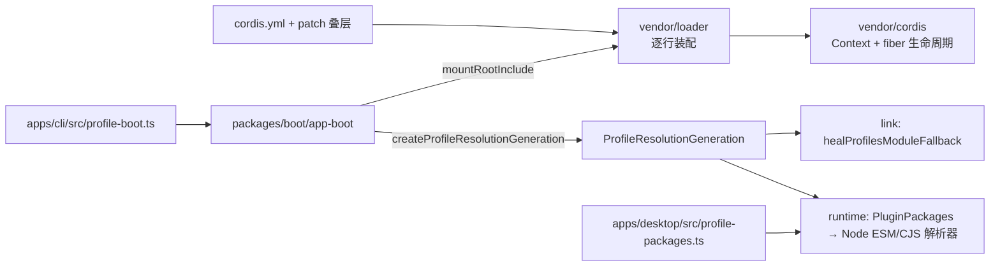
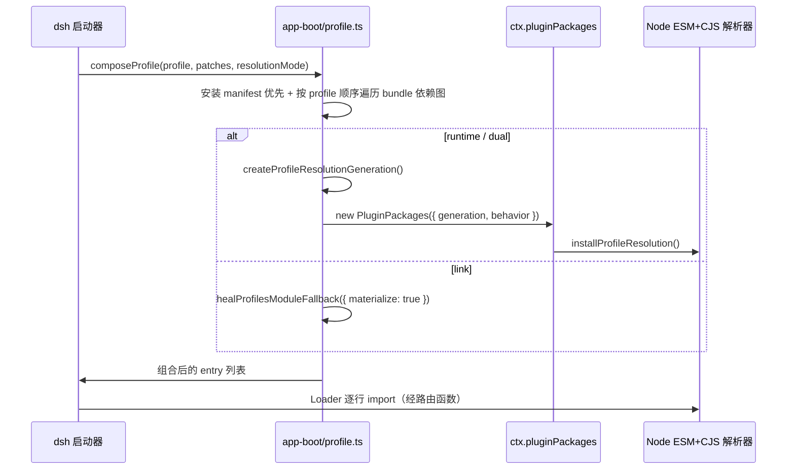
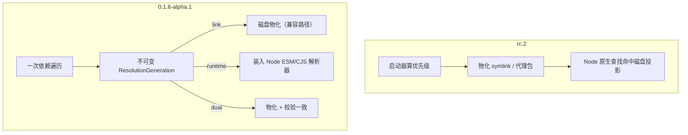

# 【第 01 篇】vendor/ 与 boot/：可拆卸运行时底座与 profile 解析（Cordis 框架层）

> **版本**：v0.1.6-alpha.1（tag `dsh-v0.1.6-alpha.1` = `0a15e36e7f`，上版 `dsh-v0.1.5-rc.2` = `fb2c4b9e69`）
> 难度：🟡 进阶（本版把 profile 解析从磁盘投影搬进进程内解析器，需要一点 Node 模块解析基础）
> 前置阅读：`../项目架构总览.md`（总览层）
> 对应目录：`deepseek-harness/vendor/`、`deepseek-harness/packages/boot/`、`deepseek-harness/apps/cli/src/profile-boot.ts`、`deepseek-harness/apps/desktop/src/profile-packages.ts`
> 对应版本：v0.1.6-alpha.1

## 目录

- [0 引言：版本、包范围与文档链接](#0-引言版本包范围与文档链接)
- [1 概述](#1-概述)
- [2 核心概念](#2-核心概念)
- [3 包结构](#3-包结构)
- [4 关键类型](#4-关键类型)
- [5 数据流](#5-数据流)
- [6 测试覆盖](#6-测试覆盖)
- [7 与上游/下游的关系](#7-与上下游的关系)
- [8 本版本变更要点（rc.2 → 0.1.6-alpha.1）](#8-本版本变更要点rc2--016-alpha1)

---

## 0 引言：版本、包范围与文档链接

本篇覆盖"框架层 + 启动装配层"这一竖切：

| 范围 | 路径 | 本版变化量 |
|---|---|---|
| vendored Cordis 全家桶 | `vendor/`（9 个 `@deepseek-ai` 作用域包） | 13 个文件，+169 / −542 |
| 应用启动库 | `packages/boot/app-boot/` | 25 个文件，+4215 / −809 |
| 启动命令行交接 | `packages/boot/cmdline/` | 3 个文件（含 README 双语文档） |
| 启动器消费方 | `apps/cli/src/profile-boot.ts` | 本版新增 `resolutionMode` 分支 |
| 桌面端消费方 | `apps/desktop/src/profile-packages.ts`、`apps/desktop-host/src/index.ts` | 随 ASAR 运行时改造 |

官方资料：

- `docs/architecture.md`（组合与扩展点总图）
- `docs/cordis-primer.md`（Cordis 五理念与 waterfall 语义）
- `packages/boot/app-boot/README.md`（本包契约、`Startup and reload failures` 失败矩阵表）
- `packages/boot/README.md`、`packages/boot/cmdline/README.md`
- `vendor/README.md`（manifest 表 + 本地修改日志）

决策记录（Agent Notes，本版新增或改写）：

- `.agents/notes/implemented/architecture/2026-09-09-profile-resolution-generations.md`
- `.agents/notes/implemented/architecture/2026-09-09-consumer-owned-startup-strictness.md`
- `.agents/notes/implemented/simplification/2026-09-09-nontransactional-loader.md`
- `.agents/notes/implemented/architecture/2026-09-08-desktop-bundled-runtime-and-external-plugins.md`
- `.agents/notes/implemented/architecture/2026-09-09-desktop-in-place-profile.md`

## 1 概述

rc.2 的框架层核心命题是"可拆卸 + 可替换 + 可组合"，其装配细节是：**profile 包解析靠磁盘物化**——启动器计算包优先级，然后把结果写成共享符号链接、profile 自有链接，或打包可执行文件的代理包（proxy package）。这些文件跨进程、跨安装持久存在，需要调和与加锁，会把生成的代理 manifest 暴露给元数据读取方，且无法原子地表达一次进程内变更。

0.1.6-alpha.1 把这条路径分岔成三种**解析模式（resolution mode）**：

| 模式 | 行为 | 谁在用 |
|---|---|---|
| `link` | 物化到磁盘（保留既有行为），不动 Node 解析器 | 普通 Node 调用方；启动器省略 `resolutionMode` 时的默认值 |
| `dual` | 物化**并**校验磁盘结果与内存 generation 一致 | 内部对比路径与测试 |
| `runtime` | 只把不可变的 `ResolutionGeneration` 装进 Node 的 ESM / CommonJS 解析器，不写磁盘 | `pkg` 打包可执行文件、Electron Host |

同一版还做了两件配套事：

1. **启动严格性回归应用侧**：vendored Cordis 不再承担"必需启动失败"的策略，由 `app-boot` 在初始树 settle 后审计一个全局必需 entry id 列表（`feat(boot): distinguish required startup failures`，`bd4cfc7c46`）。
2. **Loader 事务性回退**：撤销 #932 引入的事务性配置重载，回到固定的 eager、非事务式实现，把完成性检查交还给应用消费方（`e07f41d5fd` / `2abb542a22` / `d225dbba50`）。

## 2 核心概念

- **解析代（resolution generation，`ResolutionGeneration`）**——一次 profile 启动从**同一棵依赖遍历**算出的一份不可变包表；磁盘物化器与运行时解析器消费同一份结果，谁都不持有优先级算法的副本。
- **解析模式（resolution mode）**——`link | dual | runtime`，见上表。
- **路由函数（routing function）**——ESM 适配器与 CommonJS 适配器共用的一个函数；它只决定"要不要走 generation"，最终解析（exports / conditions / main / 子路径 / 缓存 / 错误码）仍归 Node。
- **能力缝（capability seam）**——Service Definition / Service Provider / Consumer 三角；本版 `ctx.pluginPackages` 把包元数据以服务形式暴露。
- **消费方拥有的严格性（consumer-owned strictness）**——启动必需性是应用或资源所有者的判断，不是 Loader group 的判断。
- **非事务式 Loader（nontransactional Loader）**——配置变更立即写 entry options；失败不回滚上一个插件或配置，失败可见但由消费方审计。
- **补丁层叠（patch layering）**——`cordis.yml` + bundle patch + profile/home 级 `cordis.patch.yml` + `--patch` overlay 的兄弟 patch 列表。

## 3 包结构



| 路径 | 角色 |
|---|---|
| `vendor/cordis/src/context.ts` | 服务注册表 + 事件总线 |
| `vendor/cordis/src/events.ts` | `DispatchMode` 五种分发；本版收窄 `internal/update` 签名 |
| `vendor/cordis/src/fiber.ts` | fiber 生命周期；本版 `Fiber.update()` 不再返回 waterfall 结果 |
| `vendor/loader/src/index.ts` | `Loader` / `EntryTree`；本版 `internal/update` 监听器改回同步 |
| `vendor/loader/src/config/entry.ts` | entry 激活与 detached 完成观察器（本地修改 #12） |
| `vendor/loader/src/config/group.ts` | sibling 并发启动，记录应用失败，不做回滚 |
| `vendor/loader/src/config/isolate.ts` | isolate realm 交换；`loader/patch-context` 改同步 |
| `vendor/include/src/index.ts` | patch 应用、`applyEntryPatches`、持久化写入 |
| `vendor/hmr/src/index.ts` | 模块 watcher 就绪顺序与原生路径规范化 |
| `packages/boot/app-boot/src/index.ts` | 903 行：`boot`、`auditStartupEntries`、`installFailLoud`、`mountRootInclude`、`renderConfigDump` |
| `packages/boot/app-boot/src/profile.ts` | 888 行：profile 模板、bundle 解析、`healProfilesModuleFallback`、`createProfileResolutionGeneration` |
| `packages/boot/app-boot/src/profile-resolution/resolver.ts` | 924 行：generation 查询 + Node 内部 ESM/CJS 适配器 |
| `packages/boot/app-boot/src/profile-resolution/service.ts` | 107 行：`PluginPackages` 服务 |
| `packages/boot/app-boot/src/profile-resolution/worker-bootstrap.ts` | 11 行：Worker 内安装继承的 generation |
| `packages/boot/app-boot/src/profile-resolution/legacy-links.ts` | 66 行：旧磁盘投影的虚拟插入位处理 |
| `packages/boot/app-boot/src/watch-config.ts` | 86 行：profile patch 文件精确监听 |

## 4 关键类型

```ts
export type ProfileResolutionMode = 'link' | 'dual' | 'runtime'
```

`packages/boot/app-boot/src/profile.ts` 导出，被 `packages/boot/cmdline` 与 `apps/cli` 消费。

```ts
export interface ProfileResolutionEntry { /* 包名、版本、查找目录、声明 manifest 锚点、scope */ }
export interface ProfileResolutionGeneration { /* 一份不可变的包表 + 代内缓存 */ }
```

`packages/boot/app-boot/src/profile.ts` 导出。generation 记录每个 fallback entry 的包名、版本、选中的查找目录、声明该边的 manifest 锚点，以及重跑 Node 原生解析所需的 scope。

```ts
export type ProfileResolutionBehavior = 'enforce' | 'verify'

export interface ProfileResolutionRegistration {
  replace(generation: ProfileResolutionGeneration): void
  packageDir(name: string, parentURL: string): string | undefined
  dispose(): void
}

export function installProfileResolution(
  generation: ProfileResolutionGeneration,
  behavior: ProfileResolutionBehavior,
): ProfileResolutionRegistration

export function registerWorkerResolution(
  generation: ProfileResolutionGeneration,
  behavior: ProfileResolutionBehavior,
): () => void
```

`packages/boot/app-boot/src/profile-resolution/resolver.ts` 导出。`enforce` 对应 runtime 模式，`verify` 对应 dual 模式。

```ts
export class PluginPackages extends Service {
  constructor(ctx: Context, config: PluginPackagesConfig = {})
  replace(generation: ProfileResolutionGeneration): void
  packageOf(specifier: string, parentURL: string): PluginPackage | undefined
}
```

`packages/boot/app-boot/src/profile-resolution/service.ts` 导出，通过声明合并挂到 `ctx.pluginPackages`。`PluginPackage` 含 `name` / `version` / `dir` / `manifestPath` / `manifest`。

## 5 数据流



关键点（均来自 `2026-09-09-profile-resolution-generations.md`）：

1. **一个选择算法**：安装 manifest 是第一个根；图按 `dependencies` → `peerDependencies` 广度优先遍历，每条边从声明它的 manifest 解析；某个名字下第一个到达的已安装包拥有该名字；随后按 profile 顺序跑选中的 bundle 根，靠前的根整张图优先于靠后的根。
2. **不可变代**：解析器注册持有唯一的 `current` generation；每次同步解析只捕获一次引用；构造期读完全部所需 manifest 才发布，出错则当前代不变。发布是"替换一个引用"，在途调用可继续跑完它捕获的那一代。
3. **共享 ESM 与 CJS 规则**：用 `node-addon-require-builtin` 读取 `internal/modules/esm/loader` 与 `internal/modules/cjs/loader`；两个适配器共用一个路由函数，忽略 builtin、相对/绝对路径、URL、profile scope 之外的 parent；裸包请求若命中 generation 则走该 entry 的声明锚点，否则在虚拟 fallback 位之后继续原生查找。
4. **Worker**：主线程通过 Worker 环境数据发布可结构化克隆的 generation；每个 Harness 自有的已构建 Worker 用 build banner 拿到自己的 ESM/CJS 内部对象并安装同一批适配器，bootstrap bundle 不含静态包导入。
5. **只做加法**：`replace()` 只接受**加性**后继代（新增包名），任何改变已存在包目录或版本的代都被拒绝；替换/升级/移除已加载包需要进程重启。

## 6 测试覆盖

| 测试文件 | 覆盖点 |
|---|---|
| `packages/boot/app-boot/tests/profile-resolution.spec.ts` | 1518 行新增：root 顺序、传递与 peer 依赖、本地优先、exports 与子路径错误、conditions、显式 CJS 选项 |
| `packages/boot/app-boot/tests/profile-resolution-service.spec.ts` | 205 行新增：服务注册、加性替换、Worker 注册生命周期 |
| `packages/boot/app-boot/tests/profile-resolution-worker-bootstrap.spec.ts` | 43 行新增：mock 线程与原生 loader 接口下的环境数据发布与安装 |
| `packages/boot/app-boot/tests/watch-config.spec.ts` | 286 行新增：profile patch 文件精确监听 |
| `packages/boot/app-boot/tests/app-boot.spec.ts` | 440 行改动：必需/可选 entry 的缺席、禁用、导入失败、同步与异步 `apply()` 失败、pending 依赖、必需失败拆除 |
| `packages/boot/app-boot/tests/config-reload.spec.ts` | 321 行改动：非事务式重载下的补丁重应用与失败上报 |
| `packages/boot/app-boot/tests/user-patches.spec.ts` | 106 行改动：用户 patch 挂载与 entry 激活错误保留 |
| `packages/boot/app-boot/tests/hmr-config.spec.ts` | **删除**（213 行）：职责移交 `watch-config.spec.ts` |
| `apps/cli/tests/profiles/web/tests/web-failure-matrix.expected.e2e.ts` | 进程级失败矩阵：启动时与 patch 文件编辑后的可选/必需失败 |
| `apps/cli/tests/profiles/web/tests/web-best-effort-startup.expected.e2e.ts` | 243 行新增：Web 完整 UI 在可选失败下仍可服务 |

Node 兼容性矩阵会在受支持的内部 loader 变体上跑 resolver / service / bootstrap 三组规格。

## 7 与上游/下游的关系

- **上游**：vendored Cordis 与 Loader 是 pinned 源码副本，manifest 记录上游版本与 commit；本版把 `loader` 的 peerDependency `node-addon-require-builtin` 从 `^0.1.4` 提升到 `^0.1.6`（`0bade5a010 chore(runtime): upgrade builtin loader to 0.1.6`），该 peer 为 optional。
- **下游**：
  - `apps/cli/src/profile-boot.ts` —— `const packaged = (process as NodeJS.Process & { pkg?: unknown }).pkg !== undefined; const resolutionMode = packaged ? 'runtime' : options.resolutionMode ?? 'link'`；`PluginPackages` 以 `behavior: resolutionMode === 'dual' ? 'verify' : 'enforce'` 安装。
  - `apps/desktop/src/profile-packages.ts` —— 桌面端在 profile 行挂载前安装自己的运行时 generation。
  - `apps/desktop-host/src/index.ts` —— Host 通过 `ELECTRON_RUN_AS_NODE=1` 以 Node 模式运行，从 ASAR 读 dsh 树，并把可执行 ASAR 条目映射到 electron-builder 的 unpacked 树。
- **守护**：`verify-vendored-links` 在本版被删除，vendored 链接一致性改由 `scripts/verify-repository-references.ts` 与 `pnpm run hygiene` 的其他叶子闸门承担；`vendor/README.md` 的本地修改日志仍是框架差异的唯一账本。

## 8 本版本变更要点（rc.2 → 0.1.6-alpha.1）

> 本节占本篇一半以上篇幅，是本版增量的正文。

### 8.1 变更总览

| 主题 | 关键提交 | 落点 |
|---|---|---|
| profile 解析模式 | `6aa2e4633c` | `packages/boot/app-boot/src/profile-resolution/**`、`profile.ts` |
| 必需启动失败区分 | `bd4cfc7c46`、`6894e93a12` | `packages/boot/app-boot/src/index.ts` |
| Loader 非事务化回退 | `e07f41d5fd`、`2abb542a22`、`d225dbba50`、`2376d210bd` | `vendor/loader/**`、`vendor/include/**`、`vendor/cordis/src/{events,fiber}.ts` |
| native 缓存交给 addon | `c3a66d9cd2` | `profile-resolution/{resolver,service,worker-bootstrap}.ts` |
| pkg 强制 runtime | `c917a4e0bd` | `apps/cli/src/profile-boot.ts` |
| desktop 从 ASAR 跑 Host | `fa7d5519f5` | `apps/desktop/**`、`apps/desktop-host/src/index.ts` |
| builtin loader 升 0.1.6 | `0bade5a010` | `vendor/loader/package.json` |
| 解析边界修补 | `6823f8a00c`、`013aead5c9`、`c75f667822`、`0d4b097375`、`0de61878b3`、`3cacc0e69a`、`69ab6575d1`、`32e6e872f6` | `profile-resolution/resolver.ts`、`profile.ts` |

### 8.2 profile 解析模式：从磁盘投影到进程内 generation

**问题**（`2026-09-09-profile-resolution-generations.md` #Problem）：profile 从它自己的包工程加载插件行，而 Harness 包与被选中 bundle 携带的包可能位于该工程普通依赖树之外。启动器用"启动时算优先级 + 物化"来搭桥，产物是共享符号链接、profile 自有链接或打包可执行文件的代理包——它们跨进程与安装持久存在，需要调和与加锁，把生成的代理 manifest 暴露给元数据读取方，也无法原子地表达进程内变更。

**决策**（同 note #Decision）：profile 启动从**同一次供磁盘模块 fallback 使用的依赖遍历**里算出**一份不可变的 `ResolutionGeneration`**。启动器默认 `link` 模式以保留既有行为；内部调用方与测试可选 `runtime`（装入 Node ESM 与 CJS 解析器）或 `dual`（物化并校验同一代）。`PluginPackages.replace()` 以"一次引用替换"发布一个完整的加性后继。

三个模式共用同一个 generation schema 与依赖选择策略：`link` 持久化计算结果，`runtime` 只在进程内安装，`dual` 要求 Node 的物化结果等于 generation 的路由。

**模式选择点**（可验证行）：

```ts
// apps/cli/src/profile-boot.ts
const packaged = (process as NodeJS.Process & { pkg?: unknown }).pkg !== undefined
const resolutionMode = packaged ? 'runtime' : options.resolutionMode ?? 'link'
```

`packages/boot/app-boot/README.md` 的表述与之对应：

> Before mounting profile rows, the `dsh` launcher computes one immutable package-resolution generation from the installation and ordered bundle dependency graphs. The default link mode materializes the existing shared and profile-owned fallback links, so supported launch behavior stays unchanged. Internal callers and test harnesses can instead install the generation through Node's ESM and CommonJS resolvers in runtime mode, or materialize and verify the same generation in dual mode.

**选择算法（一段逻辑，两个消费者）**：

| 步骤 | 规则 |
|---|---|
| 1 | 安装 manifest 是第一个根 |
| 2 | 从每个根出发，按 `dependencies` → `peerDependencies` 广度优先，每条边从声明它的 manifest 解析 |
| 3 | 某个名字下**第一个到达**的已安装包拥有该名字 |
| 4 | 随后按 profile 顺序跑选中的 bundle 根；靠前的根整张图优先于靠后的根 |
| 5 | 安装提供的名字被保留；bundle 包根自身不成为插件 fallback |
| 6 | 声明了但缺失的包按既有行为跳过 |
| 7 | profile 本地与插件私有 `node_modules` 留在 fallback 条目之外，Node 在虚拟 fallback 位之前先查它们 |

**性能与验证的边界**（note 明确标注为一次性本地测量，脚本与结果**未提交**，不是 benchmark 也不是 CI 预算）：在 Node 22.19 / 24.18 / 26.8 上交替跑七轮，热路径中位增量最大 4.5%；Node 24.18 上 256 包冷启动最多回退 11.2%，generation 构造中位 16.027 ms。

### 8.3 必需启动失败：严格性归应用所有

**问题**：Loader 的尽力而为调和会保留可用插件，但应用仍需要一组最低能力——一个没有监听服务器的 HTTP 应用不算在运行，而一个不可用的工具可以省略。Cordis 无法从插件实现或依赖状态推断这种区别。

**决策**（`2026-09-09-consumer-owned-startup-strictness.md`）：

- DSH 在 vendored Cordis 之**外**拥有启动严格性。`app-boot` 在初始树 settle 后，用一个**全局的稳定 entry id 列表**审计。
- 列出的 entry 若**存在、启用、且未激活**，则拒绝启动并拆除应用。
- 列出的 id **缺席或显式禁用**则不产生任何影响。
- bootstrap Include 因为 entry 身份而被要求：缺失或无效的根配置本身就阻止了应用装配。
- 其他未激活 entry 只产生一条警告，成功兄弟继续运行。
- `disabled: !!js` 表达式**抛错**被当作 entry **失败**而非禁用，因为求值从未确定是否该跳过它。
- 审计**只在初始应用启动**时运行；之后配置 HMR 仍是最佳努力，失败候选保留可见以便修复。

必需 id 列表（`packages/boot/app-boot/README.md` 与 note 一致）：

```
agent-loop, webserver, modules, connection, headless-runner, acp, sdk-jsonrpc-server
```

提交链：`bd4cfc7c46 feat(boot): distinguish required startup failures` → `f4a7dd6077 fix(boot): limit required IDs to application endpoints` → `7fd41b833b`/`f5b5a9da51`/`25d5efcd86`/`4cd20c1a1e` 诊断细化 → `6894e93a12 refactor(app-boot): keep required startup policy private`。

**失败矩阵**（摘自 `packages/boot/app-boot/README.md`，本版新增该表）：

| 失败形态 | 可选 entry（启动） | 必需 entry（启动） | 之后的配置 HMR |
|---|---|---|---|
| 模块导入失败或求值抛错 | 警告；继续 | 停止启动 | 报错；保留成功兄弟；修复后可激活 |
| 插件 config schema 校验失败 | 警告；继续 | 停止启动 | 新 entry 保持未激活；已有 entry 保留先前实例与 config |
| config `!!js` 求值抛错 | 警告；继续 | 停止启动 | 报错；保留成功兄弟 |
| `disabled: !!js` 求值抛错 | 警告；继续 | 停止启动 | 报求值错误，而非当作禁用 |
| 同步 `apply()` 抛错 | 警告；继续 | 停止启动 | 报错；修复后可激活 |
| 异步 `apply()` 抛错 | settle 后警告；继续 | settle 后停止启动 | settle 后报错 |
| 注入服务不可用 | 警告；entry 等待依赖时继续 | 停止启动 | entry 保持等待；补上 provider 可激活 |
| HTTP 端口绑定失败 | 警告；无该端点继续 | 停止启动 | 进程继续运行但无该端点 |
| `apply()` 返回 Promise 之外的后台异步工作产生未处理拒绝 | 致命 | 致命 | 致命（无论 entry id） |
| entry 缺席或显式禁用 | 忽略 | 忽略 | 不激活；不做必需审计 |

拒绝的备选（note #Alternatives considered）：给 vendored Loader 加事务/尽力而为模式（严格性属于应用或资源所有者，且会扩大 vendor patch）；在每个 profile 里声明必需 entry（同一应用端点会在 profile 数据与自定义 profile 间重复）；把每个启动失败都当作可选（无法暴露选定应用端点的进程必须报告启动失败）。

### 8.4 Loader 非事务化：撤销 #932，把完成性检查交还消费方

**问题**（`2026-09-09-nontransactional-loader.md`）：事务性配置重载能在编辑失败后保留旧的插件代，但要求 Loader 自己拥有候选导入、生命周期结算、回滚、option 身份与 Include 序列化。这让 vendored 实现与 pinned 上游实质分岔，而且应用启动与 profile patch 监听隐式依赖那套结算。

**决策**：撤销 #932 的五个提交，解决包移动并保留独立的后续行为：

```
e07f41d5fd Revert #932 transactional Cordis reload changes
2abb542a22 Adapt current consumers to nontransactional Cordis Loader
d225dbba50 Remove nonessential remnants of Cordis PR 932
2376d210bd Preserve nested plugin errors after Cordis revert
```

回退后的实际语义：

| 组件 | 行为 |
|---|---|
| `Loader` | **eager** 修改 entry options |
| `EntryGroup` | 并发启动兄弟，记录应用失败 |
| `EntryTree` | 等待未完成工作，**不**因失败 fiber 而拒绝 |
| `Include` | 保留 parse 校验与 patch 重应用；插件失败可留下部分应用的树 |
| 恢复方式 | 无自动回滚；应用报告失败，等一次后续有效编辑来恢复 |

**消费方的适配**（note #Decision 后半段，可逐条对照源码）：

- CLI 在安装 live patch watcher 之前等待它的 fallback HMR 服务。
- directory chooser 检查它自己挂载的 entry；chooser 与 browser package runner 在移除 entry 前捕获第一个 fiber-disposal 结果，并在报告拆除完成后 await 它。
- preset 挂载等待自己的子树，并报告导入、激活与缺失服务失败。
- `packages/boot/app-boot` 拥有精确的 patch 文件监听、激活审计与部分上下文清理。
- Web 启动在打印 URL 或打开浏览器之前审计激活。

**保留的两个 #932 专属 vendor 改动**（note 明确列出）：Include 的 awaited 初始文件创建与强制重读；Schemastery 的条件 exports。移除后者会在 Web preset 套件启动时重现 `ERR_REQUIRE_ESM_RACE_CONDITION`（Node 在并发 ESM 导入期间回退到 CJS 入口）。

**代价**（note #Consequences，原文意思照录）：插件激活失败可以留下新 options 和一个失败 fiber。需要活跃插件的调用方必须**在 settle 之后审计**；只 await `Loader.create()` 并不等于建立了激活。

### 8.5 vendor/ 的实际 diff 与本地修改日志改写

`git diff --stat dsh-v0.1.5-rc.2..dsh-v0.1.6-alpha.1 -- vendor`：

```
 vendor/README.md                    |  22 ++--
 vendor/cordis/src/events.ts         |   2 +-
 vendor/cordis/src/fiber.ts          |   6 +-
 vendor/hmr/README.md                |   6 +-
 vendor/hmr/src/index.ts             | 181 +++-----------------
 vendor/include/src/index.ts         | 144 ++++++------------
 vendor/loader/package.json          |   2 +-
 vendor/loader/src/config/entry.ts   | 197 ++++++-------------------
 vendor/loader/src/config/group.ts   |  81 ++++--------
 vendor/loader/src/config/isolate.ts |   4 +-
 vendor/loader/src/config/tree.ts    |  53 ++--------
 vendor/loader/src/config/utils.ts   |   2 +-
 vendor/loader/src/index.ts          |  11 +-
 13 files changed, 169 insertions(+), 542 deletions(-)
```

**签名收窄（可核对的两行）**：

```diff
-  'internal/update'(this: Fiber, config: any, noSave: boolean, next: () => void | Promise<void>): void | Promise<void>
+  'internal/update'(this: Fiber, config: any, noSave: boolean, next: () => void): void
```

```diff
-  ctx.on('loader/patch-context', async (entry, next) => {
+  ctx.on('loader/patch-context', (entry, next) => {
```

`Fiber.update()` 相应地不再返回 waterfall 结果：

```
@returns nothing; the restart runs behind the `internal/update` waterfall.
@throws {ValidationError} when the new config fails validation.
```

**`vendor/README.md` 本地修改日志的改写（第 6~12 项）**：

| 条目 | rc.2 | 0.1.6-alpha.1 |
|---|---|---|
| #6 `cordis/src/fiber.ts` | 生命周期加固（含 `Fiber.update()` 返回 waterfall 结果） | 加固保留；删掉"返回 waterfall 结果"那句 |
| #7 JSDoc 富化 | 仅 Cordis | 扩到 **Cordis + Loader**（`loader/src/{index,internal,config/entry,config/group,config/isolate,config/tree,config/utils}.ts`），覆盖 entry 所有权、树变更方法与 `!!js` 判别符 |
| #8 | 事务性 Loader/Include 配置调和 | 改写为 **Include 的容错文件刷新与补丁重应用**；明确"Loader entry/group/tree 的变更遵循 pinned 的 eager、非事务式实现，不恢复先前的插件或 options" |
| #12 | Include 子树序列化 + HMR 主 watcher 初始扫描抑制 | 改写为 **`loader/src/config/entry.ts` 激活观察器**：detached 的 `Entry.init()` 完成观察器处理两种结局，fiber 保留其激活错误供显式消费方审计 |
| #9 / #14 | HMR 精确配置监听 / 持久化防抖写入 | 表述改写（精确 profile patch 监听的所有权移交给 `packages/boot/app-boot/src/watch-config.ts`；Include teardown 在子项移除前后各 drain 一次） |

> 注：`vendor/hmr/README.md` 与 `vendor/hmr/src/index.ts` 的净减少（181 行中大部分为删除）来自 `d225dbba50 Remove nonessential remnants of Cordis PR 932`。

### 8.6 native 缓存交给 addon 管理

`c3a66d9cd2 refactor(boot): use addon-managed native cache` 的 stat：

```
 packages/boot/app-boot/src/profile-resolution/resolver.ts            |  8 +----
 packages/boot/app-boot/src/profile-resolution/service.ts             | 41 +++-------------------
 packages/boot/app-boot/src/profile-resolution/worker-bootstrap.ts    | 12 +------
 packages/boot/app-boot/tests/profile-resolution-service.spec.ts      | 15 ++------
 packages/boot/app-boot/tests/profile-resolution-worker-bootstrap.spec.ts | 31 ++--------------
 packages/boot/app-boot/tests/profile-resolution.spec.ts              | 10 ------
 6 files changed, 11 insertions(+), 106 deletions(-)
```

即：原先由 DSH 自己在 `app-boot` 里维护的原生模块缓存生命周期，改为由 `node-addon-require-builtin` 管理；`d4350442e8 docs(boot): remove private native cache lifecycle` 同步删除相关文档。`vendor/loader/package.json` 的 peer 提升到 `^0.1.6`（`0bade5a010`）与这次切换配套。

配套的解析边界修补（`fix(boot)` / `fix(app-boot)` / `test(boot)` 系列，均落在 `profile-resolution/resolver.ts` 与 `profile.ts` 的测试面）：

| 提交 | 修的东西 |
|---|---|
| `6823f8a00c` | runtime 与 link 解析对齐 |
| `013aead5c9` | runtime profile 解析与链接对齐 |
| `c75f667822` | profile 解析边界用例覆盖 |
| `3cacc0e69a` | 保留选中包的失败信息 |
| `69ab6575d1` | 保留选中的显式路径错误 |
| `0d4b097375` | 对齐其余运行时解析边界 |
| `32e6e872f6` | 绑定内部 ESM default resolver |
| `0de61878b3` | `null` exports 按 legacy 解析处理 |
| `2fc699255f` / `a663bbf4b8` / `9c914dfea9` | Windows 解析器路径规范化与显式 fallback 失败测试 |

### 8.7 打包与桌面端：runtime 模式成为载体默认

- `c917a4e0bd feat(cli): force runtime resolution in pkg builds` —— 只改 `apps/cli/src/profile-boot.ts` 一个文件（3 增 2 删），把 `pkg` 打包可执行文件钉死为 `runtime` 模式。
- `fa7d5519f5 feat(desktop): run runtime host from asar` —— 18 个文件，覆盖 `apps/desktop/src/{host-process,main,profile-packages,project-manager}.ts`、`apps/desktop-host/src/index.ts`、`electron-builder.config.mjs` 及其类型声明，以及 macOS 签名与启动测试。note 的表述是：Electron Host 以 `ELECTRON_RUN_AS_NODE=1` 跑在 Electron 可执行文件上，从 **ASAR** 读它的 dsh 树，并把可执行 ASAR 条目映射到 electron-builder 的 unpacked 树。

两者共同的结果（`2026-09-09-profile-resolution-generations.md` #Mode behavior / #Disk migration）：`pkg` 与打包 Electron 载体**强制 runtime 解析**，两者都**不**创建、更新或移除遗留解析链接；遗留磁盘状态仍可供 link-only 启动、老进程与回滚使用，但不参与 runtime-only 选择。移除该状态是本次变更之外的独立维护操作。

### 8.8 桌面端 profile：从 staged 改为原地修改

`2026-09-09-desktop-in-place-profile.md` 记录：Desktop 停止 Host 后**直接修改当前 profile**；共享 host 链接在包变更时先摘除、操作 settle 后恢复；包锁定、依赖校验与已批准的原生构建保留；兼容升级只刷新链接而不复制插件文件。**不再有** staging profile、激活日志、目录交换恢复或自动回滚。

一个持久标记 `desktop-packages-pending` 在包写入或原生运行时重建**之前**落地，只在安装、批准的构建与校验全部成功后移除；之后带该标记的启动会重装锁定图并重试待处理构建，即使已记录的运行时元数据已经匹配上。普通未变更启动复用 profile，不扫插件依赖图。

该 note 明确宣告它取代（supersede）`2026-08-25-electron-desktop-packaging-and-updates`、`2026-09-08-desktop-bundled-runtime-and-external-plugins`、`2026-09-09-desktop-immediate-window-and-direct-start` 中的 staging 与 rollback 部分，其余发布身份、模块身份与窗口生命周期决策仍有效。

### 8.9 数据流对比（rc.2 vs 0.1.6-alpha.1）



### 8.10 被否决的备选与本版的取舍

三条决策各自记下了被拒绝的路径，它们解释了"为什么是这个形状"。

**（a）profile 解析模式**（`2026-09-09-profile-resolution-generations.md` #Alternatives considered）：

| 备选 | 否决理由 |
|---|---|
| 永久保留磁盘投影 | 保留原生查找、无需进程钩子，但留下了跨进程变更、过期代、代理 manifest、写者锁与打包运行时分歧。有限的 `dual` 迁移仍有价值，因为两个后端消费同一份 generation |
| 在 resolve 期间惰性展开依赖图 | 把 manifest 读取与错误摊到首次使用调用上、改变相对磁盘实现的时序、复杂化 Worker 启动，并让热路径依赖图大小。完整构造更易比较与原子替换 |
| 用 `module.registerHooks` | 这个公共 API 会让每个相关解析都先经过 Node 的全局钩子分发，然后才轮到 profile scope 拒绝。直接访问既有的内部 ESM 与 CJS 解析器对象能得到更小的快路径，同时保留 Node 作为最终解析者 |
| 通过 Loader 与 HMR 适配器记录每个 Entry 的真实导入 | 真实导入记录只对有状态解析器有用（相同输入返回不同目标）。本设计让 generation 成为权威且确定性的，那些记录只是重复解析器的答案，还额外引入 Entry、fiber、registry、ModuleJob 与 HMR 生命周期状态 |
| 每次包操作后改一个长命表 | 增量变更会暴露部分图并要求定向缓存失效。构造完整后继让失败原子化，并让所有缓存归代所有 |
| 热替换已加载的包版本 | 解析表交换无法让每个活着的模块实例或对象引用失效。重启保证每进程一个包身份 |

**（b）启动严格性**（`2026-09-09-consumer-owned-startup-strictness.md`）：

| 备选 | 否决理由 |
|---|---|
| 给 vendored Loader 加事务模式与尽力而为模式 | 严格性属于应用或资源所有者，而一个 Loader group 里装着互不相关的插件。模式还会扩大 vendor patch，并让调用方必须在每个 group 上选策略 |
| 在每个 profile 里声明必需 entry | 同一批应用端点会在 profile 数据与自定义 profile 之间重复。全局列表把缺失 id 视为无关，同时让稳定的随附 id 保持权威 |
| 把每个启动失败都当可选 | 一个无法暴露其选定应用端点的进程必须报告启动失败 |

**（c）非事务式 Loader**（`2026-09-09-nontransactional-loader.md`）：

| 备选 | 否决理由 |
|---|---|
| 保留事务性 Loader 更新 | 它们提供对"被拒插件候选"的自动恢复，但保留的正是本次要移除的 vendored 生命周期机制。解析失败可以在没有插件回滚的情况下被容纳 |
| 逐字还原每个 vendored 文件 | 这也会连带移除惰性注入 config 求值、条件 `disabled` entry、生命周期销毁修复、持久化写入与模块加载器兼容性——这些都有独立消费方，且仍记录在 vendor 账本里 |
| 把通用回滚搬进 app boot | 只是把同样的候选代与恢复义务换一个所有者。应用改为报告失败，让一次后续有效编辑来恢复 |

### 8.11 迁移与兼容性影响

**（a）磁盘状态的处置**（note #Disk migration）：runtime-only 启动路径**不**创建、更新或退役符号链接与代理包。解析器把遗留的共享 fallback 与 `.dsh-module-fallback` 投影当作**虚拟插入位**：命中 generation 就用表里的目标，未命中则跳过那些旧位置再继续原生祖先查找。`dual` 阶段启动器物化并安装同一份 generation，测试会轮流禁用各后端并比较目标。遗留磁盘状态仍可供 link-only 启动、老进程与回滚使用，但不参与 runtime-only 选择；移除它是本次变更之外的独立维护操作。

**（b）代替换的加性约束**（note #Additive package changes）：调用方在构造后继代之前要完成它的 pnpm 事务；替换会拒绝任何改变已存在包的目录或版本的代。调用方在挂载新 Loader 行**之前**发布加性后继；本实现不提供那次包事务，所以挂载失败可能留下"包装好了但没激活"的状态。替换、升级或移除一个已加载的包需要进程重启，因为 Node 的 ESM Module Map、CommonJS 缓存、现存对象引用与运行中的 Worker 都可能保留旧的模块身份——代替换**不**声称能卸载模块。

**（c）覆盖范围的诚实边界**（note #Shared ESM and CommonJS rule）：保证覆盖该线程内安装后的 Node 默认 `import`、`import()`、`import.meta.resolve`、`require` 与 `require.resolve`。**不覆盖**已链接的模块、自定义 `vm` linker、不透明的非 Node 导入方，以及第三方 Worker。

**（d）谁是权威**（note #Active plugin list and package metadata）：resolution generation 列出**可用**的 fallback 包；Loader entry 构成**活跃**的插件列表。消费方继续用 Loader 既有的 entry 生命周期，并自行过滤与本 scope 相关的 entry。需要包元数据的消费方把 specifier 与所属树 base URL 交给一个轻量 `app-boot` 服务，**不需要** `./package.json` 导出。已安装的 generation 是权威的——**包括一次 miss**；没有 generation 就被创建的服务保留原生查找，供低层嵌入方使用。

**（e）为什么服务与 provider 留在 app-boot**（note #Active plugin list and package metadata 末段）：profile boot 拥有解析器的生命周期，所以服务定义与 provider 一起留在 `app-boot`。只有当出现"与启动器无关的 provider"或"独立演化的消费方"时，抽出独立的能力缝才是有理由的。

**（f）vendor 侧的兼容姿态**（`2026-09-09-nontransactional-loader.md` #Consequences 末段）：需要活跃插件的调用方必须**在 settle 之后审计**；只 await `Loader.create()` 不足以建立激活。自动插件回滚需要一次独立的未来决策，并且要有证据说明它的恢复收益值回额外的生命周期实现成本。live-patch 测试保留受控事件投递与原生 watcher 覆盖，同时断言"报告失败但不回滚"。

**（g）桌面端的兼容姿态**（`2026-09-09-desktop-in-place-profile.md`）：包或 Host 失败会**保留部分变更**供修复与重试；没有 staging profile、激活日志、目录交换恢复或自动回滚；既有 scratch 目录不会被解释或删除。测试覆盖离线初始化、原地升级、写入前失败、Host 失败后保留变更、部分 pnpm 失败、恢复的 host 链接与独占包所有权。

### 8.12 三种模式的行为对照与验证面

`2026-09-09-profile-resolution-generations.md` 的 #Mode behavior 与 #Verification 两节把三种模式的行为差异逐条固定下来：

| 行为 | `link` | `dual` | `runtime` |
|---|---|---|---|
| 使用同一 generation schema 与依赖选择策略 | ✅ | ✅ | ✅ |
| 持久化计算结果到磁盘 | ✅ | ✅ | ❌ |
| 只在进程内安装 | ❌ | ❌ | ✅ |
| 要求 Node 的物化结果等于 generation 路由 | ❌ | ✅（不等即失败） | — |
| 创建 / 更新 / 退役 fallback 链接 | ✅ | ✅ | ❌ |
| 需要受支持的 Node Internal loader 接口 | ❌ | 物化侧不需要，校验侧需要 | ✅ |
| 作为启动器默认 | ✅（`resolutionMode` 省略时） | ❌ | ❌（仅 `pkg` 与 Electron 载体强制） |

note 的 #Verification 列表（八条，逐条对应本篇第 3~6 节的落点）：

1. 一次 eager 计算同时供给保留的磁盘物化器与运行时 generation。
2. link-only、dual 与 runtime-only 测试消费同一份 generation；runtime 启动既不写也不退役模块解析数据。
3. `pkg` 与 Electron 载体选择 runtime 解析；Electron 从 ASAR 支撑的 dsh 树以 Node 模式执行其 Host，而原生可执行条目保持 unpacked。
4. ESM 与 CJS 适配器共用同一个 router，并把最终解析委派给 Node，**不用** `module.registerHooks`、**不替换** `_findPath`。
5. 生产元数据查找**不**记录 Loader 导入结果，也**不**包装 Entry、registry、tree 或 HMR 方法。
6. Node 兼容性矩阵在受支持的 loader 接口上跑主线程 resolver 规格；service 与 bootstrap 规格覆盖 Worker 环境数据与安装接口，**不启动**已构建的 Worker。
7. 一次性 built plain-Node 测量给出了 §8.2 的热/冷观察值（对照无钩子的 Node）。
8. 包 README、架构引用、生成目录与双语对照都描述已交付的实现。

这八条同时解释了本篇第 6 节测试矩阵的形状：`profile-resolution.spec.ts` 覆盖选择算法本身，`profile-resolution-service.spec.ts` 覆盖服务与加性替换，`profile-resolution-worker-bootstrap.spec.ts` 用 mock 覆盖 Worker 安装接口而**不**真启 Worker，generation 测试证明"构造失败不发布部分状态"与"成功替换是原子的"。

一处容易混淆的重命名值得单独记：rc.2 里名为 `hmr-config.spec.ts` 的测试（213 行）在本版被删除，其职责迁移到新增的 `watch-config.spec.ts`（286 行）。`vendor/README.md` 的本地修改 #9 同步改写为"精确的 profile patch 监听归 `packages/boot/app-boot/src/watch-config.ts` 所有"，而 vendored HMR 只保留模块 watcher 的就绪顺序与原生路径规范化。换句话说：**watch 的归属从 vendored 框架层上移到了应用启动层**，这与 8.3"严格性归应用所有"是同一条设计线的两个落点。

同一条设计线在 vendor 账本里还有第三个落点——`2026-09-09-nontransactional-loader.md` 列出的"消费方必须自己拥有的完成性检查"清单，逐条对应本篇第 3 节的包结构：

| 消费方 | 它自己的完成性检查 |
|---|---|
| `apps/cli` | 在安装 live patch watcher 之前等待 fallback HMR 服务 |
| directory chooser | 检查自己挂载的 entry；移除前捕获第一个 fiber-disposal 结果并 await |
| browser package runner | 同上 |
| preset 挂载 | 等待子树，报告导入 / 激活 / 缺失服务失败 |
| `packages/boot/app-boot` | 精确 patch 文件监听、激活审计、部分上下文清理 |
| Web 启动 | 在打印 URL 或打开浏览器之前审计激活 |

四条线索合起来读：**框架层给出机制，应用层拥有策略**。rc.2 把若干策略（事务回滚、必需 entry、精确 watch）压在 vendored Loader 里；0.1.6-alpha.1 把它们搬回 `packages/boot/app-boot` 与各应用消费方，代价是"调用方必须自己审计"，收益是 vendored 实现与 pinned 上游的差异面显著收窄（`vendor/` 净 −373 行）。

### 8.13 未核实项

以下内容在本版线索中出现，但本次未在仓库中核实到对应实现或数据，**不写入结论**：

- profile resolution 的跨版本性能基准与 CI 预算（note 自述其测量脚本与结果未提交）。
- `dual` 模式在 CI 中的实际启用范围（note 只说它是内部对比路径，测试与低层嵌入方可以显式选择）。
- `ResolutionGeneration` 在第三方 Worker 中的任何行为（note 明确说不覆盖自定义 `vm` linker、非 Node 导入方与第三方 Worker）。
- `ProfileResolutionEntry` 与 `ProfileResolutionGeneration` 的**具体字段清单**——本次核实到的是两者的存在与语义（包名、版本、查找目录、声明 manifest 锚点、scope），未逐字段展开源码。
- `packages/boot/app-boot/src/profile-resolution/legacy-links.ts` 的**具体函数名**——本次核实到该文件 66 行新增及其职责（虚拟插入位），未展开符号。
- `apps/desktop` 77 个变更文件与 `apps/desktop-host` 2 个变更文件的**逐项内容**——本次核实到 `fa7d5519f5` 的 18 个文件清单与 ASAR 运行时行为，未测全量 77 个。

---

*文档生成时间: 2026-09-17*
*数据源: dsh-v0.1.6-alpha.1 (0a15e36e7f) vs dsh-v0.1.5-rc.2 (fb2c4b9e69)*
