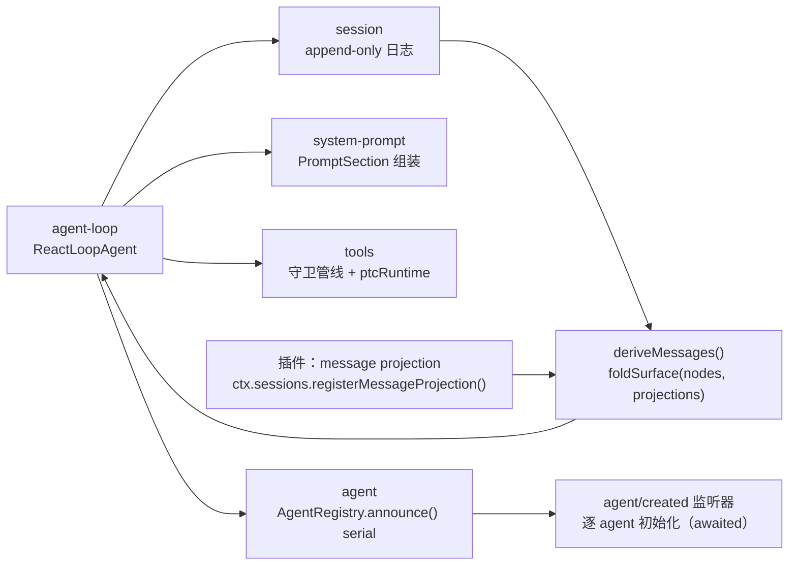

# 【第 02 篇】packages/core/：产品主干（agent · session · tools · system-prompt · scope）

> **版本**：dsh-v0.1.6-alpha.1（`0a15e36e7f`），对比上版 dsh-v0.1.5-rc.2（`fb2c4b9e69`）
> 难度：🟡 进阶（建议先读 v0.1.5-rc.2 的第 01 篇与 `docs/architecture.md`）
> 包范围：`deepseek-harness/packages/core/` 下 8 个包
> 上游文档：`docs/subsystems/core.md`、`session.md`、`tools.md`、`system-prompt.md`、`scope.md`

## 目录

- [引言](#引言)
- [概述](#概述)
- [核心概念](#核心概念)
- [包结构](#包结构)
- [关键类型](#关键类型)
- [数据流](#数据流)
- [测试覆盖](#测试覆盖)
- [与上游/下游的关系](#与上下游的关系)
- [本版本变更要点（rc.2 → 0.1.6-alpha.1）](#本版本变更要点rc2--016-alpha1)
- [附录：本版核心包提交索引](#附录本版核心包提交索引)

---

## 引言

本文覆盖 `deepseek-harness/packages/core/` 这一个包组：它是**每个组合都必须启动的主干**（官方表述 "the packages every composition boots"，见 `docs/subsystems/core.md`）。`packages/core` 在本次版本区间内共 **72 个文件变更（+1729 / -505）**，是本版 API 语义变化最集中的区域之一——虽然它的文件数量少于 `packages/client`（512）与 `packages/session`（103），但其中三项是**破坏性接口变更**（`agent/created` 分发模式、同步会话历史读取废弃、`ctx.codeRuntime` 更名）。

本版已确认的坐标（来源 `RECON.md`，可由 `git rev-parse` 复现）：

| 项 | 值 |
|---|---|
| 本版 tag | `dsh-v0.1.6-alpha.1` = `0a15e36e7f` |
| 上版 tag | `dsh-v0.1.5-rc.2` = `fb2c4b9e69` |
| 发布提交 | `ea53423b60 release(dsh): 0.1.6-alpha.1` |
| `packages/core` 8 个包版本 | 全部 `0.1.5-rc.2` → `0.1.6-alpha.1` |
| `SESSION_FORMAT_VERSION` | **3（未变，与 rc.2 相同）** |

---

## 概述

`packages/core/` 提供 Agent 的三个器官：

- **记忆**：`session` 的追加式事件日志（append-only event log）是唯一真相源（single source of truth）；模型历史由 `deriveMessages()` 派生，不另存消息数组；
- **手脚**：`tools` 是工具调用的唯一入口，调用必经守卫管线（guard pipeline）；
- **大脑**：`agent` 声明 `Agent` 接口与注册表，`agent-loop` 是其唯一默认实现，驱动一次 turn 的完整编排。

`scope` 提供作用域基元（scoped dispatch / scoped effects），`system-prompt` 负责请求前缀与工具 schema 的组装，`agent-default-model` 与 `agent-tool-presentation` 是较小的默认值/呈现包。

本版 Core 的三个主题可以一句话概括：

1. **创建变慢但确定**——`agent/created` 从 `emit` 变为 `serial`，创建者必须等到逐 agent 初始化完成；
2. **历史读取被收回**——`Session.eventAt()` / `snapshotEvents()` / `ownEvents()` 成为 `@deprecated`，新调用被 lint 阻断；
3. **内容变更外移**——插件可以注册纯消息投影（message projection），Session 只做原子接纳与缓存失效，不再内置图像投影算法。

---

## 核心概念

| 术语（首次出现附英文） | 含义 | 本版是否受影响 |
|---|---|---|
| turn / step | turn 是一次完整交互轮；step 是轮内一次"模型请求 + 其触发的工具执行" | 未变 |
| 事件溯源（event sourcing） | 一切状态由追加日志派生，无第二份真相 | 未变（但见 projection 扩展） |
| surface（模型可见面） | 由 `surfaceOp` 折叠出的消息节点序列 | 新增 `contentGeneration` |
| 能力缝（capability seam） | Service Definition / Provider / Consumer 三角色；本版 `ptcRuntime` 是典型 | 重命名 + 扩展 |
| 消息投影（message projection） | 插件提供的纯解释器：不改节点成员、不改消息身份，只改既有消息内容 | **本版新增** |
| 序列（serial）分发 | 监听器按序 await，前一个完成才启动下一个；抛错即失败并跳过后续 | **本版新增模式** |

---

## 包结构

`packages/core/` 在 `dsh-v0.1.6-alpha.1` 下为 8 个包（`git ls-tree --name-only dsh-v0.1.6-alpha.1 packages/core/` 排除 README 后核实）：

| 包 | 职责 | 本版改动规模 |
|---|---|---|
| `agent` | `Agent` 接口、`AgentRegistry`、`agent/*` 事件 | `src/index.ts` 52 行、`src/runtime-types.ts` 32 行、`tests/agent.spec.ts` 69 行 |
| `agent-loop` | 默认循环实现（`ReactLoopAgent`） | `src/index.ts` 70 行、`src/agent.ts` 9 行；**新增** `tests/serial-listener-review.spec.ts`、`tests/fixtures/serial-created.mjs` |
| `session` | `SessionMap`、`Session`、`SessionStore`、`foldSurface` | `src/surface.ts` 134 行、`src/index.ts` 77 行、`src/types.ts` 11 行、`known-event-types.ts` 6 行；**新增** `tests/message-projections.spec.ts` |
| `tools` | 工具注册表与执行管线、PTC 传输 | `src/ptc.ts` 137 行、`src/index.ts` 83 行、`src/types.ts` 8 行、`package.json` 14 行、`tests/ptc.spec.ts` 534 行 |
| `system-prompt` | prompt 分段组装与 `{{variable}}` 插值 | `src/index.ts` 14 行、`tests/system-prompt.spec.ts` 19 行 |
| `scope` | 作用域事件与 scoped dispatch | `src/scoped-events.generated.ts` 1 行（生成物） |
| `agent-default-model` | 默认模型选择 | 仅版本号 |
| `agent-tool-presentation` | 工具呈现默认值 | `src/index.ts` 10 行、`tests/` 20 行（细节未逐行核实） |

---

## 关键类型

**片段 A：`agent/created` 的分发模式（本版从 `emit` 改为 `serial`）**

```ts
// packages/core/agent/src/runtime-types.ts
'agent/created'(
  this: Scoped<Agent>,
  payload: { agent: Agent; source: SessionStartSource; signal?: AbortSignal },
): undefined | Promise<undefined>
```

翻译：payload 新增 `source` 与可选 `signal`；返回值从 `void` 变为 `undefined | Promise<undefined>`，这正是 `@mode serial` 允许 await 的类型基础。JSDoc 明确："Listeners run in order and are awaited before creation resolves… A throw or rejection fails creation and skips later listeners."

**片段 B：插件自有消息投影的两个类型**

```ts
// packages/core/session/src/surface.ts
export interface SessionMessageProjectionContext {
  readonly nodes: readonly SessionSeq[]
  readonly events: readonly SessionEvent[]
  readonly baseSeq: SessionLogOffset
  readonly messages: ReadonlyMap<SessionSeq, Message>
}

export interface SessionMessageProjection<T extends SessionEventType = SessionEventType> {
  type: T
  project(event: SessionEvent<T>, context: SessionMessageProjectionContext): ReadonlyMap<SessionSeq, Message>
}
```

翻译：`project()` 必须**先校验完整 durable payload**，再返回"以原始事件 seq 为键的不变消息副本"；返回空 Map 表示不改任何内容。`SessionMessageProjectionContext` 里刻意提供了 `baseSeq`——因为 `events` 可能是一个**窗口**而非完整日志，投影实现需要用 `seq - baseSeq` 定位。

**片段 C：surface 的两个代数（generation）**

```ts
// packages/core/session/src/surface.ts
export interface SessionSurface {
  readonly nodes: readonly SessionSeq[]
  readonly replaceGeneration: number    // 仅位置替换（surfaceOp: replace）
  readonly contentGeneration: number    // 替换 + 插件消息投影
}
```

翻译：本版新增 `contentGeneration`。`Session.deriveMessages()` 的缓存失效判据从 `replaceGeneration` 换成 `contentGeneration`（`packages/core/session/src/index.ts`），`agent-loop` 的三处 `requestSurfaceGeneration` 比较同步换用。区分两个计数的原因写在同一处 JSDoc：图像省略（image offload）改变模型可见内容，但**不能伪装成一次成功的文本压缩**——`replaceGeneration` 保持只统计真正的节点替换。

**片段 D：工具预分发决策新增 `cancel`**

```ts
// packages/core/tools/src/types.ts
export type PreToolDecision =
  | { kind: 'allow' }
  | { kind: 'deny'; reason: string; info?: ToolErrorInfo }
  | { kind: 'cancel' }
  | { kind: 'ask'; reason?: string }
```

翻译：`deny` 现在可以携带结构化错误身份 `ToolErrorInfo`；`cancel` 是新增的第四种决策，选择"规范的预分发取消结果"（`ABORTED_BEFORE_DISPATCH`）而不呈现为策略拒绝——这是 Auto review（`55e53907ab feat(permission): add experimental Auto review`）需要的语义区分。

---

## 数据流



**六步读懂本版数据流：**

1. 驱动在 `agent-loop` 中领取队列输入，在 `session` 上开轮（未变）；
2. 请求前缀经 `system-prompt` 组装——本版 `PromptSection` 新增 `interpolate: false`，`tools:sdk` 分段用它保留字面 `{{` 花括号；
3. `foldSurface(events, projections)` 折叠出当前节点与 `projectedMessages` 映射；`deriveEventMessage(event, projectedMessages)` 消费它；
4. 工具调用进入 `tools` 守卫管线；`PreToolDecision` 可以是 `allow` / `deny(info)` / `cancel` / `ask`；
5. `run_code`（PTC）传输从 `ctx.ptcRuntime` 读取语言，并通过 `ctx.get('sandboxPolicy')` 解析沙箱策略；
6. 创建路径上，`AgentLoop.publish()` 现在是 `async`，在 `runMaintenance` 内 await `AgentRegistry.announce(agent, source, signal)`，全部 listener 完成后才启动驱动。

---

## 测试覆盖

| 文件 | 类型 | 行数变化 | 覆盖对象 |
|---|---|---|---|
| `packages/core/agent-loop/tests/serial-listener-review.spec.ts` | **新增** | 123 | serial 创建监听器的顺序、失败、取消 |
| `packages/core/agent-loop/tests/fixtures/serial-created.mjs` | **新增** | 24 | SDK 串行创建场景夹具 |
| `packages/core/session/tests/message-projections.spec.ts` | **新增** | 117 | 缺失解释器、原子投影、restore/fork、fiber 卸载 |
| `packages/core/tools/tests/fixtures/literal-sdk.ts` | **新增** | 20 | 字面花括号 SDK 提示词 |
| `packages/core/tools/tests/ptc.spec.ts` | 修改 | 534 | PTC 常驻策略、沙箱结果、per-program 控制 |
| `packages/core/agent-loop/tests/scope-lifecycle.spec.ts` | 修改 | 149 | 有序完成与取消 |
| `packages/core/session/tests/surface.spec.ts` | 修改 | 56 | 折叠代数（含 `contentGeneration`） |
| `packages/core/agent/tests/agent.spec.ts` | 修改 | 69 | awaited creation 迁移 |
| `packages/core/session/tests/gen-persistence-catalog.spec.ts` | 修改 | 13 | 持久化目录与消息投影清单 |
| `packages/core/system-prompt/tests/system-prompt.spec.ts` | 修改 | 19 | `interpolate: false` |
| `packages/core/tools/tests/tools.spec.ts` | 修改 | 38 | 守卫管线决策 |

> 说明：上表"行数变化"来自 `git diff --stat`，不是测试断言数量。本版各包的 `test:coverage` 门禁要求 `packages/*/*/src` 逐文件 100% 覆盖（`AGENTS.md`）。

---

## 与上游/下游的关系

- **上游（被依赖）**：`vendor/` 的 Cordis 提供事件总线与 effect 基元。本版 `AgentRegistry.register()` 改用 `async function*` effect，并直接返回 `ReturnType<Context['effect']>`（而非 `() => void`），说明它对 Cordis 的 effect 语义依赖更显式。
- **平级**：`llm` 提供消息词汇与流式协议，`core` 消费它；本版的图像 token 投影决策被移到 `llm-deepseek`（提交 `06c491508f` 的标题为「请求图片按 V4.1 token 网格投影」），`attachment` 只接收目标尺寸。
- **下游（依赖方）**：
  - `packages/session-format-catalog` 通过 `src/message-projections.ts` 组装第一方投影定义，供离线与浏览器侧读取（`325c8d880a build: admit pure message projection leaves in browser bundles`）；
  - `packages/session-query` 的 `documents.ts`、`index.ts`、`tracing.ts` 现在向 `foldSurface` / `Session.create` 显式传入 `currentSessionMessageProjections`；
  - 所有工具组（`shell`、`fs`、`web`、`subagent`…）注册进 `ctx.tools`；本版它们需要处理 `PreToolDecision` 的 `cancel` 分支与 `deny.info` 字段。

---

## 本版本变更要点（rc.2 → 0.1.6-alpha.1）

> 本节是全文重点。每条结论后附可复现的提交哈希或文件路径。

### 变更 1：`agent/created` 从 `emit` 改为 `serial`，`agent/session-start` 被删除

**这是本版 Core 最重要的 API 变更，也是插件作者升级时的第一道坎。**

| 项 | rc.2 | 0.1.6-alpha.1 |
|---|---|---|
| 分发模式 | `@mode emit` | `@mode serial` |
| payload | `{ agent: Agent }` | `{ agent: Agent; source: SessionStartSource; signal?: AbortSignal }` |
| 返回值 | `void` | `undefined \| Promise<undefined>` |
| 同步抛错 | veto publication（否决发布） | 失败创建并跳过后续 listener |
| 返回 Promise 拒绝 | 仅记录 warn 日志 | **失败创建**（caller 可见） |
| `agent/session-start` | 独立的 `@mode emit` 事件 | **已从 `Events` 接口移除** |

证据：`git diff dsh-v0.1.5-rc.2..dsh-v0.1.6-alpha.1 -- packages/core/agent/src/runtime-types.ts` 显示 `'agent/session-start'` 的完整声明块被删除，`'agent/created'` 的 JSDoc 与签名重写。

`source` 的语义被吸收进 `agent/created`：官方子系统文档的 diff 直书（`docs/subsystems/core.md`）：

> `agent/session-start` carries a `SessionStartSource`…
> → `agent/created` carries a `SessionStartSource`…

**实现侧的三处结构性改动：**

1. `AgentRegistry.register(agent)` 从 `() => void` 变为 `ReturnType<Context['effect']>`，内部改为 `async function*`：先 `yield this.enter(agent, undefined)`，再 `await this.announce(agent, 'startup')`。提交 `11656ca683 refactor(agent): keep registry registration startup-only`。
2. `AgentRegistry.announce(agent)` → `async announce(agent, source, signal?)`，内部用 `this.ctx.serial(entry.carrier, 'agent/created', {...})` 替代原来的 `ctx.events.dispatch('emit', args)` 循环。
3. `AgentLoop` 新增私有方法 `initializeAgent(prepared, initialize)`，把创建包进 `prepared.agent.runMaintenance(...)`；失败时调用 `prepared.agent.cancel({ kind: 'disposed' }, { keepInbox: true })` 后再抛出——`keepInbox` 是为「保留 teardown 拥有的 inbox 清理」而设。`publish(source)` 的返回类型从 `AgentHandle` 变成 `Promise<AgentHandle>`。

**行为细节（来自 Agent Note `2026-09-09-awaited-agent-creation.md`）：**

- AgentLoop 在初始化期间持有既有的 maintenance activity；输入可以在初始化期间进入 inbox，但**驱动只在全部 listener 成功后启动**；
- 创建分发在 listener await 期间保留 scope 与 session；disposal 会取消初始化并 join 该分发后才释放资源；
- **listener 不得 await 自己 agent 的 idle 状态或自己 owner 的 disposal**——因为那两者都在等这个 listener 完成。

**驱动侧的一个配套修复**（`packages/core/agent-loop/src/agent.ts`）：

```ts
const cause = maintenance.abort.signal.reason as AgentCancelCause | undefined
if (cause?.kind !== 'disposed' && maintenance.wakeRequested && this.inbox.hasPending) this.wakeDriver()
```

翻译：取消原因是 `disposed` 时不再唤醒驱动——创建失败路径已经取消了该 activity，此时唤醒就等于"唤醒一个正在拆除的 agent"。对应提交 `0fb509f544 fix(agent): preserve initialization failure during teardown`。

**相关提交**：`9b7a8ccc9f feat(agent): await initialization through agent/created`、`11656ca683`、`aeb13413c7 test(agent): complete awaited creation migration`、`0fb509f544`、`efa5294c00 test(agent-loop): drop duplicate creation disposal case`。生成物 `packages/core/scope/src/scoped-events.generated.ts` 随之重生成（-1 行）。

**升级影响**：任何监听 `agent/session-start` 的插件必须改为监听 `agent/created` 并从 payload 读 `source`；任何在 `agent/created` 内做异步初始化的插件，现在会被真正 await（而不是被丢弃 promise），因此**必须自查是否 await 了会死锁的对象**。

---

### 变更 2：会话事件的同步历史读取被废弃（插件作者最关心的接口变更）

`Session` 的三个同步读取方法在 JSDoc 上被标记 `@deprecated`：

| 方法 | 语义 | 状态 |
|---|---|---|
| `Session.eventAt(seq)` | 读取某一精确 seq 的事件 | `@deprecated` |
| `Session.snapshotEvents(from?, to?)` | 物化半开区间的不可变快照 | `@deprecated` |
| `Session.ownEvents()` | 返回 fork 继承前缀之后的事件 | `@deprecated` |

**为什么废弃（Agent Note `2026-09-09-deprecate-synchronous-session-event-reads.md` 的 `## Problem`）**：

> Synchronous access to arbitrary event positions makes consumers depend on the complete Session event sequence being immediately available in memory. The storage direction is to stop retaining that complete sequence in memory.

翻译：一旦历史事件需要存储 I/O，"任意位置同步读取"就无法在不保留全部历史或不阻塞存储的前提下保持。注意这是一个**API 使用决策，不是实现变更**——note 明确写道 "the current Session implementation still retains the complete event sequence in memory"。

**新调用如何被阻断（三层）：**

1. **JSDoc 层**：三个方法的注释包含 `@deprecated` 并链接到该 Agent Note；
2. **lint 层**：`.oxlintrc.json` 中 `typescript/no-deprecated` 为 `error`（第 78 行）。测试文件覆盖区（第 198~225 行）为 `packages/*/*/tests/**`、`apps/*/tests/**`、`examples/*/tests/**`、`scripts/**/*.spec.{ts,tsx}` 放行**且仅放行**这三个名字，来源限定为 `packages/core/session/src/index.ts`；
3. **豁免层**：生产代码中每一处既有调用都带行级 `// oxlint-disable-next-line typescript/no-deprecated -- Existing Session history read; migration deferred.`。本版新增这类豁免的位置包括 `packages/core/session/src/index.ts`（`ownEvents` 委托、`_forkSeed` 的 3 处）、`packages/core/agent-loop/src/index.ts`（`appendUnstoredSuffix`）、`packages/core/session/session-log-deepseek/src/*`、`packages/session-query/*`、`packages/compaction/compaction-basic/src/region.ts`。

**替代路径（note 的 `### State needed after resume`）**：domain 逻辑应改为读**投影状态**（restore 时恢复、之后由新提交事件增量维护）或处理**当前交付的事件**；按需展示的历史内容走**显式异步分页**。Fork 与少数操作确实需要完整历史序列，note 说它们 "remain valid and require an explicit storage read"——但需要各自论证。

**相关提交**：`5cfc765ff6 docs(session): deprecate direct event readers`、`aa491acc29 docs(session): record synchronous history read deprecation policy`、`37abcb74c5 chore(session): permit existing deprecated history reads`、`8f986c8da6 chore(session): scope history reader exemptions to tests`、`14da43d9ff docs(session): link deprecated readers to the history policy`、`c59d285f99 chore(compaction): mark existing history read for deferred migration`。

---

### 变更 3：插件自有消息投影（plugin-owned message projections）

**问题**（Agent Note `2026-09-11-plugin-owned-message-projections.md`）：

> Implementing its image traversal and target validation inside Session makes each feature-specific message transformation a core change.

即：图像卸载事件需要改变派生消息内容但不替换节点；把图像遍历与目标校验写在 Session 里，等于让**每一个功能专有的消息变换都变成一次 core 改动**。

**方案**：事件归属插件提供一个纯 `SessionMessageProjection`；Session 只负责原子接纳、live/detached 共用折叠、内容代际缓存失效。**Session 内不含任何图像选择或图像投影实现**。

| 机制 | 落点 |
|---|---|
| 投影定义接口 | `packages/core/session/src/surface.ts`：`SessionMessageProjection`、`SessionMessageProjectionContext` |
| 注册入口 | `SessionStore.registerMessageProjection(projection): () => Promise<void>`，内部走 `this.ctx.effect(...)` |
| 借出定义 | `SessionStore.messageProjections` getter（供 detached replay） |
| 事件标注 | `SessionEventMap` 成员上的 `@messageProjection` tag 生成"必需解释器清单" |
| 清单常量 | `packages/core/session/src/known-event-types.ts`：`MESSAGE_PROJECTION_EVENT_TYPES` |
| 折叠 | `foldSurface(events, projections?)` 返回 `SurfaceFoldResult.projectedMessages` |
| 派生 | `deriveEventMessage(event, projectedMessages?)` 优先返回投影结果 |
| 缓存失效 | `SessionSurface.contentGeneration`；`SurfaceManager._assertProjections()` |

**四条硬约束（均可从源码或 note 逐条核实）：**

1. **缺失解释器即拒绝**：`planSurfaceEvent()` 在事件类型属于 `MESSAGE_PROJECTION_EVENT_TYPES` 但无注册定义时抛出 `session event "<type>" requires a message projection; load its owning plugin or supply its projection definition`。note 明确该拒绝覆盖 append、seeded creation、restore 与纯折叠。
2. **一个事件类型只能有一个 owner**：`registerMessageProjection` 在重复注册同一 `type` 时抛出 `session message projection "<type>" is already registered`。
3. **卸载定义后缓存读取被阻断**：`_assertProjections()` 检查历史上使用过的定义是否仍在借出列表中，否则抛出 `session message projection "<type>" was removed or replaced; restore the session with its owning plugin`。
4. **投影事件不能同时声明 surface 操作**：note 原文 "A projection event cannot also declare a surface operation."

**不扩权**：note 明确 "This inventory does not make unknown third-party event names readable or change `ignorable` compatibility."

**detached 组装的唯一入口**：`packages/session/session-format-catalog/src/message-projections.ts`（本版新增，7 行）：

```ts
export const currentSessionMessageProjections: readonly SessionMessageProjection[] = [imageOffloadProjection]
```

它被 `src/current.ts`（`validateInstalledCurrentSessionArtifact`）与 `packages/session-query` 的三处调用点使用。note 强调 "No process-global registry or import-time registration is involved."

**相关提交**：`b5e7fca4a5 feat(compaction): record image offload decisions without message replacement`、`413ac14b16 refactor: move image offload projection into its plugin`、`4e7193945d fix: expose the projection registration async disposer`、`401c3ef977 test: type the stored projection fixture as format events`、`1d4d22c1ff test: complete projection fixtures and configuration catalog`、`325c8d880a build: admit pure message projection leaves in browser bundles`。

---

### 变更 4：工具管线——`cancel` 决策、`deny.info`、`error.reason`、`exec.schema`

| 新增/变更 | 位置 | 语义 |
|---|---|---|
| `{ kind: 'cancel' }` | `packages/core/tools/src/types.ts` `PreToolDecision` | 选择规范取消结果，不呈现为策略拒绝；`ToolRuntime` 中直接返回 `post-result` + `toolAbortedBeforeDispatchResult()` |
| `deny.info?: ToolErrorInfo` | 同上 | 让策略拒绝携带结构化错误身份，物料化为 `error: { message, info }` |
| `ToolErrorInfo.reason?: string` | `packages/core/tools/src/index.ts` | **原始的用户可见说明，位于模型可见内容之外**——持久化投影保留它，但模型看不到 |
| `ToolExecutionInput.schema?: ToolSchema` | 同上 | PTC 内层调用的绑定期 schema；JSDoc 注明 "frozen by its producer and never logged" |
| `PtcDispatchEventData.error?: { name; code; reason? }` | `packages/core/tools/src/types.ts` | 让 UI 与 SDK 用与原生调用**完全相同的路径**渲染子调用 |

这些字段不是自由发挥：它们各自进了持久化类型变更记录 `docs/persistence-changes/2026-09-12-auto-review-error-metadata.md`（root 为 `event:tool/ptc-dispatch` 与 `event:tool/result`，决策均为 `same-version`）。该记录的 Compatibility 段写明：

> PTC dispatch events do not enter model history; native tool-result replay projects data.message and does not include error metadata.

翻译：两个新增都是可选字段，模型重放不变，因此**不升 `SESSION_FORMAT_VERSION`**。

---

### 变更 5：`code-runtime` → `ptc-runtime` 更名与沙箱策略接入

| 项 | rc.2 | 0.1.6-alpha.1 |
|---|---|---|
| 服务键 | `ctx.codeRuntime` | `ctx.ptcRuntime` |
| 类型 | `CodeRuntime`、`CodeSdkLanguage` | `PtcRuntime`、`PtcSdkLanguage` |
| 私有方法 | `requireCodeRuntime` / `requireCodeTransport` | `requirePtcRuntime` / `requirePtcTransport` |
| peer 依赖 | `@deepseek-ai/dsh-code-runtime` | `@deepseek-ai/dsh-ptc-runtime` |
| 新增 peer | — | `@deepseek-ai/dsh-sandbox`、`@deepseek-ai/dsh-sandbox-policy` |
| tsconfig 引用 | `../../code-runtime/code-runtime` | `../../ptc-runtime/ptc-runtime`（另加 `sandbox/sandbox`、`sandbox/sandbox-policy`） |

`requirePtcTransport()` 的两个新注入点：

```ts
peekApprover: () => this.ctx.get('approval'),
resolveSandboxPolicy: (exec) => {
  const policy = this.ctx.get('sandboxPolicy')
  if (policy === undefined) throw new Error('dsh-tools: confined PTC runtime requires sandboxPolicy')
  return policy.resolve(exec.agent === undefined ? {} : { session: exec.agent.session })
},
```

翻译：受限 PTC 运行时**要求** `sandboxPolicy` 服务存在，缺失时抛出具名错误。注意错误信息里的示例包名也随更名更新为 `@deepseek-ai/dsh-ptc-runtime-node`。

**为什么这是 core 的改动而不是纯重命名**：`run_code` 的传输定义由 core 的 `tools` 包创建，它的语言→SDK 渲染表、`run_code` flavor 表、以及 `docs/subsystems/ptc-runtime.md` 的重命名必须一起改——源码注释本身列出了这份清单："Adding a new backend language is three parallel edits… plus the renderer function this table points at."。

**相关提交**：`7c9bb5914c refactor(ptc): align runtime packages and services with PTC naming`、`f95f7ec8dc refactor(code-runtime): name the Node runtime provider`、`75ed8da3e0 feat(code-runtime): execute Node programs through confined processes`、`a248cc4e64 feat(ptc): expose per-program timeout and sandbox approval controls`、`2a08bf6ab9 feat(ptc): present provider execution guidance in logged program schema`、`5a673b8a59 refactor(ptc): share the prompt section return type`、`f6904f4615 fix(tools): omit an absent Session during runtime policy resolution`、`ca7f3a523d test(tools): cover PTC standing policy and sandbox outcomes`。

---

### 变更 6：`system-prompt` 的 `interpolate: false` 与新增分段顺序

```ts
// packages/core/system-prompt/src/index.ts
export interface PromptSection {
  readonly text: string | ((context: AssembleContext) => string)
  /** Whether to interpolate prompt variables. Defaults to true; false preserves literal text. */
  readonly interpolate?: boolean
}
```

`renderPrompt()` 的改动只有一行语义：

```ts
.map(section => section.interpolate === false ? section.text : interpolate(section, assembly.variables, 'section'))
```

**动机**：生成的 SDK 提示词里包含字面 `{{` 花括号（例如 JSON Schema 示例），默认插值会把它们当作变量引用而抛错。提交标题直说：`96a1749db6 fix(ptc): preserve literal braces in generated SDK prompts`。`packages/core/tools/src/index.ts` 的 `sdkSection()` 因此加上 `interpolate: false`。

`SECTION_ORDERS` 新增两项（`packages/core/system-prompt/src/index.ts`）：

| 常量 | 顺序值 | 用途 |
|---|---|---|
| `TOOL_COMPUTER_USE` | 3000 | 新增的 computer-use 能力 |
| `MCP_SERVERS` | 3100 | MCP server 指令（对应 `3ba5b6eb04 feat(mcp): add scoped resources and server instructions`） |

既有值未变：`TOOLS_SDK` 保持 5000，`DELIVERABLE_FILE_REFERENCES` 9000，`STRUCTURED_OUTPUT` 9900。

另外 `ToolRuntime.collapseSection()` 与 `sdkSection()` 的返回类型从内联对象类型收敛为具名 `PromptSection`（提交 `5a673b8a59`）。

---

### 变更 7：跨包的相关变更——命令身份（不属于 `packages/core`）

Agent Note `2026-09-10-command-identities-and-composer-file-action.md` 描述的是**命令注册表**（`CommandDefinitionId` 定义在 `packages/interaction/commands/src/brand.ts`，见该目录的 `index.ts` / `types.ts`），**不在 `packages/core/` 内**。它的要点：

- 命令注册表在有效定义与描述符上保留可选 branded `CommandDefinitionId` 作为 `definitionId`；第一方生产者以**包名**作为稳定身份；
- 作用域 shadowing 选择**完整描述符**，不继承被 shadow 定义的 identity；
- 该标识符是发现元数据，**不是授权声明**，且不进入命令生命周期事件；
- File 动作改由 Conversation 通过注入的命令服务注册，绑定实时可用性查询。

相关提交：`996278e6ce refactor: separate command identity and composer file action ownership`、`ca827aa2ad fix(commands): refresh catalogs and use type-only export identity`。

把它放在本文的原因是：它示范了本版的一条通用原则——**用稳定标识符而不是显示文案做匹配**，这与 core 侧把 `agent/created` 的 payload 从"隐式时序"改为"显式 source"是同一种治理取向。

---

### 变更 8：仓库治理——维护型文件引用策略

提交 `6b651380a7 feat: enforce maintained repository reference policy` 与 `0b7f0b072b chore: enforce maintained repository reference policy`（后者只改 `AGENTS.md` 与 `.agents/skills/dsh-pre-push-checks/SKILL.md`）。

配套 Agent Note：`.agents/notes/implemented/process/2026-09-12-maintained-repository-references.md`（`RECON.md` 第 7 节以 `maintained-repository-references` 列出）。

对 core 的影响是间接的：它解释了为什么 `packages/core/*` 下大量 `README.md` / `README.zh.md` / `README.i18n.yaml` 出现在 diff 中（`packages/core/README.zh.md` 12 行、`agent-loop/README.zh.md` 28 行、`system-prompt/README.zh.md` 26 行等）——这些是本版双语 README 校对与引用策略落地的产物（提交族 `8e8fb2fc62 docs(i18n): proofread bilingual README corpus`、`89743f33b2`、`267e8b933b`）。

---

### 变更 9：另一个符号对齐提交（不在 `packages/core` 内）

`6c3c3064c3 refactor: align instruction and job helper symbols` 的文件分布可核实：`packages/context/agent-instructions/src/{files,index,render,state}.ts`、`packages/jobs/jobs-local/src/index.ts`、`packages/jobs/tool-jobs/src/index.ts`，加上 `shell/tool-bash`、`shell/tool-pwsh`、`subagent/tool-subagent`、`terminal/tool-terminal` 的测试调用点与 `scripts/gen-tool-catalog.ts`。

`--stat` 显示 **22 files changed, 337 insertions(+), 337 deletions(-)** —— 删除与新增行数完全相等，这是**符号重命名**（而非行为改动）的强信号。该提交未触及 `packages/core/` 下任何文件（`git log -- packages/core` 中不出现该哈希）。

---

### 变更 10：本版**没有**发生的事

| 项 | 结论 | 证据 |
|---|---|---|
| `SESSION_FORMAT_VERSION` | **仍为 3** | `packages/core/session/src/types.ts:88`：`export const SESSION_FORMAT_VERSION = 3` |
| 会话日志结构（envelope / 操作语法） | 未变 | `docs/persistence-changes/2026-09-14-image-offload.md` Compatibility 段："Event envelopes and structural Session format versions are unchanged." |
| 已发布格式记录 | 未变（`latestReleasedVersion: 3`，`evidenceTag: dsh-v0.1.5-alpha.1`） | `docs/session-format-status.md` |
| `agent-loop` 循环语义 | 编排未变，只改了创建的等待与 `contentGeneration` 比较 | `packages/core/agent-loop/src/index.ts` diff 全部落在创建/发布路径 |

**因此本版的会话日志是"非结构性变更"**：新增了事件类型（`image/offload`）与既有事件的**可选字段**（`tool/result.error.reason`、`tool/ptc-dispatch.error`），这些改变的是**被识别的事件词汇表**而非 envelope；按 `docs/persistence-changes/README.md` 的分类规则，"Add an ordinary event type" 与 "Add an optional event-body property" 的最低决策都是 `same-version`。

---

## 附录：本版核心包提交索引

`git log --oneline --no-merges dsh-v0.1.5-rc.2..dsh-v0.1.6-alpha.1 -- packages/core` 中与本文直接相关的哈希：

| 哈希 | 标题 |
|---|---|
| `9b7a8ccc9f` | feat(agent): await initialization through agent/created |
| `11656ca683` | refactor(agent): keep registry registration startup-only |
| `aeb13413c7` | test(agent): complete awaited creation migration |
| `0fb509f544` | fix(agent): preserve initialization failure during teardown |
| `efa5294c00` | test(agent-loop): drop duplicate creation disposal case |
| `55e53907ab` | feat(permission): add experimental Auto review |
| `5cfc765ff6` | docs(session): deprecate direct event readers |
| `aa491acc29` | docs(session): record synchronous history read deprecation policy |
| `14da43d9ff` | docs(session): link deprecated readers to the history policy |
| `37abcb74c5` | chore(session): permit existing deprecated history reads |
| `8f986c8da6` | chore(session): scope history reader exemptions to tests |
| `c59d285f99` | chore(compaction): mark existing history read for deferred migration |
| `b5e7fca4a5` | feat(compaction): record image offload decisions without message replacement |
| `413ac14b16` | refactor: move image offload projection into its plugin |
| `4e7193945d` | fix: expose the projection registration async disposer |
| `401c3ef977` | test: type the stored projection fixture as format events |
| `1d4d22c1ff` | test: complete projection fixtures and configuration catalog |
| `325c8d880a` | build: admit pure message projection leaves in browser bundles |
| `7c9bb5914c` | refactor(ptc): align runtime packages and services with PTC naming |
| `f95f7ec8dc` | refactor(code-runtime): name the Node runtime provider |
| `75ed8da3e0` | feat(code-runtime): execute Node programs through confined processes |
| `a248cc4e64` | feat(ptc): expose per-program timeout and sandbox approval controls |
| `2a08bf6ab9` | feat(ptc): present provider execution guidance in logged program schema |
| `ca7f3a523d` | test(tools): cover PTC standing policy and sandbox outcomes |
| `f6904f4615` | fix(tools): omit an absent Session during runtime policy resolution |
| `5a673b8a59` | refactor(ptc): share the prompt section return type |
| `96a1749db6` | fix(ptc): preserve literal braces in generated SDK prompts |
| `e1f0911618` | test(ptc): strengthen literal prompt assertions |
| `3ba5b6eb04` | feat(mcp): add scoped resources and server instructions |
| `af4ad05845` | feat: add computer use with Cua Driver providers |
| `996278e6ce` | refactor: separate command identity and composer file action ownership |
| `ca827aa2ad` | fix(commands): refresh catalogs and use type-only export identity |
| `6c3c3064c3` | refactor: align instruction and job helper symbols |
| `6b651380a7` | feat: enforce maintained repository reference policy |
| `0b7f0b072b` | chore: enforce maintained repository reference policy |
| `71d50b4a84` | refactor: ban ambiguous origin label |
| `ea53423b60` | release(dsh): 0.1.6-alpha.1 |

---

**下一篇预告**：【第 03 篇】能力缝与运行时（`ptc-runtime` / `sandbox` / `ssh`）——本版新增的三个包组。

*文档生成时间: 2026-09-17*
*数据源: dsh-v0.1.6-alpha.1 (0a15e36e7f) vs dsh-v0.1.5-rc.2 (fb2c4b9e69)*
