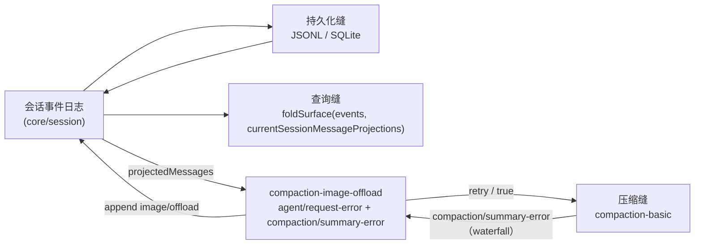

# 【第 06 篇】记忆的落地：session · session-query · compaction · attachment · spill · storage

> **版本**：dsh-v0.1.6-alpha.1（`0a15e36e7f`），对比上版 dsh-v0.1.5-rc.2（`fb2c4b9e69`）
> 难度：🟡 进阶（建议先读本文件夹的第 02 篇）
> 包范围：`packages/session/`（21 包）、`packages/session-query/`（4）、`packages/compaction/`（5）、`packages/attachment/`（2）、`packages/spill/`（3）、`packages/storage/`（4）
> 上游文档：`docs/subsystems/persistence.md`、`session.md`、`session-query.md`、`compaction.md`、`attachment.md`、`spill.md`、`storage.md`

## 目录

- [引言](#引言)
- [概述](#概述)
- [核心概念](#核心概念)
- [包结构](#包结构)
- [关键类型](#关键类型)
- [数据流](#数据流)
- [测试覆盖](#测试覆盖)
- [与上游/下游的关系](#与上下游的关系)
- [本版本变更要点（rc.2 → 0.1.6-alpha.1）](#本版本变更要点rc2--016-alpha1)
- [附录：本版记忆侧提交索引](#附录本版记忆侧提交索引)

---

## 引言

本文覆盖六个包组，它们共用同一个真相源——`packages/core/session` 的追加式事件日志：

| 包组 | 与日志的关系 | 本版文件变更数 |
|---|---|---|
| `packages/session` | 落盘、标题、遥测、投影缓存、格式迁移 | **103** |
| `packages/session-query` | 只读检索、导出、SQLite 全文索引 | 26（含 README/i18n） |
| `packages/compaction` | 摘要替换、工具结果修剪、**图像卸载（本版新增）** | 44（含新包） |
| `packages/attachment` | 附件规范化与请求图片投影 | 21 |
| `packages/spill` | 溢出产物落盘 | 15 |
| `packages/storage` | 非会话存储（kv 域） | 13（**无 src 改动**） |

本版坐标（来源 `RECON.md`）：

| 项 | 值 |
|---|---|
| 本版 tag | `dsh-v0.1.6-alpha.1` = `0a15e36e7f` |
| 上版 tag | `dsh-v0.1.5-rc.2` = `fb2c4b9e69` |
| `SESSION_FORMAT_VERSION` | **3（未变）** |
| `docs/session-format-status.md` 记录 | `latestReleasedVersion: 3`，`evidenceTag: dsh-v0.1.5-alpha.1` |
| 文档侧新增规模 | `docs/persistence-changes/**` 等路径共 **144 files changed, +619671 / -68** |

**一句话总结本版记忆侧**：日志的**格式**没变，但日志的**治理方式**与**内容变更方式**双双换代——引入了 in-tree 的持久化类型历史体系与校验器，并把"改变既有消息内容"的能力从 Session 内核移交给事件归属插件（图像卸载是第一个用户）。

---

## 概述

四个子系统需求在 rc.2 已成立，本版没有推翻它们：

- **R1 持久可恢复**：日志经持久化缝落盘（JSONL / SQLite 可互换后端），崩溃后恢复并保持事件平衡；
- **R2 持久化不引入平行事件类型**：持久化只搬运既有 `SessionEvent`；
- **R3 检索有界**：`session-query` 全部只读，事件表面分 `current` / `shadowed` / `log-only` 三态；
- **R4 上下文可压缩**：compaction 是可选能力缝，把旧范围摘要化并以 `user/message` + `surfaceOp: replace` 替换。

本版在此基础上追加了两条：

- **R5 持久化类型变更必须被确认**：任何结构性类型变化都要留一份可校验的记录（本版新增）；
- **R6 内容变更不改变节点身份**：插件可以基于自有事件改变既有消息的**内容**，但节点成员与消息 id 保持不变。

---

## 核心概念

| 术语（首次出现附英文） | 含义 | 本版受影响 |
|---|---|---|
| 事件日志（event log） | 追加式、无损 JSON、seq 连续的唯一真相源 | 未变 |
| 表面（surface） | 由 `surfaceOp` 折叠出的模型可见消息节点序列 | 新增 `contentGeneration` |
| 持久化缝（persistence seam） | Service Definition / Provider / Consumer 的能力三角 | 未变 |
| 消息投影（message projection） | 插件提供的纯解释器，改写既有消息内容但不替换节点 | **本版新增** |
| 图像卸载（image offload） | 永久省略被选中的输入图像出现位置，后续请求以占位文本代替 | **本版新增** |
| 持久化类型变更记录（persistence-change record） | 绑定"兼容性决策"与"精确生成 schema"的树内记录 | **本版新增** |
| 根（root） | 持久化类型比较的单位：逻辑 Session 头、物理 JSONL 头行、事件 envelope、每个仓库声明的事件 | **本版新增** |

---

## 包结构

**`packages/session/`（21 个包，`git ls-tree` 核实）**：`session-format`、`session-format-catalog`、`session-format-v0-to-v1`、`session-format-v1-to-v2`、`session-format-v2-to-v3`、`session-persistence`、`session-persistence-jsonl`、`session-projection`、`session-projection-cache`、`session-checkpoint-policy`、`session-log-deepseek`、`session-title`、`session-title-llm`、`session-title-first-prompt-llm`、`session-title-all-prompts-llm`、`session-turn-outline`、`session-stats`、`session-telemetry`、`session-telemetry-otel`。

**`packages/compaction/`（5 个）**：`compaction`、`compaction-basic`、`command-compact`、`compaction-tool-result-pruner`、**`compaction-image-offload`（本版新增）**。

**`packages/session-query/`（4 个）**：`session-query`、`session-query-sqlite`、`session-log-export`、`tool-session-query`。

**`packages/attachment/`（2 个）**：`attachment`、`attachment-local`。
**`packages/spill/`（3 个）**：`spill`、`spill-local`、`spill-policy`。
**`packages/storage/`（4 个）**：`storage`、`storage-domain`、`storage-json`、`storage-sqlite`。

---

## 关键类型

**片段 A：图像卸载事件（本版新增，事件声明在插件里而非 core）**

```ts
// packages/compaction/compaction-image-offload/src/projection.ts
export interface ImageOffloadTarget {
  /** Current message-producing event containing these occurrences. */
  seq: SessionSeq
  /** Zero-based depth-first image indexes within the immutable message. */
  imageIndexes: number[]
}

declare module '@deepseek-ai/dsh-session/types' {
  interface SessionEventMap {
    /** @messageProjection */
    'image/offload': { targets: ImageOffloadTarget[] }
  }
}
```

翻译：每个 target 指向一个**当前**的 `user/message` 或 `tool/result` 节点；`imageIndexes` 是深度优先的零基下标，**包含嵌套 tool result 与已被省略的图像**（因此省略是幂等可叠加的）。同一附件 id 多次出现算不同 occurrence，所以不能用 attachment id 或单一水位线（watermark）来标识。

**片段 B：请求图片的目标尺寸（替代像素预算）**

```ts
// packages/attachment/attachment/src/types.ts
export interface ImageRequestTarget {
  width: number
  height: number
  maxBytes: number
}
```

对比 rc.2 的 `ImageRequestPolicy { maxPixels, maxBytes }`：本版不再给"总像素上限"，而是给**精确目标宽高**，加上一个纯几何函数：

```ts
// packages/attachment/attachment/src/request-projection.ts
export function longEdgeDimensions(width: number, height: number, longEdge: number): ProjectedDimensions
```

翻译：按**长边**计算目标尺寸，短边按比例四舍五入。这样编码器只按长边 resize（`pipeline()` 用 `byWidth ? { width } : { height }`），短边的实际取值与路由预测一致。

**片段 C：持久化类型变更记录的机器声明（YAML frontmatter 之外的一段）**

```yaml
# docs/persistence-changes/2026-09-14-image-offload.md
schemaVersion: 1
id: 2026-09-14-image-offload
baseline: false
changes:
  - root: "event:image/offload"
    previous: null
    after: "b222069eea2d768065161c1147b1f2c78c1b54328c84b3586ae5c8f91b8ed35e"
    decision: same-version
```

翻译：每个受影响 root 记录**前驱记录名、after digest、兼容性决策**。`previous: null` 表示新 root（此前不存在）。中英两文件必须携带**完全相同**的机器声明，校验器只解析一次英文那份。

---

## 数据流



**五步读懂本版数据流：**

1. 日志仍是唯一真相源；持久化只搬运。
2. `session-query` 的 `documents.ts` / `tracing.ts` 折叠时**显式传入** `currentSessionMessageProjections`（`packages/session-format-catalog/src/message-projections.ts`），因此离线检索与浏览器侧看到的是同一套投影结果。
3. 请求失败时，`agent/request-error` waterfall 上若 failure 带 `IMAGE_OFFLOAD_REQUIRED` 与 `offloadImages`，插件追加一条 `image/offload` 并返回 `{ kind: 'retry' }`。
4. 摘要请求**绕开** agent error waterfall，改走与选择相邻的同步 `compaction/summary-error`；后端在重试前重新派生输入与定价。
5. `attachment-local` 的请求图片现在写在**共享缓存根**（`dshCachePath({ dshHome }, 'attachments')`）而非附件持久化根之下。

---

## 测试覆盖

| 文件 | 类型 | 行数变化 | 覆盖对象 |
|---|---|---|---|
| `packages/compaction/compaction-image-offload/tests/image-offload.spec.ts` | **新增** | 409 | 连续失败、当前表面顺序、恢复耗尽、新请求头、disposal |
| `packages/compaction/compaction-image-offload/tests/projection.spec.ts` | **新增** | 142 | 嵌套/重复 occurrence、原子拒绝、缓存失效、纯折叠、restore、fork |
| `packages/session/session-format-catalog/tests/catalog.spec.ts` | 修改 | 16 | 每个必需类型都有 detached 解释器；拒绝非法图像引用 |
| `packages/session/session-log-deepseek/tests/config.spec.ts` | **新增** | 31 | 默认开启与显式覆盖（含测试环境标记） |
| `packages/session/session-projection-cache/tests/cache.spec.ts` | 修改 | 99 | 强制检查点与 `domain/changed` 时序（新增 `whenWritten` 助手） |
| `packages/attachment/attachment-local/tests/request-image.spec.ts` | 修改 | 127 | 长边目标尺寸、共享缓存根 |
| `packages/compaction/compaction-basic/tests/manual-compaction.spec.ts` | 修改 | 24 | 手动压缩路径 |
| `packages/compaction/compaction-tool-result-pruner/tests/tool-result-pruner.spec.ts` | 修改 | 20 | 修剪器消费投影后历史 |
| `apps/web/tests/session-unarchive.e2e.ts` | **新增** | 167 | 取消归档的端到端行为 |

> 说明：行数来自 `git diff --stat`，不是断言数量。

---

## 与上游/下游的关系

- **上游**：`packages/core/session` 提供 `SessionEventMap`、`foldSurface`、`Session.create/fromRestore` 的 `projections` 参数；`packages/core/tools` 的 `tool/result` 类型被本版扩展了 `error.reason`。
- **下游**：`packages/api/session-controller` 消费 fork 边界语义（本版有 fork 修复）；`packages/workspace` 提供归档集合与取消归档动词；`packages/client` 提供取消归档设置页。
- **跨组协作范例**：`packages/session-query/session-query/tsconfig.json` 新增了对 `session-format-catalog` 的项目引用（+3 行），因为检索侧现在需要本版新增的 `currentSessionMessageProjections` 导出。

---

## 本版本变更要点（rc.2 → 0.1.6-alpha.1）

### 变更 1：持久化类型历史体系（`docs/persistence-changes/**`）——本版最大新增

这是本版记忆侧体量最大的变化，也是唯一一个**纯治理不碰运行时**的变化。

**问题**（Agent Note `.agents/notes/implemented/process/2026-09-11-persistence-type-history.md` 的 `## Problem`）：

> A persisted event can retain the same payload type expression while a referenced type changes. Reviewing declaration text alone does not expose every nested structural change. A digest detects a difference but cannot explain whether it adds optional data or changes an existing property.

翻译：被引用的类型变了，但事件 payload 的**书写表达式**可能一字未改——只读声明文本看不出嵌套结构变化；digest 只能报"有差异"，无法说明是"新增可选数据"还是"改了既有属性"。

**方案**：一个归一化类型模型同时供给三样东西——可读的持久化目录、完整 schema 清单、按 root 的**传递性 digest**。

**新增文件（规模可核实）**：

| 路径 | 行数 | 作用 |
|---|---|---|
| `docs/persistence-changes/README.md` | 74 | 记录体系总说明、兼容性规则表、历史与限制 |
| `docs/persistence-changes/2026-09-11-initial.md` | 280 | **基线记录**（`baseline: true`，覆盖全部 root） |
| `docs/persistence-changes/2026-09-12-auto-review-error-metadata.md` | 52 | 2 个 root 的可选字段追加 |
| `docs/persistence-changes/2026-09-14-image-offload.md` | 96 | 13 个 root（含新增的 `event:image/offload`） |
| `docs/persistence-changes/historical-formats/v{0,1,2}.md` | 5105 / 5107 / 5362 | 低于写者常量的每个整数格式的完整清单 |
| `docs/persistence-changes/releases/**` | 每 tag 一份 + `manifest.json`（162） | 追溯性发布比较（独立 `persistence-release` 类型） |
| `docs/persistence-schema.json` | 61331 | 归一化类型清单 |
| `docs/cookbook/reviewing-persistence-type-changes.md` | 108 | 作者/评审的本地流程 |

**兼容性分类规则**（`docs/persistence-changes/README.md` 的表格，逐行可核实）：

| 检测到的变化 | 最低决策 |
|---|---|
| 新增可选事件体属性（含完整子树） | `same-version` |
| 把必需事件体属性变为可选 | `same-version` |
| 新增普通事件类型 | `same-version` |
| 把可选属性变必需 / 新增必需属性 / 改既有类型 / 删除或重命名属性或事件 | `version-bump` |
| 改 Session 头或事件 envelope | `version-bump` |

**规则的适用范围**：README 写明 "The rules apply to the complete change, so an allowed change cannot hide a simultaneous breaking change."（规则作用于**整次变更**，被允许的改动不能藏匿同时发生的破坏性改动）。

**三条关键限制（作者的诚实声明）**：

1. **只用树内文件**："Verification rejects ambiguous history and requires current source to match the terminal recorded state **without consulting Git history or remote services**."；
2. **不证明历史未被改写**："The checks prove current-tree consistency, not that accepted history was never rewritten or that an explanation is semantically correct."；
3. **不透明值不可测**："Hidden structures inside `unknown` and similar opaque values remain undetectable."。

**本版实际使用情况**：三条记录，**全部为 `same-version`**。这直接解释了为什么 `SESSION_FORMAT_VERSION` 仍是 3——`2026-09-14-image-offload.md` 的 Compatibility 段原文："Event envelopes and structural Session format versions are unchanged."

**与既有版本机制的关系**：note 明确本机制"adds no runtime digest or Session-format field"，既有的 `2026-08-10-session-log-version-mechanism`（版本机制）与 `2026-08-31-released-session-format-migrations`（已发布代际迁移）保持各自独立的运行时保证。

**相关提交**：`feat(session): verify persistence type history`、`2b1dabec86 Refresh merged SDK recordings and persistence documentation`。

---

### 变更 2：图像卸载（image offload）——本版记忆侧的功能主线

**问题**（Agent Note `.agents/notes/implemented/architecture/2026-09-10-image-offload-events.md` 的 `## Problem`）：

> Recomputing the omitted prefix for each request lets a route switch, inline fallback, or compaction restore previously omitted images. The model-visible image set then depends on unlogged request preparation.

翻译：如果"省略哪些图片"是每次请求现算的，那么路由切换、内联回退或压缩都会把**已经省略过的图片放回来**；模型可见的图像集合就依赖于**未被记录**的请求准备过程——这违反"模型可见 ⟺ 已记录"。

**新包 `packages/compaction/compaction-image-offload`（11 个新增文件）**：

| 文件 | 行数 |
|---|---|
| `src/projection.ts` | 74（事件声明 + 纯投影 `imageOffloadProjection`） |
| `src/image-offload.ts` | 48（选择策略 `offloadOldestImages`） |
| `src/project-message.ts` | 39（`offloadMessageImages`） |
| `src/index.ts` | 41（插件入口，`inject = ['agents', 'sessions']`） |
| `tests/image-offload.spec.ts` | 409 |
| `tests/projection.spec.ts` | 142 |
| `README.md` / `README.zh.md` | 各 108 |

**恢复策略（`src/index.ts`）**：两个 waterfall 监听器。

```ts
ctx.on('agent/request-error', ({ agent, failure }, next) => {
  if (failure.code !== IMAGE_OFFLOAD_REQUIRED_CODE || failure.offloadImages === undefined) return next()
  if (!offloadOldestImages(agent.session, agent.session.surface.nodes, failure.offloadImages)) return next()
  return Promise.resolve<RequestErrorAction>({ kind: 'retry' })
})
```

源码注释直接写明这条边界的价值：

> A durable surface repair, not a provider retry: it spends no retry budget and logs no retry event.

**为什么摘要请求需要独立路径**（note 原文）："Summary requests bypass the agent error waterfall." 所以本版在 `packages/compaction/compaction/src/index.ts` **新增了一个 waterfall 事件**：

```ts
'compaction/summary-error'(
  payload: { session: Session; sourceEventSeqs: readonly SessionSeq[]; error: unknown; signal?: AbortSignal },
  next: () => boolean,
): boolean
```

对应 `packages/compaction/compaction-basic/src/region.ts` 的新重试循环：`RegionDependencies` 新增 `recover(...)` 依赖；`summarizeCompaction` 现在接收 `assertStable: StabilityCheck`，捕获摘要异常后先跑稳定性检查，再调 `recover`，成功后用 `prepareCompaction` **重新派生**输入。note 解释这个顺序的用意："Synchronous recovery keeps the stability check and decision adjacent."

**事件的四条不变式（note 与源码一致）**：

| 不变式 | 说明 |
|---|---|
| 无 `surfaceOp` | 既不新建消息，也不替换消息节点 |
| 节点与消息身份不变 | 重建产出的是不可变消息副本，原始事件、消息 id、来源与未受影响的块都不变 |
| reading required | `image/offload` 被加入 `KNOWN_SESSION_EVENT_TYPES`；不认识它的旧读者会**拒绝**该日志，而不是静默恢复被省略的图片 |
| 不消耗重试预算 | 不触发 `llm/retry` |

**代际语义**：note 写明 "`contentGeneration` advances for message replacements and image-offload events so cached history and request series are refreshed. `replaceGeneration` advances only for replacements"——这正是第 02 篇变更 3 里两个 generation 计数分家的原因。

**未覆盖的边界（note 的 `## Consequences`）**：卸载**不删除附件字节**；读取占位符的访问路径会**产生一个新的图像 occurrence**，它可以被独立保留。

**相关提交**：`c1b1cd2984 docs: propose a durable image offload watermark`（proposed 起点）、`345b5cdc6f feat(session, llm): durable image offload watermark`、`8c7b023d6c refactor(llm): move image offload planning into a plugin and trim the change surface`、`ab93bfd90c refactor(session): fold the image offload helpers into surface.ts and index.ts`、`523ae08a2d refactor(session, llm): cut the image offload surface to its callers`、`4779f054b6 refactor(compaction): own image offload as a compaction executor`、`6329c53a37 refactor(llm-retry, session): offload images by surface replacement instead of a watermark event`、`b5e7fca4a5 feat(compaction): record image offload decisions without message replacement`、`413ac14b16 refactor: move image offload projection into its plugin`、`debb4b9a9c fix(compaction): recover durable image offload in summary requests`、`73e10fb80c fix(compaction): preserve summary diagnostics on cancellation`、`08dba8f5f6 test(compaction): record summary image recovery through ACP`、`5e277c2111 test(session): close image offload coverage gaps`。

**一条值得记下的演化史**：从提交标题可以看出，实现经历过 **watermark 事件 → surface replacement → 专用 `image/offload` 事件** 三次改型，最终停在"专用事件 + 纯投影"。note 的 `## Alternatives considered` 保留了为什么否掉前两种：复用 `compaction/prune` 会"couples omission to node replacement and shadow-price accounting"（把省略耦合到节点替换与影子定价）。

---

### 变更 3：请求图片移入共享缓存，策略改为目标尺寸

| 项 | rc.2 | 0.1.6-alpha.1 | 位置 |
|---|---|---|---|
| 路由给的参数 | `ImageRequestPolicy { maxPixels, maxBytes }` | `ImageRequestTarget { width, height, maxBytes }` | `packages/attachment/attachment/src/types.ts` |
| 几何助手 | `requestImageDimensions(w, h, maxPixels)` | 新增 `longEdgeDimensions(w, h, longEdge)` | `.../request-projection.ts` |
| 变换版本常量 | `'request-image-v5'` | `'request-image-v6'` | `attachment-local/src/request-image.ts` |
| 缓存根 | `join(dshHome, 'attachments', 'v1')` | 新增 `cacheRoot = dshCachePath({ dshHome }, 'attachments')` | `attachment-local/src/index.ts` |
| 变体 id 描述符 | `routePixelBudget` | `targetWidth` / `targetHeight` | `request-image.ts` |

**关键点**：变异体标识（variant id）的**完整输入集变了**，所以 `REQUEST_IMAGE_TRANSFORM_VERSION` 必须同步升级到 `v6`——否则旧的 v5 缓存会被误当作新目标的产物复用。

**求解器留在 `llm-deepseek`**：提交 `ba30b73f7b` 的标题为「refactor(attachment): 求解器留在 llm-deepseek，存储层只接收目标尺寸」，配套 `06c491508f fix(llm-deepseek): 请求图片按 V4.1 token 网格投影` 与 `e17a736cc3 docs: 同步请求图片投影文档与 Agent Note`。也就是说：**路由（模型侧）决定目标尺寸，存储层只负责按目标编码**——这是"显式 > 隐式"在包边界上的落地。

**相关提交**：`d911a7b422 feat(attachment-local): move request images into shared cache`、`7f005e2c0f test(attachment-local): isolate fallback cache home`、`27d52a4edb Update image tests for split adapters and durable offload failures`、`f0f1988a7a Clarify token counts after aspect-preserving image projection`。

---

### 变更 4：会话日志上传默认打开

```ts
// packages/session/session-log-deepseek/src/index.ts
export const Config: z<Config> = z.object({
  enabled: z.boolean().default(true),   // rc.2 为 default(false)
})
```

**这是本版最有产品影响的一条默认值变更。** 动机（note `2026-09-14-session-log-upload-default.md`）：

> Ordinary DeepSeek requests do not contain the complete canonical Session trajectory. Requiring each installation to enable log contribution prevents the default product configuration from supplying that trajectory.

**边界与代价（note 的 `## Consequences`，原文照录要点）**：

- 符合条件的请求会把**完整的、未被确认的**规范日志后缀发给解析出的 DeepSeek 端点或配置的网关，内容包括消息文本、工具参数与结果、工作区路径、反馈；
- **不新增任何 prompt token 或模型可见内容**；
- 请求体会显著变大，provider 拒绝仍然会使请求失败；
- **OTel 保持独立**——关闭 OTel 不会关闭这个贡献；
- 插件**不再检查** test-runner 或 snapshot 环境变量（这正是 `31ec6bc7e3 fix(session): keep upload defaults independent of test runners` 与 `6ce915d3fc` 要修的问题）。

**测试语料的分工**：headless / ACP 语料的基础补丁与 Web 脚手架**显式关闭**上传，后续场景补丁可以打开；SDK 文本轮次录制**省略该设置**，因此它演练的是出厂默认值，并包含 durable acceptance 事件。

**相关提交**：`2389b65246 feat(session): default session-log upload on outside recorded-session lanes`、`6ce915d3fc fix(session): keep the recorded-session marker check branch-free`、`b35d728d42 test(session): cover environment-aware upload defaults`、`31ec6bc7e3 fix(session): keep upload defaults independent of test runners`。

---

### 变更 5：从设置页恢复已归档会话

提交 `5f773a0ded feat(workspace): restore archived sessions from a settings page`（配套 `ae34320a5b test(web): expect the unarchive verb and the archived-sessions nav row`）。

**问题**：归档把会话从所有 Workspace 分组面移除，但**没有任何路径把它带回来**——归档集合是单向显示过滤器。

**方案三层**：

| 层 | 落点 | 语义 |
|---|---|---|
| 注册表 | `WorkspaceRegistry.unarchiveSession(sessionId)` | 在**同一条操作链**上做幂等的 check-then-write，单次 durable `setState` |
| RPC | `WorkspaceController` 的 `@Remote('unarchiveSession')` | 返回**完整**的 `WorkspaceArchiveValue`，与 archive 一致 |
| UI | 新包 `@deepseek-ai/dsh-client-ui-settings-unarchive-sessions` | 一个本地化 `settings.section`，id `archived-sessions`，导航顺序 25 |

**一处刻意的不对称**：取消归档**不做会话存在性探测**。note 给出的理由："Archive verifies that the Session is live or persisted because it adds a reference that must resolve; unarchive only removes an id, so it cannot introduce an unknown referent."（归档要验证引用可解析；取消归档只是移除 id，不可能引入未知引用）。这条不对称被记在 `packages/workspace/workspace/README.md` 的 known limitations 下。

**对本组的意义**：note 明确"No frame type, persisted field, or `SESSION_FORMAT_VERSION` change accompanies the verb."——归还是**复用**既有 `{ type: 'archived', archivedSessionIds }` follow increment（完整集合替换语义）实现的。

---

### 变更 6：fork 停在选中的 turn 结束处（bug 修复）

Agent Note `.agents/notes/implemented/bug-fix/2026-09-11-session-controller-fork-turn-cut.md`。

**问题**：用户输入在它的 `turn/start` 之前就进入 durable inbox。把一个已完成 turn 的 fork 延伸到随后的 between-turn 事件，会**复制下一个输入的插入却没有复制它后来的移除**；子会话继续执行时就会执行一个来自选中 turn 之外的输入。

**决策**：Session Controller 复制**到选中的 `turn/end` 为止的连续前缀（含该事件）**。显式 anchor 选择**锚点或其后的第一个关闭事件**；省略或超出末尾的 anchor 选择**最后一个关闭事件**。该关闭事件之后的任何事件都不属于种子——包括排队输入、标题与模型设置。

**边界划分**：更低层的 `SessionStore.fork()` 保留它自己的"显式 stable event"语义；在 controller 里选中一个已完成 turn **不会**请求更晚的 stable event。

**相关提交**：`896a6c3e47 fix(session): stop forks at the selected turn end`、`0f8552df7f fix(session): retain fork tail until the first inbox change`、`973bea8204 fix(session): use the selected turn end as the fork cut`、`88c3d05fbf fix(session): align browser fixture forks and legal log regressions`；测试侧 `d58c5455dd`、`9b091919e2`、`e179c4ae14`。

---

### 变更 7：detached replay 的投影组装与检索侧接线

本版把"离线读取也必须用同一套投影"变成了**编译期可见**的接线：

| 文件 | 变化 |
|---|---|
| `packages/session/session-format-catalog/src/message-projections.ts` | **新增**（7 行）：`currentSessionMessageProjections = [imageOffloadProjection]` |
| `packages/session/session-format-catalog/src/current.ts` | `validateInstalledCurrentSessionArtifact` 向 `Session.create(...)` 传 `currentSessionMessageProjections` |
| `packages/session/session-format-catalog/package.json` | +12 行（新增对 `compaction-image-offload` 依赖） |
| `packages/session-query/session-query/src/documents.ts` | `foldSurface(events)` → `foldSurface(events, currentSessionMessageProjections)` |
| `packages/session-query/session-query/src/tracing.ts` | 同上 |
| `packages/session-query/session-query/src/index.ts` | `Session.create(...)` 传投影定义 |
| `packages/session-query/session-query/tsconfig.json` | +3（新增项目引用） |

**为什么必须接线**：缺失解释器会**抛错**（第 02 篇变更 3）。所以在检索侧忘记传投影不是"少一个优化"，而是**读取直接失败**。Agent Note 对此的表述："Missing definitions reject append, seeded creation, restore, and pure folding."；且 note 说明静态组装 "does not mount recovery listeners"——离线读者拿到的是**定义**，不是恢复监听器。

---

### 变更 8：同步读取废弃在记忆侧的落点

第 02 篇覆盖了 `@deprecated` 的机制，本节只列**本组内的实际调用点**（这些是升级时需要关注的白名单）：

| 包 | 文件 | 被豁免的读取 |
|---|---|---|
| `session-log-deepseek` | `src/index.ts`（3 处）、`src/invariant.ts` | `eventAt`、`snapshotEvents` |
| `compaction-basic` | `src/region.ts`（3 处，含与 `no-non-null-assertion` 合并的指令） | `eventAt` |
| `session-projection` | `src/index.ts`（3 处） | `snapshotEvents`、`eventAt` |
| `session-title` | `src/index.ts`（3 处）、`src/invariant.ts`（2 处） | `snapshotEvents`、`eventAt` |
| `session-query` | `src/corpus.ts`（2 处）、`src/observation.ts` | `snapshotEvents` |
| `session-query-sqlite` | `src/index.ts` | `snapshotEvents` |
| `core/session` | `src/index.ts`（`ownEvents` 委托 + `_forkSeed` 3 处） | 自身方法 |

**另有一条外围改名**：`packages/session/session-title/src/types.ts` 把 `SessionTitleModelProvenance` → `SessionTitleModelIdentity`（`session-title/src/index.ts` 同步跟随）。它属于本版"清理 ambiguous 词汇"的主题——提交 `71d50b4a84 refactor: ban ambiguous origin label` 与仓库规则"Ban `prove` + `nance`"同源。

---

### 变更 9：本版**没有**发生的事

| 项 | 结论 | 证据 |
|---|---|---|
| `SESSION_FORMAT_VERSION` | 仍为 3 | `packages/core/session/src/types.ts:88` |
| `packages/storage/*` 的 `src` | **零改动**（仅版本号与 README/i18n） | `git diff --stat ... -- packages/storage/*/src` 无输出 |
| `packages/spill` 功能 | 仅注释措辞（`SpillSource` 的 "Descriptive provenance only" → "Descriptive source description only"） | `packages/spill/spill/src/types.ts` ±2 |
| Session V0→V1→V2→V3 迁移链 | 未新增版本 | `packages/session/session-format-v2-to-v3/` 的改动只有版本号、README 与测试微调 |
| 会话事件 envelope | 未变 | `2026-09-14-image-offload.md` Compatibility 段 |

---

### 变更 10：proposed 方向（**未落地，仅为下一步候选**）

以下五份 Agent Note 位于 `.agents/notes/proposed/architecture/`，均带中文对照（`.zh.md`），**在 `dsh-v0.1.6-alpha.1` 中没有任何对应实现**：

| 文件 | 主题 |
|---|---|
| `2026-09-06-logical-session-storage-rebuild.md` | 逻辑会话存储重建 |
| `2026-09-10-session-capability-protocols.md` | 会话能力协议 |
| `2026-09-10-session-data-compatibility.md` | 会话数据兼容 |
| `2026-09-10-session-developer-transition.md` | 会话开发者迁移 |
| `2026-09-10-session-refactor-faq.md` | 会话重构 FAQ |

把它们与**已落地**的变更 8 放在一起读，可以看出方向：同步历史读取的废弃是这些 proposed 重构的**前置收敛**——先把新调用堵住，再谈存储层重建。判断某个 proposed 方案是否已经落地时，应检查实现包是否存在，而不是只看 note 是否出现在 diff 中（本版所有新增 note 都会出现在 diff 里，无论 implemented 还是 proposed）。

---

## 附录：本版记忆侧提交索引

| 哈希 | 标题 |
|---|---|
| `2389b65246` | feat(session): default session-log upload on outside recorded-session lanes |
| `6ce915d3fc` | fix(session): keep the recorded-session marker check branch-free |
| `b35d728d42` | test(session): cover environment-aware upload defaults |
| `31ec6bc7e3` | fix(session): keep upload defaults independent of test runners |
| `8e0a5acd1` | test(session): await every successful cache replacement |
| `3ba25cd4cb` | test(session): exclude interval fallback from mandatory checkpoint |
| `a90d8df582` | test(session): await durable turn-end cache checkpoints |
| `896a6c3e47` | fix(session): stop forks at the selected turn end |
| `0f8552df7f` | fix(session): retain fork tail until the first inbox change |
| `973bea8204` | fix(session): use the selected turn end as the fork cut |
| `88c3d05fbf` | fix(session): align browser fixture forks and legal log regressions |
| `345b5cdc6f` | feat(session, llm): durable image offload watermark |
| `8c7b023d6c` | refactor(llm): move image offload planning into a plugin and trim the change surface |
| `ab93bfd90c` | refactor(session): fold the image offload helpers into surface.ts and index.ts |
| `523ae08a2d` | refactor(session, llm): cut the image offload surface to its callers |
| `4779f054b6` | refactor(compaction): own image offload as a compaction executor |
| `6329c53a37` | refactor(llm-retry, session): offload images by surface replacement instead of a watermark event |
| `b5e7fca4a5` | feat(compaction): record image offload decisions without message replacement |
| `413ac14b16` | refactor: move image offload projection into its plugin |
| `debb4b9a9c` | fix(compaction): recover durable image offload in summary requests |
| `73e10fb80c` | fix(compaction): preserve summary diagnostics on cancellation |
| `08dba8f5f6` | test(compaction): record summary image recovery through ACP |
| `d911a7b422` | feat(attachment-local): move request images into shared cache |
| `7f005e2c0f` | test(attachment-local): isolate fallback cache home |
| `ba30b73f7b` | refactor(attachment): 求解器留在 llm-deepseek，存储层只接收目标尺寸 |
| `06c491508f` | fix(llm-deepseek): 请求图片按 V4.1 token 网格投影 |
| `f0f1988a7a` | Clarify token counts after aspect-preserving image projection |
| `5f773a0ded` | feat(workspace): restore archived sessions from a settings page |
| `ae34320a5b` | test(web): expect the unarchive verb and the archived-sessions nav row |
| `2b1dabec86` | Refresh merged SDK recordings and persistence documentation |
| `b0641b83fc` | feat(llm): default DeepSeek to Messages with Files parity |
| `accafa5fb2` | refactor(llm): inherit Messages defaults and verify live parity |
| `ea53423b60` | release(dsh): 0.1.6-alpha.1 |

---

**下一篇预告**：【第 07 篇】多智能体与后台任务（`subagent` / `workflow` / `jobs` / `agent-team`）——本版 `workflow` 已迁入沙箱化 PTC 运行时。

*文档生成时间: 2026-09-17*
*数据源: dsh-v0.1.6-alpha.1 (0a15e36e7f) vs dsh-v0.1.5-rc.2 (fb2c4b9e69)*
