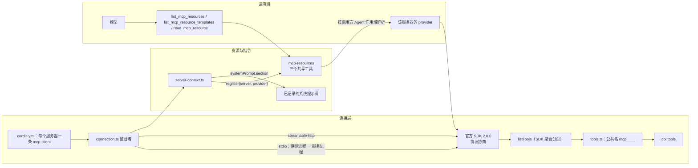
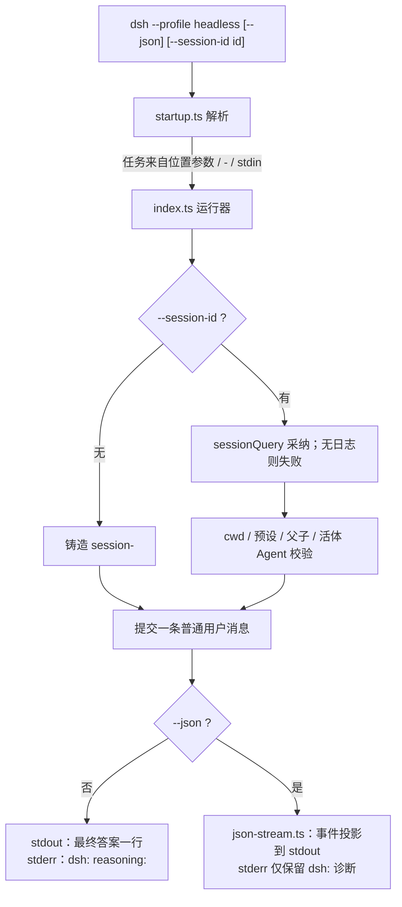

# 【第 11 篇】协议与 SDK（v0.1.6-alpha.1）

> **版本**：v0.1.6-alpha.1（`0a15e36e7f`）· 对比基线 v0.1.5-rc.2（`fb2c4b9e69`）
> **难度**：🟢 入门（本篇偏接口视角）
> **对应目录**：`deepseek-harness/packages/mcp/`、`packages/sdk/`、`packages/acp/`、`packages/hooks/`、`packages/bundle/headless/`、`python/`
> **子系统文档**：[`docs/subsystems/mcp.md`](../deepseek-harness/docs/subsystems/mcp.md)（**本版新增**）、[`docs/subsystems/tools.md`](../deepseek-harness/docs/subsystems/tools.md)、[`docs/subsystems/system-prompt.md`](../deepseek-harness/docs/subsystems/system-prompt.md)
> **规约（口径）**：本文所有结论指向具体文件、符号或 commit 哈希；无证据者标注「未核实」。

## 目录

- [1 概述](#1-概述)
- [2 核心概念](#2-核心概念)
- [3 包结构](#3-包结构)
- [4 关键类型](#4-关键类型)
- [5 数据流](#5-数据流)
- [6 测试覆盖](#6-测试覆盖)
- [7 与上游/下游的关系](#7-与上下游的关系)
- [8 本版本变更要点（rc.2 → 0.1.6-alpha.1）](#8-本版本变更要点rc2--016-alpha1)
- [9 延伸阅读](#9-延伸阅读)

---

## 1 概述

本篇覆盖"把产品接出去"的全部通道：**进程外驱动**（`packages/sdk/`、`python/`）、**协议互操作**（`packages/acp/`、`packages/mcp/`）、**外部钩子**（`packages/hooks/`）、以及**无 GUI 的一次性运行面**（`packages/bundle/headless/`）。

本版改动量：

| 目录 | 变更文件数 | 性质 |
|---|---|---|
| `packages/mcp` | 38 | 三项能力升级 + 一个新包 |
| `packages/mcp/mcp-client` | 26 | SDK 换代、协商生命周期、资源与指令 |
| `packages/mcp/mcp-resources` | 9 | **新包** |
| `packages/hooks` | 19 | 迁移到 `agent/created`（两个桥各 12 行源码） |
| `packages/sdk` | 17 | 仅 `server.ts` 一行源码变更，其余为测试与 README |
| `packages/bundle/headless` | 15 | 机器可读运行面（新增 2 个源文件） |
| `python` | 13 | 运行时引导与测试，**SDK 源码零变更** |
| `packages/acp` | 6 | **源码零变更**（仅 README 与版本号） |

一句话概括本版主题：**MCP 从"仅桥接 tools"升级为"官方 SDK 协商 + 工具/资源/指令三件套"；headless 从"人读终端"升级为"可被监督进程驱动的机器可读运行面"。**

## 2 核心概念

| 概念 | 英文 | 本版落点 | 说明 |
|---|---|---|---|
| 协议协商 | protocol negotiation | `@modelcontextprotocol/client` 2.0.0 | SDK 拥有现代发现、legacy 初始化、传输协商、列表变更订阅、分页、请求头、取消与输出校验 |
| 作用域 | scope | `dsh-scope` 的 `ScopedLayers` | 资源提供者按调用方 Agent 作用域解析 |
| 服务端指令 | server instructions | `server-context.ts` | 作为一条带归属的 system-prompt 字面量小节发布 |
| 存储期探针 | probe process | `connection.ts` | stdio 协商先起一个一次性探测进程并等其退出，再起服务进程 |
| 可见性来源 | visibility | 已配置客户端 | 连接健康**不决定**资源工具可见性；可见的已配置客户端即可 |
| 机器可读运行面 | machine-readable run surface | `packages/bundle/headless/src/json-stream.ts` | `--json` 输出按行分隔的 JSON 事件投影 |
| 仅采纳 | adopt-only | `--session-id` | 只采纳已持久化的 Session；日志不存在即失败 |
| 提交点投影 | commit-point projection | `json-stream.ts` | 文本/思考只从已提交的 `assistant/message` 投影，绝不取实时增量 |
| 桥 | bridge | `hooks-claude-code`、`hooks-codex` | 把外部 shell-hook 协议翻译到 harness 唯一的类型化拦截点 |

## 3 包结构

### 3.1 `packages/mcp/`（本版从 1 个包变为 2 个）

| 包 | 角色 | 本版变更文件数 |
|---|---|---|
| `mcp-client/` | 每个服务器一个连接插件，把发现的工具登记到 `ctx.tools`，并登记资源提供者与指令小节 | 26 |
| `mcp-resources/` | **新增**：跨服务器共享的三个资源工具 + 作用域内提供者选择 | 9 |

`mcp-client/src/` 文件与新增项：

| 文件 | 角色 |
|---|---|
| `src/index.ts` | 插件入口：`Config` schema、`serverName` 预留、激活等待 |
| `src/connection.ts` | 连接监督者：客户端世代、重连策略、尝试预算、处置（本版改动 150 行） |
| `src/server-context.ts` | **新增（40 行）**：资源提供者注册与字面量服务端指令 |
| `src/tools.ts` | 工具桥：发现、命名、注册换代替换、执行、图片投影（本版改动 206 行） |
| `src/transport.ts` | 传输工厂：stdio 派生与环境清理、Streamable HTTP |

`mcp-resources/src/`：

| 文件 | 角色 |
|---|---|
| `src/index.ts`（129 行） | 服务 `McpResourceRuntime`：作用域图层、`register()`、服务器名提示小节 |
| `src/tools.ts`（64 行） | 三个共享工具与参数 schema |
| `src/render.ts`（24 行） | 带服务器归属的文本投影，替换 `blob` 载荷 |

### 3.2 `packages/sdk/`（三包，协议源码本版未变）

| 包 | 本版源码变更 |
|---|---|
| `protocol/` | **无**（仅 README 与 package.json） |
| `client/` | **无**（仅 README、package.json 与测试） |
| `server/` | `src/server.ts` 一行：DeepSeek 回退挂载由 `ctx.plugin(LlmDeepSeek, {})` 改为 `ctx.plugin(LlmDeepSeek)` |

### 3.3 `packages/acp/`、`packages/hooks/`

- `acp/`：**源码零变更**（`git diff --name-only … -- packages/acp/acp/src` 为空）。本版 ACP 的行为变化全部来自上游（`agent/session-start` → `agent/created`），ACP 自身的编解码、内容准入、模型控制未动。
- `hooks/`：`hook-protocol/src/invariant.ts` 加一行弃用豁免注释；`hooks-claude-code/src/index.ts` 与 `hooks-codex/src/index.ts` 各改 12 行（详见 8.7）。

### 3.4 `packages/bundle/headless/`（本版新增 2 个源文件）

| 文件 | 角色 |
|---|---|
| `src/index.ts` | `headless-runner` 插件：运行流程、会话解析、输出契约、退出码映射 |
| `src/startup.ts` | `headless-startup` 提供者：任务位置参数、`--session-id`、`--json`、`--help` |
| `src/json-stream.ts` | **新增（332 行）**：`--json` 投影（事件词汇、提交点发射、字符串边界） |
| `src/runner-internals.ts` | **新增（21 行）**：进程钩子，从包入口移出 |
| `src/startup-internals.ts` | **新增（14 行）**：启动进程缝，从公开入口移出 |
| `cordis.patch.yml` | 转发两个新设置 |

## 4 关键类型

### 4.1 MCP

```ts
/** One supported resource operation, with server-owned cursors and URIs. */
export type McpResourceRequest =
  | { method: 'resources/list' | 'resources/templates/list'; cursor?: string }
  | { method: 'resources/read'; uri: string }

/** One configured server's resource access, owned by its MCP connection plugin. */
export interface McpResourceProvider {
  request(request: McpResourceRequest, exec: ToolExecution): Promise<JsonValue>
}
```

来源：[`packages/mcp/mcp-resources/src/index.ts`](../deepseek-harness/packages/mcp/mcp-resources/src/index.ts)，并经 `docs/subsystems/mcp.md` 的 `ts type-equiv` 区同步登记。

```ts
/** Connection-owned values used by the resource and prompt consumers. */
export interface ServerContext {
  resources: McpResourceProvider
  instructions(): string
}
```

来源：[`packages/mcp/mcp-client/src/server-context.ts`](../deepseek-harness/packages/mcp/mcp-client/src/server-context.ts)。`ConnectionHandle extends ServerContext`。

新增的服务端 API（生成式目录，见 `docs/subsystems/mcp.md`）：

```ts
register(server: string, provider: McpResourceProvider): () => void
```

新增配置字段（`packages/mcp/mcp-client/README.md`）：

| 字段 | 默认 | 语义 |
|---|---|---|
| `maxInstructionBytes` | `32,768` | 服务端指令（含归属文本）的最大 UTF-8 字节数；超限**拒绝连接** |
| `toolCallTimeoutMs` | `60,000` | 现在同时覆盖 `tools/call` 与资源请求 |

新增常量：`DEFAULT_MAX_INSTRUCTION_BYTES = 32_768`（`connection.ts`）。

### 4.2 Headless 事件词汇（`--json`）

| `type` | 字段 | 发射时机 |
|---|---|---|
| `session` | `sessionId`、`cwd` | 首行，任何模型输出之前 |
| `status` | `phase`（`turn_start` / `step_start` / `step_end` / `turn_end`）、`turn`、`step`、`usage`、`reason` | 每个边界一次 |
| `text` | `text` | 一个已提交的 assistant 文本块 |
| `thinking` | `text` | 一个已提交的思考块 |
| `tool_call` | `callId`、`tool`、`input` | 每次调用一次 |
| `tool_result` | `callId`、`status`、`result` | 每次追加结果一次 |
| `error` | `message` | 运行器在轮次之外抛出的失败 |
| `final` | `text` | 末行 |

来源：Agent Note [`headless-machine-readable-run-surface.md`](../deepseek-harness/.agents/notes/implemented/feature/2026-09-09-headless-machine-readable-run-surface.md) 与 `packages/bundle/headless/README.md`。

边界规则（官方明示）：每个字符串与对象键上限 **8 KiB**（被截断的事件带 `truncated: true`），单行序列化事件（含换行）上限 **32 KiB**，嵌套深度 **64 层**截断；末尾 `final` 事件**故意不设上限**，装载与默认模式相同的无损答案。

### 4.3 Headless 命令行契约

```text
dsh --profile headless [--json] [--session-id <id>] [<task>... | -]
```

任务解析顺序：拼接后的位置参数 → 单个 `-` → 管道 stdin。仅有空白的的位置参数自身即用法错误（即使 stdin 不是终端），避免误吞管道；任务**完全缺失**只在 stdin 是终端时才是用法错误。`-` 是唯一的 stdin 标记，与其它任务词混用即用法错误。

## 5 数据流

### 5.1 MCP 一次工具调用与一次资源读取



### 5.2 Headless 一次运行的输出分流



## 6 测试覆盖

### 6.1 `packages/mcp/mcp-client/tests/`

| 文件 | 覆盖点 |
|---|---|
| `negotiation-lifecycle.spec.ts`（新增 149 行）+ `fixtures/negotiation-lifecycle.mjs`（38 行） | 真实 SDK 生命周期：探测处置、进程顺序、HTTP 探测重试预算、stdio 派生失败 |
| `protocol.spec.ts`（新增 152 行） | 真实 SDK 的空发现与不支持读取的报错 |
| `server-context.spec.ts`（新增 57 行） | 资源提供者注册与字面量指令小节 |
| `tool-definition.spec.ts`（新增 66 行） | `createMcpToolDefinition` 的规范值与图片准入 |
| `fixtures/resources-server.ts`（27 行）、`fixtures/pagination-limit-server.ts`（15 行）+ `pagination-limit.patch.yml` | 资源服务器与分页上限夹具（取代 rc.2 的 `repeated-cursor-server.ts` / `repeated-cursor.patch.yml`） |
| `reconnect.spec.ts`（158 行）、`apply.spec.ts`（175 行）、`mcp-client.spec.ts`、`http-fixture.ts`、`egress.spec.ts`、`load-path.spec.ts` | 重连、激活、HTTP 夹具、出口、加载路径 |
| `mcp-client.e2e.ts` | 真实端点（凭据门槛） |

### 6.2 `packages/mcp/mcp-resources/tests/resources.spec.ts`（361 行）

覆盖：三个操作的固定行为、游标原样回传、必需的 `server` 参数、不可用服务器拒绝、作用域内提供者选择、重复注册拒绝、处置、无损规范结果与"二进制不进模型文本"的文本投影；以及无指令时仍可见的服务器名、字面量名称、提供者或资源服务处置后提示上下文被移除。

### 6.3 会话级快照（keyless，本版全部新增）

| 快照 | 作用 |
|---|---|
| `snapshots/session/mcp-resources/`、`mcp-resources-ptc/` | 配置服务器时的资源工具与提示词（含 `system-prompt.expected.md`、`tool-schemas.expected.json`） |
| `snapshots/session/mcp-empty/`、`mcp-empty-ptc/` | 无 MCP 配置时不产生任何 MCP 提示或工具 |
| `apps/cli/tests/profile-mcp.spec.ts`、`apps/desktop/tests/profile-mcp.spec.ts` | 每个出厂 profile 的组合解析（CLI 模板与 Desktop 的 Host 覆盖层） |
| `apps/cli/tests/profiles/headless/tests/headless.expected.e2e.ts` | headless 两种输出模式的端到端期望 |
| `apps/cli/tests/profiles/headless/tests/mcp-pagination.expected.e2e.ts` | 可选 MCP 启动失败后 headless 仍继续运行 |

### 6.4 `packages/bundle/headless/tests/`

`startup.spec.ts`（真实 Loader 树上的命令行解析）、`headless.spec.ts`（运行流程、聚合、刷新、会话采纳、退出码映射）、`json-stream.spec.ts`（投影顺序、提交点发射、边界、处置）、`fixtures/provider-cwd.ts`。

### 6.5 Python 与 SDK

| 文件 | 覆盖点 |
|---|---|
| `python/sdk/tests/test_client.py`（+94 行） | 高层 SDK 运行一轮并**保留 Auto review 拒绝详情**（`tool/result` 与 `tool/ptc-dispatch` 的 `error` 原样透传；PTC 事件不得携带 `description` / `parameters` / `schema`） |
| `python/sdk/tests/test_smoke_model.py`（62 行重排） | 冒烟模型从 Chat Completions 报文切到 **Messages 报文**（`content_block_start` / `delta.text` / `tool_use` / `tool_result`） |
| `packages/sdk/client/tests/sdk-client.spec.ts`（+93 行） | 与 Python 同构的原生/PTC 事件断言（TypeScript SDK 侧镜像） |
| `packages/sdk/server/tests/messages-response.ts`（新增 11 行） | 共享的 Messages SSE 响应夹具；`server.spec.ts` 断言改为 `x-api-key`、`system` 顶层、`output_config.effort` |

这两组测试正是仓库根 `AGENTS.md` 规定的"两个 SDK 同时投影循环"纪律的直接证据：同一行为需要同时更新 TypeScript 与 Python 两侧的期望输出。

## 7 与上游/下游的关系

| 方向 | 对象 | 关系 |
|---|---|---|
| 上游 | `packages/core/agent` | `agent/created` 由 emit 改为 serial（`docs/subsystems/core.md`），本版 hooks 桥因此改写；`agent/session-start` 事件被移除 |
| 上游 | `packages/tools` | MCP 工具与资源工具都登记到 `ctx.tools`；`ToolExecution` 携带 Agent 身份与取消信号 |
| 上游 | `packages/system-prompt` | 资源服务器名小节与服务器指令小节都经由 `systemPrompt.section()` 发布 |
| 上游 | `packages/session`、`packages/session-query` | headless 采纳要求组合中同时存在 `sessionPersistence` 与 `sessionQuery` |
| 下游 | `packages/experimental/computer-use-cua-driver-native` | 复用 `mcp-client` 导出的 `createMcpToolDefinition`，但**不开 MCP 连接** |
| 下游 | `packages/attachment` | 资源结果中的受支持图片走附件系统；二进制 `blob` 只作程序化值 |
| 平级 | `packages/boot/app-boot` | headless 的 `--session-id` / `--json` 经 `cordis.patch.yml` 转发的设置进入配置；可选 MCP 启动失败不阻断运行 |
| 平级 | `packages/llm/llm-deepseek` | SDK 服务端在无适配器时回退挂载 DeepSeek 适配器（本版改为继承 Messages 默认，见第 04 篇） |

## 8 本版本变更要点（rc.2 → 0.1.6-alpha.1）

> 本节篇幅占全文一半以上。

### 8.1 MCP 之一：官方 SDK 协议协商

| 证据 | 内容 |
|---|---|
| Agent Note | [`2026-09-12-mcp-sdk-protocol-negotiation.md`](../deepseek-harness/.agents/notes/implemented/feature/2026-09-12-mcp-sdk-protocol-negotiation.md) |
| commit | `489c3ac715` `feat(mcp): negotiate modern protocols with the official SDK`；`3785b68ecf` `fix(mcp): own transports through protocol negotiation` |
| 依赖 | `package.json`：`@modelcontextprotocol/sdk` → **`@modelcontextprotocol/client` 2.0.0**（运行依赖） |

**决定（官方要点）**：

- 「`dsh-mcp-client` uses the official TypeScript client 2.0.0 with automatic protocol negotiation.」SDK 拥有现代发现与 legacy 初始化、传输特定协商、列表变更订阅、分页、请求头、取消与输出校验；
- 桥本身只用高层 `listTools` 与 `callTool`，「passing the complete discovered definition to each call」——`client.listTools(undefined, { cacheMode: 'refresh' })` 与 `client.callTool({ name, arguments }, { signal, timeout, toolDefinition })`；
- 「Servers without a tools capability publish no tools.」——`client.getServerCapabilities()?.tools === undefined` 时工具集为空；
- 「Discovery failures preserve the last successful registration; duplicate names still reject the new generation.」；
- 「Malformed cursor chains stop at the SDK page limit; the bridge does not add a parallel pagination implementation.」——rc.2 的桥内游标去重（`seenCursors` / 重复游标报错）**被删除**；
- **传输归属**：「The supervisor owns each transport before the SDK attaches it to its Client.」处置时先关闭尚未挂接的传输以取消协商，再等待该尝试结束，让 SDK 回收其探测；失败的探测没有 Client close 事件，SDK 清理后走正常重试预算；
- **stdio 成本**：「Stdio negotiation starts a disposable probe process and waits for its exit before starting the serving process.」——每个 stdio 服务器多一次进程启动；
- 结果适配器「passes the original `ToolExecution` to each provider callback, preserving its Agent identity and cancellation」，原生 Cua Driver 结果在规范投影前走 SDK 的公开 spec-type 校验，「the adapter does not accept a separate permissive result format」。

被否决的备选：**保留裸请求以兼容**（会绕过 SDK 拥有的现代请求头与 schema 校验）；**在桥里自行实现现代协议行为**（重复维护）。

### 8.2 MCP 之二：作用域资源与服务端指令

| 证据 | 内容 |
|---|---|
| Agent Note | [`2026-09-12-mcp-resources-and-instructions.md`](../deepseek-harness/.agents/notes/implemented/feature/2026-09-12-mcp-resources-and-instructions.md) |
| commit | `3ba5b6eb04` `feat(mcp): add scoped resources and server instructions`；`834bd55a59` `fix(mcp): expose scoped resource server names to the model`；`4c6b2c02af` `docs(mcp): clarify resource discovery and profile verification` |

**新增三个共享工具**（`mcp-resources/src/tools.ts`）：

| 工具名 | 参数 | 映射的 MCP 方法 |
|---|---|---|
| `list_mcp_resources` | `server`（必需）、`cursor`（可选） | `resources/list` |
| `list_mcp_resource_templates` | `server`（必需）、`cursor`（可选） | `resources/templates/list` |
| `read_mcp_resource` | `server`（必需）、`uri`（必需） | `resources/read` |

**分布决策**：每个服务器一套资源工具会引入重复 schema，因此只做三个共享工具，用**显式 `server` 参数 + 执行期作用域解析**选择提供者。`McpResourceRuntime.request()` 在发起任何网络操作前解析 `this.layers.merge(exec.agent, …).get(server)`，缺服务器或不可用时直接抛错。

**服务器名提示**：当组合中存在 system-prompt 装配时，`mcp-resources` 发布一条字面量小节（`interpolate: false`）：

```
## MCP resource servers

Use list_mcp_resources, list_mcp_resource_templates, or read_mcp_resource with one of these names as the server argument: <JSON 数组>
```

名字来自**与分发同一张注册表**，因此「resource-only servers remain discoverable without server instructions」；名称进入既有系统消息日志，提供者处置后从后续装配中移除。

**服务端指令**：每个已配置服务器贡献一条带作用域的字面量 system-prompt 小节（`server-context.ts` 中 `name: 'mcp:${server}'`、`order: systemPrompt.getSectionOrder('MCP_SERVERS')`、`interpolate: false`，文本为 `### MCP server: <name>` + 指令正文）。指令**不做插值**（花括号保持字面量），并通过 `maxInstructionBytes` 检查，超限即拒绝连接。

**结果表示**：规范结果保留完整 JSON 供程序化调用者使用；模型可见文本带服务器归属，字符串型 `blob` 字段变为描述（形如 `[binary resource: <length> base64 characters; available to programmatic callers]`）而非内联 base64。**不新增平行的资源日志或二进制附件存储**——既有工具结果日志即模型可见内容的记录。

**明确不支持**：MCP prompts、elicitation、task 执行、资源订阅与更新通知。

### 8.3 MCP 之三：资源可见性跟随"已配置服务器"

| 证据 | 内容 |
|---|---|
| Agent Note | [`2026-09-13-mcp-resources-in-profiles.md`](../deepseek-harness/.agents/notes/implemented/feature/2026-09-13-mcp-resources-in-profiles.md) |
| commit | `e08468954a` `feat(mcp): activate profile resource tools for configured servers` |

**决定**：

- 每个出厂 profile 只挂载 `mcp-resources` **一次**：「base-backed profiles, including Desktop, inherit its row from `dsh-base`; standalone `sdk-minimal` owns its row. Users configure only their `mcp-client` entries. No MCP server is enabled by default.」；
- 「An empty visible registry contributes no resource prompt, native tool schemas, PTC declarations, or PTC bindings.」；
- 「The first provider in a scope enables its shared tools; removal of the last removes those local registrations while preserving inherited providers and tools. The resource service owns the shared tool effects independently of any server plugin.」——共享工具的生存期**不**归属第一个服务器插件；
- 「Connection health does not determine this visibility.」——已激活客户端在请求失败与重连期间仍保持"已配置"，其共享工具与服务器名提示继续可用，调用本身报告连接失败。

被否决的备选：保留独立开关（把共享能力变成第二项用户配置）；无服务器时仍显示资源工具（给普通会话加不可用操作与提示词成本）；按协商到的资源能力过滤提供者（可见性将依赖一次成功的协商）。

该 Note 明确声明它**部分取代** `2026-09-12-mcp-resources-and-instructions.md` 中"独立 opt-in 挂载"的部分，后者保留操作、作用域选择、规范结果、二进制渲染与指令日志的决策。

### 8.4 MCP 官方文档：`docs/subsystems/mcp.md` 本版新增

139 行，包含 Configuration / Responsibilities and scope / Protocol and results / Resources and instructions / Resource provider types / Limits 六节，并带生成的 `cordis-surface` 区（`ctx.mcpResources` — `McpResourceRuntime`）。其中 `Resource provider types` 一节以 `ts type-equiv` 形式登记 `McpResourceRequest` 与 `McpResourceProvider`，与源码同步校验。

`packages/mcp/README.md` 的组描述同步改写：「connect external Model Context Protocol servers, call their tools, and read their resources」；包表新增 `mcp-resources/` 行。rc.2 中"MCP resources and prompts are not supported"的表述已不再成立（**prompts 仍不支持**）。

### 8.5 Headless：机器可读运行面

| 证据 | 内容 |
|---|---|
| Agent Note | [`2026-09-09-headless-machine-readable-run-surface.md`](../deepseek-harness/.agents/notes/implemented/feature/2026-09-09-headless-machine-readable-run-surface.md) |
| 主 commit | `ba6a90d2f2` `feat(headless): add stdin task, --session-id, and --json run events`（20 文件、+1231/-153） |

**背景**：rc.2 的 headless「serves a human terminal: the task arrives only through argv, stdout carries one final assistant message, provider reasoning streams to stderr, and every run creates a fresh random session」。监督进程（例如外部 agent 运行时，每次唤醒驱动一个 headless 进程）需要三件它给不了的东西：私有管道而非 argv 传任务、机器可读的活动流、可回传的精确会话身份。

**三项新增**：

1. `--json` 用按行分隔的 JSON 运行事件替换 stdout 载荷；推理变成事件而非 stderr 输出，因此 stderr 只保留 `dsh:` 诊断；
2. `--session-id <id>` 指定精确会话身份；
3. 任务文本也可从 stdin 到达（无位置参数，或位置参数为 `-`）。

**投影规则（关键约束）**：

- 文本与思考**只从已提交的 `assistant/message` 投影**，绝不来自实时尝试增量；被重试或丢弃的尝试只追加 `assistant/attempt`，投影忽略它——「the stream never carries content the durable log does not contain」（对应 `packages/AGENTS.md` 的"只在提交点发布状态"）；
- 每个已提交内容块恰好产生一个 `text` 或 `thinking` 事件，按内容顺序；`tool-call` 块不投影（由 `tool/call` 事件拥有）；`user/message` 回显与内部会话事件（标题、模型选择、投影、检查点、目标、子代理）不投影；
- `tool/result` 只在其 `surfaceOp` 为 `append` 时投影——压缩替换旧结果属于历史，投影它会发出无匹配 `tool_call` 的调用 id；
- `usage` 只在步骤内**每个**尝试都报告了样本时出现在 `step_end`（跨尝试求和），避免把部分总量当作精确值；
- 轮内失败的回合仍以 `final` 结束且不产生 `error` 事件，因此监督方要按**退出码 + `turn_end` 原因**分类该次运行。

**与默认模式的关系**：「`--json` changes the stdout payload and the destination of the reasoning projection only. Exit status, shutdown ordering, session flush, and the durable session log are unchanged.」

**本版内的修复链（同一特性在 alpha 周期内的连续收敛）**：

`d5fe1fb887`（重新生成事件生产者图）、`0e7361a489`（单文件覆盖率）、`8662afb530`（重新生成模块图）、`ba6e19809d`（只投影已提交内容、限定活体采纳）、`45032ea1bd`（复审发现）、`3797127eb2`（发布共享 chunk、读取会话当前预设）、`0ca42f3b78`（整体事件设界、恢复后复查采纳、收紧 `--json` 扫描）、`3488db77bf`（限制递归深度、错误事件走行上限）、`b3756a89d1`（`--session-id` 会创建非持久会话时大声失败）、`a5c21a69b8`（每个 `--session-id` 路径都要求持久化）、`7a4a55f30b`（畸形预设记录与不可往返参数失败关闭）、`755b44bbcd`（每个 `--session-id` 运行都要求查询服务）、`b3f6c5e991`（把行终止符计入 32 KiB 事件上限）、`980b4b77af`（v11 复审缺口）、`a69933d3e5`（任一尝试缺样本时省略步骤用量）、`31be030ccc`（`--json` 的 stderr 不含 commander 的报错打印）。

**延迟项（官方明示）**：每次运行的 `--model` 覆盖**未实现**（留给后续，且必须尊重 Session Controller 的会话级选择优先级）；冷启动加日志重放随会话长度增长；`--json` 把推理从 stderr 移到 stdout，因此只看 stderr 的收集器在该模式下看不到任何推理；`tool_result` 的有界载荷对监督方隐藏完整输出。

### 8.6 Headless：`--session-id` 的语义收紧（**行为破坏性变更，务必写清**）

先说清版本事实：**rc.2 的 headless 完全没有 `--json`、`--session-id` 与 stdin 任务**（`git show dsh-v0.1.5-rc.2:packages/bundle/headless/src/startup.ts` 只有 `[task...]` 位置参数与 `--help`）。因此本版相对 rc.2 是**纯新增**；但**在本版开发周期内**该选项的语义发生过一次收紧，这对任何按早期 alpha 集成的调用方是破坏性的。

| 阶段 | 行为 | commit |
|---|---|---|
| 早期 | 允许为请求的 id 创建会话；随后加严为"将要创建非持久会话时大声失败" | `b3756a89d1`、`a5c21a69b8` |
| **收紧（现行）** | 「`--session-id <id>` is adopt-only: observe the persisted session and resume it, failing when the log does not exist.」 | `ea84ad31b6` `feat(headless): require --session-id to name an existing Session` |
| 文档与端到端补齐 | 采纳专用措辞、恢复端到端验证 | `127d2c8eb5`、`9bcb1e214f`、`9b330b653f` |

**为什么不提供"采纳或创建"**（官方原话）：创建一个不存在的 id 会让笔误或过期的 id **静默打开一段空历史**，而调用方以为在续接；首次唤醒本就不传该标志并从 `session` 事件读取铸造出的 id，所以没有任何调用方需要靠 `--session-id` 来创建。

**拒绝清单（每一项都退出 1）**：

| 条件 | 理由 |
|---|---|
| 日志不存在 | 禁止静默开新历史 |
| 记录的 cwd 与进程 cwd 不一致 | 会话按项目目录组织 |
| 会话未记录 cwd | 同上 |
| 会话是子代理或 fork 出来的 | 身份与归属不匹配 |
| 会话运行在 agent preset 下 | 该 bundle 不组合 preset 名册，续接会用 headless 的工具与提示词跑别人的会话 |
| 预设记录畸形 | 失败关闭（`7a4a55f30b`） |
| 该 id 已有活体 Agent | 其所有者可能仍在驱动它，`whenIdle` 不是单消息信号，运行器无法独占该区间 |
| 缺少组合中的 `sessionQuery` 或 `sessionPersistence` | 观察不到 id 就无法续接，无法持久化就不是身份 |

此外：`--session-id` 在运行器空闲等待**之后**会再检查一次预设（`0ca42f3b78`）；id 是不透明的，运行器只在裁剪后的值上校验非空并原样传递（含空白）；同一 id 不能被两个活进程写入（存储的写租约已有此保护）。

### 8.7 Headless：包入口的缝剥离（两项重构）

| commit | 变更 |
|---|---|
| `3be1ea10b9` `refactor(headless): move the runner process hooks out of the package entry` | 新增 `src/runner-internals.ts`（21 行），`src/index.ts` 减 16 行 |
| `6d05765405` `refactor(headless): keep the startup process seam out of the public entry` | 新增 `src/startup-internals.ts`（14 行），`src/startup.ts` 减 10 行 |
| `9b330b653f` | 文档措辞与 lockfile 归属修正 |

`package.json` 的 `files` 字段显式发布 `lib/json-stream-*.js` 共享 chunk，`scripts/check-workspace-constraints.ts` 同步登记——「so the installed tarball loads」（`3797127eb2`）。

### 8.8 上游连带：hooks 桥迁移到 `agent/created`

| 证据 | 内容 |
|---|---|
| commit | `9b7a8ccc9f` `feat(agent): await initialization through agent/created`；`aeb13413c7` `test(agent): complete awaited creation migration` |
| 事件契约变更 | `docs/subsystems/core.md`：`agent/created` 由 `@mode emit` 改为 `@mode serial`，payload 增加 `source: SessionStartSource` 与可选 `signal`；`agent/session-start` 事件**被移除** |

两个桥的改动（各 12 行，`hooks-claude-code/src/index.ts`、`hooks-codex/src/index.ts`）：

```ts
// rc.2：detached 运行，慢钩子可能错过首次请求
ctx.on('agent/session-start', ({ agent, source }) => {
  // TODO(session-start-gating): add a startup gate before promising first-turn delivery.
  detached.track(runPoint('SessionStart', …))   // 不 await
})

// 0.1.6：serial 等待，注入必然先于首个请求
ctx.on('agent/created', async ({ agent, source, signal }) => {
  const ownerSignal = signal === undefined ? detached.signal : AbortSignal.any([signal, detached.signal])
  const run = runPoint('SessionStart', source, …, { agent, signal: ownerSignal })
    .then((merged) => { const context = contextFrom(merged); if (context) agent.inject(context) })
    .catch((error) => { ctx.logger.warn(`hooks-claude-code: SessionStart hook failed: ${String(error)}`) })
  detached.track(run)
  await run
})
```

**行为差异**：rc.2 中 SessionStart 钩子是 detached 的，慢钩子可能赶不上首个请求（代码里留有 `TODO(session-start-gating)`）；本版改为串行等待，`agent/created` 的监听器按序执行并在创建解析前被等待，「AgentLoop holds queued input until all listeners finish」，抛错或拒绝会**使创建失败并跳过后续监听器**（`docs/subsystems/core.md`）。这解释了为什么两个桥都需要把 `run` 交给 `detached.track()` 之后再 `await`（既保留处置期取消，又让创建等待）。

`hook-protocol/src/invariant.ts` 仅新增一行弃用豁免（`Existing Session history read; migration deferred.`）。

### 8.9 Python 侧

**核心事实：`python/sdk/src` 本版零变更**（`git diff --name-only … -- python/sdk/src` 为空）。改动集中在运行时引导、测试与文档。

`python/sdk-runtime/runtime-bootstrap.mjs`（+12/-1）新增两条前置分支：

| 分支 | 条件 | 行为 |
|---|---|---|
| Windows ACL runner | `process.platform === 'win32'` 且 `process.argv[2]` 等于 `@deepseek-ai/dsh-sandbox-windows-acl/runner` 解析出的路径 | 删除该 argv 项并动态导入该 runner |
| PTC Node 运行时 | `DSH_PTC_RUNTIME_NODE === '1'` | 删除该环境变量并动态导入 `@deepseek-ai/dsh-ptc-runtime-node/process` |
| 其余 | `DSH_SUBPROCESS_RUNNER` 未设置 | 与原行为一致，导入 `@deepseek-ai/dsh/lib/bin.js` 并调用 `runCli()` |

对应 commit：`dcec949f33` `fix(python): allow workspace-only patches during runtime deploy`。

**测试侧的两类改动**：

1. `python/sdk/tests/test_client.py`：断言高层 SDK 在 `tool/result` 与 `tool/ptc-dispatch` 事件中**原样保留** Auto review 的拒绝详情（`{ name: 'AutoReviewDeniedError', code: 'AUTO_REVIEW_DENIED', reason: … }`），并断言 PTC 事件**不得**携带 `description` / `parameters` / `schema`；
2. `python/sdk/tests/test_smoke_model.py`：冒烟模型从 Chat Completions 报文改为 Messages 报文（`content_block_start` 的 `tool_use`、`content_block_delta` 的 `partial_json`、`tool_result` 块），与 8.1 之外的 04 篇默认协议切换联动。

TypeScript SDK 侧有一份**同构的**新增测试（`packages/sdk/client/tests/sdk-client.spec.ts` +93 行），断言完全相同的两份事件载荷。这就是仓库根 `AGENTS.md` 那条纪律的落地形态：「Agent-loop, session-lifecycle, and `SessionEventMap` changes update the TypeScript and Python SDK expected outputs in the same PR」。

### 8.10 SDK 与 ACP

**SDK**：`packages/sdk/protocol/src` 与 `packages/sdk/client/src` 本版**源码零变更**，即 **SDK 线协议不变**。唯一源码改动是 `packages/sdk/server/src/server.ts` 的一行——无适配器时的 DeepSeek 回退挂载改为继承 Messages 默认。服务端测试改为 Messages SSE 夹具（`tests/messages-response.ts`）并断言 `x-api-key`、顶层 `system`、`output_config.effort`。

**ACP**：`packages/acp/acp/src` **源码零变更**；本版只改 README 与版本号。ACP 的会话生命周期、内容准入、模型控制、MCP 挂载均保持 rc.2 行为（其上游 `agent/session-start` → `agent/created` 的迁移在 ACP 内未产生源码差异——**未核实** ACP 是否曾监听该事件）。

### 8.11 启动策略相邻变更：headless 不因可选 MCP 失败而中止

`464334bc4c` `test(boot): keep headless running after optional MCP startup failure` 把该行为固定为端到端期望（`apps/cli/tests/profiles/headless/tests/mcp-pagination.expected.e2e.ts`），并从夹具中删除 `repeated-cursor.patch.yml`（rc.2 的重复游标测试场景随桥内分页实现一并移除）。`packages/mcp/mcp-client/README.md` 同步说明：「Setting `failOnStartupError: true` rejects plugin activation; app-boot's startup policy still permits an optional MCP entry to fail without aborting the harness.」

### 8.12 破坏性变更与迁移清单

| 变更 | 影响面 | 迁移 |
|---|---|---|
| MCP 依赖 `@modelcontextprotocol/sdk` → `@modelcontextprotocol/client` 2.0.0 | 直接依赖旧 SDK 的插件 | 改用新包；桥内不再暴露裸请求 |
| 桥内分页与重复游标检测被移除 | 依赖"重复游标报错"行为的测试与用户 | 行为改由 SDK 页上限决定；本版已删除对应夹具 |
| stdio 协商多一次探测进程 | 启动时间与进程可观测性 | 无操作；失败路径有独立重试预算 |
| 新增服务器指令进入系统提示词 | 提示词 token 与 KV 前缀 | 不想要就断开该服务器；超限时用 `maxInstructionBytes` 失败关闭 |
| `agent/session-start` 事件移除，`agent/created` 变 serial 且 payload 变更 | 所有监听这两个事件的插件（含 hooks 桥） | 迁到 `agent/created` 并 `await`；监听器内**不得** await `agent.whenIdle()` 或自身所有者的处置 |
| headless `--session-id` 为 adopt-only | 依赖"指定 id 即创建"的早期集成 | 首次唤醒不传该标志，从 `session` 事件读取铸造 id，后续唤醒回传 |
| headless 默认 stdout/stderr 契约不变 | — | 无操作（默认模式行为逐条保持） |
| 资源工具要求显式 `server` 参数 | 提示词与工具 schema 成本 | 无服务器时零成本；`tools.restrict()` 只检查全局/祖先作用域提供的名字，调用方自身作用域内注册的资源工具在允许/拒绝掩码之外 |

### 8.13 本版未变的部分（同样是结论）

- SDK 线协议（`packages/sdk/protocol/src`、`packages/sdk/client/src`）零变更；
- ACP 源码零变更；
- Python SDK 源码（`python/sdk/src`）零变更；
- headless 的默认（非 `--json`）输出契约、退出码映射、关闭顺序、会话刷新与持久日志行为不变；
- MCP 的工具命名（`mcp__<serverName>__<rawName>`）、环境清理、规范结果契约不变；
- MCP prompts、elicitation、task 执行、资源订阅仍未支持。

## 9 延伸阅读

**官方（权威来源）**

- [`docs/subsystems/mcp.md`](../deepseek-harness/docs/subsystems/mcp.md) —— **本版新增**，MCP 子系统权威页
- [`packages/mcp/mcp-client/README.md`](../deepseek-harness/packages/mcp/mcp-client/README.md)、[`packages/mcp/mcp-resources/README.md`](../deepseek-harness/packages/mcp/mcp-resources/README.md)
- [`packages/bundle/headless/README.md`](../deepseek-harness/packages/bundle/headless/README.md) —— 运行面契约、会话身份、机器可读输出
- [`docs/subsystems/core.md`](../deepseek-harness/docs/subsystems/core.md) —— `agent/created` 的 serial 语义

**决策记录（WHY 的一手来源）**

- 🔴 [`2026-09-12-mcp-sdk-protocol-negotiation.md`](../deepseek-harness/.agents/notes/implemented/feature/2026-09-12-mcp-sdk-protocol-negotiation.md)
- 🔴 [`2026-09-12-mcp-resources-and-instructions.md`](../deepseek-harness/.agents/notes/implemented/feature/2026-09-12-mcp-resources-and-instructions.md)
- 🔴 [`2026-09-13-mcp-resources-in-profiles.md`](../deepseek-harness/.agents/notes/implemented/feature/2026-09-13-mcp-resources-in-profiles.md)
- 🔴 [`2026-09-09-headless-machine-readable-run-surface.md`](../deepseek-harness/.agents/notes/implemented/feature/2026-09-09-headless-machine-readable-run-surface.md)

**关键 commit 速查**

`489c3ac715`、`3785b68ecf`、`3ba5b6eb04`、`834bd55a59`、`4c6b2c02af`、`e08468954a`、`ba6a90d2f2`、`ea84ad31b6`、`3be1ea10b9`、`6d05765405`、`31be030ccc`、`9b7a8ccc9f`、`aeb13413c7`、`dcec949f33`、`464334bc4c`

---

**下一篇预告**：【第 12 篇】工程体系。

---

*文档生成时间: 2026-09-17*
*数据源: dsh-v0.1.6-alpha.1 (0a15e36e7f) vs dsh-v0.1.5-rc.2 (fb2c4b9e69)*
