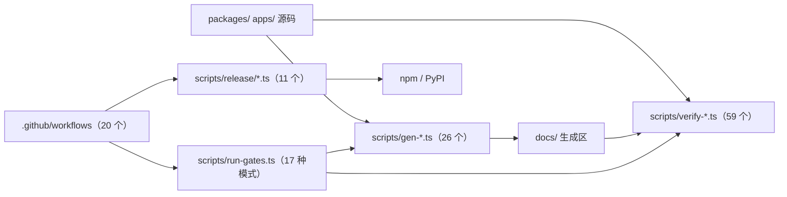
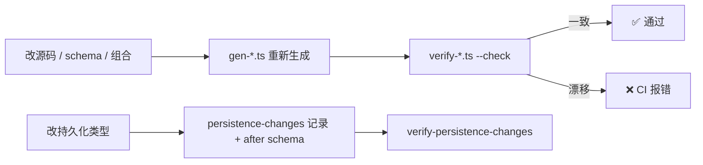

# 【第 12 篇】工程体系：scripts / docs / .github / bundle / 发布流水线

> **版本**：v0.1.6-alpha.1（tag `dsh-v0.1.6-alpha.1` = `0a15e36e7f`，上版 `dsh-v0.1.5-rc.2` = `fb2c4b9e69`）
> 难度：🟢 入门（运维视角总览，无深代码）
> 前置阅读：`../项目架构总览.md`
> 对应目录：`deepseek-harness/scripts/`、`docs/`、`.github/`、`.agents/`、`packages/bundle/`、`native/`
> 对应版本：v0.1.6-alpha.1

## 目录

- [0 引言：版本、范围与文档链接](#0-引言版本范围与文档链接)
- [1 概述](#1-概述)
- [2 核心概念](#2-核心概念)
- [3 包结构与目录](#3-包结构与目录)
- [4 关键类型与入口](#4-关键类型与入口)
- [5 数据流：源码 → 生成物 → 闸门](#5-数据流源码--生成物--闸门)
- [6 测试覆盖](#6-测试覆盖)
- [7 与上游/下游的关系](#7-与上下游的关系)
- [8 本版本变更要点（rc.2 → 0.1.6-alpha.1）](#8-本版本变更要点rc2--016-alpha1)

---

## 0 引言：版本、范围与文档链接

本篇覆盖"让产品活下来"的工程体系，范围与本版实际改动量：

| 范围 | 路径 | rc.2 → 0.1.6-alpha.1 |
|---|---|---|
| 闸门与生成器 | `scripts/` | 97 个文件变更；`*.ts` 从 203 → 240 |
| 文档体系 | `docs/` | 294 个文件变更；`.md` 现 329 个 |
| CI 与治理脚本 | `.github/` | 24 个文件变更，+1581 / −852 |
| 决策记录 | `.agents/notes/` | `*.md` 共 2056 个 |
| 组合包 | `packages/bundle/` | 41 个文件变更 |
| 发布脚本 | `scripts/release/` | 9 → 11 个文件 |

官方资料：

- `docs/AGENTS.md`（文档层级、字数预算、tier 分类）
- `docs/development.md`（日常流程）
- `docs/testing.md`（测试政策）
- `docs/persistence-changes/README.md`（持久化类型变更记录）
- `docs/cookbook/reviewing-persistence-type-changes.md`（本版新增 cookbook）
- `.github/issue-management/README.md`（issue 治理模块所有权）
- `.agents/notes/README.md`（决策记录规范）
- `scripts/AGENTS.md`（闸门脚本编写规则）

## 1 概述

rc.2 的工程体系是"规则即脚本 + 生成即保鲜 + 一事实一家"。0.1.6-alpha.1 在此之上增加了四条新的纪律线：

| 新增纪律 | 载体 | 一句话 |
|---|---|---|
| **默认产品隔离** | `scripts/verify-default-product-isolation.ts`、`scripts/web-product-bundle-isolation.ts`、`scripts/release/installed-product-isolation.ts` | 实验包可以发布，但不得进入默认安装、运行时导入与随附组合 |
| **发布默认翻转** | `scripts/experimental-package-policy.ts` | 实验包**默认公开**，私有靠显式 denylist |
| **维护型引用政策** | `scripts/verify-repository-references.ts`、`scripts/verify-concrete-terms.ts` | 维护文件中禁止真实 commit 哈希与特定组织 URL；禁止一个歧义来源标签 |
| **持久化类型历史** | `docs/persistence-changes/**`、`scripts/persistence-*.ts`、`docs/persistence-schema.json` | 每个结构性持久化变更都要有一份绑定 after digest 的确认记录 |

## 2 核心概念

- **闸门（gate）**——写成可执行脚本的质量约束，由 `scripts/run-gates.ts` 按模式编排。
- **生成即保鲜（generated + freshness-gated）**——目录从源码生成，`verify-*` 以 `--check` 校验新鲜度。
- **文档 tier**——root `AGENTS.md` / `architecture.md` / `subsystems/` / Agent Notes / cookbook / generated reference 各占一层，"一个事实只有一个家"。
- **source plane vs artifact plane**——静态闸门与测试经 tsconfig `paths` 解析到 `src`；消费构建产物 `lib/` 的闸门必须声明该依赖。
- **实验包（experimental package）**——npm 名以 `@deepseek-ai/dsh-experimental-` 开头，或仓库路径落在 `packages/experimental/` 之下。
- **持久化根（persistence root）**——逻辑 Session header、物理 JSONL header 行、事件 envelope，以及每个仓库声明的事件。
- **确认记录（acknowledgement record）**——`docs/persistence-changes/YYYY-MM-DD-slug.md`，把一个兼容性决策绑定到某个根的确切 after digest。

## 3 包结构与目录



| 路径 | 本版角色 |
|---|---|
| `scripts/run-gates.ts` | 闸门编排入口，`gatesForMode()` 的 17 个 case |
| `scripts/experimental-package-policy.ts` | `PRIVATE_EXPERIMENTAL_PACKAGE_DIRECTORIES`（本版为**空数组**）与 `isPublicExperimentalPackageDirectory()` |
| `scripts/npm-baseline-packages.ts` | npm baseline 的 manifest 发现，排除 denylist 目录 |
| `scripts/verify-default-product-isolation.ts` | 372 行：默认产品源码/配置级隔离 |
| `scripts/web-product-bundle-isolation.ts` | 199 行：Vite 输出图级隔离 |
| `scripts/bundle-input-isolation.ts` | 两条打包阶段共用的输入隔离基类 |
| `scripts/verify-repository-references.ts` | 112 行：commit 哈希与组织 URL 政策 |
| `scripts/verify-concrete-terms.ts` | 歧义来源标签政策 |
| `scripts/persistence-*.ts` | 8 个模块：schema model / schema / changes / releases / formats / artifacts / catalog-source / catalog-text |
| `scripts/render-persistence-schema.ts` | 渲染 `docs/persistence-schema.json` |
| `scripts/gen-dependency-catalog.ts` | 生成 `docs/dependency-catalog.json` |
| `scripts/release/installed-product-isolation.ts` | 已安装依赖图级隔离 |
| `scripts/repo-files.ts` | 文件发现（本版修改） |
| `docs/persistence-changes/` | 记录目录：根记录 3 份 + `releases/` 27 份 + `historical-formats/` v0/v1/v2 |
| `.github/issue-management/` | 本版新增的 issue 治理模块目录 |
| `packages/bundle/` | 组合包，本版 41 个文件变更 |

## 4 关键类型与入口

```ts
// scripts/experimental-package-policy.ts
export const PRIVATE_EXPERIMENTAL_PACKAGE_DIRECTORIES: readonly string[] = []

export function isPublicExperimentalPackageDirectory(
  directory: string,
  privateDirectories: readonly string[] = PRIVATE_EXPERIMENTAL_PACKAGE_DIRECTORIES,
): boolean
```

`isPublicExperimentalPackageDirectory()` 的判定正则 `/^packages\/experimental\/[^/]+$/` 说明：只有 `packages/experimental/<name>` 这一层算实验包目录，且不在 denylist 中时才默认公开。

```ts
// scripts/verify-default-product-isolation.ts
export interface ProductIsolationResult {
  failures: string[]
  packageCount: number
  sourceCount: number
  configCount: number
  webPluginCount: number
}

export function verifyDefaultProductIsolation(root: string): ProductIsolationResult
```

```ts
// scripts/verify-repository-references.ts
export interface RepositoryReference {
  file: string
  line: number
  kind: 'commit-hash' | 'organization-url'
}

export function findRepositoryReferences(
  file: string, source: string, commits: ReadonlySet<string>,
): RepositoryReference[]

export function scanRepositoryReferences(repoRoot: string): RepositoryReference[]
```

```ts
// scripts/release/installed-product-isolation.ts
export function verifyInstalledProductIsolation(directory: string): number
```

```ts
// scripts/run-gates.ts
export function gatesForMode(selected: Mode): Gate[]
```

`Mode` 的 17 个取值：`ci-primary`、`ci-linux-primary`、`ci-static`、`ci-lint-contracts-ready`、`ci-coverage`、`ci-bench`、`ci-snapshot`、`ci-artifacts`、`ci-consumers`、`ci-windows-blocking`、`ci-windows-complete`、`ci-windows-observational`、`node-compat`、`check-all`、`hygiene`、`doc-sync`、`doc-quick`。

## 5 数据流：源码 → 生成物 → 闸门



`doc-sync` 模式（`scripts/run-gates.ts` 第 754~774 行附近）在本版包含的叶子闸门：

| 闸门脚本 | 标签 | quick |
|---|---|---|
| `verify-persistence-catalog` | persistence catalog | — |
| `verify-persistence-changes` | persistence type history | — |
| `verify-persistence-releases` | released persistence history | — |
| `verify-persistence-formats` | Session format references | ✅ |
| `verify-public-repository-links` | public repository links | ✅ |
| `verify-repository-references` | repository references | ✅ |
| `verify-concrete-terms` | concrete terms | ✅ |
| `verify-doc-budgets` | doc budgets | ✅ |

`verify-default-product-isolation` 同时挂在 `ciSharedStaticGates()`（约第 300 行）与第 704 行的另一处静态闸门集合里。

## 6 测试覆盖

| 测试 | 覆盖 |
|---|---|
| `scripts/verify-default-product-isolation.spec.ts` | 新增：别名、传递安装路径、运行时导入、配置加载的插件 |
| `scripts/web-product-bundle-isolation.spec.ts` | 258 行新增：Vite 输出边、懒加载 chunk、worker、CSS 依赖与 asset |
| `scripts/release/installed-product-isolation.spec.ts` | 新增：已安装图与旁装 tarball 的区分 |
| `scripts/verify-repository-references.spec.ts` | 新增：blob / digest / 无关十六进制 / 歧义前缀的放行 |
| `scripts/verify-concrete-terms.spec.ts` | 新增：路径与文本两处命中，排除 vendor 与归档笔记 |
| `scripts/persistence-*.spec.ts` | 新增 6 个 spec：schema model、schema、changes、releases、formats |
| `scripts/gen-dependency-catalog.spec.ts`、`scripts/gen-config-catalog.spec.ts`、`scripts/gen-workflow-guest.spec.ts` | 新增生成器 spec |
| `apps/cli/tests/profiles/web/tests/web-default-isolation.expected.e2e.ts` | 真实 Web profile 启动 + 加载后观察已挂载 fiber 与 Node 模块缓存 |
| `apps/web/tests/default-product-isolation.e2e.ts` | Chromium 启动交付页面并读真实 Client Loader / registry / 模块缓存 |
| `apps/desktop/tests/package-macos.spec.ts` | 用 barrier 证明两条 notarization 通道重叠、票据隔离与失败收集 |
| `.github/issue-management/policy.test.mjs` | 新增：策略与 lifecycle 行为 |

## 7 与上游/下游的关系

- **上游**：`scripts/` 消费产品源码与类型声明；`.github/workflows` 调用 `scripts/run-gates.ts`；`website/` 消费 `docs/`。
- **下游**：`packages/bundle/` 的组合行被 `verify-default-product-isolation` 读取；`native/system/scripts/pack-release.mjs` 消费仓库身份元数据。
- **守护**：`doc-sync` 与 `hygiene` 是两个聚合闸门（`pnpm run doc-sync` / `pnpm run hygiene` 均指向 `scripts/run-gates.ts`）。

## 8 本版本变更要点（rc.2 → 0.1.6-alpha.1）

> 本节占本篇一半以上篇幅。

### 8.1 数量对比

| 维度 | v0.1.5-rc.2 | v0.1.6-alpha.1 | 变化 |
|---|---|---|---|
| `scripts/*.ts` | 203 | **240** | +37 |
| `gen-*.ts` | 21 | **26** | +5 |
| `verify-*.ts` | 54 | **59** | +5 |
| `scripts/release/` 文件 | 9 | **11** | +2 |
| `.github/workflows` | 21 | **20** | −1（`e2b-e2e.yml` 删除） |
| `docs/*.md` | 未核实 | **329** | — |
| `.agents/notes` 中 `*.md` | 未核实 | **2056** | — |
| └ implemented | — | 357 | — |
| └ archived | — | 630 | — |
| └ proposed | — | 27 | — |
| └ rejected | — | 14 | — |
| `.agents/skills/` 目录 | 12 | **12** | 0 |
| 根 `package.json` scripts | 未核实 | **175** | — |
| `packages/experimental/` 目录 | 未核实 | **16** | — |

`scripts/` 的 diff 明细：**新增 41、修改 55、删除 1**。

### 8.2 新增闸门脚本

```bash
git -C ... diff --name-status dsh-v0.1.5-rc.2..dsh-v0.1.6-alpha.1 -- scripts
# A=41  M=55  D=1
```

**⚠️ 与线索不符的核实结果**：`scripts/verify-public-repository-links.ts` **不是本版新增**——它在 `dsh-v0.1.5-rc.2` 的 `scripts/` 树中已存在（连同 `verify-public-repository-links.spec.ts`）。本版对它做的是**修改**（15 增 / 6 删）。

四个被点名的脚本逐一核实：

| 脚本 | 状态 | 核实结论 |
|---|---|---|
| `scripts/verify-default-product-isolation.ts` | **新增**（372 行） | 见 8.3 |
| `scripts/verify-repository-references.ts` | **新增**（112 行） | 见 8.4 |
| `scripts/web-product-bundle-isolation.ts` | **新增**（199 行，另有 258 行 spec） | 见 8.3 |
| `scripts/verify-public-repository-links.ts` | **已存在，本版修改** | 与 `verify-repository-references.ts` 共享 `canonicalReferenceText()` |
| `scripts/verify-vendored-links.ts` | **删除**（72 行全部移除） | 见 8.4 |

### 8.3 默认产品隔离：三层证据

`2026-09-12-default-product-experimental-isolation.md` 的问题陈述是：**npm 上公开可用并不等于该实验包属于默认产品**。直接查 manifest 会漏掉依赖别名、传递安装路径、只为开发声明的运行时导入，以及由配置加载的插件。release smoke 会把所有 tarball 一起安装，所以实验包出现在消费者目录里并不能说明默认产品需要它们。

`verify-default-product-isolation` 落在 `ci-static` 与 `hygiene` 两处，做四件事：

1. **依赖图**：从每个 app 与 Python runtime 出发，跟随 runtime / optional / peer 依赖，解析 workspace 与 npm 别名；实验包按 npm 前缀或仓库目录识别。**发布 denylist 成员身份不影响这一分类。**
2. **源码级**：读选中包里的运行时导入、安装方拥有的 profile bundle 列表、bundle patch、随附 agent preset，以及声明的配置树；用生产 patch 解析器加载默认 Web 层，再用**启动时同一个 patch 引擎**组合它们。检查的是**生效行与打过 patch 的 Include 树**，所以一个只按 id 定位的 patch 藏不住替换 group 的插件。
3. **默认 Web 源图**：从真实 HTML 入口的 module script 出发，含 inline module 与本地引用的 Worker 入口。独立的实验预览可以存在，但不得从默认入口导入。
4. **preset**：`packages/preset/agent-presets/presets/*/agent.cordis.yml` 全部扫描；匹配为空即失败。

`web-product-bundle-isolation` 补齐**构建期**证据：跟随 Vite 从 `index.html` 发出的真实输出边，包含懒加载 chunk、worker、CSS 依赖与 asset。注释说明了动机——一个稳定的 `lib/client.js` 路径可能包含**更早**由实验包打进去的代码，所以每个打包阶段都要检查它自己的真实输入。

`scripts/release/installed-product-isolation.ts` 补第三层：从 `@deepseek-ai/dsh` 出发跟随**已安装**依赖图，用解析后的 manifest 名识别别名与外部传递依赖；开发依赖与旁装的无关 tarball 不计入。

运行时两层烟测：

| 烟测 | 观察点 |
|---|---|
| `apps/cli/tests/profiles/web/tests/web-default-isolation.expected.e2e.ts` | 私有 Harness home 里从构建后的 `dsh` 导出启动真实 Web profile；测试专用观察器在就绪后读实际 Loader 行、已注册 fiber、已注册回调关联的模块与 Node 已加载模块缓存 |
| `apps/web/tests/default-product-isolation.e2e.ts` | Chromium 启动交付页面，读真实 Client Loader、registry 与模块缓存，要求每个交付 entry 都处于激活态 |

两者都用**显式负控命令**拒绝一个真实实验插件被挂载。被拒绝的备选：只查直接依赖名；拒绝每个已安装的实验 tarball（release smoke 有意安装整个发布族）；把每个 Web 源都当默认入口扫；只查 Vite 最终模块路径。

### 8.4 发布策略：denylist 取代 allowlist，并全量发布

三份 Agent Note 构成一条链：

| Note | 决策 |
|---|---|
| `2026-09-12-experimental-publication-denylist.md` | 本地 npm baseline 发布器与公开 dsh 发布族**默认发现**实验包；`PRIVATE_EXPERIMENTAL_PACKAGE_DIRECTORIES` 拥有显式的私有排除。**本版该数组为空。** |
| `2026-09-12-publish-all-experimental-packages.md` | `packages/experimental/` 下每个当前包都进入 dsh 发布族与本地 npm baseline；每个 manifest 去掉 `private` 并设 `publishConfig.access: public` |
| `2026-09-12-default-product-experimental-isolation.md` | 发布与"是否属于默认产品"是两件独立的事，前者不豁免后者 |

对应提交：`6e30e1a300 feat(release): use a private denylist for experimental packages`、`42c5b65643 feat(release): publish all experimental packages`、`f34dd86285 ci(release): keep experimental packages out of the default product`、`b5d463ca5c test(release): cover packed experimental worker consumers`、`22c5ae6abc fix: cover supported experimental isolation inputs`。

**denylist 机制形状**（`scripts/experimental-package-policy.ts`）：

```ts
export const PRIVATE_EXPERIMENTAL_PACKAGE_DIRECTORIES: readonly string[] = []
```

`scripts/npm-baseline-packages.ts` 用 `globSync` 的 `exclude` 参数把它映射成 `${directory}/package.json`。

**工作区约束**（note 原文意思）：公共包必须**省略** `private` 并设 `publishConfig.access: public`；所有实验包保留 `@deepseek-ai/dsh-experimental-*` 前缀；新增私有原型需要同时加 denylist 条目**和**私有 manifest。

**发布带来的实际工作量**（`publish-all-experimental-packages`note 明确列出）：

- Inspector 的 tarball 需包含 `lib/worker.js`，因为它的 Host 入口按 sibling URL 启动这个 Worker；其 built-artifact 测试会先打包并解包再启动。
- WebWorker packer 通过 runtime 的公共 library 入口导入 module-proxy 与 replacement-package 表；其 compiled 仓库 chunk 不要求运行时 TypeScript 源；packed-consumer 测试在 plain Node 下导入两个解包后的 tarball，并在**没有**这两个包源码树的情况下挂载 base image 与 data overlay。
- CPython PTC backend 交付其 Python 脚本，在 Unix 上仍需一个受支持的外部解释器。
- 发布**不**把这批包加入任何随附 profile，也**不**让 browser preview 成为产品启动器。

`packages/experimental/` 现存的 16 个目录：`agent-team`、`agent-team-profile`、`agent-team-web-profile`、`auto-review`、`browser-use-chrome-devtools-mcp`、`browser-use-playwright-mcp`、`browser-use-runtime`、`browser-use-stagehand-native`、`client-ui-agent-team`、`computer-use-cua-driver-mcp`、`computer-use-cua-driver-native`、`inspector`、`ptc-runtime-python`、`tool-agent-team`、`webworker-packer`、`webworker-runtime`。

### 8.5 维护型仓库引用政策

提交：`6b651380a7 feat: enforce maintained repository reference policy`、`0b7f0b072b chore: enforce maintained repository reference policy`、`2b05a43eca fix: address concrete terminology review findings`。

`2026-09-12-maintained-repository-references.md` 的规则：

- 历史证据用**发布 tag** 与 PR / run / job 标识，当前仓库文件用**相对链接**。
- 闸门扫描 tracked 文件与未忽略的新文件；`vendor/` 与 `.agents/notes/archived/` 保留既有排除，**活跃笔记与历史发布记录仍被检查**。
- 十六进制候选会拿本地 Git 对象库验证，**只拒绝无歧义的 commit 身份**。指向 blob 的配对哈希、schema digest、无关十六进制值、以及解析到不同对象身份的十六进制分支名都仍然合法。
- 组织 URL 检测与既有的 `verify-public-repository-links` 共享解码与规范化——这正是 `verify-repository-references.ts` 顶部 `import { canonicalReferenceText } from './verify-public-repository-links.ts'` 的由来。

实现要点（可直接对照源码）：

| 行 | 事实 |
|---|---|
| 第 13 行 | `const excludedPrefixes = ['vendor/', '.agents/notes/archived/']` |
| 第 75~82 行 | 用 `git cat-file --batch-check=%(objectname) %(objecttype)` 判定对象类型 |
| 第 77 行 | `GIT_NO_LAZY_FETCH: '1'`——**禁用网络抓取**，包括 Git partial-clone 的 lazy fetch |
| 第 102~111 行 | CLI 入口：有命中则逐行打印 `file:line kind` 并设 `process.exitCode = 1` |

note 明确承认的边界（#Consequences）：闸门检查所有**本地可用的** commit 对象（含不可达的历史 PR head）；缺失对象无法匹配，所以一个带额外 PR 对象的 checkout 可能检测到 CI 全历史 clone 检测不到的引用。引用校验建立的是**维护文件政策**，不是远端 tag 不可变性或历史兼容性。

**native 侧的配套**：`native/system/scripts/pack-release.mjs` 在 workflow 打包时把 workflow 仓库投影到一次性输入里，让 npm trusted publishing 能验证 artifact 身份；它保留 source manifest 并原样发布生成的 tarball。本地无 workflow 上下文打包时保留公开源代码元数据。

**另一个新增闸门** `verify-concrete-terms`（`scripts/verify-concrete-terms.ts`）来自 `71d50b4a84 refactor: ban ambiguous origin label`：它拒绝一个被拼接出来的歧义来源标签（源码里写成 `const blockedTerm = 'prove' + 'nance'`，正是为了不在这份文本里复现该词）。排除项除 `vendor/` 与归档笔记外，还额外放行 `docs/persistence-changes/releases/dsh-v*.schema.json` 与 `docs/persistence-changes/historical-formats/v*.schema.json`——发布快照保留其 pinned 源中出现的标识符。判定用 `value.normalize('NFKC').toLowerCase().includes(blockedTerm)`。

### 8.6 持久化类型历史：新的文档 kind

`2026-09-11-persistence-type-history.md` 的问题陈述很具体：一个持久化事件可以**保留相同的 payload 类型表达式**，而它引用的类型已经变了；只看声明文本无法暴露嵌套结构变化；digest 能发现差异但说不清是"加了可选数据"还是"改了已有属性"；重新生成目录也不能证明作者**评审过**持久化后果。

提交链：`1e9b05d356 feat(session): verify persistence type history`、`a0a7e2c11c fix(session): harden and automate persistence change review`、`6e294b1c27 fix(session): infer persistence change decisions for agents`、`b8f6c421b docs(session): backfill and gate persistence format references`、`765c87fb87 fix(docs): address persistence format history review`、`38070996c1 docs(session): nest historical formats under persistence changes`、`aea077ac75 docs(session): backfill alpha and RC persistence history`、`70a3be6f20 test(session): protect persistence digests from harmless reordering`、`0b368dfe78 test(persistence): budget heavy integration cases for CI`。

**机制形状**：一份归一化类型模型同时供给三个产物——可读的持久化目录、完整的 schema 清单、以及**按根的传递 digest**。根覆盖：逻辑 Session header、物理 JSONL header 行、事件 envelope、以及每个仓库声明的事件。源位置、别名、注释、属性顺序都是 digest 之外的呈现细节。

**每份记录的四个兄弟文件**（`docs/persistence-changes/README.md`）：

| 文件 | 所有者 |
|---|---|
| `YYYY-MM-DD-slug.md` | 英文确认，`kind: persistence-change`，一条机器声明 + 兼容性推理 + 验证证据 |
| `YYYY-MM-DD-slug.zh.md` | 中文对照，机器声明必须完全相同 |
| `YYYY-MM-DD-slug.i18n.yaml` | 生成的双语一致性记录 |
| `YYYY-MM-DD-slug.schema.json` | 生成：受影响且仍存在的根的完整 after schema |

**兼容性判定表**（直接摘自 `docs/persistence-changes/README.md`）：

| 检出的变化 | 最低决策 |
|---|---|
| 新增可选的事件体属性（含其完整子树） | `same-version` |
| 把必需的事件体属性改为可选 | `same-version` |
| 新增普通事件类型 | `same-version` |
| 把可选属性改为必需、新增必需属性、改变已有类型、移除/重命名属性或事件 | `version-bump` |
| 改变 Session header 或事件 envelope | `version-bump` |

规则适用于**完整变更**，所以一个被允许的变化藏不住同时发生的破坏性变化。

**本次新增的三类文档产物**：

| 产物 | 数量（非 zh） | 说明 |
|---|---|---|
| `docs/persistence-changes/2026-09-11-initial.md` | 1 | baseline，覆盖全部根 |
| `docs/persistence-changes/2026-09-12-auto-review-error-metadata.md` | 1 | 后续记录，指名每个根的前驱 |
| `docs/persistence-changes/2026-09-14-image-offload.md` | 1 | 同上 |
| `docs/persistence-changes/releases/*.md` | **27** | 从 `dsh-v0.0.1-rc.1` 到 `dsh-v0.1.5-rc.2` 的发布对比，`kind: persistence-release` |
| `docs/persistence-changes/historical-formats/v{0,1,2}.md` | 3 | 每个历史整数格式的完整清单 |

生成式产物：`docs/persistence-schema.json`（1 437 841 字节）、`docs/dependency-catalog.json`（168 165 字节）。新增 cookbook：`docs/cookbook/reviewing-persistence-type-changes.{md,zh.md}` 与 `docs/cookbook/reviewing-persistence-type-changes.i18n.yaml`。

note 明确写下的边界（#Consequences / #Alternatives considered）：检查证明的是**当前树内的一致性**，不是"历史从未被改写"或"解释在语义上正确"；藏在 `unknown` 等不透明值里的结构无法检出；该机制**不新增任何运行时 digest 或 Session-format 字段**。被拒绝的备选包括：哈希展示出来的声明、把所有确认绑定到一个总 digest、拿 PR merge-base 或某个发布 checkout 做对比、把每个变化的 digest 都当版本 bump、以及从类型推断行为。

### 8.7 CI 变化

**（a）Blacksmith 作为故障转移腿**（`.agents/notes/implemented/process/2026-09-09-blacksmith-failover-leg.md`）

`DSH_CI_FAILOVER_LINUX` 与 `DSH_CI_FAILOVER_WINDOWS` **新增接受** `blacksmith` 取值。任何一个仓库写入者设置它时，该平台的参与 job 会重定向到 Blacksmith 托管 runner，vCPU 规格与被替换的池匹配；其他值（或未设置）保持今天的 runner，`selfhosted` 仍路由到内部池。

- **参与 job**：三个企业 Linux worker、`node-compat` 各腿、`all-checks-passed` 判定、[`ci.yml`](../../deepseek-harness/.github/workflows/ci.yml) 里四条 Windows 通道（16 核池映射到 `blacksmith-16vcpu-ubuntu-2404` 与 `blacksmith-16vcpu-windows-2025`，标准托管腿映射到 `blacksmith-4vcpu-ubuntu-2404`）；`expected-filenames`；sandbox bwrap 腿；以及两个手动 benchmark 矩阵。
- **不参与**：被 workflow spec 钉在标准托管 runner 上的 job、持有凭据的 job（真实 API e2e、issue App-token job、npm 与 PyPI 发布器）、需要 Blacksmith 缺省宿主能力的 job（Landlock 腿及其 pack 校验、Seatbelt 腿、linux-arm64 single-exe 腿）、以及发布形状的链。
- **成本语义**：这是 writer 可管理的仓库状态，**不需要 merge**，只需重跑受影响的 job；只在设置期间花钱，因此是显式的故障或实验选择，**从不是默认值**。
- **实测发现**：镜像试验（PR #3841，已关闭）确认 `blacksmith-4vcpu-ubuntu-2404`、`blacksmith-16vcpu-ubuntu-2404`、`blacksmith-16vcpu-windows-2025` 可调度执行；三条 `node-compat` 腿在试验镜像上全绿（run 34322356689）。同一试验暴露一个环境问题：node 24.13 的内部 `fs.glob` 在展开 `**` 时会对符号链接文件做 `lstat` 探测并抛 `ENOTDIR` 而非跳过（run 34319926270），导致 `check:ci:static` 里的 `verify-md-wrap` 失败，直到 `scripts/repo-files.ts` 把 `globSync` 换成 dirent walker。
- **已知缺口**（note 自述）：Landlock、Seatbelt 与 linux-arm64 的排除仍基于较早迁移尝试（已关闭 PR #3053）的文字测量；benchmark 矩阵的 8 与 32 vCPU 标签未参与试验，按命名对称性**推断**得到，首次使用前需手动 dispatch 确认。

**（b）并行 macOS notarization**（`2026-09-09-parallel-macos-notarization.md`）

固定目标的 installer 命令签名并验证一个 App，然后用 `ditto` 创建两份独立副本：

| 通道 | 动作 |
|---|---|
| App 通道 | notarize + staple 它的副本，验证签名、票据与 Gatekeeper 接受，让 electron-builder 生成 ZIP 与 updater 元数据 |
| DMG 通道 | 立即打包它的副本、签镜像，用既有的 artifact 完成钩子 notarize + staple + 验证镜像 |

每个 electron-builder 进程通过 `--prepackaged` 拿到真实 `.app` 路径、一个隔离的输出目录与 `--publish never`。两条通道都 settle 之后才传播错误或清理临时目录；**只有两条通道都成功**才提升 DMG、ZIP、ZIP blockmap 与 channel 元数据。

实测数据（note #Consequences）：2026-09-09 在同一台 Mac、同一系统代理下，arm64 完整打包从串行的 751.33 秒降到并行的 **490.78 秒**（−34.7%）；产物通道相隔 8 毫秒开始，App/ZIP 用 307.36 秒，DMG 用 268.54 秒。note 同时声明每种配置只有**一个完整构建样本**，缓存与 Apple 队列波动使这个差值不能全部归因于并发。

被拒绝的备选：两条通道共用一个 App（DMG 读取可能与 `stapler` 写入重叠，产生非确定性 bundle）；只 notarize DMG（ZIP 更新独立分发，需要 stapled App）；保持串行只用代理（代理只影响吞吐，不消除 Apple 提交之间的串行依赖）。

**（c）issue 治理模块拆分**（`2026-09-07-issue-policy-module-ownership.md`、`2026-09-07-selective-issue-policy-evaluation.md`）

提交 `845acdb3b7 refactor(ci): separate issue policy rules transport and lifecycle owners` 与 `108c87008b fix(ci): avoid unnecessary issue Policy Project reads and lifecycle runs`。本版把 issue 管理拆成**纯决策 / GitHub 访问 / pull-request 评估 / lifecycle 变更 / 命令分发**五个所有者模块，落在新建的 `.github/issue-management/` 目录：

```
.github/issue-management/README.md (+ zh + i18n)
.github/issue-management/github.mjs
.github/issue-management/lifecycle.mjs
.github/issue-management/pull-request.mjs
.github/issue-management/rules.mjs
.github/issue-management/selective-preflight.json
```

调用方与测试导入**拥有该操作的模块**，而不是把命令入口当成导出集合。note 明确的不承诺项：模块拆分**不**授予更强凭据、不改变检查权限、不序列化 Project 变更、也不阻止未来的行为回归；既有 lifecycle 竞态与字段管理限制仍由它们的行为所有者记录。

**（d）审批工作流身份**（`2026-09-10-approval-review-workflow-identity.md`）

GitHub 可能把 workflow run 的 `name` 填成展开后的 `run-name`。审批评审工作流在标题里带 PR 号，所以拿 `workflow_run.name` 比对静态工作流名，会在刷新审批状态之前拒掉合法的评审事件。修法是让 `.github/review-ownership/check-approval.mjs` 用**精确的 `workflow_run.path`** 识别评审事件工作流，同时要求一次成功的 `pull_request_review` run、从 `display_title` 解析 PR 号、校验任何提供的 PR 关联，并在评估审批前比对当前 PR head 与被评审 head。

**（e）workflow 集合**：`e2b-e2e.yml` 删除（随 `refactor(e2b): retire remote execution providers`），workflow 数从 21 降到 20。

### 8.8 packages/bundle：41 个文件变更改了什么

```bash
git -C ... diff --stat dsh-v0.1.5-rc.2..dsh-v0.1.6-alpha.1 -- packages/bundle
# 41 files changed, 2193 insertions(+), 249 deletions(-)
```

按性质分四类：

**（1）版本号与依赖重排**——所有 bundle 的 `package.json` 版本从 `0.1.5-rc.2` 提到 `0.1.6-alpha.1`，依赖表随之增删。可核对的例子：

| 包 | 新增依赖 | 移除依赖 |
|---|---|---|
| `packages/bundle/base/package.json` | `@deepseek-ai/dsh-compaction-image-offload`、`@deepseek-ai/dsh-mcp-resources`、`@deepseek-ai/dsh-workflow-ptc`、`@deepseek-ai/dsh-ptc-runtime-node` | `@deepseek-ai/dsh-workflow-worker-thread` |
| `packages/bundle/web-app/package.json` | `@deepseek-ai/dsh-client-ui-settings-unarchive-sessions`、`@deepseek-ai/dsh-api-terminal-controller`、`@deepseek-ai/dsh-client-ui-sidebar-terminal` | `@deepseek-ai/dsh-code-runtime-worker-thread` |
| `packages/bundle/sdk-minimal/package.json` | `@deepseek-ai/dsh-mcp-resources` | — |

**（2）headless bundle 的机器可读运行面**——这是 41 个文件里改动最集中的一块：

| 文件 | 变化 |
|---|---|
| `packages/bundle/headless/src/json-stream.ts` | **新增** 332 行 |
| `packages/bundle/headless/src/runner-internals.ts` | **新增** 21 行 |
| `packages/bundle/headless/src/startup-internals.ts` | **新增** 14 行 |
| `packages/bundle/headless/src/index.ts` | 262 行改动 |
| `packages/bundle/headless/src/startup.ts` | 94 行改动 |
| `packages/bundle/headless/tests/json-stream.spec.ts` | **新增** 421 行 |
| `packages/bundle/headless/tests/headless.spec.ts` | 675 行改动 |
| `packages/bundle/headless/tests/startup.spec.ts` | 160 行改动 |
| `packages/bundle/headless/tests/fixtures/provider-cwd.ts` | **新增** 49 行 |
| `packages/bundle/headless/tsconfig.json` | 6 行（新增编译器面） |
| `packages/bundle/headless/cordis.patch.yml` | 14 行改动 |
| `packages/bundle/headless/README.md` / `README.zh.md` | 52 / 68 行 |

对应 Agent Note：`.agents/notes/implemented/feature/2026-09-09-headless-machine-readable-run-surface.md`。

**（3）patch 层调整**——`base/cordis.patch.yml`（24 行）、`headless/cordis.patch.yml`（14 行）、`web-app/cordis.patch.yml`（15 行）、`sdk-minimal/cordis.patch.yml`（3 行）。这些行正是 `verify-default-product-isolation` 的检查对象。

**（4）README 双语文档**——每个 bundle 的 `README.md` / `README.zh.md` / `README.i18n.yaml` 三件套同步更新，其中 `bundle/README.zh.md`（14 行）与 `web-app/README.zh.md`（30 行）改动最大。

### 8.9 发布流水线

`scripts/release/` 从 9 个文件增至 11 个：

| 文件 | 本版状态 |
|---|---|
| `bump.ts`、`families.ts`、`pack.ts`、`process.ts`、`publish.ts`、`tarball.ts`、`verify.ts` | 保留 |
| `verify-packed-install.ts` | **修改**——跟随已安装依赖图，用解析后的 manifest 名识别别名与外部传递依赖 |
| `installed-product-isolation.ts` | **新增** |
| `installed-product-isolation.spec.ts` | **新增** |

`scripts/release/verify-packed-install.ts` 的行为变化（note 原文）：从 `@deepseek-ai/dsh` 出发跟随已安装依赖图；**开发依赖与旁装的无关 tarball 被排除**；缺失的必需依赖失败；被省略的可选依赖仍被允许，**除非它指向一个实验包**。

发布提交：`42c5b65643 feat(release): publish all experimental packages`、`6e30e1a300 feat(release): use a private denylist for experimental packages`。manifest 元数据的配套重构是 `5c82aa9371 refactor(manifest): separate package metadata from public DSH fields`（对应 `.agents/notes/implemented/architecture/2026-09-10-public-package-manifest.md`）。

### 8.10 文档体系的其他本版变化

| 变化 | 载体 |
|---|---|
| 新增子系统页 | `docs/subsystems/{browser-use,computer-use,ptc-runtime,ssh,mcp}.{md,zh.md,i18n.yaml}`（`docs/subsystems/` 现有 58 个 `.md`） |
| 删除子系统页 | `docs/subsystems/code-runtime.{md,zh.md,i18n.yaml}` |
| 新增生成目录 | `docs/dependency-catalog.json`（由 `scripts/gen-dependency-catalog.ts` 生成） |
| 新增生成目录 | `docs/persistence-schema.json`（由 `scripts/render-persistence-schema.ts` 生成） |
| 新增 cookbook | `docs/cookbook/reviewing-persistence-type-changes.{md,zh.md}` |
| 链接发现修复 | `verify-md-links` 把 `packages/*.md` 纳入既有源发现（`.agents/notes/implemented/process/2026-09-08-package-index-link-discovery.md`） |

`verify-md-links` 那条修复的问题陈述值得记录：嵌套的 group 与 package glob 匹配不到 `packages/README.md` 或它的中文对照，所以两个索引里的断链会逃过校验。修法是**把 `packages/*.md` 纳入既有的源发现**，命令与测试共用同一个发现函数；符号链接去重与归档笔记排除仍归 `scripts/repo-files.ts`。note 明确该检查**只校验链接有效性**，不要求索引枚举每个包。

### 8.12 闸门接线与验证证据

新增闸门不是"写了脚本就算"，每个都接进了 `scripts/run-gates.ts` 的模式图，并有对应的 spec：

| 闸门脚本 | 接入模式 | 标签 | spec |
|---|---|---|---|
| `verify-default-product-isolation` | `ci-static`（`ciSharedStaticGates()` 约第 300 行）+ 第 704 行的静态集合 | default product isolation | ✅ |
| `web-product-bundle-isolation` | 构建期输入检查（`packages/client/tsdown.client.ts` 与 Web 图检查两处） | — | ✅ 258 行 |
| `installed-product-isolation` | `scripts/release/verify-packed-install.ts` 内 | — | ✅ |
| `verify-repository-references` | `doc-sync`（quick） | repository references | ✅ |
| `verify-concrete-terms` | `doc-sync`（quick） | concrete terms | ✅ |
| `verify-public-repository-links`（既有，本版扩展） | `doc-sync`（quick） | public repository links | ✅ |
| `verify-persistence-changes` | `doc-sync` | persistence type history | ✅ |
| `verify-persistence-releases` | `doc-sync` | released persistence history | ✅ |
| `verify-persistence-formats` | `doc-sync`（quick） | Session format references | ✅ |
| `gen-dependency-catalog` | `check-all` 族 | — | ✅ |
| `render-persistence-schema` | 生成侧 | — | ✅ |

`doc-sync` 的四条 persistence 闸门分别对应四类产物：可读目录（`docs/persistence-catalog.md`）、当前确认链（`docs/persistence-changes/*.md`）、历史发布对比（`docs/persistence-changes/releases/*.md`）、历史格式清单（`docs/persistence-changes/historical-formats/v*.md`）。`scripts/AGENTS.md` 给出的脚本纪律是"使用语法感知的发现、防止空或收窄的语料、对每个会改变检测边界的准入/排除形式都写测试"——`verify-default-product-isolation` 的 `profilePackages()` 静态字面量解析与 `verify-repository-references` 的对象类型判定都是这条纪律的实例。

`verify-default-product-isolation` 的失败面同时被 `apps/cli` 与 `apps/web` 的进程级烟测覆盖，两个烟测都用显式负控命令拒绝一个真实实验插件——这正是 `packages/AGENTS.md` 里"产品可见插件需要非单测的真实组合测试"这条要求的落地形式。

**性能与体量**：`docs/persistence-schema.json` 单文件 1 437 841 字节（约 1.4 MB），是仓库里最大的生成物之一；`verify-persistence-*` 系列因此被拆成多条闸门并按 quick / 非 quick 分流（`test(persistence): budget heavy integration cases for CI`，`0b368dfe78`），`test:coverage` 与 `test` 之外还有 `test:expected`、`test:snapshot` 等分面。

### 8.13 未核实项

- `docs/` 与 `.agents/notes/` 在 rc.2 的 `.md` 计数：本次只测了 0.1.6-alpha.1 的现数量（329 / 2056），未测 rc.2 基数，故 8.1 表中该两行标"未核实"。
- 根 `package.json` scripts 的 rc.2 基数：本次只测到 0.1.6-alpha.1 的 175，未取 rc.2 基数。
- `packages/experimental/` 目录数的 rc.2 基数：同上。
- Blacksmith 的 8 与 32 vCPU 标签映射：note 自述为"按命名对称性推断"，本次未在 workflow 文件中逐一核对。

---

*文档生成时间: 2026-09-17*
*数据源: dsh-v0.1.6-alpha.1 (0a15e36e7f) vs dsh-v0.1.5-rc.2 (fb2c4b9e69)*
